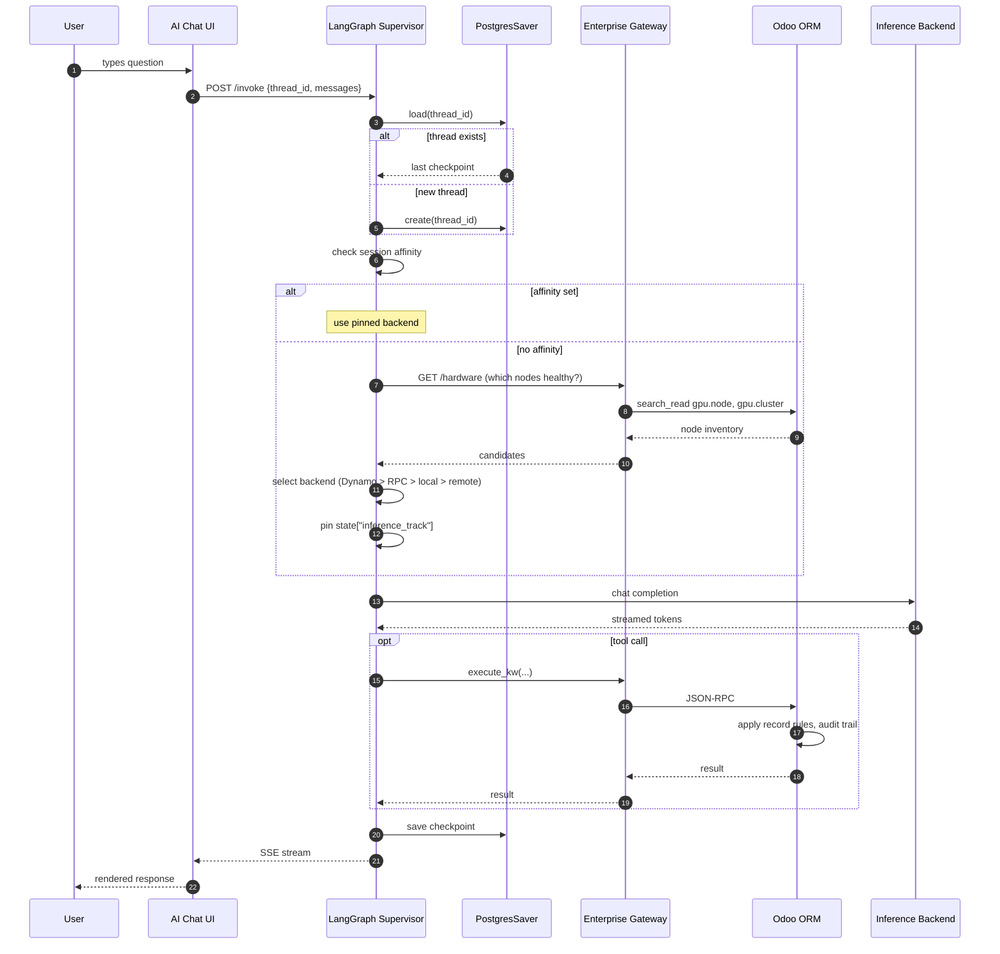
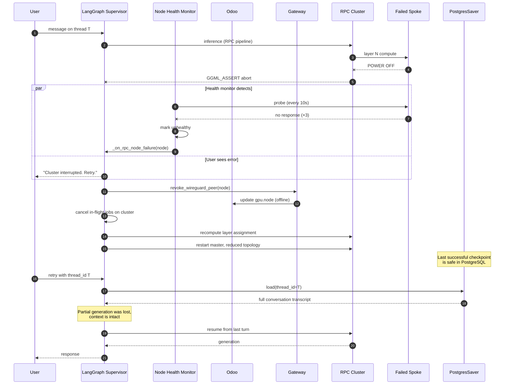

# NETTRADES Platform — Architecture & Build Plan

**Purpose:** Mermaid architecture diagram of the finished solution, plus a step-by-step build plan for distributed inferencing. Designed so a future DeepSeek context window can continue from here without re-deriving the design.

**Companion to:** `HANDOFF.md` (current state, error classes, daily workflow)

---

## 1. Finished Solution Architecture Diagram

```mermaid
flowchart TB
    subgraph L4["LAYER 4 — User Interfaces"]
        direction LR
        UI1["NETTRADES Launcher<br/>(Electron)"]
        UI2["Odoo CE Admin<br/>(Business UI)"]
        UI3["AI Chat UI<br/>(LangGraph UI)"]
    end

    subgraph L3["LAYER 3 — Orchestration & Gateway"]
        direction TB
        LG["LangGraph Supervisor<br/>FastAPI :8000"]
        LG_R1["Intent Router"]
        LG_R2["Session Affinity"]
        LG_R3["Hardware Selector"]
        LG_R4["Recovery Coordinator"]
        LG --> LG_R1 & LG_R2 & LG_R3 & LG_R4

        GW["Enterprise Gateway<br/>evolved from odoo_proxy :8090"]
        GW_C1["Odoo Connector<br/>(JSON-RPC)"]
        GW_C2["Salesforce MCP Adapter"]
        GW_C3["SAP MCP Adapter"]
        GW_C4["Custom MCP Adapter"]
        GW --> GW_C1 & GW_C2 & GW_C3 & GW_C4

        LG_R1 -->|tool calls| GW
    end

    subgraph L2["LAYER 2 — Business Systems"]
        direction LR
        ODOO["Odoo CE<br/>+ NETTRADES modules<br/>(management plane)"]
        SF["Salesforce<br/>(CRM)"]
        SAP["SAP<br/>(ERP)"]
        ANY["Any MCP Server"]
    end

    subgraph L2_DB["LAYER 2 — Storage"]
        direction LR
        PG_ODOO[("PostgreSQL 17<br/>Odoo ORM tables<br/>nettrades_* business data")]
        PG_INFRA[("PostgreSQL 17<br/>Agent Infrastructure<br/>heartbeats, queue, saga")]
        PG_CHK[("PostgreSQL 17<br/>LangGraph Checkpoints<br/>threads, state, messages")]
        VALKEY[("Valkey<br/>sessions, rate limits")]
    end

    subgraph L1["LAYER 1 — Distributed Inference"]
        direction TB
        subgraph HUB["HUB — nettrades.ai"]
            DYNAMO["Dynamo + vLLM<br/>H200 + NVLink<br/>tensor parallelism"]
            ODOO_HUB["Odoo CE<br/>(multi-tenant)"]
        end

        subgraph SUBHUB_A["SUB-HUB — Client A"]
            RPC_MASTER_A["llama.cpp RPC master<br/>pipeline parallelism"]
            ODOO_A["Odoo CE<br/>(Client A)"]
        end

        subgraph SUBHUB_B["SUB-HUB — Client B"]
            RPC_MASTER_B["llama.cpp RPC master<br/>pipeline parallelism"]
            ODOO_B["Odoo CE<br/>(Client B)"]
        end

        subgraph SPOKES_A["SPOKES — Client A office"]
            SPOKE_A1["PC1<br/>rpc-server.exe<br/>+ heartbeat agent"]
            SPOKE_A2["PC2<br/>rpc-server.exe<br/>+ heartbeat agent"]
            SPOKE_A3["Jetson<br/>rpc-server<br/>+ heartbeat agent"]
        end

        subgraph SPOKES_B["SPOKES — Client B office"]
            SPOKE_B1["PC1<br/>rpc-server.exe<br/>+ heartbeat agent"]
            SPOKE_B2["PC2<br/>rpc-server.exe<br/>+ heartbeat agent"]
        end
    end

    %% L4 to L3
    UI1 -.->|docker socket| LG
    UI2 -->|HTTP :8069| ODOO
    UI3 -->|HTTP :3002| LG

    %% L3 to L2
    GW_C1 -->|JSON-RPC| ODOO
    GW_C2 -->|MCP| SF
    GW_C3 -->|MCP| SAP
    GW_C4 -->|MCP| ANY

    %% L3 to storage
    LG -->|save state| PG_CHK
    LG -->|read config| GW
    GW -->|session tokens| VALKEY
    LG -->|cross-system saga| PG_INFRA

    %% L2 to storage
    ODOO --> PG_ODOO

    %% L3 to L1 — inference routing
    LG_R3 -->|primary<br/>session affinity| DYNAMO
    LG_R3 -->|office fallback| RPC_MASTER_A
    LG_R3 -->|office fallback| RPC_MASTER_B
    LG_R3 -->|single-node fallback| SPOKE_A1

    %% L1 internal — RPC pipeline
    RPC_MASTER_A -->|rpc://| SPOKE_A1
    RPC_MASTER_A -->|rpc://| SPOKE_A2
    RPC_MASTER_A -->|rpc://| SPOKE_A3
    RPC_MASTER_B -->|rpc://| SPOKE_B1
    RPC_MASTER_B -->|rpc://| SPOKE_B2

    %% Spokes heartbeat to sub-hub
    SPOKE_A1 -.->|heartbeat :8080| RPC_MASTER_A
    SPOKE_A2 -.->|heartbeat :8080| RPC_MASTER_A
    SPOKE_A3 -.->|heartbeat :8080| RPC_MASTER_A
    SPOKE_B1 -.->|heartbeat :8080| RPC_MASTER_B
    SPOKE_B2 -.->|heartbeat :8080| RPC_MASTER_B

    %% Odoo instances talk to gateway
    ODOO_A -.->|register cluster| GW
    ODOO_B -.->|register cluster| GW
    ODOO_HUB -.->|register cluster| GW

    %% Styling
    classDef l4 fill:#e1f5ff,stroke:#0288d1
    classDef l3 fill:#fff3e0,stroke:#f57c00
    classDef l2 fill:#e8f5e9,stroke:#388e3c
    classDef l2db fill:#fce4ec,stroke:#c2185b
    classDef l1 fill:#f3e5f5,stroke:#7b1fa2
    class UI1,UI2,UI3 l4
    class LG,LG_R1,LG_R2,LG_R3,LG_R4,GW,GW_C1,GW_C2,GW_C3,GW_C4 l3
    class ODOO,SF,SAP,ANY l2
    class PG_ODOO,PG_INFRA,PG_CHK,VALKEY l2db
    class DYNAMO,ODOO_HUB,RPC_MASTER_A,RPC_MASTER_B,ODOO_A,ODOO_B,SPOKE_A1,SPOKE_A2,SPOKE_A3,SPOKE_B1,SPOKE_B2 l1
```



---

## 2. Finished Solution — Request Flow (Sequence)



---

## 3. Finished Solution — Spoke Failure Recovery



---

## 4. Distributed Inferencing — Complete Instructions

This section is the operational reference for the three inference tracks. A future context window can build each from this plan.

### 4.1 The Three Inference Tracks

| Track | Hardware | Parallelism | When Used | Failure Mode |
|---|---|---|---|---|
| **Dynamo** | Data-centre GPU (H200 + NVLink) | Tensor parallelism (1 model across N GPUs) | Model fits in Dynamo pool, high-throughput tenants | Rare — data-centre class hardware |
| **RPC cluster** | Office PCs (Windows + Linux), Jetsons | Pipeline parallelism (model split by layer across N nodes) | Model too large for one spoke, but fits across many | **Spoke power-off aborts cluster** (GGML_ASSERT) |
| **Local llama.cpp** | Any single machine (hub, sub-hub, spoke) | None | Small models, single-node deployments, last-resort fallback | Graceful per-request failure |

### 4.2 Track Selection Rules

The LangGraph supervisor chooses the track in this order. The first track that satisfies all conditions wins.

```python
def select_inference_track(request, hardware_state):
    # Rule 1: Session affinity
    #   A conversation that started on a track stays on that track.
    #   Reason: the KV cache is physically resident on the chosen backend.
    if request.thread_id in pinned_tracks:
        return pinned_tracks[request.thread_id]

    # Rule 2: Model size vs available capacity
    model_size_gb = estimate_model_size(request.model_name)

    # Rule 3: Dynamo if it fits
    if dynamo.is_healthy() and dynamo.available_vram_gb >= model_size_gb:
        return "dynamo"

    # Rule 4: RPC cluster if it fits
    rpc_capacity = sum(n.available_vram_gb for n in rpc_cluster.online_nodes())
    if rpc_cluster.all_nodes_healthy() and rpc_capacity >= model_size_gb:
        return "rpc"

    # Rule 5: Local llama.cpp fallback
    if llama_cpp.is_healthy():
        return "local"

    # Rule 6: Remote API (subject to Red/Yellow/Green mode)
    if gateway.mode_allows_remote():
        return "remote"

    # Rule 7: Refuse
    raise NoCapacityAvailable("No inference track can serve this request")
```

### 4.3 Session Affinity — Why It Matters

Every inference backend has its own **KV cache** — the in-memory state of the current conversation. It is **not portable between backends**.

- If a conversation starts on Dynamo and the next turn routes to RPC, the RPC cluster has no memory of the previous turns. It sees only the new message.
- If it routes back to Dynamo, Dynamo still has the KV cache in GPU memory — but only if the TTL hasn't expired (usually 5–15 minutes).

**Rule:** Once a track is selected for a thread, all subsequent turns go to that track. On track failure, the supervisor **must return an error** and let the user retry (see section 4.6).

### 4.4 Dynamo (Data Centre)

**Deployment:**
```yaml
# docker-compose.yaml
dynamo:
  image: nvcr.io/nvidia/ai-dynamo/dynamo-frontend:1.3.1
  ports:
    - "8001:8000"
  environment:
    - CUDA_VISIBLE_DEVICES=0,1,2,3
    - MODEL_NAME=${DYNAMO_MODEL:-deepseek-7b}
  volumes:
    - ./dynamo-data/models:/models
  deploy:
    resources:
      reservations:
        devices:
          - driver: nvidia
            count: all
            capabilities: [gpu]
```

**Protocol:** OpenAI-compatible API at `http://dynamo:8000/v1`.

**Session affinity:** Handled by Dynamo internally via the `X-Dynamo-Session-ID` header. LangGraph passes the `thread_id` through.

**KV cache TTL:** Typically 10 minutes. Long pauses between turns may evict the cache. The next turn re-warms it (slower first token).

**Failure modes:**
- GPU OOM → return 500, supervisor falls back to next track
- Worker crash → Dynamo reschedules internally (rarely visible to us)
- Network partition → health check fails, node marked unhealthy

### 4.5 RPC Cluster (Office PCs, Pipeline Parallelism)

**Topology:**
- One **master** per office (Linux, in Docker)
- N **spokes** (Windows PCs, Jetsons — native binaries)
- Each spoke contributes its GPU/CPU to the model

**How it works:**
1. Master loads the model once
2. Splits layers across spokes by VRAM (or by RAM for CPU nodes)
3. Spoke 1 computes layers 0..K, sends activation to spoke 2
4. Spoke 2 computes layers K..M, sends to spoke 3, …
5. Spoke N computes final layers, returns logits to master

**Protocol:** llama.cpp's RPC protocol (`rpc://` or TCP port 50052 by default). The master uses `--rpc` and `--split-mode layer`.

**Master deployment:**
```yaml
llama-rpc-master:
  image: ghcr.io/ggml-org/llama.cpp:server-cuda
  ports:
    - "8081:8080"
  volumes:
    - ./dynamo-data/models:/models
  environment:
    - RPC_BACKENDS=${RPC_BACKENDS}  # e.g. "10.100.0.5:50052,10.100.0.6:50052"
    - RPC_SPLIT=${RPC_SPLIT}        # e.g. "0.5,0.5"
    - RPC_N_GPU_LAYERS=${RPC_N_GPU_LAYERS:-0}
  command:
    - "-m"
    - "/models/deepseek-r1-distill-qwen-7b-q4_k_m.gguf"
    - "--host"
    - "0.0.0.0"
    - "--port"
    - "8080"
    - "--rpc"
    - "${RPC_BACKENDS}"
    - "--tensor-split"
    - "${RPC_SPLIT}"
    - "--split-mode"
    - "layer"
```

**Spoke deployment (Windows PC):**
- Download `rpc-server.exe` from llama.cpp releases
- Run: `rpc-server.exe -H 0.0.0.0 -p 50052`
- Heartbeat agent (Python, ~200 MB RAM):
  ```python
  # spoke-agent.py (simplified)
  import requests, time, json, psutil, subprocess
  from datetime import datetime

  SUBHUB_URL = "http://10.100.0.1:8080"  # sub-hub WireGuard IP
  NODE_ID = os.getenv("NODE_ID")

  while True:
      gpu_info = subprocess.check_output([
          "nvidia-smi", "--query-gpu=memory.used,memory.total,utilization.gpu",
          "--format=csv,noheader,nounits"
      ]).decode().strip().split(",")
      payload = {
          "node_id": NODE_ID,
          "cpu_pct": psutil.cpu_percent(),
          "ram_pct": psutil.virtual_memory().percent,
          "gpu_vram_used_mb": int(gpu_info[0]),
          "gpu_vram_total_mb": int(gpu_info[1]),
          "gpu_util_pct": int(gpu_info[2]),
          "timestamp": datetime.utcnow().isoformat(),
      }
      try:
          requests.post(f"{SUBHUB_URL}/api/v1/nodes/heartbeat",
                        json=payload, timeout=5)
      except Exception as e:
          print(f"heartbeat failed: {e}")
      time.sleep(5)
  ```

**Spoke deployment (Jetson):**
- Same as Windows, but `rpc-server` native binary compiled for ARM64
- Heartbeat agent runs as systemd service

**Layer assignment algorithm** (proportional by VRAM):
```python
def compute_layer_assignment(healthy_nodes, total_layers=32):
    total_vram = sum(n.vram_gb for n in healthy_nodes)
    assignment = []
    cursor = 0
    for node in healthy_nodes:
        share = max(1, int(total_layers * (node.vram_gb / total_vram)))
        assignment.append({
            "node_id": node.id,
            "layer_start": cursor,
            "layer_end": min(cursor + share - 1, total_layers - 1),
        })
        cursor += share
    return assignment
```

**Critical failure mode — spoke power-off:**
- Master's `ggml_backend_graph_compute` hits a failed RPC call
- llama.cpp aborts with `GGML_ASSERT` — no graceful error recovery
- **All in-flight requests on that cluster fail**
- The KV cache for the conversation is lost (it was split across spokes)
- LangGraph must recover from checkpoint (see section 4.6)

### 4.6 Recovery Flow — When a Spoke Dies Mid-Inference

This is the design that makes RPC viable on unreliable hardware (office PCs that can be switched off).

**The principle:** LangGraph persists conversation state to PostgreSQL after every turn. The KV cache is volatile and lost, but the transcript survives.

**The recovery steps:**

1. **Health monitor detects failure** (within 10–30 seconds)
   - Probe every 10 seconds
   - Mark unhealthy after 3 consecutive failures
   - Hysteresis: require 2 consecutive successes to mark healthy again

2. **Supervisor is notified**
   - Callback: `_on_rpc_node_failure(node)`
   - Do NOT retry the same request on the failed cluster

3. **Recovery actions:**
   - Revoke the failed spoke's WireGuard peer (Gateway → Odoo → `gpu.node.write`)
   - Cancel in-flight jobs targeting that cluster (`gpu.cluster.cancel_jobs`)
   - Recompute layer assignment excluding the failed node
   - Restart the master with the new topology
   - Notify the user that the request failed

4. **User retries**
   - Same `thread_id` sent back to `/invoke`
   - LangGraph loads the last checkpoint from PostgreSQL
   - Full conversation history is intact
   - Model resumes from where the last successful turn ended
   - The interrupted partial generation is lost (acceptable)

**What survives a spoke failure:**
- ✅ Full conversation transcript (in PostgreSQL)
- ✅ All tool call results (in PostgreSQL)
- ✅ User's config and preferences (in Odoo)
- ✅ Session history (in PostgresSaver)

**What is lost:**
- ❌ Partial generation from the failed turn
- ❌ KV cache for the current turn
- ❌ Any in-flight tool calls that were mid-execution

**What the user sees:**
- A clear error message: *"Cluster interrupted. Your conversation is saved. Click retry to continue."*
- No data loss beyond the partial response
- No need to re-enter their question

### 4.7 Health Monitor Design

The health monitor runs in the LangGraph service (FastAPI), not in Odoo.

**Why not in Odoo?**
- Odoo cron has a 1-minute minimum interval
- Health checks need 5–10 second granularity
- Odoo being down should not prevent health monitoring
- Odoo cron competes with business queries for DB resources

**Where it runs:** `src/core/node_health.py` as an asyncio task inside LangGraph.

**What it does:**
```python
class NodeHealthMonitor:
    interval = 10          # seconds between probe batches
    failure_threshold = 3  # consecutive failures before marking unhealthy
    success_threshold = 2  # consecutive successes before marking healthy
    timeout = 5            # per-probe HTTP timeout

    async def probe_all(self):
        async with aiohttp.ClientSession() as session:
            tasks = [self.probe_one(session, n) for n in self.nodes.values()]
            await asyncio.gather(*tasks, return_exceptions=True)

    async def probe_one(self, session, node):
        try:
            async with session.get(node.health_url, timeout=self.timeout) as r:
                if r.status == 200:
                    node.on_success()
                else:
                    node.on_failure()
        except Exception:
            node.on_failure()

        if node.just_became_unhealthy():
            await self.on_node_failure(node)
        elif node.just_became_healthy():
            await self.on_node_recovery(node)
```

**What it emits:**
- Prometheus metrics: `nettrades_node_healthy{node_id}`, `nettrades_node_latency_ms{node_id}`
- Callbacks to the supervisor: `on_node_failure`, `on_node_recovery`
- Log entries for every state change

### 4.8 Checkpoint Persistence Strategy

**Checkpointer:** `langgraph.checkpoint.postgres.PostgresSaver`

**Storage:** Same PostgreSQL instance as Odoo, but in **separate tables**:
- `checkpoints`
- `checkpoint_writes`
- `checkpoint_blobs`

**Encryption at rest:** Set `LANGGRAPH_AES_KEY` in `.env`. Values are encrypted before insertion.

**Retention:** Checkpoints are pruned on a schedule (e.g. 90 days for inactive threads). This is a separate cron that runs in the LangGraph service, not in Odoo.

**Recovery flow:**
```python
# On resume
config = {"configurable": {"thread_id": thread_id}}
result = graph.invoke(
    {"messages": [new_user_message]},
    config=config,
)
# PostgresSaver automatically:
#   1. Loads the checkpoint for thread_id
#   2. Restores full graph state (all prior messages, decisions)
#   3. Appends the new message
#   4. Runs the graph from the last node
#   5. Saves a new checkpoint on completion
```

**Multi-tenancy:** Thread IDs must be namespaced by tenant. Use `f"{tenant_id}:{user_thread_id}"` when calling the API.

### 4.9 WireGuard Topology

**Three networks, physically separate:**

| Network | Purpose | Subnet |
|---|---|---|
| Admin VPN | Remote admin access to hub | 10.10.0.0/24 |
| Internal RPC | Sub-hub ↔ spokes for rpc-server traffic | 10.100.0.0/24 |
| Control plane | LangGraph ↔ sub-hubs for heartbeats and job dispatch | 10.200.0.0/24 |

**Key rules:**
- Each spoke has one WireGuard key pair (private never leaves the spoke)
- Sub-hub is the WireGuard controller for its office
- Hub has its own keys for the admin VPN
- All traffic between spoke and sub-hub is encrypted
- The RPC protocol (port 50052) runs *over* WireGuard, not in the clear

**WireGuard config generation:**
```python
# On the spoke, run:
wg genkey | tee private.key | wg pubkey > public.key
# Send public.key to the sub-hub (or Odoo via registration API)
# Sub-hub allocates a /32 IP from 10.100.0.0/24
# Sub-hub returns a full wg0.conf to the spoke
```

**Registration flow:** Same as the one already implemented in `gpu.registration.token` — token-authenticated, one-time use, time-limited.

---

## 5. Build Plan — What to Build Next

This is the ordered plan for a future context window. Do them in this order; each depends on the previous.

### Phase 1 — Finish the Odoo module install (1–2 hours)

**Goal:** All 15 modules install cleanly on a fresh DB.

- [ ] Fix the last `AssertionError` in `nettrades_gpu_admin` (see HANDOFF §3)
- [ ] Install `nettrades_gpu_admin`, `nettrades_bridge` successfully
- [ ] Attempt `nettrades_trigger`, `nettrades_onboarding`, `nettrades_wireguard` — never tried
- [ ] Run the full install and confirm `Failed modules: 0`
- [ ] Rebuild the Launcher, verify Modules tab shows all green

**Exit criteria:** `tail -30 /tmp/install_final.log` shows zero failed modules.

### Phase 2 — Reconcile the connector framework (4–6 hours)

**Goal:** The Enterprise Gateway correctly forwards user identity to Odoo.

**Reference:** `src/core/odoo_proxy/` and `src/connectors/`

- [ ] Remove the fixed admin user from `connectors/odoo.py` (currently uses `admin` for all operations — this breaks tenant isolation)
- [ ] Change `registry.py` to cache connector **classes**, not instances; create a per-user instance cache keyed by session token
- [ ] Move session tokens from in-memory dict to Valkey with TTL
- [ ] Route `/auth/login` through the connector framework instead of direct JSON-RPC to Odoo
- [ ] Replace synchronous `requests.post` in connectors with `httpx.AsyncClient`

**Exit criteria:** Two different users calling the same tool get different Odoo record rules applied. Log in as User A, create a project; log in as User B, search for projects — the two users should not see each other's.

### Phase 3 — Implement the health monitor (3–4 hours)

**Goal:** LangGraph polls GPU nodes and fires callbacks on state change.

**Reference:** `src/core/node_health.py` (draft exists)

- [ ] Confirm `aiohttp` is in `src/core/requirements.txt`
- [ ] Implement `NodeHealthMonitor` with the thresholds from section 4.7
- [ ] Wire it into the FastAPI lifespan in `src/core/app.py`
- [ ] Add Prometheus metrics: `nettrades_node_healthy`, `nettrades_node_latency_ms`
- [ ] Add `/nodes` endpoint that returns current health

**Exit criteria:** Stopping a spoke's `rpc-server` causes the node to be marked unhealthy within 30 seconds and a callback to fire.

### Phase 4 — Add llama.cpp RPC cluster (1–2 days)

**Goal:** Distributed inference across multiple spokes.

**Reference:** sections 4.5 and 4.6 above

- [ ] Add `llama-rpc-master` and `llama-rpc-worker` services to `deploy/docker/docker-compose.yaml`
- [ ] Verify `rpc-server` exists in the `ghcr.io/ggml-org/llama.cpp:server-cuda` image (test with `docker run --rm <image> ls /app`)
- [ ] Test with 2 Linux spokes first, then a Windows spoke
- [ ] Implement layer assignment recompute in `gpu.cluster.recompute_layers()`
- [ ] Implement drain-and-restart in `gpu.cluster.drain_and_restart_for_node(node)`

**Exit criteria:** Model loads across 3 spokes. Killing one spoke mid-generation aborts the cluster; restarting recomputes layers; LangGraph checkpointer preserves the conversation.

### Phase 5 — Wire up the launcher (2–3 hours)

**Goal:** A user can install the platform, launch the app, and see all modules + GPU nodes + inference status.

- [ ] Add hardware-detection IPC in `installer/main.js` (see `src/core/hardware_detection.py`)
- [ ] Add a UI panel showing: GPU count, VRAM, driver version, active inference track
- [ ] Add a "Deploy RPC cluster" button that generates the master config from the discovered spokes
- [ ] Wire up the Modules tab to refresh from Odoo's `ir.module.module`

**Exit criteria:** Double-clicking the Launcher, selecting a profile, and clicking Deploy completes without shell access.

### Phase 6 — Gateway multi-backend (future, 1 week)

**Goal:** Route to Salesforce, SAP, or any MCP server.

- [ ] Add `MCPConnector` in `src/connectors/mcp.py` implementing the `AbstractConnector` interface
- [ ] Add tenant routing: `nettrades.company.backend_type` field (odoo / salesforce / sap)
- [ ] Add per-tenant connector lookup in the gateway
- [ ] Implement saga coordination using `nettrades_saga_log` and `nettrades_compensation_registry`
- [ ] Add `deploy/docker/docker-compose.salesforce.yaml` for the MCP sidecar

**Exit criteria:** A tenant configured for Salesforce has all its agent tool calls routed through the Salesforce MCP adapter.

---

## 6. Anti-Patterns to Avoid

These are the mistakes that have caused the most pain in this project so far. Future contexts should not repeat them.

| Anti-pattern | Why it's tempting | Why it hurts |
|---|---|---|
| Editing Odoo modules from Windows VS Code | Windows launch is default | File modes and line endings get corrupted. Always launch `code .` from the WSL terminal |
| Adding a model to a module without checking for a duplicate | "This is the right place for it" | Odoo raises `AssertionError: is_model_definition` and blocks the entire install |
| Referencing a field in a view before adding it to the model | "The view is what I want" | `Field X does not exist in model Y` blocks the module |
| Using `Many2one` for an ID that's actually an integer | "It looks like a foreign key" | The comodel may not exist. If the ID is opaque, use `Integer` |
| Putting agent infrastructure in Odoo ORM tables | "Odoo is the source of truth" | Odoo upgrades touch agent infra. Vendor lock-in. Duplicate state. |
| Adding `password=True` to a Char field | Old habit from Odoo 16 | Deprecated warning; use `widget="password"` in the view |
| Storing session tokens in memory | "It's just for development" | Every restart logs everyone out. Use Valkey |
| Using `requests.post` inside `async def` | Easy to write | Blocks the event loop. Use `httpx.AsyncClient` |
| Committing broken modules to catch the error later | "I'll fix it in the next commit" | Downstream modules fail with confusing cascade errors |
| Hardcoding `admin` credentials in a connector | "It just works" | Breaks multi-tenancy. Every user becomes admin |

---

## 7. Reference Commands

```bash
# Rebuild the deploy tree (must run after editing any module source)
./scripts/prepare-odoo-addons.sh --force

# Restart Odoo with a clean mount (mandatory after prepare)
cd deploy/docker
docker compose stop odoo && docker compose rm -f odoo && docker compose up -d odoo
sleep 12
cd ../..

# Install one module with streaming output
./scripts/install-modules.sh --force --auto --modules=nettrades_core

# Install everything
./scripts/install-modules.sh --force --auto 2>&1 | tee /tmp/install.log

# Read the summary block
tail -30 /tmp/install.log

# Extract the last error traceback
LATEST=$(ls -t logs/install-modules-*.log | head -1)
LINE=$(grep -n "Traceback" "$LATEST" | tail -1 | cut -d: -f1)
sed -n "$((LINE-20)),$((LINE+40))p" "$LATEST"

# Check for duplicate model names across the codebase
for f in odoo-modules/*/models/*.py; do
    grep -H "_name = " "$f" 2>/dev/null
done | sed -E "s/.*_name = ['\"]([^'\"]+)['\"].*/\1/" | sort | uniq -d

# Check for non-UTF-8 characters
find odoo-modules -type f \( -name "*.py" -o -name "*.xml" -o -name "*.csv" \) \
    -exec grep -lP '[^\x00-\x7F]' {} \; 2>/dev/null
```

---

## 8. Prompt for the Next Context Window

When starting a new DeepSeek context, open with:

> I'm continuing work on the NETTRADES Sovereign AI Platform. Two files define the current state and the plan:
>
> 1. `https://raw.githubusercontent.com/nettrades/nettrades-platform/dev-deployment1/HANDOFF.md` — current install state, error classes, daily workflow
> 2. `https://raw.githubusercontent.com/nettrades/nettrades-platform/dev-deployment1/ARCHITECTURE-AND-PLAN.md` — Mermaid architecture diagrams, distributed inference instructions, build plan
>
> Work in small steps. After each change, run `./scripts/prepare-odoo-addons.sh --force`, restart Odoo with `docker compose stop/rm/up` (not `restart`), then install a single module. Paste both the command output and the log tail when reporting.

---

*End of architecture and plan document.*