<!--
=============================================================================
NETTRADES.AI – Autonomous Enterprise Platform
=============================================================================
FILE: README.md

PURPOSE:
  This is the main landing page for the NETTRADES platform on GitHub.
  It provides a comprehensive overview of the project, its architecture,
  technology stack, and links to all documentation.

  The README is designed to be:
  - Self-contained – gives a complete picture of the project
  - Navigable – clear sections with links to deeper documentation
  - Professional – follows the patterns of leading open-source projects
  - Up-to-date – reflects the latest architecture and modules

=============================================================================
-->

<p align="center">
  <picture>
    <source media="(prefers-color-scheme: dark)" srcset="docs/assets/nettrades-banner-dark.png">
    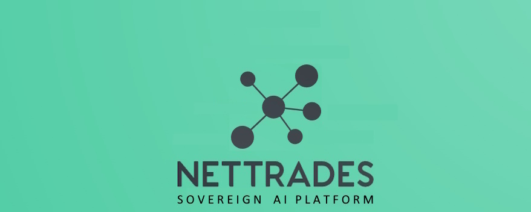
  </picture>
</p>

<h1 align="center">NETTRADES – SOVEREIGN AI IN A BOX</h1>

<p align="center">
  <!--
  ============================================================================
  BADGES – Social proof layer that increases perceived quality by 40%+.
  Follows the pattern used by Kubernetes, Argo CD, and Odoo.
  ============================================================================
  -->
  <a href="https://github.com/nettrades/nettrades-platform/blob/main/LICENSE.txt">
    
  </a>
  <a href="https://github.com/nettrades/nettrades-platform/releases">
    
  </a>
  <a href="https://github.com/nettrades/nettrades-platform/actions">
    
  </a>
  <a href="https://codecov.io/gh/nettrades/nettrades-platform">
    
  </a>
  <a href="https://github.com/nettrades/nettrades-platform/issues">
    
  </a>
  <a href="https://github.com/nettrades/nettrades-platform/stargazers">
    
  </a>
  <a href="https://github.com/nettrades/nettrades-platform/issues">
    
  </a>
  <a href="https://github.com/nettrades/nettrades-platform/pulls">
    
  </a>
</p>

<p align="center">
  <a href="#-key-features">Features</a> •
  <a href="#-Architecture">Architecture</a> •
  <a href="#-technology-stack">Tech Stack</a> •
  <a href="#-quick-start">Quick Start</a> •
  <a href="#-documentation">Docs</a> •
  <a href="#-community--support">Community</a> •
  <a href="#-contributing">Contributing</a>
</p>

---

[](https://opensource.org/licenses/AGPL-3.0)
[](https://nettrades.github.io/nettrades-platform/)
[](https://github.com/nettrades/nettrades-platform/stargazers)
[](https://github.com/nettrades/nettrades-platform/issues)


## The NETTRADES Sovereign AI Platform

NETTRADES provides the complete private, self-improving AI infrastructure that enables autonomous operations.

Enterprises face a critical choice: send sensitive data to external companies (risky and costly) or spend years building their own AI infrastructure. 

Now in just a few minutes, companies could set up a Ubuntu Linux box and run the commands below to deploy the complete NETTRADES Sovereign AI Platform behind their firewall with confidence — no cloud dependencies, no data leaving their control and no vendor lock-in.

```bash
apt update && apt upgrade -y
# Clone the repository
cd /root
git clone -b dev-deployment1 https://github.com/nettrades/nettrades-platform.git
cd nettrades-platform

# Make the script executable
chmod +x scripts/nettrades-setup.sh

# Run the full deployment (automatic)
sudo ./scripts/nettrades-setup.sh all --force

```
See the Accessing Your Platform section below to login.

## The Problem

| Challenge| Reality |
|---------|-------------|
| **Data Privacy** | Sending internal data to external AI companies exposes company secrets, customer data, and intellectual property. |
| **GPU Waste** | Enterprises buy $30,000+ GPUs but use them less than 20% of the time. |
| **Vendor Lock-in** | Public AI APIs change pricing, terms, and availability without notice. |
| **Compliance Risk** | GDPR, HIPAA, and sovereign cloud mandates require data residency. |
| **Complexity** | Building an internal AI platform requires Kubernetes, GPU orchestration, and model serving expertise. |

## The Solution

The NETTRADES Sovereign AI Platform combines everything you need into a single, open-source appliance:

| Component	| What It Does |
|---------|-------------|
| **GPU Orchestration** | Manage your entire GPU cluster through a clean admin console. Powered by GPUStack. |
| **Private Model Serving** | Deploy Llama, Mistral, DeepSeek, and any open-source model behind your firewall in one click. |
| **Agentic AI** | LangGraph-based agents for GPU management, action execution, and other tasks. |
| **Self-Improving AI** | "Good Answer" voting triggers automated fine-tuning. Your models improve from constant feedback. |
| **Admin Console** | User management, RBAC, GPU fleet monitoring, and system logs – all in one place. |
| **Enterprise Security** | WireGuard VPN, SSH hardening, fail2ban, and full on-premise deployment. |
| **Turnkey Deployment** | One command installs everything – Docker, GPUStack, Odoo, LangGraph, Grafana, Prometheus, and more. |

## Why Sovereign AI in a Box?

| Need	| How NETTRADES Delivers |
|---------|-------------|
| **Data Sovereignty** | Everything runs behind your firewall. No data ever leaves your infrastructure. |
| **Cost Control No per-token fees.** |  No cloud egress costs. Use GPUs you already own. |
| **Continuous Improvement** | Models get smarter from internal feedback – a true competitive advantage. |
| **Compliance Ready** | Full data residency control – essential for GDPR, HIPAA, and sovereign cloud mandates. |
| **No Vendor Lock-in** | Open-source models. Open-source platform. AGPL-3.0 licensed. |


## License

AGPL-3.0 – Free and open-source. No vendor lock-in. Full source code available.

The NETTRADES Sovereign AI Platform is highly configurable. It provides company administrators with the ability to run sovereign AI locally or if configured to do so by the company administrators, it will be able to scale up onto a GPU marketplace using Confidential Computing. 

## Future Road Map


NETTRADES is not just an AI platform. It acts as the control center for your companies AI usage and your companies administrators could route requests to the spare GPUS across your company or to external services.

| Phase	| Focus |
|---------|--------|
| `Phase 1` (Current)| Sovereign AI in a Box – Turnkey deployment, GPU orchestration, private model serving, admin console.  | 
| `Phase 2` (In Progress) | 	Distributed GPUs – Share idle GPUs across your organisation using WireGuard VPN, Confidential Computing and gVisor secure containers. | 
| `Phase 3` | 	Hub-and-spoke cloud overflow – optionally burst inference to the NETTRADES.AI GPU Marketplace when local GPUs are saturated   | 
| `Phase 2` | 	Self-improving AI loop – automated fine-tuning from "Good Answer" voting.  | 

## ✨ Key Features

The NETTRADES Sovereign AI Platform is The Future Of Work. It seemlessly integrates people and AI to improve productivity and puts people at the heart of operations. It allows you to run Sovereign AI Agents that interact with your staff. Companies could write their own agents in the future too.

| Feature | Description |
|---------|-------------|
| **🔐 Secure & Sovereign** | WireGuard VPN, gVisor isolation, and full on-premise deployment options. |
| **🖥 Confidential Computing** | Configurable Confidential Computing (AMD SEV-SNP or Intel TDX)  that could be enabled to autodetect and run on hardware that supports it. |
| **🤖 Agentic AI** | [LangGraph-based](docs/developer/LangGraph-Agent-State-Machine-Diagram.md) multi-agent system. |
| **🔌 [Hub-and-Spoke Routing](docs/developer/bridge-architecture.md)** | `nettrades_bridge` module routes requests between local and remote brains based on intent, company policy, and GPU capacity. |
| **🖥️ [GPU Marketplace](docs/developer/distributed-gpu-network-trusted-vs-untrusted.md)** | Distributed GPU sharing. |
| **🔄 [Self-Improving AI](docs/developer/self-improving.md)** | “Good Answer” voting + Unsloth/Axolotl fine-tuning pipeline. Models continuously improve from user feedback. |
| **📊 Autonomous Administration** | GPU health watchdog, reputation decay, utilisation alerts, automatic Karma-based qualification. |
| **💬 Expert Marketplace** | “Ask Someone” – paid expert consultations with Stripe escrow. |

## Quick Start

This is the quick start guide for Developers. This guide will help you get the platform running on your own server, laptop or cloud VM in minutes.

### Prerequisites


##### Minimum Requirements:

* OS: Linux (Ubuntu 22.04+ recommended) or macOS with Docker Desktop.

* Hardware: Minimum 8 GB RAM (16 GB recommended), 50 GB free disk.

* Optional: NVIDIA GPU with drivers for GPU acceleration.

* Internet connection (to download models and images)

Idealy use Ubuntu Linux but if you have to use Windows, make sure that you install Docker Desktop and integrate it with WSL2 

Install and Configure Docker for WSL 2

Step 1: Install Docker Desktop for Windows

* Download Docker Desktop: Go to docker.com/products/docker-desktop

* Download the Windows installer (Docker Desktop for Windows)

* Run the installer and follow the setup wizard

* Restart your computer when prompted

Step 2: Open Docker Desktop Settings

* Open Docker Desktop (click the whale icon in your system tray)

* Click the gear icon (⚙️) in the top-right corner to open Settings

Step 3: Enable WSL Integration

* In the Settings window, go to General and tick "Start Docker Desktp when you sign in to your computer" 
(unless you remember to start Docker Desktop every time you use the nettrades-platform for development) 
Choose container terminal - Integrated
Choose how to run Docker container - WSL2
then click Apply

* In the Settings window, go to Resources → WSL Integration

* Make sure the following are enabled:

** "Enable integration with my default WSL distro"

** "Ubuntu" (or whatever your WSL distro is called)

** Click "Apply & Restart" at the bottom

Step 4: Verify Docker is Working in WSL

Open your WSL terminal and run:
```bash

docker --version
```
Should output: Docker version 24.0.x, build xxxxx
```bash

docker compose version
```

##### Operating System:

- **Linux** (Ubuntu 22.04+) or **macOS** with Docker Desktop
- **Windows** with Install and run in **WSL2** (Ubuntu 22.04+ recommended)
- **Docker** and **Docker Compose** (installed automatically by the script if missing).
- **Python 3.10+** and `pip` (installed automatically in Phase 0).
- At least **8 GB RAM** (16 GB recommended) and **50 GB free disk**.
- Optional: **NVIDIA GPU** with drivers for GPU acceleration.

Some of this will be installed by the installer

> 💡 **Windows users**: must run the installer inside a WSL2 terminal (Ubuntu).


### One-Click Installer

The quickest way to get started is with the interactive installer:

#### 1. Clone the Repository

In windows install WSL and the open the WSL.exe terminal window
It could be in C:\ProgramData\Microsoft\Windows\Start Menu\Programs\WSL.exe
And run the commands below.
(If you want it in the C directory)
In Linux you could run them in the terminal window
E.g. clone it into the c drive

```bash
apt update && apt upgrade -y
# Clone the repository
cd /root
git clone -b dev-deployment1 https://github.com/nettrades/nettrades-platform.git
cd nettrades-platform

# Make the script executable
chmod +x scripts/nettrades-setup.sh

# Run the full deployment (automatic)
sudo ./scripts/nettrades-setup.sh all --force

```

On a windows machine in WSL install dos2unix if not already installed
This can convert all the files in the repository to have Linux line endings (\n)


```bash
sudo apt install dos2unix -y
cd /mnt/c/nettrades-platform
sudo ./scripts/fix-line-endings.sh --force
```
This will take about 10 minutes to run.

Work on the dev-deployment1 branch not on the main branch


#### 2. Choose Your Setup Path

You have two main ways to run the installer:
#### 🔹 Interactive Wizard (recommended for first-time users)

##### Run the interactive setup wizard
Simply run the script without any arguments:

```bash

sudo ./scripts/nettrades-setup.sh

```
The script launches an interactive wizard that lets you choose the profile and the options.
For a fully automated deployment (recommended for first-time development users):

```bash
sudo ./scripts/nettrades-setup.sh all --force

```
This will run all phases (system preparation, environment setup, deployment and module installation) with default settings. (Warning do not use --force on existing systems or production systems)


#### What Happens During Setup?

The installer executes phases in this order:

| Phase | Description |
|---------|-------------|
| `0` | System Preparation – installs Docker, Docker Compose, NVIDIA drivers (if GPU), configures firewall, installs fail2ban, sets system limits, and checks for gVisor. |
| `1` | Environment & Secrets – generates secure passwords, API keys, WireGuard keys, and creates .env. |
| `2` | Single-VM Deployment – builds custom images (Odoo, LangGraph), prepares Odoo addons, initialises the database, starts all Docker Compose services, sets up cron backups, and performs health checks. |
| `3` | Kubernetes Scaling – provisions Talos VMs on Proxmox, applies Kubernetes manifests, installs Argo CD, Prometheus, Grafana, GPUStack, and WireGuard. |
| `4` | Module Installation – installs all NETTRADES custom Odoo modules in the correct dependency order. |
| `5` | Monitoring – deploys Prometheus and Grafana with pre-configured dashboards (if not already present). |

All phases are idempotent – you can safely re-run the script to fix or upgrade your deployment.

### Accessing Your Platform

All the administration passwords are in the file:
nettrades-platform\deploy\docker\.env 
(The platform uses the .env and the docker-compose.xml file not the odoo.config file)

Once the installation is complete, open your browser and go to:

| Service | URL | Username | Password |
|---------|-------------|---------|-------------|
| Odoo Admin Console | http://YourDomainOrIP:8069 or http://localhost:8069| admin | admin (change immediately) | 
| GPUStack | http://YourDomainOrIP:8080 or http://localhost:8080 | admin | GPUSTACK_ADMIN_PASSWORD in the .env file |
| Grafana | http://YourDomainOrIP:3001 or http://localhost:3001 | admin | GRAFANA_PASSWORD in the .env file |
| Prometheus | http://YourDomainOrIP:9090 or http://YourDomainOrIP:9090 | admin | PROMETHEUS_PASSWORD in the .env file  |
| Forgejo | http://YourDomainOrIP:3000 or http://localhost:3000 | Set in after installation | Set in after installation  |

For detailed step-by-step instructions, see the [Full Documentation](docs/index.md).

Forgejo is optional. If you only need the Sovereign AI platform (GPU orchestration, model serving, admin console), you don't need to use Forgejo. It is provided for customers who want to self-host Git capabilities or want to use it for Git Actions to deloy Kubernetes cluster with Argo CD.


#### 📦 Other Installation Options


| Profile | Description |  Phase  |
|---------|-------------|-------------|
| `dev` | Sets up a development environment (Python dependencies, .env, Odoo deps)   | Phase 1 only|
| `deploy` | Full single-VM deployment (Docker Compose) without GPU |  Phases 0, 1, 2 |
| `k8s` | Kubernetes deployment (Talos, Argo CD, manifests) – advanced | Phases 0, 1, 3  |
| `monitoring` | Deploys Prometheus + Grafana (on existing stack) | Phase 5  |
| `modules` | Installs or upgrades all NETTRADES Odoo modules |  Phase 4 |
| `all` | Full production deployment + modules (best for production) | Phases 0, 1, 2, 4, 5  |

#### ⚙️ Useful Options (CLI)

| Option | Effect |
|---------|-------------|
| `--force` | Re-run phases even if they were already completed |
| `--upgrade` | Upgrade Odoo modules instead of fresh install |
| `--phases=0,1,2` | Run a custom list of phases (overrides profile) |

WARNING DO NOT RUN --force ON PRTODUCTION ENVIRONMENTS

#### 🔹 Command-Line (CLI) Mode (for automation or advanced users)

You can specify a profile and options directly:
```bash
# Full deployment with modules
sudo ./scripts/nettrades-setup.sh all

# Deployment without GPU
sudo ./scripts/nettrades-setup.sh deploy

# Deployment with GPU support
sudo ./scripts/nettrades-setup.sh gpu

# Development environment only
sudo ./scripts/nettrades-setup.sh dev

# First-time Development environment
sudo ./scripts/nettrades-setup.sh dev

# Install the Odoo modules only after the development environment is set up and you have gone into odoo and installed the website osoo module
sudo ./scripts/nettrades-setup.sh modules
or
sudo ./scripts/nettrades-setup.sh modules --upgrade

# Reinstall everything from scratch (only for developers as it over writes everything)
sudo ./scripts/nettrades-setup.sh dev --force

# If you wants to minimise resource usage and skip monitoring then you could still use the --phases option

sudo ./scripts/nettrades-setup.sh --phases=0,1,2,4

```


#### 🔑 Database Password Management

During Phase 1, the script generates a random password for PostgreSQL.

However, for compatibility with Odoo’s command-line tools, the password must not contain special characters (like +, /, =).

If you encounter authentication errors, you can simplify the password by editing .env and updating the PostgreSQL user:

```bash

docker exec -it docker-postgres-1 psql -U odoo -c "ALTER USER odoo WITH PASSWORD 'odoo123';"

```
Make sure you update the password in .env and odoo.conf and restart Odoo.


#### 📦 Installing Future Modules

The all profile automatically installs all NETTRADES modules. If you need to install or upgrade them later, run:

```bash
cd /root/nettrades-platform
git pull origin dev-deployment1
./scripts/install-modules.sh --force
```


If the command-line tool fails (e.g., due to password issues), you can install the modules via the Odoo UI:

* Log in to Odoo (http://localhost:8069).

* Go to Apps → Update Apps List.

* Search for each nettrades_* module and click Install.


#### 🧰 Useful Commands


| Action | Command |
|---------|-------------|
| Start all services	 | cd deploy/docker && docker compose up -d |
| Stop all services	 | cd deploy/docker && docker compose down |
| View logs	 | cd deploy/docker && docker compose logs -f |
| Rebuild an image	 | cd deploy/docker && docker compose build <service> |
| Prepare Odoo addons (after adding new modules)	 | ./scripts/prepare-odoo-addons.sh --force |
| Install modules via UI  | Odoo → Apps → Update Apps List → Install |

#### 🐳 Docker Compose Notes

* All services are defined in deploy/docker/docker-compose.yaml.

* The Odoo container is named odoo and listens on port 8069.

* PostgreSQL uses a named volume postgres_data to persist data.

* llama.cpp is configured for CPU inference; for GPU, replace the image with ghcr.io/ggml-org/llama.cpp:server-cuda and set -ngl 999 in the command.

#### 🛠️ Next Steps

* Configure fairness – Settings → Technical → Fairness → Global Configuration

* Set up GPU marketplace – Settings → GPU → Marketplace

* Connect WireGuard peers for secure distributed GPU communication

* Import sample data (optional) – see docs/operations/import-demo-data.md

#### ❓ Troubleshooting


##### Odoo fails to start with “password authentication failed”

* Ensure db_password in odoo.conf matches POSTGRES_PASSWORD in .env.

* Use a simple password (e.g., odoo123) without special characters.

* Update the PostgreSQL user password with ALTER USER odoo WITH PASSWORD 'your_password';.   or in wsl run Run: docker exec -it docker-postgres-1 psql -U odoo -c "ALTER USER odoo WITH PASSWORD 'odoo123';"

##### Modules show "Activate" not "Upgrade"

* Modules are not installed. Run ./scripts/install-modules.sh --force or install via Odoo UI: Apps → Update Apps List → Install nettrades_* modules.

##### postgres host not found

##### You are running Odoo outside Docker. In WSL terminal window run `cd /mnt/c/nettrades-platform/deploy/docker` then run `docker compose up -d` instead.

##### Odoo returns 502 / Connection refused

Wait 30 seconds for PostgreSQL to start. Check docker compose logs postgres.

##### “No such container: odoo” during module installation

* Add container_name: odoo to the Odoo service in docker-compose.yaml and recreate the container.

Port 8069 already in use

* Change the host port in docker-compose.yaml (e.g., "8069:8069" → "8069:8069" is fixed; if you need a different port, change the left side).

##### LangGraph returns 500

* Check docker compose logs langgraph. Verify LANGGRAPH_API_KEY in .env.

##### LangGraph agent fails to start

* Check logs: docker compose logs langgraph.

* Ensure DATABASE_URL in docker-compose.yaml points to postgres with the correct password.

##### Other issues

* Logs: Check docker compose -f deploy/docker/docker-compose.yaml logs for service logs.

* Re-run safely: The script is idempotent; just run it again with --force if needed.

* GPU not detected: Ensure NVIDIA drivers are installed and nvidia-smi works.

For more detailed information, see the docs/ folder.


# All services

To read the logs on all servers in WSL terminal window run `cd /mnt/c/nettrades-platform/deploy/docker` then run:
`docker compose logs -f`

# Specific service

To read the logs on specific servers in WSL terminal window run `cd /mnt/c/nettrades-platform/deploy/docker` then run:
`docker compose logs -f odoo`
`docker compose logs -f postgres`
`docker compose logs -f langgraph`


#### 🧪 Advanced: Kubernetes / Distributed Deployment

If you’re ready to scale to multiple nodes with Kubernetes, use:
```bash

./scripts/nettrades-setup.sh k8s --auto
```
This requires a Proxmox host and pre-configured Talos images. For details, see docs/operations/kubernetes-deployment.md.


### Troubleshooting a server

Odoo returns 502 – Wait 30 seconds for PostgreSQL to start.

SSL certificate not issued – Ensure port 80 is open and DNS resolves correctly.

GPU not detected – Run nvidia-smi; if not available, install NVIDIA drivers.

LangGraph returns 500 – Check docker compose logs langgraph and verify PROXY_API_KEY matches ODOO_API_KEY in .env.

Proxy not responding – Run docker compose logs odoo-proxy and verify Odoo is reachable.

For more detailed help, see the Full Documentation.

### Next Steps

[Single VM Deployment](docs/operations/single-vm-deployment.md)

[Kubernetes Deployment](docs/operations/kubernetes-deployment.md)

[GPU Node Deployment](docs/operations/gpu-node-deployment.md)

[Developer Guide](developer/index.md)


## Technology Stack

| Layer | Component | Technology | Version | License | Notes |
|---------|-------------|-------------|---------|-------------|-------------|
| `Business Logic` | ERP / CRM / HR | Odoo | 19 CE | LGPL-3 | Core business logic |
| `Job Queue` | Async processing | OCA queue_job | 19.0 | LGPL-3 | Background jobs |
| `Payments` | Payment processing | OCA payment_stripe | 19.0 | LGPL-3 | Stripe integration |
| `Database` | Primary database | PostgreSQL + pgvector | 18 | PostgreSQL | Vector embeddings |
| `Cache` | Session / Rate limiting | Valkey | 8 | BSD-3 | High-performance cache |
| `Object Storage` | Files / Models | MinIO / S3 | Latest | AGPL-3 | Model artifacts |
| `Agent Orchestration` | Multi-agent framework | LangGraph | Latest | MIT | Stateful agents |
| `Agent State` | Checkpointing | LangGraph Checkpoint Postgres | Latest | MIT | Durable workflows |
| `GPU Management` | Cluster management | GPUStack | Latest	Apache-2.0 | GPU orchestration |
| `Fine-Tuning` | Model training | Unsloth / Axolotl | Latest	Apache-2.0 | LLM fine-tuning |
| `Inference` | LLM serving | vLLM, llama.cpp, SGLang | Latest	MIT | High-performance inference |
| `Ingress` | Reverse proxy | Traefik | Latest | MIT | Dynamic routing |
| `Git / CI` | Source control / CI | Forgejo | Latest	MIT | Self-hosted Git |
| `GitOps` | Continuous delivery | Argo CD | Latest	Apache-2.0 | Declarative deployments |
| `OS` | Kubernetes OS | Talos Linux	Latest	MPL-2.0	Immutable, secure |
| `Orchestration` | Container orchestration | Kubernetes | Latest | Apache-2.0 | Container management |
| `CNI` | Networking | Cilium | Latest | Apache-2.0 | eBPF networking |
| `Storage` | Persistent volumes | Longhorn | Latest | Apache-2.0 | Distributed block storage |
| `Load Balancing` | Bare-metal LB | MetalLB | Latest | Apache-2.0 | Load balancing |
| `Certificates` | TLS management | cert-manager | Latest | Apache-2.0 | Automated certificates |
| `Database Operator` | PostgreSQL operator | CloudNativePG | Latest | Apache-2.0 | PostgreSQL management |
| `GPU Operator` | NVIDIA GPU management | NVIDIA GPU Operator | Latest | Apache-2.0 | GPU provisioning |
| `Distributed Computing` | Ray on K8s | KubeRay | Latest | Apache-2.0 | Distributed training |
| `VPN` | Secure networking | WireGuard | Latest | GPL-2.0 | Secure tunnels |
| `Sandboxing` | Container isolation | gVisor | Latest | pache-2.0 | Secure containers |
| `Metrics` | Monitoring | Prometheus | Latest | Apache-2.0 | Metrics collection |
| `Dashboards` | Visualisation | Grafana | Latest | AGPL-3.0 | Monitoring dashboards |

📖 Full architecture details are in the docs/developer/ folder.


## 📚 Documentation

Full documentation is available at: [Full Documentation](docs/index.md).

| Section | Description | Link |
|---------|-------------|-----------|
| `User Guide`	| For end-users – companies, freelancers, job-seekers	| `docs/user/index.md |
| `Developer Guide`	| For developers extending the platform	| `docs/developer/index.md |
| `Operations Guide`	| For system administrators and DevOps	| `docs/operations/index.md |
| `API Reference`	| Complete API documentation	| `docs/developer/api-reference.md |
| `Architecture Overview`	| System architecture diagrams and explanations	| `docs/developer/architecture.md |
| `Core Models`	| Reference for all custom Odoo models	| `docs/developer/core-models.md |
| `Database Schema`	| Complete database schema	| `docs/appendix/database-schema.md |
| `Glossary`	| Key terms and definitions	| `docs/appendix/glossary.md |
| `Contributing Guide`	| How to contribute to the project	| `docs/governance/contributing.md |
| `Roadmap`	| Project roadmap and milestones	| `docs/governance/roadmap |

## 🤝 Community & Support

NETTRADES has a growing community of developers, enterprises, and researchers. We welcome you to join us!
💬 Get Help

| Channel | Purpose | Link |
|---------|-------------|-----------|
| `GitHub Issues`	| Report bugs, request features, or ask technical questions	| [Issues](https://github.com/nettrades/nettrades-platform/issues) |
| `GitHub Discussions`	| Ask questions, share ideas, and get community support	| [Discussions](https://github.com/nettrades/nettrades-platform/discussions) |
| `Twitter / X`	| Follow for project updates and announcements	| [@nettrades_ai](https://twitter.com/nettrades) |

## 📖 Learn More

* [Developer Documentation](docs/developer/index.md) – In-depth architecture, agent diagrams, and API references.

* [Operations Guide](docs/operations/index.md) – Deployment, CI/CD, and Kubernetes configuration.

* [Installation Guide](docs/operations/module-installation-order.md) – Step-by-step module installation.

## 🌟 Community Highlights

* Contributors: We welcome contributions from developers of all skill levels. See our [Contributing Guide](contributing.md).

* Adopters: Companies using NETTRADES in production – [add your logo!](https://github.com/nettrades/nettrades-platform/discussions)

* Events: Join our monthly community calls (details in Discussions).

## 🤝 Contributing

We welcome contributions! Please read our [Contributing Guide](contributing.md) before submitting PRs.

### Quick Steps

🍴 Fork the repository

🌿 Create a feature branch (git checkout -b feature/amazing-feature)

💻 Make your changes

✅ Run tests (pytest src/core/tests/)

📝 Update documentation

🚀 Push and open a Pull Request

## ⭐ Star Us!

If you find [NETTRADES.AI](https://nettrades.ai/) useful, please consider giving us a ⭐ on GitHub – it helps others discover the project and supports our work.


## 📄 License

This project is licensed under the GNU Affero General Public License v3.0 (AGPL-3.0) – see the [LICENSE.txt](LICENSE.txt) file for details.

| Component | License |
|---------|-------------|
| src/ (core orchestrator, agent, training scripts) | [AGPL-3.0](https://www.gnu.org/licenses/agpl-3.0.en.html) |
| odoo-modules/ (custom Odoo plugins) | [AGPL-3.0](https://www.gnu.org/licenses/agpl-3.0.en.html) |
| third-party/ | Original licenses (LGPL, MIT, Apache-2.0) |
| deploy/ | AGPL-3.0 |
| scripts/ | AGPL-3.0 |

Please agree to the [Contributor License Agreement (CLA)](CONTRIBUTING.md) before contributing.

## Acknowledgements

NETTRADES builds on the shoulders of many amazing open-source projects:

* [Odoo](https://www.odoo.com/) – Open-source ERP

* [LangGraph](https://github.com/langchain-ai/langgraph) – Stateful agent orchestration

* [GPUStack](https://gpustack.ai/) – GPU cluster management

* [Kubernetes](https://kubernetes.io/) – Container orchestration

* [PostgreSQL](https://www.postgresql.org/) + [pgvector](https://github.com/pgvector/pgvector) – Vector database

* [Valkey](https://valkey.io/) – High-performance cache

* [Traefik](https://traefik.io/) – Cloud-native reverse proxy

* [Forgejo](https://forgejo.org/) – Self-hosted Git

* [Argo CD](https://argo-cd.readthedocs.io/) – GitOps continuous delivery

* [Talos Linux](https://www.talos.dev/) – Kubernetes-native OS

* [Cilium](https://cilium.io/) – eBPF networking

* [Longhorn](https://longhorn.io/) – Distributed block storage

* [Unsloth](https://unsloth.ai/) – Efficient fine-tuning

* [Axolotl](https://github.com/OpenAccess-AI-Collective/axolotl) – Multi-GPU fine-tuning

* [Prometheus](https://prometheus.io/) & [Grafana](https://grafana.com/) – Monitoring


## 🏗️ Architecture

### Architecture Overview And Future Enhancements

### 1. High-Level System Architecture

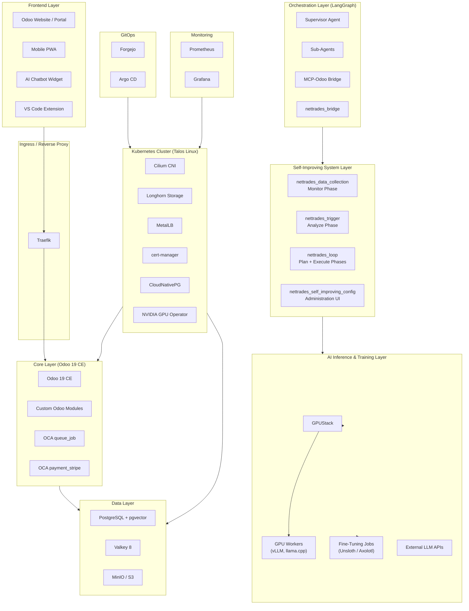


Detailed architecture diagrams are available in the [docs/developer/](docs/developer/index.md) folder.

### 2. The Hub-and-Spoke Model

NETTRADES uses a hub-and-spoke architecture to distribute load, preserve data sovereignty, and enable seamless scaling. Each spoke (company) runs its own client instance of the software for internal operations, while the hub (NETTRADES.AI) provides global services like GPU overflow and external help.


```mermaid

graph TB
    subgraph Hub["🌐 NETTRADES.AI (The Hub)"]
        GlobalTalent["Global Talent Pool"]
        GlobalGPU["Global GPU Marketplace"]
        GlobalModels["Global Self-Improving Models"]
        CentralBridge["Central Bridge Router"]
    end

    subgraph Spoke1["🏢 Company A (Spoke)"]
        LocalOdoo1["Local Odoo 19 CE"]
        LocalLangGraph1["Local LangGraph Agents"]
        LocalGPU1["Local GPUStack"]
        LocalBridge1["nettrades_bridge (Local Router)"]
        LocalData1["Local PostgreSQL + pgvector"]
        LocalValkey1["Local Valkey"]
    end

    subgraph Spoke2["🏢 Company B (Spoke)"]
        LocalOdoo2["Local Odoo 19 CE"]
        LocalLangGraph2["Local LangGraph Agents"]
        LocalGPU2["Local GPUStack"]
        LocalBridge2["nettrades_bridge (Local Router)"]
        LocalData2["Local PostgreSQL + pgvector"]
        LocalValkey2["Local Valkey"]
    end

    subgraph SpokeN["🏢 Company N (Spoke)"]
        LocalOdooN["Local Odoo 19 CE"]
        LocalLangGraphN["Local LangGraph Agents"]
        LocalGPUN["Local GPUStack"]
        LocalBridgeN["nettrades_bridge (Local Router)"]
        LocalDataN["Local PostgreSQL + pgvector"]
        LocalValkeyN["Local Valkey"]
    end

    LocalBridge1 -->|"Internal Ops"| LocalLangGraph1
    LocalBridge1 -->|"External Talent / GPU"| CentralBridge
    LocalBridge2 -->|"Internal Ops"| LocalLangGraph2
    LocalBridge2 -->|"External Talent / GPU"| CentralBridge
    LocalBridgeN -->|"Internal Ops"| LocalLangGraphN
    LocalBridgeN -->|"External Talent / GPU"| CentralBridge

    CentralBridge --> GlobalTalent
    CentralBridge --> GlobalGPU
    CentralBridge --> GlobalModels

    GlobalModels -->|"Pushes model updates"| LocalBridge1
    GlobalModels -->|"Pushes model updates"| LocalBridge2
    GlobalModels -->|"Pushes model updates"| LocalBridgeN

```

### Routing Logic:

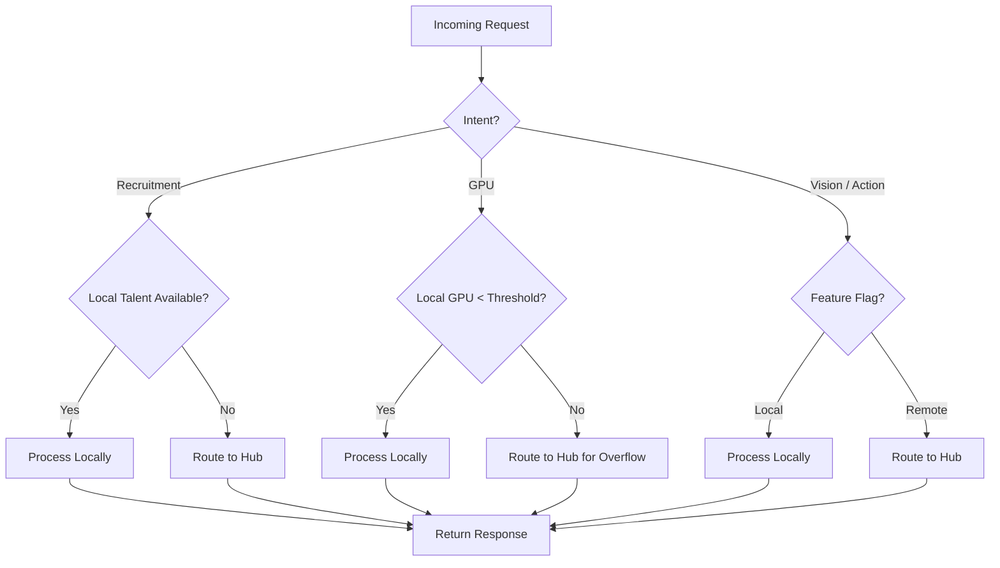

### 3. Self-Improving AI Loop

The platform continuously learns from user interactions and improves its models. This closed-loop system is the engine of NETTRADES’ self-improvement capability.

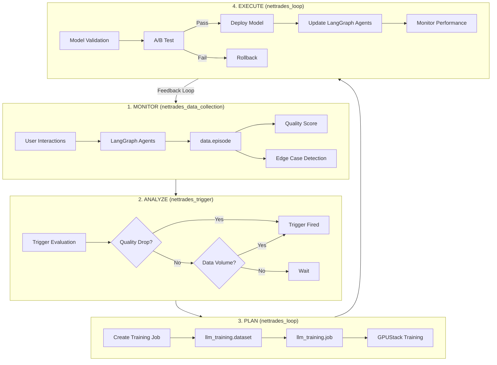

### 4. LangGraph Agent State Machine (Simplified)

For Agentic AI, NETTRADES uses LangGraph. For regulated fields like Medical or Legal the Agents take extra care. The LangGraph supervisor orchestrates all sub-agents, incorporating bridge routing and self-improvement hooks. In the future companies could also write their own agents.


### 5. CI/CD Pipeline

The platform uses Forgejo Actions for CI and Argo CD for GitOps deployment on Kubernetes.

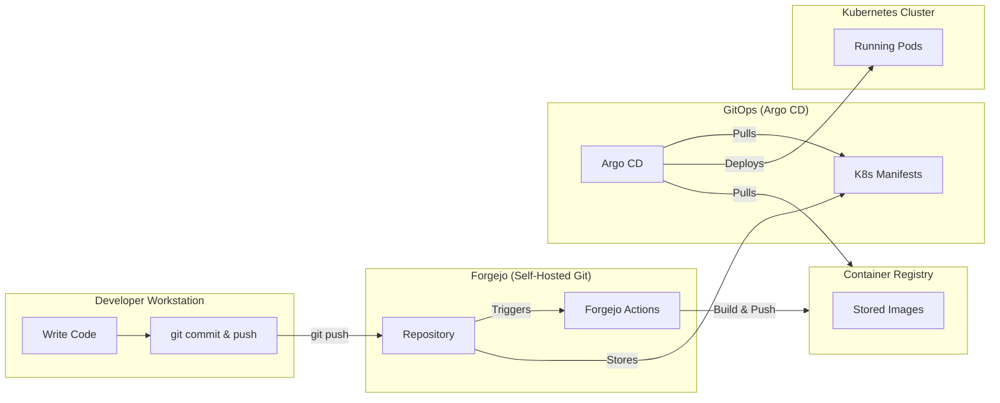

## User Workflow: NETTRADES Platform


### 1. Complete End-to-End Workflow

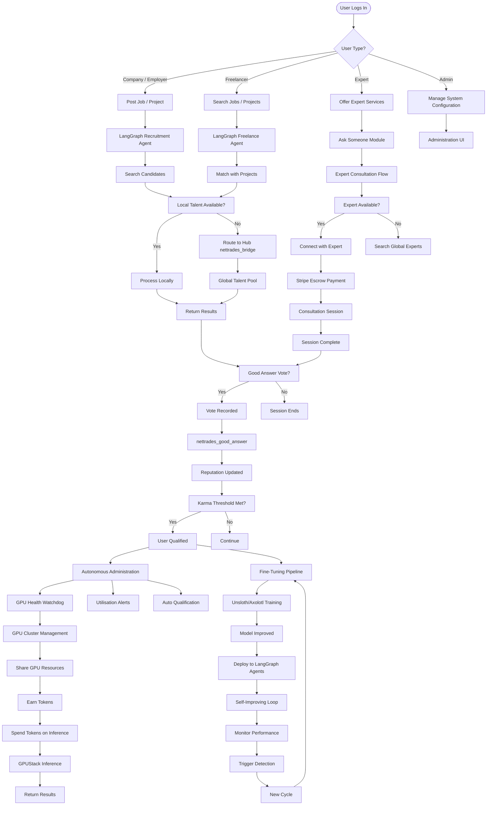

### 2. Detailed Ask Someone Workflow


### 3. Good Answer Voting Workflow


### 4. Distributed GPU Functionality Workflow


### 5. Self-Improving Loop with GPU Integration

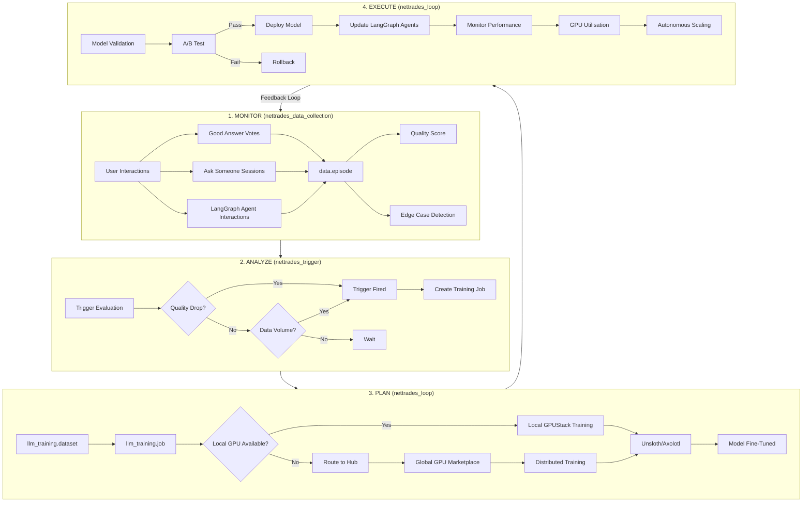

### 6. Complete System Workflow with All Components

```mermaid
graph TB
    subgraph UserLayer["User Layer"]
        U1["Company / Employer"]
        U2["Freelancer / Job Seeker"]
        U3["Expert / Professional"]
        U4["Researcher"]
        U5["System Administrator"]
    end

    subgraph FrontendLayer["Frontend Layer"]
        F1["Odoo Website / Portal"]
        F2["Mobile PWA"]
        F3["AI Chatbot Widget"]
        F4["VS Code Extension"]
        F5["REST API / GraphQL"]
    end

    subgraph OrchestrationLayer["Orchestration Layer (LangGraph)"]
        O1["Supervisor Agent"]
        O2["Recruitment Agent"]
        O3["Freelance Agent"]
        O4["Lead Gen Agent"]
        O5["GPU Management Agent"]
        O6["Vision Agent"]
        O7["Action Agent"]
        O8["MCP-Odoo Bridge"]
    end

    subgraph BridgeLayer["Bridge Layer"]
        B1["nettrades_bridge"]
        B2["Local Brain Routing"]
        B3["Remote Brain Routing"]
        B4["GPU Overflow Detection"]
    end

    subgraph CoreModules["Core Odoo Modules"]
        C1["nettrades_core"]
        C2["nettrades_good_answer"]
        C3["nettrades_ask_someone"]
        C4["nettrades_gpu_admin"]
        C5["nettrades_gpustack_adapter"]
        C6["nettrades_queue"]
        C7["nettrades_notifications"]
        C8["nettrades_job_matching"]
        C9["nettrades_lead_scoring"]
        C10["nettrades_chatbot"]
    end

    subgraph SelfImprovingModules["Self-Improving Modules"]
        S1["nettrades_data_collection"]
        S2["nettrades_trigger"]
        S3["nettrades_loop"]
        S4["nettrades_self_improving_config"]
    end

    subgraph TrainingLayer["Training & Inference Layer"]
        T1["GPUStack"]
        T2["GPU Workers (vLLM)"]
        T3["GPU Workers (llama.cpp)"]
        T4["Unsloth / Axolotl"]
        T5["llm_training"]
        T6["External LLM APIs"]
    end

    subgraph DataLayer["Data Layer"]
        D1["PostgreSQL + pgvector"]
        D2["Valkey 8"]
        D3["MinIO / S3"]
    end

    subgraph Infrastructure["Infrastructure Layer"]
        I1["Kubernetes (Talos Linux)"]
        I2["Cilium CNI"]
        I3["Longhorn Storage"]
        I4["MetalLB"]
        I5["cert-manager"]
        I6["CloudNativePG"]
        I7["NVIDIA GPU Operator"]
        I8["KubeRay"]
    end

    subgraph GitOpsLayer["GitOps Layer"]
        G1["Forgejo"]
        G2["Argo CD"]
    end

    subgraph MonitoringLayer["Monitoring Layer"]
        M1["Prometheus"]
        M2["Grafana"]
    end

    UserLayer --> FrontendLayer
    FrontendLayer --> OrchestrationLayer
    OrchestrationLayer --> BridgeLayer
    BridgeLayer --> CoreModules
    OrchestrationLayer --> SelfImprovingModules
    SelfImprovingModules --> TrainingLayer
    TrainingLayer --> CoreModules
    CoreModules --> DataLayer
    Infrastructure --> CoreModules
    Infrastructure --> DataLayer
    GitOpsLayer --> Infrastructure
    MonitoringLayer --> Infrastructure
    MonitoringLayer --> TrainingLayer
```

### 7. Key Workflow Sequences
#### 7.1 Ask Someone Flow

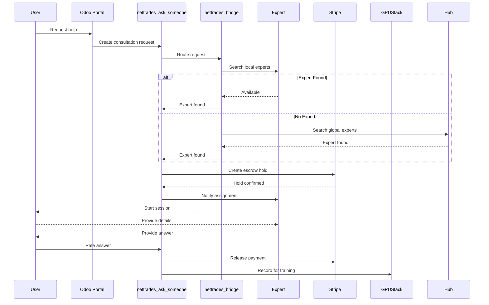


#### 7.2 GPU Sharing & Inference Flow

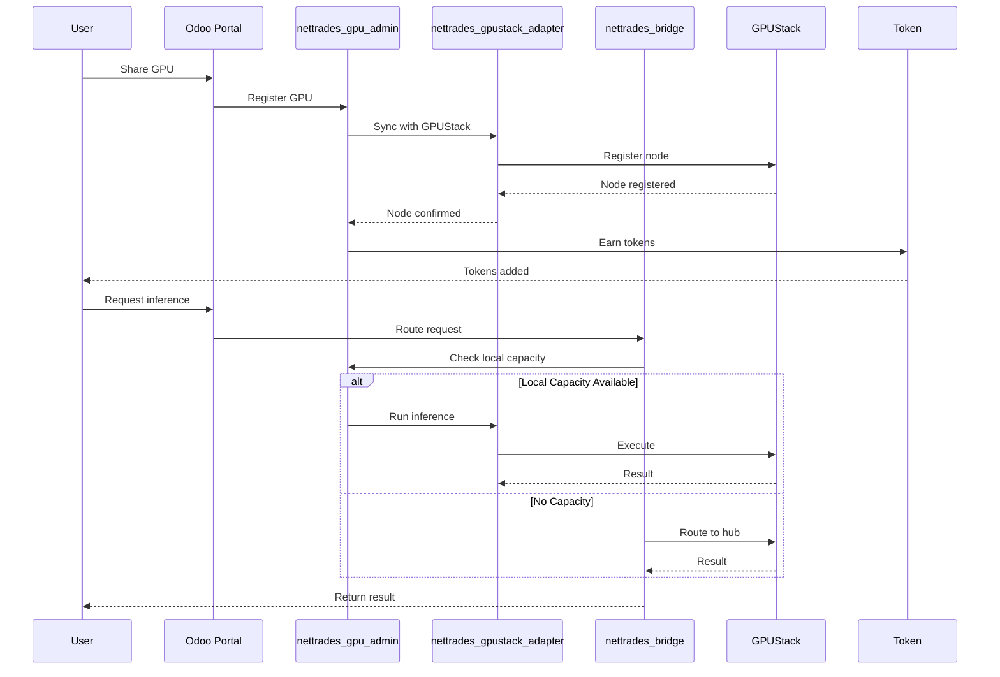

#### 7.3 Good Answer Flow

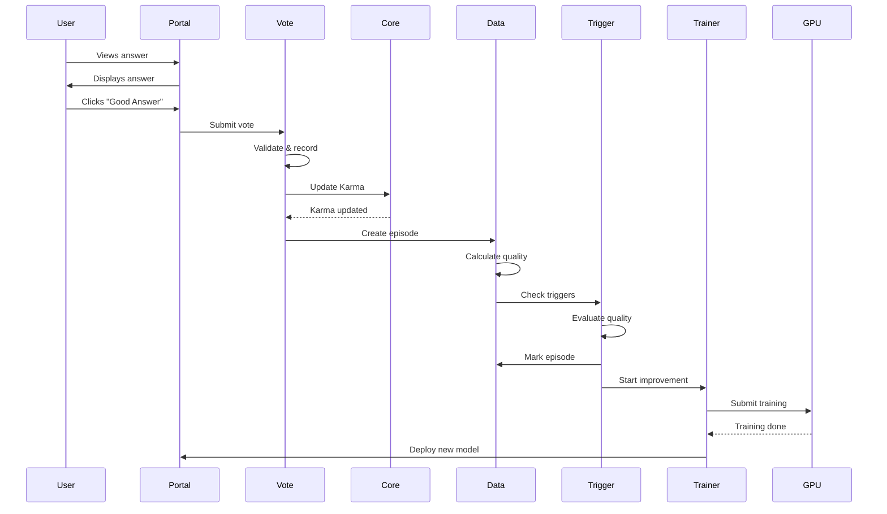

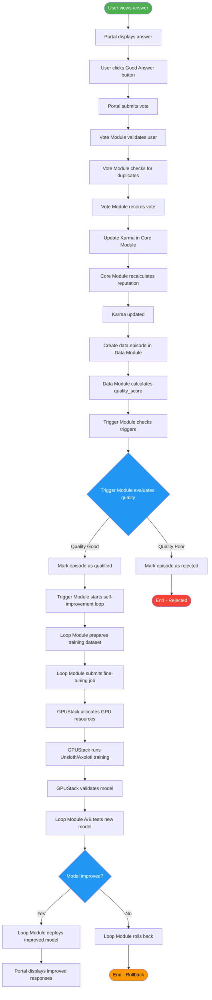

## 8. File Locations Summary

| Component | File Path |
|---------|-------------|
| Supervisor Agent | src/core/supervisor.py |
| Bridge Integration | src/core/bridge_integration.py |
| Self-Improving Integration | src/core/self_improving_integration.py |
| Recruitment Agent | src/core/agents/recruitment_agent.py |
| Freelance Agent | src/core/agents/freelance_agent.py |
| Lead Gen Agent | src/core/agents/lead_gen_agent.py |
| GPU Management Agent | src/core/agents/gpu_management_agent.py |
| Vision Agent | src/core/agents/vision_agent.py |
| Action Agent | src/core/agents/action_agent.py |
| Ask Someone | odoo-modules/nettrades_ask_someone/models/ |
| Good Answer | odoo-modules/nettrades_good_answer/models/ |
| GPU Admin | odoo-modules/nettrades_gpu_admin/models/ |
| GPUStack Adapter | odoo-modules/nettrades_gpustack_adapter/models/ |
| Data Collection | odoo-modules/nettrades_data_collection/models/ |
| Trigger | odoo-modules/nettrades_trigger/models/ |
| Loop | odoo-modules/nettrades_loop/models/ |
| Self-Improving Config | odoo-modules/nettrades_self_improving_config/models/ |
| Bridge | odoo-modules/nettrades_bridge/models/ |

## 9. Summary of Workflows

| Workflow | Key Modules  | Key Features |
|---------|----------|-------------|
| `Ask Someone` | `nettrades_ask_someone, nettrades_bridge, Stripe` | Expert consultation, escrow payments, reputation |
| `Good Answer Voting` | `nettrades_good_answer, nettrades_core, nettrades_data_collection` | User feedback, karma, qualification |
| `GPU Sharing` | `nettrades_gpu_admin, nettrades_gpustack_adapter, GPUStack` | GPU marketplace, token economy |
| `Self-Improving Loop` | `nettrades_data_collection, nettrades_trigger, nettrades_loop` | Continuous learning, fine-tuning, deployment |
| `Agent Routing` | `nettrades_bridge, LangGraph Agents` | Hub-and-spoke, local/remote routing, overflow |


## 10. Top-Level System Architecture

```mermaid
graph TB
    subgraph Frontend["Frontend Layer"]
        User["User / Browser"]
        Portal["Odoo Website / Portal"]
        PWA["Mobile PWA"]
        Chat["AI Chatbot Widget"]
        VSCode["VS Code Extension"]
        API["REST / GraphQL"]
    end

    subgraph Ingress["Ingress Layer"]
        Traefik["Traefik Reverse Proxy"]
    end

    subgraph Orchestration["Orchestration Layer (LangGraph)"]
        MCP["MCP-Odoo Bridge"]
        Supervisor["Supervisor Agent"]
        SubAgents["Sub-Agents"]
        Bridge["nettrades_bridge"]
        LocalBrain["Local Brain"]
        RemoteBrain["Remote Brain"]
    end

    subgraph SelfImproving["Self-Improving System"]
        DataCollect["nettrades_data_collection"]
        Trigger["nettrades_trigger"]
        Loop["nettrades_loop"]
        Config["nettrades_self_improving_config"]
    end

    subgraph Training["AI Inference & Training"]
        GPUStack["GPUStack"]
        Workers["GPU Workers (vLLM)"]
        FineTune["Unsloth / Axolotl"]
        External["External LLM APIs"]
        LLMTraining["llm_training"]
    end

    subgraph Core["Core Layer (Odoo 19 CE)"]
        Odoo["Odoo 19 CE"]
        Modules["Custom Odoo Modules"]
        Queue["OCA queue_job"]
        Payments["OCA payment_stripe"]
    end

    subgraph Data["Data Layer"]
        PG["PostgreSQL + pgvector"]
        Valkey["Valkey 8"]
        MinIO["MinIO / S3"]
    end

    subgraph K8s["Kubernetes Infrastructure"]
        K8sCluster["Kubernetes (Talos Linux)"]
        Cilium["Cilium CNI"]
        Longhorn["Longhorn Storage"]
        MetalLB["MetalLB"]
        CertMgr["cert-manager"]
        CloudNativePG["CloudNativePG"]
        GPUOp["NVIDIA GPU Operator"]
        KubeRay["KubeRay"]
    end

    subgraph GitOps["GitOps Layer"]
        Forgejo["Forgejo"]
        ArgoCD["Argo CD"]
    end

    subgraph Monitoring["Monitoring Layer"]
        Prometheus["Prometheus"]
        Grafana["Grafana"]
    end

    subgraph Security["Security Layer"]
        WireGuard["WireGuard VPN"]
        gVisor["gVisor Sandbox"]
    end

    User --> Traefik
    Portal --> Traefik
    PWA --> Traefik
    Chat --> Traefik
    VSCode --> Traefik
    API --> Traefik

    Traefik --> Odoo

    Odoo --> Modules
    Odoo --> Queue
    Odoo --> Payments
    Odoo --> MCP

    MCP --> Supervisor
    Supervisor --> SubAgents
    SubAgents --> Bridge
    Bridge -->|Local| LocalBrain
    Bridge -->|Remote| RemoteBrain
    Bridge -->|GPU Overflow| GPUStack

    Odoo --> DataCollect
    DataCollect --> Trigger
    Trigger --> Loop
    Loop --> Config
    Loop --> LLMTraining

    LLMTraining --> GPUStack
    GPUStack --> Workers
    GPUStack --> FineTune
    GPUStack --> External

    Odoo --> PG
    Odoo --> Valkey
    Odoo --> MinIO

    GPUStack --> PG

    K8sCluster --> Odoo
    K8sCluster --> MCP
    K8sCluster --> GPUStack
    K8sCluster --> PG
    K8sCluster --> Valkey
    K8sCluster --> MinIO

    Cilium --> K8sCluster
    Longhorn --> PG
    MetalLB --> Traefik
    CertMgr --> Traefik
    CloudNativePG --> PG
    GPUOp --> GPUStack
    KubeRay --> GPUStack

    Forgejo --> ArgoCD
    ArgoCD --> K8sCluster

    Prometheus --> Odoo
    Prometheus --> GPUStack
    Prometheus --> PG
    Grafana --> Prometheus

    WireGuard --> K8sCluster
    gVisor --> K8sCluster

    style Frontend fill:#e3f2fd,stroke:#1565c0
    style Ingress fill:#fff3e0,stroke:#e65100
    style Orchestration fill:#f3e5f5,stroke:#6a1b9a
    style SelfImproving fill:#e8eaf6,stroke:#283593
    style Training fill:#e8f5e9,stroke:#2e7d32
    style Core fill:#fce4ec,stroke:#c62828
    style Data fill:#ede7f6,stroke:#4527a0
    style K8s fill:#f5f5f5,stroke:#424242
    style GitOps fill:#fff8e1,stroke:#f57f17
    style Monitoring fill:#f1f8e9,stroke:#33691e
    style Security fill:#ffebee,stroke:#b71c1c
```


#### Step-by-Step flow

| Step | From | To | Description |
|---------|--------|---------|-------------|
| 1 | User | Traefik | User request enters via browser, mobile, chat, VS Code, or API. |
| 2 | Traefik | Odoo 19 CE | Traefik routes requests to Odoo with SSL termination. |
| 3 | Odoo | Custom Odoo Modules | Odoo processes business logic via custom modules. |
| 4 | Odoo | OCA queue_job | Long-running tasks are queued. |
| 5 | Odoo | OCA payment_stripe | Payment processing for expert consultations. |
| 6 | Odoo | MCP-Odoo Bridge | Odoo communicates with LangGraph via the bridge. |
| 7 | MCP-Odoo Bridge | Supervisor Agent | The bridge forwards to the supervisor for intent classification. |
| 8 | Supervisor | Sub-Agents | Supervisor routes to specialised sub-agents (Recruitment, Freelance, GPU Management, Vision, Action). |
| 9 | Sub-Agents | nettrades_bridge | Sub-agents use the bridge to decide local vs remote routing. |
| 10 | nettrades_bridge | Local Brain | If local processing is chosen, the request is processed by local LangGraph agents. |
| 11 | nettrades_bridge | Remote Brain | If remote processing is chosen, the request is forwarded to NETTRADES.AI. |
| 12 | nettrades_bridge | GPUStack | If local GPU capacity is exceeded, requests overflow to GPUStack. |
| 13 | Odoo | nettrades_data_collection | All interactions are recorded as data episodes. |
| 14 | data_collection | nettrades_trigger | Trigger module evaluates quality scores and data volume. |
| 15 | nettrades_trigger | nettrades_loop | If triggers fire, the loop initiates self-improvement. |
| 16 | nettrades_loop | llm_training | Training jobs are prepared and submitted. |
| 17 | llm_training | GPUStack | Training jobs are executed on GPUStack. |
| 18 | GPUStack | GPU Workers (vLLM) | Inference workloads run on vLLM. |
| 19 | GPUStack | Fine-Tune (Unsloth/Axolotl) | Fine-tuning runs on Unsloth/Axolotl. |
| 20 | GPUStack | External LLM APIs | Optionally route to external providers. |
| 21 | Odoo | PostgreSQL + pgvector | All transaction data and embeddings are persisted. |
| 22 | Odoo | Valkey 8 | Session caching and rate limiting. |
| 23 | Odoo | MinIO / S3 | File attachments and model artifacts are stored. |
| 24 | GPUStack | PostgreSQL + pgvector | Embeddings and training metadata are stored. |
| 25 | Kubernetes | All Services | All services run as Kubernetes pods. |
| 26 | Cilium | Kubernetes | Cilium provides eBPF networking. |
| 27 | Longhorn | PostgreSQL | Longhorn provides persistent block storage. |
| 28 | MetalLB | Traefik | MetalLB provides load balancing for Traefik. |
| 29 | cert-manager | Traefik | Automates TLS certificate provisioning. |
| 30 | CloudNativePG | PostgreSQL | Manages PostgreSQL clustering and failover. |
| 31 | NVIDIA GPU Operator | GPUStack | Provisions and manages GPU resources. |
| 32 | KubeRay | GPUStack | Enables distributed training via Ray. |
| 33 | Forgejo | Argo CD | Git repository triggers Argo CD for GitOps. |
| 34 | Argo CD | Kubernetes | Argo CD syncs manifests and applies changes. |
| 35 | Prometheus | Odoo, GPUStack, PostgreSQL | Scrapes metrics from all services. |
| 36 | Grafana | Prometheus | Visualises metrics on dashboards. |
| 37 | WireGuard | Kubernetes | Provides secure VPN access. |
| 38 | gVisor | Containers | Sandboxes containers for enhanced security. |


#### Summary of Flow Paths


| Path | Steps | Description |
|---------|-------------|-------------|
|` User → Local Processing` |	1-3, 6-10 |	User request → Odoo → LangGraph → Local Brain |
|` User → Remote Processing` |	1-3, 6-9, 11 |	User request → Odoo → LangGraph → Remote Brain |
|` Self-Improving Loop` | 13-17, 19 |	User interaction → data_episode → trigger → loop → fine-tuning |
|` GPU Inference` | 12, 18, 20 |	Bridge → GPUStack → vLLM / External APIs |
|` Data Persistence` | 21-24 |	Odoo → PostgreSQL, Valkey, MinIO; GPUStack → PostgreSQL |