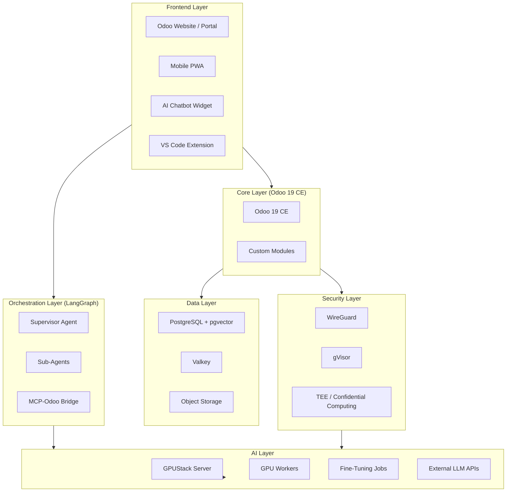

<h1 align="center">NETTRADES.AI</h1>

<p align="center">
  <strong>Autonomous Enterprise Platform – AI-powered job matching, distributed GPU marketplace, and self-improving AI</strong>
</p>

<p align="center">
  <a href="https://github.com/nettrades/nettrades-platform/blob/main/LICENSE.txt">
    
  </a>
  <a href="https://github.com/nettrades/nettrades-platform/stargazers">
    
  </a>
  <a href="https://github.com/nettrades/nettrades-platform/forks">
    
  </a>
  <a href="https://github.com/nettrades/nettrades-platform/issues">
    
  </a>
  <a href="https://github.com/nettrades/nettrades-platform/blob/main/CONTRIBUTING.md">
    
  </a>
</p>

<p align="center">
  <a href="#-quick-start.md">Quick Start</a> •
  <a href="#-key-features">Features</a> •
  <a href="#-architecture">Architecture</a> •
  <a href="#-documentation">Documentation</a> •
  <a href="#-contributing">Contributing</a> •
  <a href="#-license">License</a>
</p>

---

[](https://opensource.org/licenses/AGPL-3.0)
[](https://nettrades.github.io/nettrades-platform/)
[](https://github.com/nettrades/nettrades-platform/stargazers)
[](https://github.com/nettrades/nettrades-platform/issues)

## 🚀 What is NETTRADES.AI?

NETTRADES.AI is an **open-source, autonomous enterprise platform** that connects companies, freelancers, job-seekers, researchers, partners, and customers. It combines:

- **AI-powered job matching & freelancing** – LangGraph agents analyse CVs, job postings, and projects, automatically creating leads.
- **Distributed GPU marketplace** – Companies and freelancers can share idle GPUs to run inference and fine-tuning, earning tokens.
- **Self-improving AI** – A "Good Answer" voting system feeds a fine-tuning pipeline (Unsloth/Axolotl) that continuously improves field-specific models.
- **Expert marketplace ("Ask Someone")** – Users can request paid help from verified professionals with Stripe escrow.
- **Autonomous administration** – GPU health watchdog, reputation decay, utilisation alerts, and automatic Karma-based qualification.

## 🌐 The Hub-and-Spoke Model


NETTRADES ECOSYSTEM                                     

`Local (The Shell)`
(Self-hosted, LGPL-3.0)          
                                                
• Internal job adverts and collaboration 
• CRM, ERP, eCommerce   
• Local GPU inferencing on your own hardware 
• Agentic AI for internal operations  
• Fine-tune AI on your internal data 

          ▼   

`NETTRADES.AI (The Brain)`
(Cloud-based, Commercial) 
                                      
• Global talent pool (external recruitment)
• Global GPU marketplace    
• Central inference and fine-tuning  
• Self-improving AI pipeline    


Companies can use `nettrades.com` internally for their operations and connect to `nettrades.ai` when they need external talent, researchers, partners, or additional GPU capacity.

---

## ✨ Key Features

| Feature | Description |
|---------|-------------|
| 🤖 **AI Agents** | LangGraph-based recruitment, freelancing, lead generation, GPU management, vision, and action agents |
| 🖥️ **GPU Marketplace** | Share idle GPUs or rent capacity for inference and fine-tuning |
| 🧠 **Self-Improving AI** | "Good Answer" voting system with automated fine-tuning via Unsloth/Axolotl |
| 🧑‍🏫 **Expert Help** | "Ask Someone" – real-time expert consultations with Stripe escrow |
| 🔐 **Secure & Sovereign** | WireGuard VPN, gVisor isolation, and full on-premise deployment options |
| ⚙️ **Autonomous Ops** | GPU health watchdog, reputation decay, utilisation alerts, Karma-based qualification |
| 📱 **Mobile PWA** | Progressive Web App with offline support |
| 🔗 **Git Collaboration** | Forgejo Git integration for project collaboration |

---

## 📊 Architecture Overview




## 🛠️ Quick Start

### One-Command Deployment (Ubuntu 24.04)

```bash

# Download and run the interactive installer
curl -sSL https://raw.githubusercontent.com/nettrades/nettrades-platform/main/deploy/docker/install-nettrades.sh | sudo bash

```

The installer auto-detects your hardware, asks for your domain, generates secure passwords, and starts all services.

### Access Your Platform

### After ~10-20 minutes, you'll have:


| Service | URL | Default Credentials |
|---------|-------------|-------------|
|`Odoo`	| https://your-domain	| Create database on first login|
|`Grafana`	| https://grafana.your-domain	| admin / password from .env|
|`GPUStack`	| https://gpustack.your-domain	| admin / admin (change immediately)|
|`Forgejo`	| https://git.your-domain	| Create first user on first login|

All services are secured with Let's Encrypt TLS.

### Manual Installation

For detailed step-by-step instructions, see the [Full Documentation](docs/index.md).

## 📚 Documentation

Full documentation is available at: [Full Documentation](docs/index.md).

| Section | Description |
|---------|-------------|
|[User Guide](user/index.md)	| For end-users – companies, freelancers, job-seekers |
|[Developer Guide](developer/index.md)	| For developers extending the platform |
|[Operations Guide](operations/index.md)	| For system administrators and DevOps |
|[API Reference](developer/api-reference.md)	| Complete API documentation |
|[Architecture Overview](developer/architecture.md)	| System architecture diagrams and explanations |
|[Core Models](developer/core-models.md)	| Reference for all custom Odoo models |
|[Database Schema](appendix/database-schema.md)	| Complete database schema |
|[Glossary](appendix/glossary.md)	| Key terms and definitions |
|[Contributing Guide](governance/contributing.md)	| How to contribute to the project |
|[Roadmap](governance/roadmap/)	| Project roadmap and milestones |


## 📦 Technology Stack

| Component | Version |License | Purpose |
|---------|-------------|---------|-------------|
|`Odoo` | 19.0 CE	| LGPL-3.0	| ERP, marketplace, CRM, HR, Projects, Accounting |
|`PostgreSQL + pgvector` | 18.1	|  PostgreSQL License | 	Business data, vector embeddings, checkpoints |
|`Valkey` | 8	|  BSD-3-Clause | Session storage, ORM cache, bus notifications |
|`LangGraph` | 	≥1.2.0	 | MIT | Multi-agent orchestration, durable execution |
|`GPUStack` | 	v2.1.2	 | Apache-2.0	 | GPU cluster manager, inference engine, token metering |
|`llama.cpp` | 	server-cpu/server-cuda	 | MIT	 | CPU inference fallback |
|`Unsloth` | 	2026.5.2	 | Apache-2.0	 | Single-GPU fine-tuning |
|`Axolotl` | 	0.16.1+	 | Apache-2.0 | 	Multi-GPU fine-tuning with FSDP2 |
|`WireGuard` | 	kernel module	 | GPL-2.0 | 	Kernel-level network isolation |
|`gVisor` | 	release-20260420.0 | 	Apache-2.0 | 	Syscall-level container isolation |
|`Forgejo` | 	15.0 LTS	 | GPL-3.0+ | 	Self-hosted Git + CI/CD |
|`Traefik` | 	v3.6.13 | 	MIT | 	Reverse proxy, automatic Let's Encrypt TLS |
|`Prometheus` | v3.8.0	 | Apache-2.0	 | Metrics collection |
|`Grafana` | 	12.4.2	 | AGPL-3.0	 | Dashboards |
|`Talos Linux` | 1.13.2	 | MPL-2.0	 | Immutable Kubernetes OS |
|`Kubernetes` | 1.36	 | Apache-2.0 | 	Container orchestration |

## 🏗️ Project Structure
text

nettrades-platform/
├── src/                                    # AGPL-3.0 – Core orchestration
│   ├── core/                               # LangGraph supervisor and sub-agents
│   ├── agent/                              # Distributed GPU node agent
│   └── scripts/                            # Training and data quality scripts
├── odoo-modules/                           # LGPL-3.0 – Custom Odoo plugins
│   ├── nettrades_core/                     # Core marketplace & AI integration
│   ├── nettrades_ask_someone/              # Expert help marketplace
│   ├── nettrades_good_answer/              # Good Answer voting & fine-tuning
│   ├── nettrades_gpu_admin/                # GPU cluster administration
│   └── ... (14 modules total)
├── third-party/                            # UNMODIFIED – Vendored dependencies
│   ├── odoo/                               # Odoo 19 CE (LGPL-3.0)
│   ├── odoo_llm/                           # Apexive LLM modules
│   └── ...
├── deploy/                                 # AGPL-3.0 – Deployment configurations
│   ├── docker/                             # Single-VM Docker Compose
│   └── kubernetes/                         # Kubernetes (Talos + Proxmox) manifests
├── docs/                                   # MkDocs documentation site
├── scripts/                                # Build & setup orchestration
└── README.md                               # This file


## 🤝 Contributing

We welcome contributions of all kinds! Please read our [Contributing Guide](governance/contributing.md) before submitting PRs.

### Quick Steps

* Fork the repository

* Set up your development environment – follow the [Developer Getting Started Guide](developer/getting-started.md)

* Create a branch – git checkout -b feature/your-feature

* Make your changes – follow the [Style Guide](developer/style-guide.md)

* Write tests – include unit or integration tests

* Update documentation – if your change affects user-facing functionality

* Submit a PR – include a clear description and link any related issues

### Contributor License Agreement (CLA)

All contributors must sign the Contributor License Agreement before their contributions can be merged. This ensures that:

* Your contributions are licensed under the project's open-source licenses.

* The project can re-license contributions under the commercial license if needed.

You will be prompted to sign the CLA when you open your first pull request.

## 📄 License

This project uses a dual-licensing approach:

| Component | License |
|---------|-------------|
|src/ (core orchestrator, agent, training scripts) | [AGPL-3.0](https://www.gnu.org/licenses/agpl-3.0.en.html) |
|odoo-modules/ (custom Odoo plugins)	| [LGPL-3.0](https://www.gnu.org/licenses/lgpl-3.0.en.html) |
|third-party/	| Original licenses (LGPL, MIT, Apache-2.0) |
|deploy/	| AGPL-3.0 |
|scripts/	| MIT |

Please agree to the [Contributor License Agreement (CLA)](CONTRIBUTING.md) before contributing to ensure that contributions can be re-licensed under the commercial license.
A commercial license is available for enterprises that cannot or do not wish to comply with the AGPL-3.0. Contact: commercial@nettrades.ai

Full license information →

## 🌐 Community & Support

| Channel | Purpose |
|---------|-------------|
|[GitHub Issues](https://github.com/nettrades/nettrades-platform/issues) |	Bug reports and feature requests|
|[GitHub Discussions](https://github.com/nettrades/nettrades-platform/discussions) |	Questions and ideas|
|[Discord](https://discord.gg/nettrades)	| Real-time chat and community support|
|[Documentation](https://nettrades.github.io/nettrades-platform/)	| Full documentation|
|[Website](https://nettrades.ai/)	| Project website|

## ⭐ Star Us!

If you find [NETTRADES.AI](https://nettrades.ai/) useful, please consider giving us a ⭐ on GitHub – it helps others discover the project and supports our work.

## 🙏 Acknowledgments

[NETTRADES.AI](https://nettrades.ai/) is built on the shoulders of giants. We are grateful to the authors and maintainers of:

* [Odoo](https://www.odoo.com/) – The ERP and business application foundation

* [LangChain](https://www.langchain.com/) / [LangGraph](https://langchain-ai.github.io/langgraph/) – Agent orchestration

* [GPUStack](https://gpustack.ai/) – GPU cluster management

* [Unsloth](https://unsloth.ai/) – Efficient fine-tuning

* [Axolotl](https://github.com/OpenAccess-AI-Collective/axolotl) – Multi-GPU training

* [WireGuard](https://www.wireguard.com/) – Secure networking

* [gVisor](https://gvisor.dev/) – Container isolation

* [Forgejo](https://forgejo.org/) – Git and CI/CD

* [Talos Linux](https://www.talos.dev/) – Immutable Kubernetes OS

* And many other open-source projects

```<p align="center"> <strong>Built with ❤️ by the NETTRADES team</strong> </p> ```


