<!--
=============================================================================
NETTRADES.AI – Autonomous Enterprise Platform
=============================================================================
FILE: README.md

PURPOSE:
  This is the main landing page for the NETTRADES platform on GitHub.
  It provides a comprehensive overview of the project, its architecture,
  technology stack, and links to all documentation.

  The README is designed to be:
  - Self-contained – gives a complete picture of the project
  - Navigable – clear sections with links to deeper documentation
  - Professional – follows the patterns of leading open-source projects
  - Up-to-date – reflects the latest architecture and modules

=============================================================================
-->

<p align="center">
  <picture>
    <source media="(prefers-color-scheme: dark)" srcset="docs/assets/nettrades-banner-dark.png">
    
  </picture>
</p>

<h1 align="center">NETTRADES – SOVEREIGN AI IN A BOX</h1>

<p align="center">
  <!--
  ============================================================================
  BADGES – Social proof layer that increases perceived quality by 40%+.
  Follows the pattern used by Kubernetes, Argo CD, and Odoo.
  ============================================================================
  -->
  <a href="https://github.com/nettrades/nettrades-platform/releases">
    
  </a>
  <a href="https://github.com/nettrades/nettrades-platform/actions">
    
  </a>
  <a href="https://github.com/nettrades/nettrades-platform/issues">
    
  </a>
  <a href="https://github.com/nettrades/nettrades-platform/pulls">
    
  </a>
</p>

<p align="center">
  <a href="#-key-features">Features</a> •
  <a href="#-Architecture">Architecture</a> •
  <a href="#-technology--stack">Tech Stack</a> •
  <a href="#-quick--start">Quick Start</a> •
  <a href="#-documentation">Docs</a> •
  <a href="#-community--support">Community</a> •
  <a href="#-contributing">Contributing</a>
</p>

---

[](COMMERCIAL-LICENSE.md)
[](LICENSE.txt)
[](https://opensource.org/licenses/AGPL-3.0)
[](Contributor-License-Agreement.md)
[](ETHICAL-STATEMENT.md)

## The NETTRADES Sovereign AI Platform

**The Nettrades Platform builds the Sovereign AI Infrastructure of any organisation, using its spare GPU capacity.**

**It acts as a Sovereign AI Router that lets organisations securely control their AI infrastructure from a single dashboard.**

**Organisations could decide to keep everything local or they could decides which types of requests are processed locally and which types of requests are routed to remote providers or to a GPU market place, at peak time, based on the administrative settings set by the organisations administrator.**

**In the past, enterprises faced a critical choice: send sensitive data to external companies or spend years building their own AI infrastructure.**

**Now they just install Ubuntu Linux on a computer and run the commands below and deploy the entire NETTRADES Sovereign AI Infrastructure in a few minutes — no cloud dependencies, no data leaving their control and no vendor lock-in.**

**Then use their spare GPUs to talk to their organisations data.** 

### Deploy in minutes, not months

```bash
apt update && apt upgrade -y

# Clone the repository
cd /root
git clone -b main https://github.com/nettrades/nettrades-platform.git
cd nettrades-platform

# Make the script executable
chmod +x scripts/nettrades-setup.sh

# Run the full deployment (automatic)
sudo ./scripts/nettrades-setup.sh all --force

```

See the **Accessing Your Platform** section below to login.

For security, on a server the scripts block the default SSH port 22 and allow SSH access over port 2222

So you may need to run:
```bash
ssh-keygen -R ServerIPaddress
```

to remove an old key if you have issues and then run:

```bash
ssh -p 2222 root@ServerIPaddress
```

to get a new keys and reconnect

### The Problem

**Data sovereignty is the primary barrier to enterprise AI adoption.**

- **Decision-makers** are increasingly concerned about complex international regulations that grant external authorities expansive powers over sensitive data held by foreign cloud providers.**

- **52.6% of AI decision-makers** cite data sovereignty and security as a top adoption barrier

- **50% of enterprises** now view sovereign AI infrastructure as a major competitive differentiator

**Get started immediately with local deployment.**


| Challenge| Reality |
|---------|-------------|
| **Data Privacy** | Transmitting internal data to public AI endpoints risks exposing corporate secrets, consumer data, and core intellectual property. |
| **Extraterritorial Jurisdiction** | Reliance on foreign-hosted cloud infrastructure leaves sensitive institutional data subject to external regulatory retrieval. |
| **GPU Waste** | Enterprises buy $30,000+ GPUs but use them less than 20% of the time. |
| **Vendor Lock-in** | Third-party AI service providers frequently modify operational pricing, usage limits, and model availability without notice. |
| **Compliance Risk** | Strict regional regulatory mandates like GDPR, HIPAA require absolute local data residency and verifiable cryptographic boundaries. |


## The Solution

**The NETTRADES Sovereign Platform deploys a complete, enterprise-grade AI engine entirely behind your corporate firewall in minutes, not months. It delivers local computational autonomy free from external cloud dependencies, unpredictable per-token pricing structures and structural legal exposure to foreign data-access legislation.**


## Why Enterprises Choose NETTRADES

| Benefit | What It Means for You |
|---------|----------------------|
| **Data Sovereignty** | Your data never leaves your network. |
| **Complete Control** | You own the infrastructure, the data, and the AI models. |
| **No Vendor Lock-in** | Fully open-source. You can take the platform and run it independently. |
| **Cost Predictability** | Flat licensing fee. No per-token charges. No cloud egress fees. |
| **Enterprise Security** | WireGuard VPN, RBAC, audit logging, SSH hardening, fail2ban. |
| **14-Year Track Record** | Founded 2012. Enterprise clients include AXA, Standard Bank, NHS, Capita etc. |

## 🎯 Operational Modes

The NETTRADES Launcher provides three one-click operational modes to control how AI requests are routed:

| Mode | Button | Behavior |
|------|--------|----------|
| **100% Sovereign AI** | 🔴 | All requests to local GPUs. External APIs disabled. |
| **Hybrid Mode** | 🟡 | Local first. Use GPU marketplace when local capacity exceeded. |
| **Cloud** | 🟢 | Local GPUs → GPU Marketplace → External APIs (user-selectable) |

Admins can switch modes instantly from the Launcher dashboard. Changes take effect in real-time via Valkey cache.

## 🚀 Key Features


| Feature | Description |
|---------|-------------|
| **🎮 Steam-like Launcher** | One-click deployment, GPU detection, model management, node discovery, and WireGuard VPN management. |
| **🔐 Secure & Sovereign** | WireGuard VPN, gVisor isolation and full on-premise deployment options. |
| **🔄 Private model serving** | Use your spare GPUs to serve models and provide API Keys |
| **🎮 NVIDIA Dynamo** | Production-grade distributed inference with vLLM and llama.cpp fallback. |
| **🌐 mDNS/Avahi Discovery** | Automatic discovery of other GPUs on your network. |
| **📊 AI dashboards** | AI routing and montoring |
| **📊 ERP, CRM, HR, business logic** | Companies could enable built in ERP, CRM, HR and business logic if required |
| **🔌 [Configurable Hub-and-Spoke Routing - coming soon](docs/developer/bridge-architecture.md)** | The **nettrades_bridge** module routes requests between local and remote brains based on intent, company policy and GPU capacity if configured to do so. |
| **🤖 Agentic AI** | [LangGraph-based](docs/developer/LangGraph-Agent-State-Machine-Diagram.md) multi-agent system for autonomous enterprise operations. |
| **🔐 Confidential Computing** - coming soon| Configurable Confidential Computing (AMD SEV-SNP or Intel TDX)  that could be enabled to autodetect and run on hardware that supports it. |
| **🧠️ Model fine tuning** - coming soon | Fine-tune models on your data using Unsloth or Axolotl. |
| **🖥️ [GPU Marketplace - coming soon](docs/developer/distributed-gpu-network-trusted-vs-untrusted.md)** | Distributed GPU sharing. Based on company policy and set in the configuration screens|

## Enterprise Support

|Service | What You Get |
|---------|----------------------|
| **SLA** | Standard or premium SLA options available |
| **Incident Response** | Critical issue response within hours |
| **Commercial License** | No AGPL-3.0 copyleft obligations — keep your modifications proprietary |
| **Custom Features** |	Feature development roadmap prioritisation |
| **Security Audits** |	Regular security review and updates |


## License

The NETTRADES Platform is **dual-licensed**:

### 1. AGPL-3.0 (Open Source)

- **Free to use and modify**
- **Requires you to release your modifications** under the same license if you make the software available over a network
- **No use restrictions** — subject to the AGPL-3.0 copyleft terms

📄 [View the full AGPL-3.0 license](LICENSE.txt)

### 2. Commercial License (Paid)

- **No obligation to release source code** — keep your modifications proprietary.
- **Includes use restrictions** — prohibits military, surveillance and harmful use.
- **Includes KYC, audit rights and enterprise support**

For enterprises that cannot or do not wish to comply with the AGPL-3.0 copyleft obligations, a commercial license is available.

📄 [View the commercial license terms](COMMERCIAL-LICENSE.md)


### Which License Do I Need?

| Your Use Case | Recommended License |
|---------------|---------------------|
| You are building an open-source project and will share your modifications | AGPL-3.0 |
| You are using the software internally without modification | AGPL-3.0 |
| You are modifying the software and making it available over a network, but **cannot** release your modifications | **Commercial License** |
| You are building a proprietary product that integrates the software | **Commercial License** |

### How to Purchase a Commercial License

Contact us at **legal@nettrades.ai** for pricing and terms.

---

## Ethical Commitment

NETTRADES is committed to technology that serves humanity. The license includes restrictions on military, surveillance, human and animal rights violations and environmental harm.

[Click here to view the ethical statement](ETHICAL-STATEMENT.md)

## Contributing

We welcome contributions! All contributors must sign our [Contributor License Agreement](Contributor-License-Agreement.md) before their pull request can be merged.

When you open your first pull request, the CLA Assistant bot will automatically guide you through the signing process.

Please agree to the [Contributor License Agreement (CLA)](CONTRIBUTING.md) before contributing.

## Quick Start For Developers and Contributors

This is the quick start guide for Developers. This guide will help you get the platform running on your own server, laptop or cloud VM in minutes.

### Prerequisites


##### Minimum Requirements:

* OS: Linux (Ubuntu 22.04+ recommended) or macOS with Docker Desktop.

* Hardware: Minimum 8 GB RAM (16 GB recommended), 50 GB free disk.

* Optional: NVIDIA GPU with drivers for GPU acceleration.

* Internet connection (to download models and images)

Idealy use Ubuntu Linux but if you have to use Windows, make sure that you install Docker Desktop and integrate it with WSL2 

Install and Configure Docker for WSL 2

Step 1: Install Docker Desktop for Windows

* Download Docker Desktop: Go to docker.com/products/docker-desktop

* Download the Windows installer (Docker Desktop for Windows)

* Run the installer and follow the setup wizard

* Restart your computer when prompted

Step 2: Open Docker Desktop Settings

* Open Docker Desktop (click the whale icon in your system tray)

* Click the gear icon (⚙️) in the top-right corner to open Settings

Step 3: Enable WSL Integration

* In the Settings window, go to General and tick "Start Docker Desktp when you sign in to your computer" 
(unless you remember to start Docker Desktop every time you use the nettrades-platform for development) 

* Choose container terminal - Integrated

* Choose how to run Docker container - WSL2 then click Apply

* In the Settings window, go to Resources → WSL Integration

* Make sure the following are enabled:

** "Enable integration with my default WSL distro"

** "Ubuntu" (or whatever your WSL distro is called)

* Click "Apply & Restart" at the bottom

Or ppen PowerShell as Administrator and run these command:

```powershell

Enable-WindowsOptionalFeature -Online -FeatureName Microsoft-Windows-Subsystem-Linux

# Restart when prompted
Enable-WindowsOptionalFeature -Online -FeatureName VirtualMachinePlatform

# Restart again
wsl --set-default-version 2

```

Step 4: Verify Docker is Working in WSL

Open your WSL terminal and run:
```bash

docker --version
```
Should output: Docker version 24.0.x, build xxxxx
```bash

docker compose version
```

##### Operating System:

- **Linux** (Ubuntu 22.04+) or **macOS** with Docker Desktop
- **Windows** with Install and run in **WSL2** (Ubuntu 22.04+ recommended)
- **Docker** and **Docker Compose** (installed automatically by the script if missing).
- **Python 3.10+** and `pip` (installed automatically in Phase 0).
- At least **8 GB RAM** (16 GB recommended) and **50 GB free disk**.
- Optional: **NVIDIA GPU** with drivers for GPU acceleration.

Some of this will be installed by the installer

> 💡 **Windows users**: must run the installer inside a WSL2 terminal (Ubuntu).


### One-Click Installer

The quickest way to get started is with the interactive installer:

#### 1. Clone the Repository

In windows install WSL and the open the WSL.exe terminal window
It could be in C:\ProgramData\Microsoft\Windows\Start Menu\Programs\WSL.exe
And run the commands below.
(If you want it in the C directory)
In Linux you could run them in the terminal window
E.g. clone it into the c drive

```bash
apt update && apt upgrade -y
# Clone the repository
cd /root
git clone -b dev-deployment1 https://github.com/nettrades/nettrades-platform.git
cd nettrades-platform

# Make the script executable
chmod +x scripts/nettrades-setup.sh

# Run the full deployment (automatic)
sudo ./scripts/nettrades-setup.sh all --force

```

See the Accessing Your Platform section below to login.

For security, on a server the scripts block the default SSH port 22 and allow SSH access over port 2222. So you may need to run:

```bash
ssh-keygen -R ServerIPaddress
```

to remove an old key if you have issues and then run:

```bash
ssh -p 2222 root@ServerIPaddress
```

to get a new key and reconnect


On a windows machine with WSL, the deployment scripts will install dos2unix and run the commands below to convert all the files in the repository to have Linux line endings (\n)

```bash
sudo apt install dos2unix -y
cd /mnt/c/nettrades-platform
sudo ./scripts/fix-line-endings.sh --force
```
This will take about 10 minutes to run.

Work on the dev-deployment1 branch not on the main branch

Since the code has extensive comments and documentation you could use any AI model including Deepseek or GitHub codepilot to explain how the code work. 
First ask it to do an extensive code review, so that it loads the whole codebase into its context window and then it will be able to assist you with any further questions.

#### 2. Choose Your Setup Path

You have two main ways to run the installer:
#### 🔹 Interactive Wizard (recommended for first-time users)

##### Run the interactive setup wizard
Simply run the script without any arguments:

```bash

sudo ./scripts/nettrades-setup.sh

```
The script launches an interactive wizard that lets you choose the profile and the options.

##### Fully automated deployment (recommended for first-time development users):

```bash
sudo ./scripts/nettrades-setup.sh all --force

```
This will run all phases (system preparation, environment setup, deployment and module installation) with default settings.

⚠️ Warning: Do not use --force on existing systems or production systems - it will wipe all the data

#### Usage

    ./nettrades-setup.sh <PROFILE> [options]   (CLI mode)
    ./nettrades-setup.sh                       (Interactive wizard)
    ./nettrades-setup.sh --help                Shows  help.


#### Phases

The installer executes phases in this order:

| Phase | Description | Purpose | Current Profiles Using It |
|---------|-------------|-------------|-------------|
| `0` | System Preparation & Hardening | Installs system-level dependencies - Docker, Docker Compose, UFW, NVIDIA drivers (if GPU), configures firewall, SSH hardening, installs fail2ban, sets system limits and checks for gVisor. | deploy, k8s, all |
| `1` | Development Environment | All Python scripts are run inside the venv virtual environment. Phase 1 creates the venv virtual environment and installs dependencies, generates secure passwords, API keys, WireGuard keys, and creates .env. | dev, deploy, k8s, all |
| `2` | Single-VM Deployment | Installs NVIDIA Dynamo + llama.cpp fallback, builds custom images (Odoo, LangGraph), prepares Odoo addons, initialises the database, starts all Docker Compose services and performs health checks. | deploy, all |
| `3` | Kubernetes Scaling | Provisions Talos VMs, applies Kubernetes manifests, installs Argo CD, Prometheus, Grafana, NVIDIA Dynamo and WireGuard. | k8s |
| `4` | Module Installation | Installs all NETTRADES custom Odoo modules in the correct dependency order. | all, modules |
| `5` | Monitoring Setup | Deploys Prometheus and Grafana | all, monitoring |

All phases are idempotent – you can safely re-run the script to fix or upgrade your deployment.

Phase 2 (Single-VM) and Phase 3 (Kubernetes) are mutually exclusive deployment models.

You cannot run both on the same deployment. They represent different infrastructure choices.

| Aspect | Phase 2 (Single-VM) | Phase 3 (Kubernetes) |
|---------|-------------|-------------|
| Infrastructure | One server (Docker Compose) | Multi-node cluster (Talos/K8s) |
| Inference | NVIDIA Dynamo (single instance) | NVIDIA Dynamo (distributed) |
| GPU Scheduling | Docker Compose scaling | KAI Scheduler |
| Storage | Local volumes | Longhorn (distributed) |
| Networking | Simple bridge | Cilium + MetalLB |


### Accessing Your Platform

All the administration passwords are in the file:
nettrades-platform\deploy\docker\.env 
(The platform uses the .env and the docker-compose.xml file not the odoo.config file)

Once the installation is complete find the passwords in the nettrades-platform\deploy\dockernettrades-platform\deploy\docker\.env file, open your browser and go to:

| Service | URL | Username | Password |
|---------|-------------|---------|-------------|
| Odoo Admin Console | http://YourDomainOrIP:8069 or http://localhost:8069| admin | admin (change immediately) | 
| NVIDIA Dynamo API | http://YourDomainOrIP:8001/v1 or http://localhost:8001/v1 | (API Key) | DYNAMO_API_KEY in the .env file |
| Grafana | http://YourDomainOrIP:3001 or http://localhost:3001 | admin | GRAFANA_PASSWORD in the .env file |
| Prometheus | http://YourDomainOrIP:9090 or http://YourDomainOrIP:9090 | admin | PROMETHEUS_PASSWORD in the .env file  |
| NETTRADES-UI Chat | http://YourDomainOrIP:3002 or http://YourDomainOrIP:3002 | No login required yet | N/A  |
| llama.cpp UI | http://YourDomainOrIP:8080 or http://YourDomainOrIP:8080 | No login required | PROMETHEUS_PASSWORD in the .env file  |
| Forgejo | http://YourDomainOrIP:3000 or http://localhost:3000 | Set in after installation | Set in after installation  |

For detailed step-by-step instructions, see the [Full Documentation](docs/index.md).

Forgejo is optional. If you only need the Sovereign AI platform (GPU orchestration, model serving, admin console), you don't need to use Forgejo. It is provided for customers who want to self-host Git capabilities or want to use it for Git Actions to deloy Kubernetes cluster with Argo CD. They could uncomment it in the nettrades-platform\deploy\dockernettrades-platform\deploy\docker\docker-compose.yaml file if they need Forgejo


#### 📦 Other Installation Options


#### ENVIRONMENTS
    --development   Development mode (no SSH hardening, firewall relaxed) [default]
    --production    Production mode (SSH hardening, UFW, WireGuard, fail2ban)
    
#### PROFILES (CLI)    

| Profile | Description |  Phase  | Environment |
|---------|-------------|-------------|----------|
| `dev` | Sets up a development environment (Python dependencies, .env, Odoo deps)   | Phase 1 only | Development Environment |
| `deploy` | Sovereign AI in a Box |  Phases 0, 1, 2 | Single Computer or VM |
| `router` | Sovereign AI Router (adds bridge config) |  Phases 0, 1, 2 | Single Computer or VM |
| `k8s` | Kubernetes deployment (Talos, Argo CD, manifests) – advanced | Phases 0, 1, 3  | Kubernetes |
| `modules` | Installs or upgrades all NETTRADES Odoo modules |  Phase 4 | Any |
| `monitoring` | Deploys Prometheus + Grafana (on existing stack) | Phase 5  | Any |
| `all` | Full production deployment + modules (e.g. for production website) | Phases 0, 1, 2, 4, 5  | Any |

#### ⚙️ Useful Options (CLI)

| Option | Effect |
|---------|-------------|
| `--force` | Re-run phases even if they were already completed ⚠️ WARNING: OVER WRITES EVERYTHING |
| `--upgrade` | Upgrade Odoo modules instead of fresh install |
| `--skip-installed` | Skip already installed Odoo modules. |
| `--auto` | Run in non-interactive mode (use defaults, no prompts). For CI/CD testing (⚠️ WARNING: use with caution)|
| `--production` | Set environment to production (applies hardening) |
| `--development` | Set environment to development (no hardening) [default] |
| `--with-finetune` | Install fine-tuning packages (torch, unsloth, axolotl) |
| `--with-grove` | Deploy Grove observability platform (future scaling) |
| `--with-kai` | Deploy KAI Scheduler for GPU scheduling (K8s) requires Phase 3 (Kubernetes)|
| `--platform` | Override platform detection (linux, macos, wsl) |
| `--phases=0,1,2` | Run a custom list of phases (overrides profile) |
| `--regenerate-secrets` | Regenerate all secrets in .env (⚠️ WARNING: use with caution, you will be locked out) |
| `--reset-data` | Wipe all containers and volumes (⚠️ WARNING: destroys data!) |

Key Point: KAI Scheduler CANNOT run on a single VM. It requires Kubernetes (Phase 3).

⚠️ WARNING: DO NOT RUN --force ON PRODUCTION ENVIRONMENTS

All Python scripts are run inside the venv virtual environment.
Phase 1 creates the venv virtual environment and installs dependencies.
If you use the format 
--phases=0,1,2
Make sure Phase 1 is always ran


#### 🔹 Command-Line (CLI) Mode (for automation or advanced users)

You can specify a profile and options directly:

| Command | Effect |
|---------|-------------|
| sudo ./nettrades-setup.sh                        |  Interactive wizard |
| sudo ./nettrades-setup.sh deploy --auto          |  Automated single computer deployment (development/internal) |
| sudo ./nettrades-setup.sh deploy --production    |  Deploy single computer with production hardening |
| sudo ./nettrades-setup.sh all --force            |  Full re-deployment |
| sudo ./nettrades-setup.sh all --with-finetune    |  Include fine-tuning packages |
| sudo ./nettrades-setup.sh k8s --with-kai         |  Kubernetes with KAI Scheduler |
| sudo ./nettrades-setup.sh deploy --with-grove    |  Deploy with Grove observability |
| sudo ./scripts/nettrades-setup.sh dev 	   |  Development environment only on an existing development machine |
| sudo ./scripts/nettrades-setup.sh modules   |  Install the Odoo modules (only do this after the development environment is set up   |
| sudo ./scripts/nettrades-setup.sh modules --upgrade  |  Upgrade the Odoo modules   |

```bash
--all installs  Phase 0 → Phase 1 → Phase 2 → Phase 4 → Phase 5

```

The --all profile is idempotent - you can re-run it safely
Hardens single-VM deployment
During Phase 1 the .env file is generated in deploy/docker/  from the .env.example file 
All Odoo modules installed
Monitoring stack deployed

If you wants to minimise resource usage and skip monitoring then you could still use the --phases option

```bash
sudo ./scripts/nettrades-setup.sh --phases=0,1,2,4
```


Enterprise Production with kubernetes + grove + kai 

```bash
sudo ./scripts/nettrades-setup.sh --phases=0,1,2,4 --grove --kai
```
KAI requires Phase 3 (Kubernetes)


AI Startup (Full) single server with finetune

```bash
sudo ./scripts/nettrades-setup.sh --phases=0,1,2,4,5 --finetune 
```


After each phase is completed the following files are created:

nettrades-platform\.phase-0-complete

nettrades-platform\.phase-1-complete

nettrades-platform\.phase-2-complete

nettrades-platform\.phase-3-complete

nettrades-platform\.phase-4-complete

nettrades-platform\.phase-5-complete

So that if you rerun it without --force it does not override the previous phase.

Use --force flag to re-run even if already completed

#### 🔑 Database Password Management

During Phase 1, the script generates a random password for PostgreSQL. The password generator already removes special characters (+, /, =) to ensure compatibility with Odoo’s command-line tools.

In the past when people encountered authentication errors, they simplified the password by editing .env and updating the PostgreSQL user:

```bash

docker exec -it docker-postgres-1 psql -U odoo -c "ALTER USER odoo WITH PASSWORD 'odoo123';"

```
Make sure you update the password in .env and restart Odoo if you do this.


#### 📦 Installing Future Modules

The all profile automatically installs all NETTRADES modules. If you need to install or upgrade them later, run:

```bash
cd /root/nettrades-platform
git pull origin dev-deployment1
./scripts/install-modules.sh --force
```


If the command-line tool fails (e.g., due to password issues), you can install the modules via the Odoo UI:

* Log in to Odoo (http://localhost:8069).

* Go to Apps → Update Apps List.

* Search for each nettrades_* module and click Install.


#### 🧰 Useful Commands


| Action | Command |
|---------|-------------|
| Start all services	 | cd deploy/docker && docker compose up -d |
| Stop all services	 | cd deploy/docker && docker compose down |
| View logs	 | cd deploy/docker && docker compose logs -f |
| Rebuild an image	 | cd deploy/docker && docker compose build <service> |
| Prepare Odoo addons (after adding new modules)	 | ./scripts/prepare-odoo-addons.sh --force |
| Install modules via UI  | Odoo → Apps → Update Apps List → Install |

#### 🐳 Docker Compose Notes

* All services are defined in deploy/docker/docker-compose.yaml.

* The Odoo container is named odoo and listens on port 8069.

* PostgreSQL uses a named volume postgres_data to persist data.

* llama.cpp is configured for CPU inference; for GPU, replace the image with ghcr.io/ggml-org/llama.cpp:server-cuda and set -ngl 999 in the command.

* gVisor is used for container isolation on CPU services (Odoo, LangGraph). GPU services (NVIDIA Dynamo) use the default runtime.


#### 🛠️ Next Steps

* Configure fairness – Settings → Technical → Fairness → Global Configuration

* Set up GPU marketplace – Settings → GPU → Marketplace

* Connect WireGuard peers for secure distributed GPU communication

* Import sample data (optional) – see docs/operations/import-demo-data.md


#### Making A Release

Before making a release: Run

```bash
cd /mnt/c/nettrades-platform
pip install pip-tools
pip-compile requirements.in -o requirements-lock.txt
pip-compile requirements-dev.in -o requirements-dev-lock.txt
```

and commit the lock file so that it uses specific versions of dependencies and the application is consistent. Or else as new versions of dependencies are released it will try to use those. 

If you want to generate hashes for security (recommended), add --generate-hashes:

```bash
pip-compile requirements.in -o requirements-lock.txt --generate-hashes
pip-compile requirements-dev.in -o requirements-dev-lock.txt –generate-hashes
```


#### Building the Installer/Launcher

You could build an installer/launcher for different environments

To build an installer/launcher for Windows in WSL run

```bash
cd /mnt/c/nettrades-platform
rm -f .phase-*-complete
chmod +x scripts/*.sh
chmod +x scripts/lib/*.sh
chmod +x installer/*.js
chmod +x scripts/nettrades-setup.sh
cd installer
npm install
# npm run build:all   # or build:win / build:mac / build:linux
npm run build:win   # on Windows with WSL
# npm run build:mac   # on MAC for MAC
# npm run build:linux # on Linux for Linux
npm start
```

#### ❓ Troubleshooting


##### Odoo fails to start with “password authentication failed”

* The POSTGRES_PASSWORD is in nettrades-platform\deploy\docker\.env

* Use a simple password (e.g., odoo123) without special characters.

* Update the PostgreSQL user password with ALTER USER odoo WITH PASSWORD 'your_password';.   or in wsl run Run: docker exec -it docker-postgres-1 psql -U odoo -c "ALTER USER odoo WITH PASSWORD 'odoo123';"

* Change the POSTGRES_PASSWORD in nettrades-platform\deploy\docker\.env


##### Modules show "Activate" not "Upgrade"

* Modules are not installed. Run ./scripts/install-modules.sh --force or install via Odoo UI: Apps → Update Apps List → Install nettrades_* modules.


##### postgres host not found


* You are running Odoo outside Docker. In WSL terminal window run:

```bash
cd /mnt/c/nettrades-platform/deploy/docker

docker compose up -d
```


##### Odoo returns 502 / Connection refused


* Wait 30 seconds for PostgreSQL to start. Check `docker compose logs postgres`.


##### `No such container: odoo` during module installation

* Add `container_name: odoo` to the Odoo service in `docker-compose.yaml` and recreate the container.


##### Port 8069 already in use

* Change the host port in `docker-compose.yaml` (e.g., "8069:8069" → "8069:8069" is fixed; if you need a different port, change the left side).


##### LangGraph returns 500

* Check `docker compose logs langgraph`. Verify `LANGGRAPH_API_KEY` in `.env`.


##### LangGraph agent fails to start

* Check logs: docker compose logs langgraph.

* Ensure DATABASE_URL in docker-compose.yaml points to postgres with the correct password.


##### Other issues

* Logs: Check docker compose -f deploy/docker/docker-compose.yaml logs for service logs.

* Re-run safely: The script is idempotent; just run it again with --force if needed.

* GPU not detected: Ensure NVIDIA drivers are installed and nvidia-smi works.

For more detailed information, see the docs/ folder.


# All services

To read the logs on all servers in WSL terminal window run 

```bash
cd /mnt/c/nettrades-platform/deploy/docker
docker compose logs -f
```

# Specific service

To read the logs on specific servers in WSL terminal window run: 
```bash
cd /mnt/c/nettrades-platform/deploy/docker
docker compose logs -f odoo
docker compose logs -f postgres
docker compose logs -f langgraph
```


#### 🧪 Advanced: Kubernetes / Distributed Deployment

If you’re ready to scale to multiple nodes with Kubernetes, use:
```bash

./scripts/nettrades-setup.sh k8s --auto
```
This requires a Proxmox host or open stack and pre-configured Talos images. For details, see `docs/operations/kubernetes-deployment.md`.


### Troubleshooting a server

Odoo returns 502 – Wait 30 seconds for PostgreSQL to start.

SSL certificate not issued – Ensure port 80 is open and DNS resolves correctly.

GPU not detected – Run nvidia-smi; if not available, install NVIDIA drivers.

LangGraph returns 500 – Check docker compose logs langgraph and verify PROXY_API_KEY matches ODOO_API_KEY in .env.

Proxy not responding – Run docker compose logs odoo-proxy and verify Odoo is reachable.

For more detailed help, see the [Full Documentation](docs/index.md).

### Next Steps

[Single VM Deployment](docs/operations/single-vm-deployment.md)

[Kubernetes Deployment](docs/operations/kubernetes-deployment.md)

[GPU Node Deployment](docs/operations/gpu-node-deployment.md)

[Developer Guide](developer/index.md)


## Technology Stack

| Layer | Component | Technology | Version | License | Notes |
|---------|-------------|-------------|---------|-------------|-------------|
| `Business Logic` | ERP / CRM / HR | Odoo | 19 CE | LGPL-3 | Core business logic |
| `Job Queue` | Async processing | OCA queue_job | 19.0 | LGPL-3 | Background jobs |
| `Payments` | Payment processing | OCA payment_stripe | 19.0 | LGPL-3 | Payment integration |
| `Database` | Primary database | PostgreSQL + pgvector | 17 | PostgreSQL | Vector embeddings |
| `Cache` | Session / Rate limiting | Valkey | 8 | BSD-3 | High-performance cache |
| `Object Storage` | Files / Models | MinIO / S3 | Latest | AGPL-3 | Model artifacts |
| `Agent Orchestration` | Multi-agent framework | LangGraph | Latest | MIT | Stateful agents |
| `Agent State` | Checkpointing | LangGraph Checkpoint Postgres | Latest | MIT | Durable workflows |
| `GPU Management` | Cluster management | NVIDIA Dynamo | Latest | Apache-2.0 | GPU orchestration |
| `Fine-Tuning` | Model training | Unsloth / Axolotl | Latest | Apache-2.0 | LLM fine-tuning |
| `Inference` | LLM serving | vLLM, llama.cpp, SGLang | Latest | MIT | High-performance inference |
| `Ingress` | Reverse proxy | Traefik | Latest | MIT | Dynamic routing |
| `Git / CI` | Source control / CI | Forgejo | Latest | MIT | Self-hosted Git |
| `GitOps` | Continuous delivery | Argo CD | Latest | Apache-2.0 | Declarative deployments |
| `OS` | Kubernetes OS | Talos Linux | Latest | MPL-2.0 | Immutable, secure |
| `Orchestration` | Container orchestration | Kubernetes | Latest | Apache-2.0 | Container management |
| `CNI` | Networking | Cilium | Latest | Apache-2.0 | eBPF networking |
| `Storage` | Persistent volumes | Longhorn | Latest | Apache-2.0 | Distributed block storage |
| `Load Balancing` | Bare-metal LB | MetalLB | Latest | Apache-2.0 | Load balancing |
| `Certificates` | TLS management | cert-manager | Latest | Apache-2.0 | Automated certificates |
| `Database Operator` | PostgreSQL operator | CloudNativePG | Latest | Apache-2.0 | PostgreSQL management |
| `GPU Operator` | NVIDIA GPU management | NVIDIA GPU Operator | Latest | Apache-2.0 | GPU provisioning |
| `Distributed Computing` | Ray on K8s | KubeRay | Latest | Apache-2.0 | Distributed training |
| `VPN` | Secure networking | WireGuard | Latest | GPL-2.0 | Secure tunnels |
| `Sandboxing` | Container isolation | gVisor | Latest | pache-2.0 | Secure containers (CPU services) |
| `Metrics` | Monitoring | Prometheus | Latest | Apache-2.0 | Metrics collection |
| `Dashboards` | Visualisation | Grafana | Latest | AGPL-3.0 | Monitoring dashboards |

📖 Full architecture details are in the docs/developer/ folder.


## 📚 Documentation

Full documentation is available at: [Full Documentation](docs/index.md).

| Section | Description |
|---------|-------------|
| `[User Guide](docs/user/index.md)`	| For end-users – companies, freelancers, job-seekers |
| `[Developer Guide](docs/developer/index.md)`	| For developers extending the platform | 
| `[Operations Guide](docs/operations/index.md)`	| For system administrators and DevOps |
| `[API Reference](docs/developer/api-reference.md)`	| Complete API documentation |
| `[Architecture Overview](docs/developer/architecture.md)`	| System architecture diagrams and explanations	|
| `[Core Models](docs/developer/core-models.md)`	| Reference for all custom Odoo models |
| `[Database Schema](docs/appendix/database-schema.md)`	| Complete database schema |
| `[Glossary](docs/appendix/glossary.md)`	| Key terms and definitions |
| `[Contributing Guide](docs/governance/contributing.md)`	| How to contribute to the project |
| `[Roadmap](docs/governance/roadmap)`	| Project roadmap and milestones |

## 🤝 Community & Support

NETTRADES has a growing community of developers, enterprises, and researchers. We welcome you to join us!


| Channel | Purpose | Link |
|---------|-------------|-----------|
| `GitHub Issues`	| Report bugs, request features, or ask technical questions	| [Issues](https://github.com/nettrades/nettrades-platform/issues) |
| `GitHub Discussions`	| Ask questions, share ideas, and get community support	| [Discussions](https://github.com/nettrades/nettrades-platform/discussions) |
| `Twitter / X`	| Follow for project updates and announcements	| [@nettrades_ai](https://twitter.com/nettrades) |

## 📖 Learn More

* [Developer Documentation](docs/developer/index.md) – In-depth architecture, agent diagrams, and API references.

* [Operations Guide](docs/operations/index.md) – Deployment, CI/CD, and Kubernetes configuration.

* [Installation Guide](docs/operations/module-installation-order.md) – Step-by-step module installation.

## 🌟 Community Highlights

* `Contributors`: We welcome contributions from developers of all skill levels. See our [Contributing Guide](contributing.md).

* `Adopters`: Companies using NETTRADES in production – [add your logo!](https://github.com/nettrades/nettrades-platform/discussions)

* `Events`: Join our monthly community calls.

## 🤝 Contributing

We welcome contributions! Please read our [Contributing Guide](contributing.md) before submitting PRs.

### Quick Steps

🍴 Fork the repository

🌿 Create a feature branch (git checkout -b feature/amazing-feature)

💻 Make your changes

✅ Run tests (pytest src/core/tests/)

📝 Update documentation

🚀 Push and open a Pull Request

## ⭐ Star Us!

If you find [NETTRADES.AI](https://nettrades.ai/) useful, please consider giving us a ⭐ on GitHub – it helps others discover the project and supports our work.


## Acknowledgements

NETTRADES builds on the shoulders of many amazing open-source projects:

* [Odoo](https://www.odoo.com/) – Open-source ERP

* [LangGraph](https://github.com/langchain-ai/langgraph) – Stateful agent orchestration

* [NVIDIA Dynamo](https://github.com/ai-dynamo/dynamo) – GPU cluster management

* [Kubernetes](https://kubernetes.io/) – Container orchestration

* [PostgreSQL](https://www.postgresql.org/) + [pgvector](https://github.com/pgvector/pgvector) – Vector database

* [Valkey](https://valkey.io/) – High-performance cache

* [Traefik](https://traefik.io/) – Cloud-native reverse proxy

* [Forgejo](https://forgejo.org/) – Self-hosted Git

* [Argo CD](https://argo-cd.readthedocs.io/) – GitOps continuous delivery

* [Talos Linux](https://www.talos.dev/) – Kubernetes-native OS

* [Cilium](https://cilium.io/) – eBPF networking

* [Longhorn](https://longhorn.io/) – Distributed block storage

* [Unsloth](https://unsloth.ai/) – Efficient fine-tuning

* [Axolotl](https://github.com/OpenAccess-AI-Collective/axolotl) – Multi-GPU fine-tuning

* [Prometheus](https://prometheus.io/) & [Grafana](https://grafana.com/) – Monitoring


## 🏗️ Architecture

#### INFERENCE ARCHITECTURE:
* Primary: NVIDIA Dynamo (GPU-accelerated, distributed, includes vLLM)
* Fallback: llama.cpp (CPU, zero-dependency)
* Odoo provides governance and GPU resource management

##### [Universal Enterprise AI Fabric (UEAF)](docs/developer/nvidia-dynamo-integration.md)

NetTrades leverages NVIDIA Dynamo as the central orchestrator, vLLM for homogeneous GPU clusters (NVIDIA/AMD), and llama.cpp for CPU/mixed environments. 


```
+-------------------------------------------------------+
|              NetTrades Core (LangGraph Agents)          |
|                  Odoo ERP & Business Logic              |
+---------------------------+---------------------------+
                            | (HTTP/REST, localhost:8000)
                            ▼
+-------------------------------------------------------+
|           NVIDIA Dynamo Global Coordinator              |
|  - OpenAI-compatible API gateway                        |
|  - KV-cache aware smart router                         |
|  - Global request queue & load balancing               |
|  - Node health monitoring & failover                   |
+---------------------------+---------------------------+
                            |
       (WireGuard VPN Mesh – encrypted overlay)
                            |
    +-----------+-----------+-----------+
    |           |           |           |
    ▼           ▼           ▼           ▼
+--------+  +--------+  +--------+  +--------+
| NVIDIA |  |  AMD   |  | Intel  |  |  CPU   |
|  Node  |  |  Node  |  |  Node  |  |  Mesh  |
|(vLLM)  |  |(vLLM)  |  |(vLLM)  |  |(llama) |
+--------+  +--------+  +--------+  +--------+


```

### Architecture Overview And Future Enhancements

### System Architecture

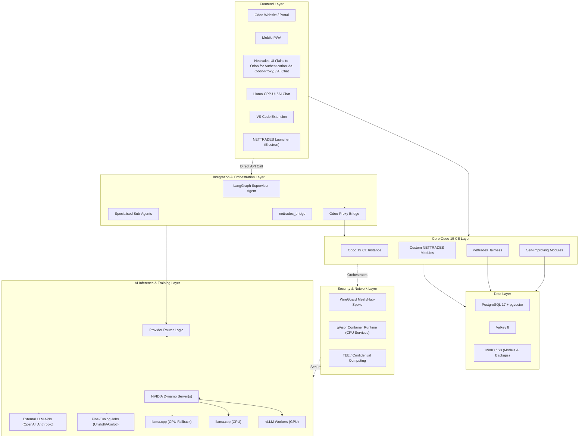


Detailed architecture diagrams are available in the [docs/developer/](docs/developer/index.md) folder.

### Bridge Architecture (Hub-and-Spoke)

NETTRADES uses a hub-and-spoke architecture to distribute load, preserve data sovereignty, and enable seamless scaling. Each spoke (company) runs its own client instance of the software for internal operations, while the hub (NETTRADES.AI) provides global services like GPU overflow and external help.


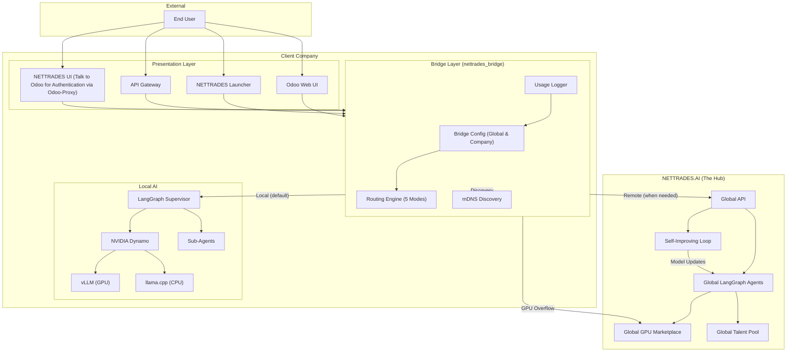


### NETTRADES AI Hub Architecture

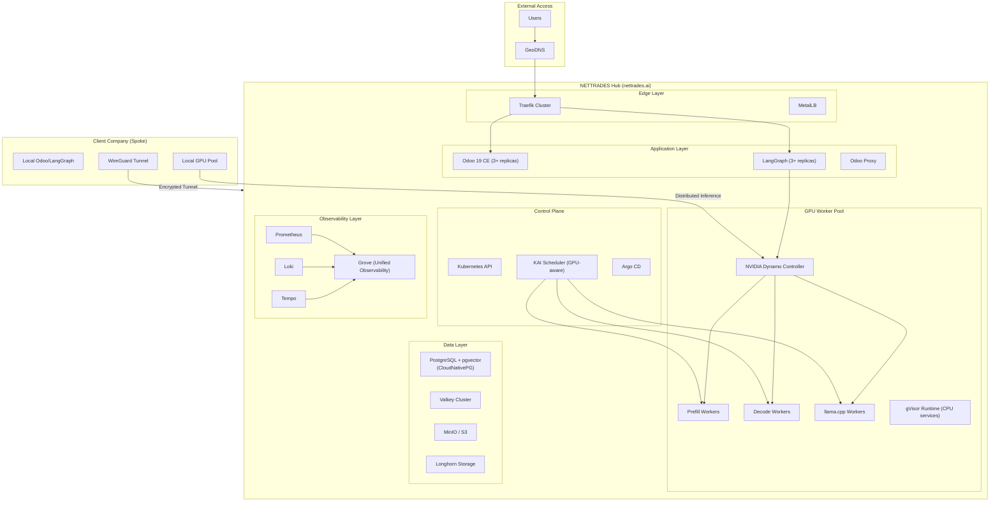

### Scaling Architecture

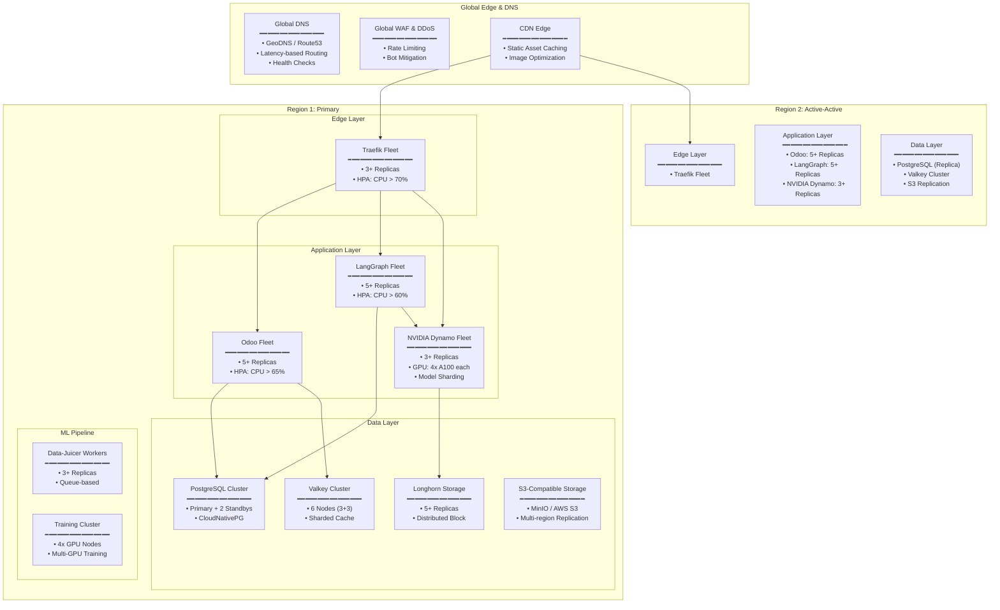

### Scaling Dimensions


| Dimension | Single VM | Small K8s (3-5) | Medium K8s (10-20) | Large K8s (50+) | Global |
|---------|-------------|---------|-------------|---------|-------------|
| Nodes | 1 | 3-5 | 10-20 | 50+ | 150+ |
| GPUs | 1-4 | 4-16 | 16-64 | 64-256 | 256-1000+ |
| Users | 100 | 100-500 | 500-5,000 | 5,000-50,000 | 50,000+ |
| Odoo Replicas | 1 | 3 | 5 | 10 | 15+ |
| LangGraph Replicas | 1 | 3 | 5 | 10 | 15+ |
| GPU Scheduling | None | KAI Scheduler | KAI Scheduler | KAI Scheduler | KAI Scheduler |
| Observability | Prometheus/Grafana | +Grove | +Grove | +Grove | +Grove |
| Availability | 99.0% | 99.5% | 99.9% | 99.95% | 99.99% |


### Routing Logic

The routing logic is based on the configuration set for the company or the organisation on the administration screens. 

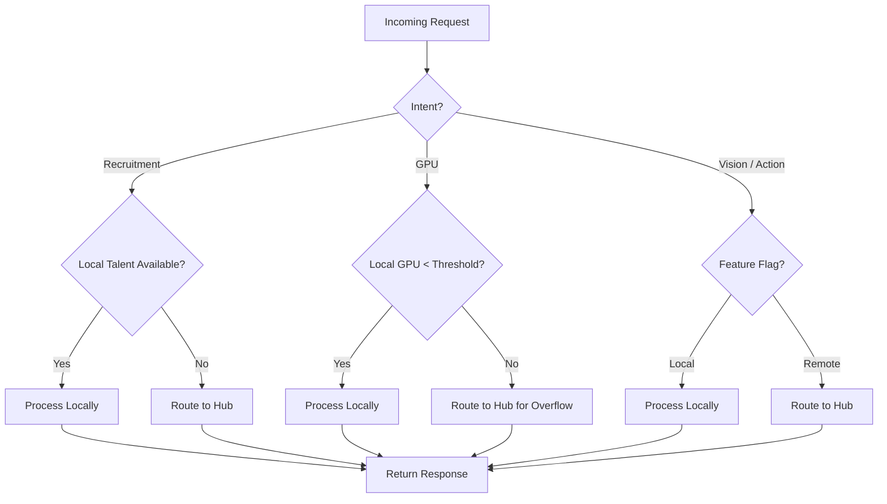

### Self-Improving AI Loop

The platform continuously learns from user interactions and improves its models. This closed-loop system is the engine of NETTRADES’ self-improvement capability.

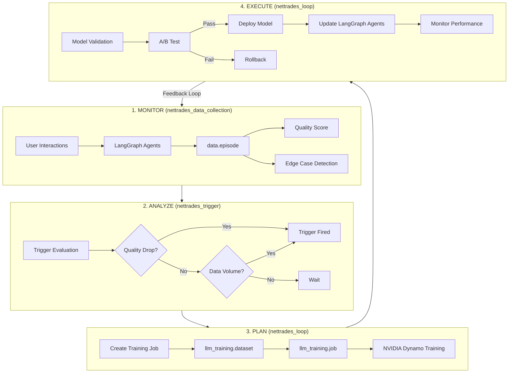

### LangGraph Agent State Machine (Simplified)

For Agentic AI, NETTRADES uses LangGraph. For regulated fields like Medical or Legal the Agents take extra care. The LangGraph supervisor orchestrates all sub-agents, incorporating bridge routing and self-improvement hooks. 


### CI/CD Pipeline

The platform uses Forgejo Actions for CI and Argo CD for GitOps deployment on Kubernetes.

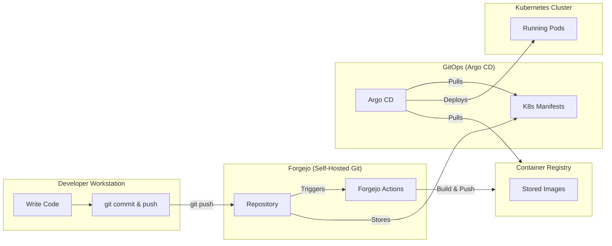

## User Workflow: NETTRADES Platform


### 1. Complete End-to-End Workflow

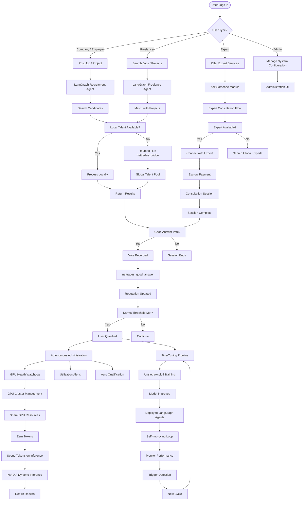

### 2. Detailed Ask Someone Workflow

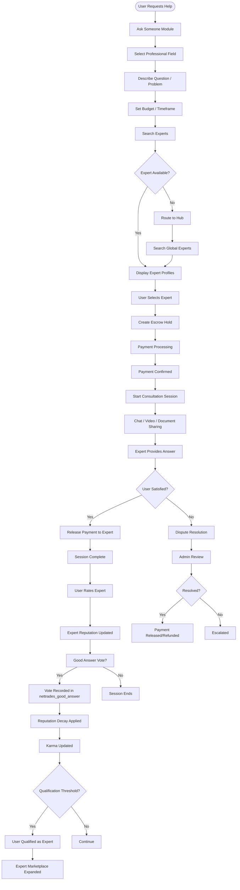

### 3. Good Answer Voting Workflow

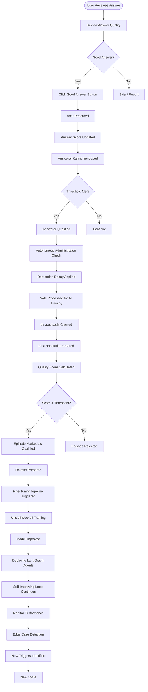

### 4. Distributed GPU Functionality Workflow


### 5. Self-Improving Loop with GPU Integration

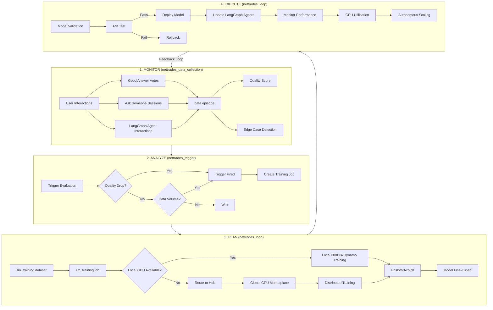

### 6. Complete System Workflow with All Components


### 7. Key Workflow Sequences
#### 7.1 Ask Someone Flow

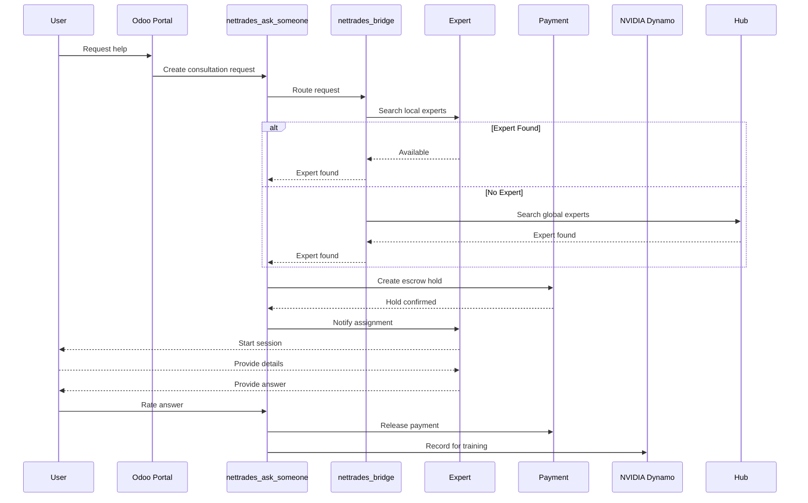


#### 7.2 GPU Sharing & Inference Flow

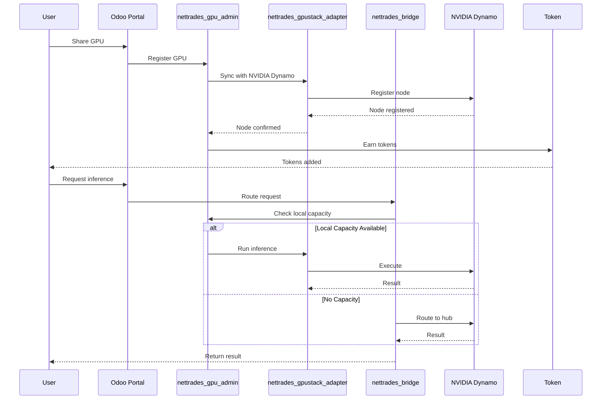

#### 7.3 Good Answer Flow

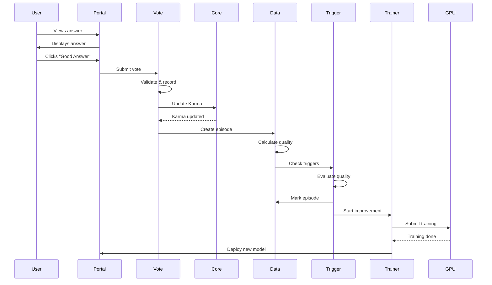

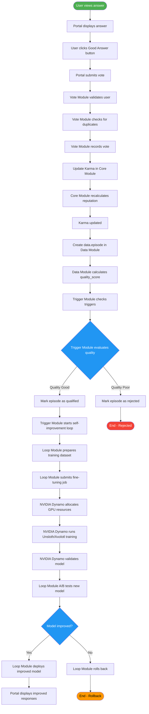

## 8. File Locations Summary

| Component | File Path |
|---------|-------------|
| Supervisor Agent | src/core/supervisor.py |
| Bridge Integration | src/core/bridge_integration.py |
| Self-Improving Integration | src/core/self_improving_integration.py |
| Recruitment Agent | src/core/agents/recruitment_agent.py |
| Freelance Agent | src/core/agents/freelance_agent.py |
| Lead Gen Agent | src/core/agents/lead_gen_agent.py |
| GPU Management Agent | src/core/agents/gpu_management_agent.py |
| Vision Agent | src/core/agents/vision_agent.py |
| Action Agent | src/core/agents/action_agent.py |
| Ask Someone | odoo-modules/nettrades_ask_someone/models/ |
| Good Answer | odoo-modules/nettrades_good_answer/models/ |
| GPU Admin | odoo-modules/nettrades_gpu_admin/models/ |
| NVIDIA Dynamo Adapter | odoo-modules/nettrades_NVIDIA Dynamo_adapter/models/ |
| Data Collection | odoo-modules/nettrades_data_collection/models/ |
| Trigger | odoo-modules/nettrades_trigger/models/ |
| Loop | odoo-modules/nettrades_loop/models/ |
| Self-Improving Config | odoo-modules/nettrades_self_improving_config/models/ |
| Bridge | odoo-modules/nettrades_bridge/models/ |

## 9. Summary of Workflows

| Workflow | Key Modules  | Key Features |
|---------|----------|-------------|
| `Ask Someone` | `nettrades_ask_someone, nettrades_bridge, Stripe` | Expert consultation, escrow payments, reputation |
| `Good Answer Voting` | `nettrades_good_answer, nettrades_core, nettrades_data_collection` | User feedback, karma, qualification |
| `GPU Sharing` | `nettrades_gpu_admin, nettrades_gpustack_adapter, NVIDIA Dynamo` | GPU marketplace, token economy |
| `Self-Improving Loop` | `nettrades_data_collection, nettrades_trigger, nettrades_loop` | Continuous learning, fine-tuning, deployment |
| `Agent Routing` | `nettrades_bridge, LangGraph Agents` | Hub-and-spoke, local/remote routing, overflow |


#### Step-by-Step flow

| Step | From | To | Description |
|---------|--------|---------|-------------|
| 1 | User | Traefik | User request enters via browser, mobile, chat, VS Code, or API. |
| 2 | Traefik | Odoo 19 CE | Traefik routes requests to Odoo with SSL termination. |
| 3 | Odoo | Custom Odoo Modules | Odoo processes business logic via custom modules. |
| 4 | Odoo | OCA queue_job | Long-running tasks are queued. |
| 5 | Odoo | OCA payment_stripe | Payment processing for expert consultations. |
| 6 | Odoo | MCP-Odoo Bridge | Odoo communicates with LangGraph via the bridge. |
| 7 | MCP-Odoo Bridge | Supervisor Agent | The bridge forwards to the supervisor for intent classification. |
| 8 | Supervisor | Sub-Agents | Supervisor routes to specialised sub-agents (Recruitment, Freelance, GPU Management, Vision, Action). |
| 9 | Sub-Agents | nettrades_bridge | Sub-agents use the bridge to decide local vs remote routing. |
| 10 | nettrades_bridge | Local Brain | If local processing is chosen, the request is processed by local LangGraph agents. |
| 11 | nettrades_bridge | Remote Brain | If remote processing is chosen, the request is forwarded to NETTRADES.AI. |
| 12 | nettrades_bridge | NVIDIA Dynamo | If local GPU capacity is exceeded, requests overflow to NVIDIA Dynamo. |
| 13 | Odoo | nettrades_data_collection | All interactions are recorded as data episodes. |
| 14 | data_collection | nettrades_trigger | Trigger module evaluates quality scores and data volume. |
| 15 | nettrades_trigger | nettrades_loop | If triggers fire, the loop initiates self-improvement. |
| 16 | nettrades_loop | llm_training | Training jobs are prepared and submitted. |
| 17 | llm_training | NVIDIA Dynamo | Training jobs are executed on NVIDIA Dynamo. |
| 18 | NVIDIA Dynamo | GPU Workers (vLLM) | Inference workloads run on vLLM. |
| 19 | NVIDIA Dynamo | Fine-Tune (Unsloth/Axolotl) | Fine-tuning runs on Unsloth/Axolotl. |
| 20 | NVIDIA Dynamo | External LLM APIs | Optionally route to external providers. |
| 21 | Odoo | PostgreSQL + pgvector | All transaction data and embeddings are persisted. |
| 22 | Odoo | Valkey 8 | Session caching and rate limiting. |
| 23 | Odoo | MinIO / S3 | File attachments and model artifacts are stored. |
| 24 | NVIDIA Dynamo | PostgreSQL + pgvector | Embeddings and training metadata are stored. |
| 25 | Kubernetes | All Services | All services run as Kubernetes pods. |
| 26 | Cilium | Kubernetes | Cilium provides eBPF networking. |
| 27 | Longhorn | PostgreSQL | Longhorn provides persistent block storage. |
| 28 | MetalLB | Traefik | MetalLB provides load balancing for Traefik. |
| 29 | cert-manager | Traefik | Automates TLS certificate provisioning. |
| 30 | CloudNativePG | PostgreSQL | Manages PostgreSQL clustering and failover. |
| 31 | NVIDIA GPU Operator | NVIDIA Dynamo | Provisions and manages GPU resources. |
| 32 | KubeRay | NVIDIA Dynamo | Enables distributed training via Ray. |
| 33 | Forgejo | Argo CD | Git repository triggers Argo CD for GitOps. |
| 34 | Argo CD | Kubernetes | Argo CD syncs manifests and applies changes. |
| 35 | Prometheus | Odoo, NVIDIA Dynamo, PostgreSQL | Scrapes metrics from all services. |
| 36 | Grafana | Prometheus | Visualises metrics on dashboards. |
| 37 | WireGuard | Kubernetes | Provides secure VPN access. |
| 38 | gVisor | Containers | Sandboxes containers for enhanced security. |


#### Summary of Flow Paths


| Path | Steps | Description |
|---------|-------------|-------------|
|` User → Local Processing` |	1-3, 6-10 |	User request → Odoo → LangGraph → Local Brain |
|` User → Remote Processing` |	1-3, 6-9, 11 |	User request → Odoo → LangGraph → Remote Brain |
|` Self-Improving Loop` | 13-17, 19 |	User interaction → data_episode → trigger → loop → fine-tuning |
|` GPU Inference` | 12, 18, 20 |	Bridge → NVIDIA Dynamo → vLLM / External APIs |
|` Data Persistence` | 21-24 |	Odoo → PostgreSQL, Valkey, MinIO; NVIDIA Dynamo → PostgreSQL |