<!--
=============================================================================
NETTRADES.AI – Autonomous Enterprise Platform
=============================================================================
FILE: README.md

PURPOSE:
  This is the main landing page for the NETTRADES platform on GitHub.
  It provides a comprehensive overview of the project, its architecture,
  technology stack, and links to all documentation.

  The README is designed to be:
  - Self-contained – gives a complete picture of the project
  - Navigable – clear sections with links to deeper documentation
  - Professional – follows the patterns of leading open-source projects
  - Up-to-date – reflects the latest architecture and modules

=============================================================================
-->

<p align="center">
  <picture>
    <source media="(prefers-color-scheme: dark)" srcset="docs/assets/nettrades-banner-dark.png">
    
  </picture>
</p>

<h1 align="center">⚡ NETTRADES.AI</h1>
<p align="center">
  <strong>Autonomous Enterprise Platform · AI Agents · GPU Marketplace · Self-Improving AI</strong>
</p>

<p align="center">
  <!--
  ============================================================================
  BADGES – Social proof layer that increases perceived quality by 40%+.
  Follows the pattern used by Kubernetes, Argo CD, and Odoo.
  ============================================================================
  -->
  <a href="https://github.com/nettrades/nettrades-platform/blob/main/LICENSE.txt">
    
  </a>
  <a href="https://github.com/nettrades/nettrades-platform/releases">
    
  </a>
  <a href="https://github.com/nettrades/nettrades-platform/actions">
    
  </a>
  <a href="https://codecov.io/gh/nettrades/nettrades-platform">
    
  </a>
  <a href="https://github.com/nettrades/nettrades-platform/issues">
    
  </a>
  <a href="https://github.com/nettrades/nettrades-platform/stargazers">
    
  </a>
  <a href="https://github.com/nettrades/nettrades-platform/issues">
    
  </a>
  <a href="https://github.com/nettrades/nettrades-platform/pulls">
    
  </a>
</p>

<p align="center">
  <a href="#-what-is-nettrades">What is NETTRADES?</a> •
  <a href="#-key-features">Features</a> •
  <a href="#-architecture-overview">Architecture</a> •
  <a href="#-self-improving-ai-loop">Self-Improving Loop</a> •
  <a href="#-technology-stack">Tech Stack</a> •
  <a href="#-quick-start">Quick Start</a> •
  <a href="#-documentation">Docs</a> •
  <a href="#-community--support">Community</a> •
  <a href="#-contributing">Contributing</a>
</p>

---

[](https://opensource.org/licenses/AGPL-3.0)
[](https://nettrades.github.io/nettrades-platform/)
[](https://github.com/nettrades/nettrades-platform/stargazers)
[](https://github.com/nettrades/nettrades-platform/issues)

## What is NETTRADES?

**NETTRADES is an open-source, autonomous enterprise platform** that connects companies, freelancers, job-seekers, researchers, partners, and customers. It combines:

- **AI-powered job matching & freelancing** – LangGraph agents analyse CVs, job postings, and projects, automatically creating leads. It combines the functionalities of LinkedIn, Fiverr, Upwork, and Freelancer with AI Matching and Git Collaboration.
- **Distributed GPU marketplace** – Companies and freelancers can share idle GPUs to run inference and fine-tuning, earning tokens.
- **Expert marketplace (“Ask Someone”)** – Users can request paid help from verified professionals with Stripe escrow.
- **Self-improving AI** – A “Good Answer” voting system feeds a fine-tuning pipeline (Unsloth / Axolotl) that continuously improves field-specific models.
- **Autonomous administration** – GPU health watchdog, reputation decay, utilisation alerts, and automatic Karma-based qualification.
- **Multimodal & robotics support** – Optional VLM, VLA, ROS 2, IoT/edge-device features, all controllable via admin toggles.
- **Transaction control and error handling** – Odoo ACID transactions + LangGraph checkpointing.

🌐 Hub-and-Spoke Architecture** – Companies run the open-source client software locally for internal operations, and seamlessly call `NETTRADES.AI` for external recruitment, GPU overflow, and global services.

---

## ✨ Key Features

| Feature | Description |
|---------|-------------|
| **🤖 Agentic AI** | [LangGraph-based](docs/developer/LangGraph-Agent-State-Machine-Diagram.md) multi-agent system for recruitment, freelancing, lead generation, GPU management, vision, and action. |
| **🖥️ [GPU Marketplace](docs/developer/distributed-gpu-network-trusted-vs-untrusted.md)** | Distributed GPU sharing with token-based economy. Earn tokens by sharing idle GPUs; spend tokens on inference and fine-tuning. |
| **🔄 [Self-Improving AI](docs/developer/self-improving.md)** | “Good Answer” voting + Unsloth/Axolotl fine-tuning pipeline. Models continuously improve from user feedback. |
| **🧠 Vision-Language-Action** | VLM (Vision-Language Models) and VLA (Vision-Language-Action) support for multimodal and robotics applications. |
| **🔌 [Hub-and-Spoke Routing](docs/developer/bridge-architecture.md)** | `nettrades_bridge` module routes requests between local and remote brains based on intent, company policy, and GPU capacity. |
| **📊 Autonomous Administration** | GPU health watchdog, reputation decay, utilisation alerts, automatic Karma-based qualification. |
| **💬 Expert Marketplace** | “Ask Someone” – paid expert consultations with Stripe escrow. |
| **🔐 Secure & Sovereign** | WireGuard VPN, gVisor isolation, and full on-premise deployment options. |
| **📱 Mobile PWA** | Progressive Web App with offline support. |
| **🔗 [Git Collaboration](docs/operations/deployment-perspective-CICD-pipeline-diagram.md)** | Forgejo Git integration for project collaboration. |

---

## 🏗️ Architecture Overview

### 1. High-Level System Architecture

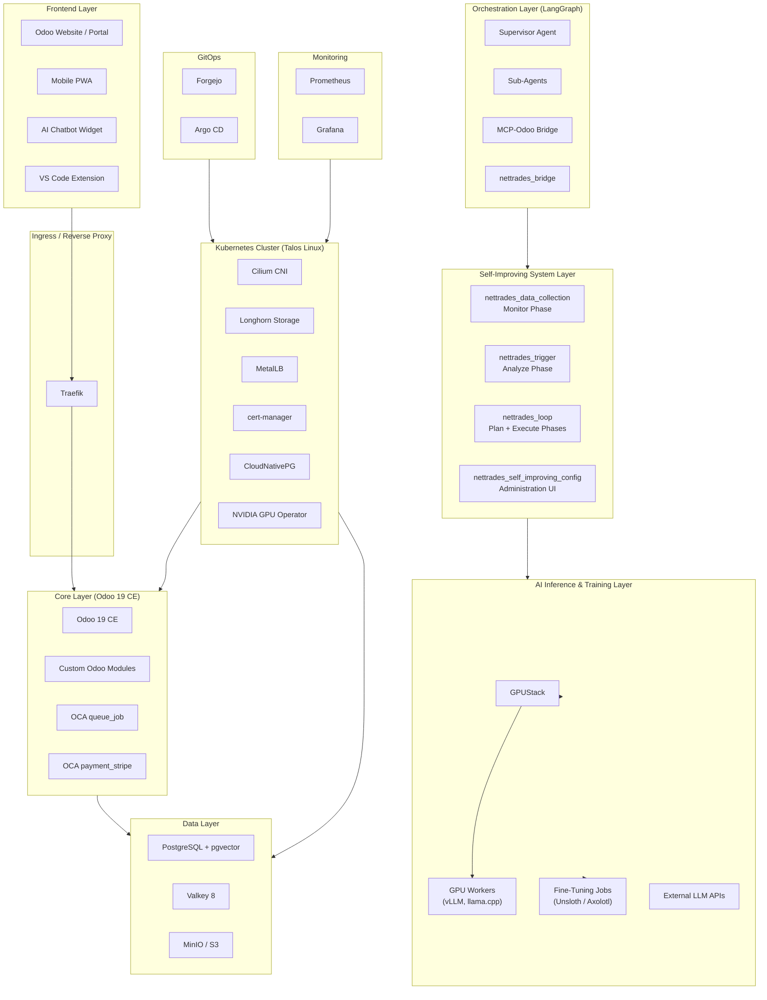


Detailed architecture diagrams are available in the [docs/developer/](docs/developer/index.md) folder.

### 2. The Hub-and-Spoke Model

NETTRADES uses a hub-and-spoke architecture to distribute load, preserve data sovereignty, and enable seamless scaling. Each spoke (company) runs its own client instance of the software for internal operations, while the hub (NETTRADES.AI) provides global services like talent discovery, GPU overflow, and the self-improving loop.

Companies can use `Local Internal Shell` internally for their operations and connect to `NETTRADES.AI` when they need external talent, researchers, partners, or additional GPU capacity.

`Local Internal Shell (Self-hosted, LGPL-3.0) `
                                                
• Internal job adverts and collaboration 
• CRM, ERP, eCommerce   
• Local GPU inferencing on your own hardware 
• Agentic AI for internal operations  
• Fine-tune AI on your internal data 


`NETTRADES.AI (The Brain) (Cloud-based, Commercial)`
                                      
• Global talent pool (external recruitment)
• Global GPU marketplace    
• Central inference and fine-tuning  
• Self-improving AI pipeline    

```mermaid

graph TB
    subgraph Hub["🌐 NETTRADES.AI (The Hub)"]
        GlobalTalent["Global Talent Pool"]
        GlobalGPU["Global GPU Marketplace"]
        GlobalModels["Global Self-Improving Models"]
        CentralBridge["Central Bridge Router"]
    end

    subgraph Spoke1["🏢 Company A (Spoke)"]
        LocalOdoo1["Local Odoo 19 CE"]
        LocalLangGraph1["Local LangGraph Agents"]
        LocalGPU1["Local GPUStack"]
        LocalBridge1["nettrades_bridge (Local Router)"]
        LocalData1["Local PostgreSQL + pgvector"]
        LocalValkey1["Local Valkey"]
    end

    subgraph Spoke2["🏢 Company B (Spoke)"]
        LocalOdoo2["Local Odoo 19 CE"]
        LocalLangGraph2["Local LangGraph Agents"]
        LocalGPU2["Local GPUStack"]
        LocalBridge2["nettrades_bridge (Local Router)"]
        LocalData2["Local PostgreSQL + pgvector"]
        LocalValkey2["Local Valkey"]
    end

    subgraph SpokeN["🏢 Company N (Spoke)"]
        LocalOdooN["Local Odoo 19 CE"]
        LocalLangGraphN["Local LangGraph Agents"]
        LocalGPUN["Local GPUStack"]
        LocalBridgeN["nettrades_bridge (Local Router)"]
        LocalDataN["Local PostgreSQL + pgvector"]
        LocalValkeyN["Local Valkey"]
    end

    LocalBridge1 -->|"Internal Ops"| LocalLangGraph1
    LocalBridge1 -->|"External Talent / GPU"| CentralBridge
    LocalBridge2 -->|"Internal Ops"| LocalLangGraph2
    LocalBridge2 -->|"External Talent / GPU"| CentralBridge
    LocalBridgeN -->|"Internal Ops"| LocalLangGraphN
    LocalBridgeN -->|"External Talent / GPU"| CentralBridge

    CentralBridge --> GlobalTalent
    CentralBridge --> GlobalGPU
    CentralBridge --> GlobalModels

    GlobalModels -->|"Pushes model updates"| LocalBridge1
    GlobalModels -->|"Pushes model updates"| LocalBridge2
    GlobalModels -->|"Pushes model updates"| LocalBridgeN

```

### Routing Logic:

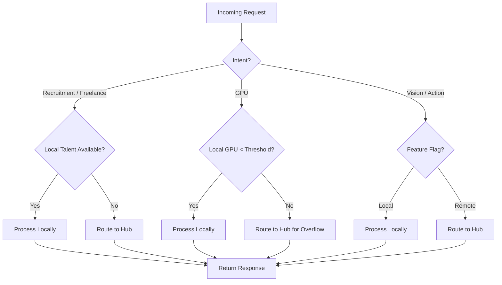

### 3. Self-Improving AI Loop

The platform continuously learns from user interactions and improves its models. This closed-loop system is the engine of NETTRADES’ self-improvement capability.

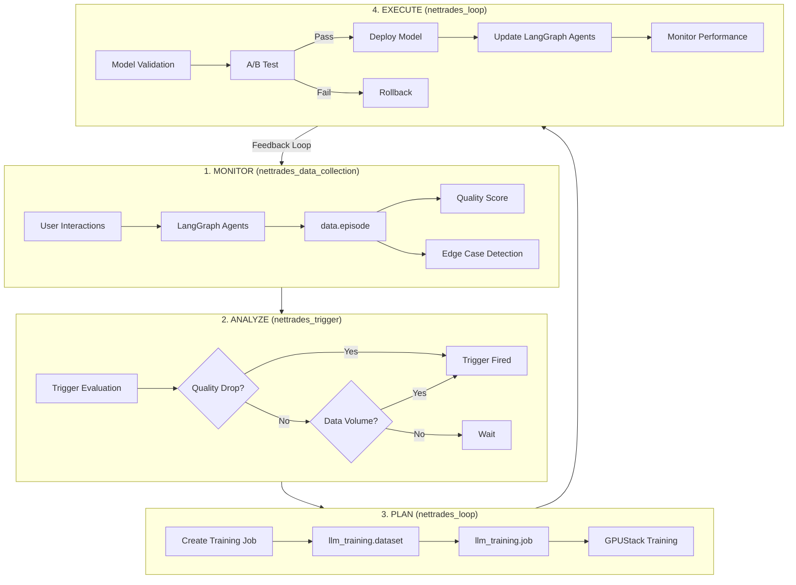

### 4. LangGraph Agent State Machine (Simplified)

The LangGraph supervisor orchestrates all sub-agents, incorporating bridge routing and self-improvement hooks.

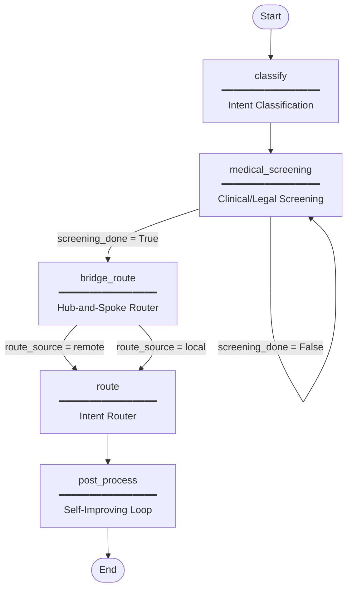

### 5. CI/CD Pipeline

The platform uses Forgejo Actions for CI and Argo CD for GitOps deployment on Kubernetes.

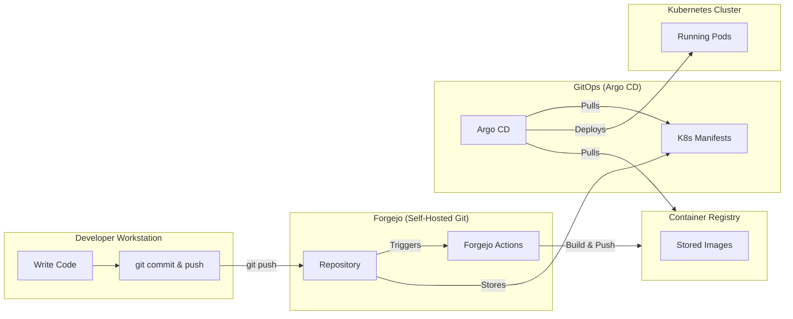

### 6. Technology Stack Table
Layer	Component	Technology	Version	License	Notes
Business Logic	ERP / CRM / HR	Odoo	19 CE	LGPL-3	Core business logic
Job Queue	Async processing	OCA queue_job	19.0	LGPL-3	Background jobs
Payments	Payment processing	OCA payment_stripe	19.0	LGPL-3	Stripe integration
Database	Primary database	PostgreSQL + pgvector	18	PostgreSQL	Vector embeddings
Cache	Session / Rate limiting	Valkey	8	BSD-3	High-performance cache
Object Storage	Files / Models	MinIO / S3	Latest	AGPL-3	Model artifacts
Agent Orchestration	Multi-agent framework	LangGraph	Latest	MIT	Stateful agents
Agent State	Checkpointing	LangGraph Checkpoint Postgres	Latest	MIT	Durable workflows
GPU Management	Cluster management	GPUStack	Latest	Apache-2.0	GPU orchestration
Fine-Tuning	Model training	Unsloth / Axolotl	Latest	Apache-2.0	LLM fine-tuning
Inference	LLM serving	vLLM, llama.cpp, SGLang	Latest	MIT	High-performance inference
Ingress	Reverse proxy	Traefik	Latest	MIT	Dynamic routing
Git / CI	Source control / CI	Forgejo	Latest	MIT	Self-hosted Git
GitOps	Continuous delivery	Argo CD	Latest	Apache-2.0	Declarative deployments
OS	Kubernetes OS	Talos Linux	Latest	MPL-2.0	Immutable, secure
Orchestration	Container orchestration	Kubernetes	Latest	Apache-2.0	Container management
CNI	Networking	Cilium	Latest	Apache-2.0	eBPF networking
Storage	Persistent volumes	Longhorn	Latest	Apache-2.0	Distributed block storage
Load Balancing	Bare-metal LB	MetalLB	Latest	Apache-2.0	Load balancing
Certificates	TLS management	cert-manager	Latest	Apache-2.0	Automated certificates
Database Operator	PostgreSQL operator	CloudNativePG	Latest	Apache-2.0	PostgreSQL management
GPU Operator	NVIDIA GPU management	NVIDIA GPU Operator	Latest	Apache-2.0	GPU provisioning
Distributed Computing	Ray on K8s	KubeRay	Latest	Apache-2.0	Distributed training
VPN	Secure networking	WireGuard	Latest	GPL-2.0	Secure tunnels
Sandboxing	Container isolation	gVisor	Latest	Apache-2.0	Secure containers
Metrics	Monitoring	Prometheus	Latest	Apache-2.0	Metrics collection
Dashboards	Visualisation	Grafana	Latest	AGPL-3.0	Monitoring dashboards

📖 Full architecture details are in the docs/developer/ folder.

🚀 Quick Start

Prerequisites

* Python 3.12+

* PostgreSQL 18+ with pgvector extension

* Docker & Kubernetes (for production deployment)

* NVIDIA GPU (optional, for GPU features)

One-Click Installer

The quickest way to get started is with the interactive installer:

```bash

curl -sSL https://raw.githubusercontent.com/nettrades/nettrades-platform/main/deploy/docker/install-nettrades.sh | sudo bash

```

The installer auto-detects your hardware, asks for your domain, generates secure passwords, and starts all services.
Manual Installation
#### 1. Clone the Repository

```bash

git clone https://github.com/nettrades/nettrades-platform.git
cd nettrades-platform

```

#### 2. Set Up Python Virtual Environment

```bash

python -m venv venv
source venv/bin/activate  # or .\venv\Scripts\activate on Windows

```

#### 3. Install Dependencies

```bash

# Core Python packages
pip install torch transformers datasets accelerate

# Odoo LLM modules requirements
pip install -r third-party/odoo_llm/requirements.txt

# Upgrade Starlette (security fix for CVE-2026-48710)
pip install --upgrade "starlette>=1.0.1"

```

### 4. Install Odoo Modules (in the correct order)

    ⚠️ Important: Modules must be installed in this order to satisfy dependencies.

#### Batch 1: Foundation Modules

```bash

python third-party/odoo/odoo-bin -c deploy/docker/config/odoo.conf \
  --addons-path=third-party/odoo/addons,odoo-modules,third-party/odoo_llm,third-party/odoo_llm_compat,third-party/website_sale_marketplace,third-party/queue-19 \
  -i queue_job,queue_job_batch,queue_job_cron,llm,llm_tool,llm_store,llm_pgvector,llm_knowledge,llm_assistant,llm_thread,llm_generate,llm_training \
  --stop-after-init

```

#### Batch 2: NETTRADES Core

```bash

python third-party/odoo/odoo-bin -c deploy/docker/config/odoo.conf \
  --addons-path=... \
  -i nettrades_core \
  --stop-after-init

```

#### Batch 3: Core NETTRADES Modules

```bash

python third-party/odoo/odoo-bin -c deploy/docker/config/odoo.conf \
  --addons-path=... \
  -i nettrades_gpu_admin,nettrades_gpustack_adapter,nettrades_good_answer,nettrades_ask_someone,nettrades_queue,nettrades_notifications,nettrades_job_matching,nettrades_lead_scoring,nettrades_chatbot \
  --stop-after-init

```

#### Batch 4: Self-improving System Modules

```bash

python third-party/odoo/odoo-bin -c deploy/docker/config/odoo.conf \
  --addons-path=... \
  -i nettrades_bridge,nettrades_data_collection,nettrades_trigger,nettrades_loop,nettrades_self_improving_config \
  --stop-after-init

```

#### Batch 5: Additional Modules

```bash

python third-party/odoo/odoo-bin -c deploy/docker/config/odoo.conf \
  --addons-path=... \
  -i nettrades_fairness,nettrades_onboarding,nettrades_proposals,nettrades_research,nettrades_pwa \
  --stop-after-init

```

    📖 See the full installation guide in docs/operations/module-installation-order.md.

### 5. Start Odoo

```bash

python third-party/odoo/odoo-bin -c deploy/docker/config/odoo.conf \
  --addons-path=third-party/odoo/addons,odoo-modules,third-party/odoo_llm,third-party/odoo_llm_compat,third-party/website_sale_marketplace,third-party/queue-19 \
  -d nettrades

```

Open http://localhost:8069 and log in with admin / admin.


## 🛠️ Quick Start

### One-Command Deployment (Ubuntu 24.04)

```bash

# Download and run the interactive installer
curl -sSL https://raw.githubusercontent.com/nettrades/nettrades-platform/main/deploy/docker/install-nettrades.sh | sudo bash

```

The installer auto-detects your hardware, asks for your domain, generates secure passwords, and starts all services.

### Access Your Platform

### After ~10-20 minutes, you'll have:


| Service | URL | Default Credentials |
|---------|-------------|-------------|
|`Odoo`	| https://your-domain	| Create database on first login|
|`Grafana`	| https://grafana.your-domain	| admin / password from .env|
|`GPUStack`	| https://gpustack.your-domain	| admin / admin (change immediately)|
|`Forgejo`	| https://git.your-domain	| Create first user on first login|

All services are secured with Let's Encrypt TLS.

For detailed step-by-step instructions, see the [Full Documentation](docs/index.md).


## 📚 Documentation

Full documentation is available at: Full Documentation.
Section	Description	Link
User Guide	For end-users – companies, freelancers, job-seekers	docs/user/index.md
Developer Guide	For developers extending the platform	docs/developer/index.md
Operations Guide	For system administrators and DevOps	docs/operations/index.md
API Reference	Complete API documentation	docs/developer/api-reference.md
Architecture Overview	System architecture diagrams and explanations	docs/developer/architecture.md
Core Models	Reference for all custom Odoo models	docs/developer/core-models.md
Database Schema	Complete database schema	docs/appendix/database-schema.md
Glossary	Key terms and definitions	docs/appendix/glossary.md
Contributing Guide	How to contribute to the project	docs/governance/contributing.md
Roadmap	Project roadmap and milestones	docs/governance/roadmap

## 🤝 Community & Support

NETTRADES has a growing community of developers, enterprises, and researchers. We welcome you to join us!
💬 Get Help
Channel	Purpose	Link
GitHub Issues	Report bugs, request features, or ask technical questions	Issues
GitHub Discussions	Ask questions, share ideas, and get community support	Discussions
Twitter / X	Follow for project updates and announcements	@nettrades_ai

## 📖 Learn More

* Developer Documentation – In-depth architecture, agent diagrams, and API references.

* Operations Guide – Deployment, CI/CD, and Kubernetes configuration.

* Installation Guide – Step-by-step module installation.

## 🌟 Community Highlights

* Contributors: We welcome contributions from developers of all skill levels. See our Contributing Guide.

* Adopters: Companies using NETTRADES in production – add your logo!

* Events: Join our monthly community calls (details in Discussions).

## 🤝 Contributing

We welcome contributions! Please read our Contributing Guide before submitting PRs.
Quick Steps

🍴 Fork the repository

🌿 Create a feature branch (git checkout -b feature/amazing-feature)

💻 Make your changes

✅ Run tests (pytest src/core/tests/)

📝 Update documentation

🚀 Push and open a Pull Request

## ⭐ Star Us!

If you find NETTRADES.AI useful, please consider giving us a ⭐ on GitHub – it helps others discover the project and supports our work.
📄 License

This project is licensed under the GNU Affero General Public License v3.0 (AGPL-3.0) – see the LICENSE.txt file for details.
Component	License
src/ (core orchestrator, agent, training scripts)	AGPL-3.0
odoo-modules/ (custom Odoo plugins)	AGPL-3.0
third-party/	Original licenses (LGPL, MIT, Apache-2.0)
deploy/	AGPL-3.0
scripts/	MIT

Please agree to the Contributor License Agreement (CLA) before contributing.

## 🙏 Acknowledgements

NETTRADES builds on the shoulders of many amazing open-source projects:

* Odoo – Open-source ERP

* LangGraph – Stateful agent orchestration

* GPUStack – GPU cluster management

* Kubernetes – Container orchestration

* PostgreSQL + pgvector – Vector database

* Valkey – High-performance cache

* Traefik – Cloud-native reverse proxy

* Forgejo – Self-hosted Git

* Argo CD – GitOps continuous delivery

* Talos Linux – Kubernetes-native OS

* Cilium – eBPF networking

* Longhorn – Distributed block storage

* Unsloth – Efficient fine-tuning

* Axolotl – Multi-GPU fine-tuning

* Prometheus & Grafana – Monitoring


## User Workflow: NETTRADES Platform

### 1. User Journey Overview

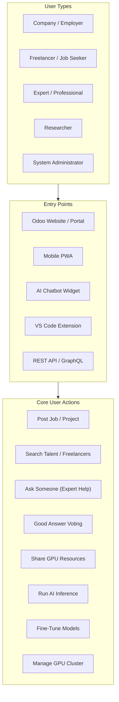

### 2. Complete End-to-End Workflow

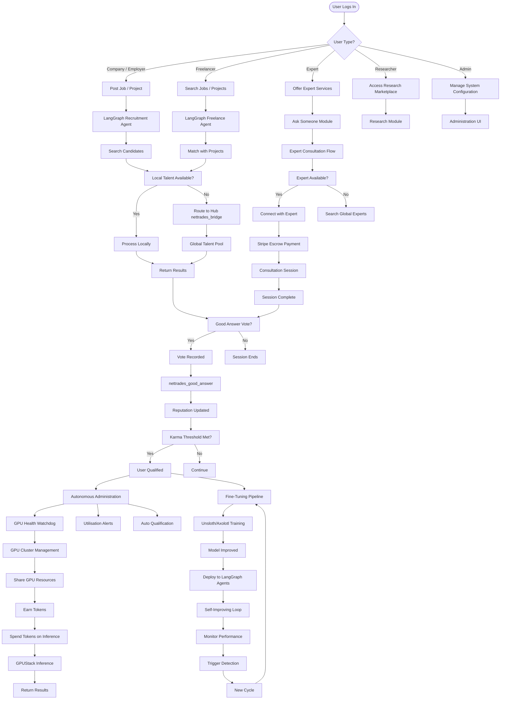

### 3. Detailed Ask Someone Workflow

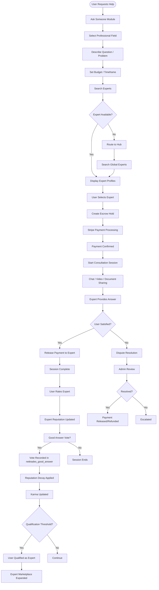

### 4. Good Answer Voting Workflow


### 5. Distributed GPU Functionality Workflow

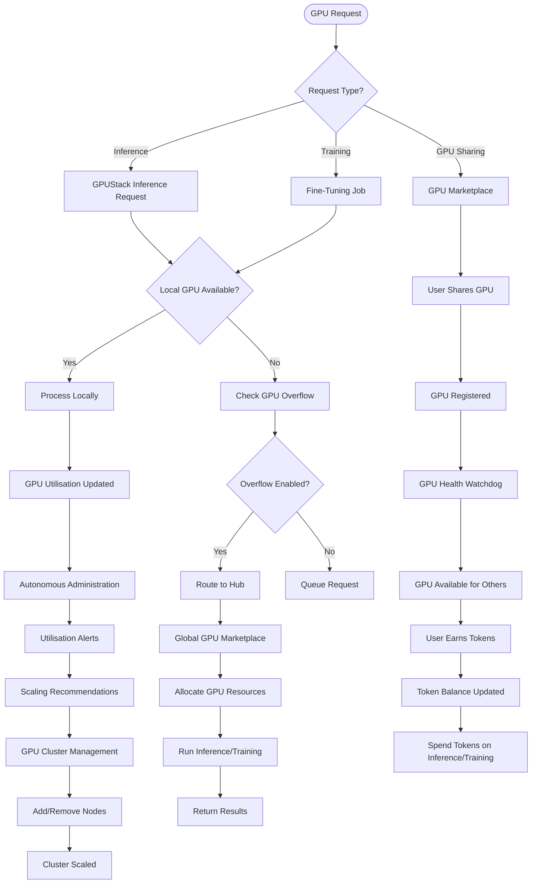

### 6. Self-Improving Loop with GPU Integration

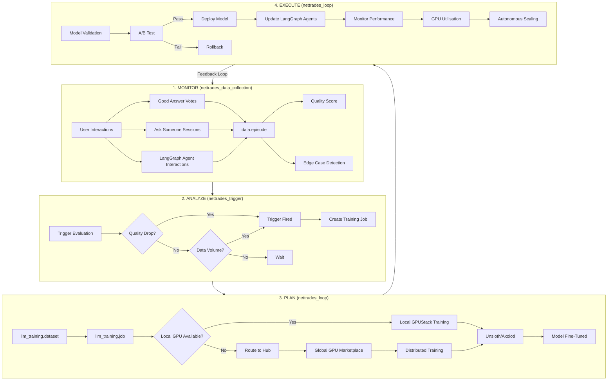

### 7. Complete System Workflow with All Components

```mermaid
graph TB
    subgraph UserLayer["User Layer"]
        U1["Company / Employer"]
        U2["Freelancer / Job Seeker"]
        U3["Expert / Professional"]
        U4["Researcher"]
        U5["System Administrator"]
    end

    subgraph FrontendLayer["Frontend Layer"]
        F1["Odoo Website / Portal"]
        F2["Mobile PWA"]
        F3["AI Chatbot Widget"]
        F4["VS Code Extension"]
        F5["REST API / GraphQL"]
    end

    subgraph OrchestrationLayer["Orchestration Layer (LangGraph)"]
        O1["Supervisor Agent"]
        O2["Recruitment Agent"]
        O3["Freelance Agent"]
        O4["Lead Gen Agent"]
        O5["GPU Management Agent"]
        O6["Vision Agent"]
        O7["Action Agent"]
        O8["MCP-Odoo Bridge"]
    end

    subgraph BridgeLayer["Bridge Layer"]
        B1["nettrades_bridge"]
        B2["Local Brain Routing"]
        B3["Remote Brain Routing"]
        B4["GPU Overflow Detection"]
    end

    subgraph CoreModules["Core Odoo Modules"]
        C1["nettrades_core"]
        C2["nettrades_good_answer"]
        C3["nettrades_ask_someone"]
        C4["nettrades_gpu_admin"]
        C5["nettrades_gpustack_adapter"]
        C6["nettrades_queue"]
        C7["nettrades_notifications"]
        C8["nettrades_job_matching"]
        C9["nettrades_lead_scoring"]
        C10["nettrades_chatbot"]
    end

    subgraph SelfImprovingModules["Self-Improving Modules"]
        S1["nettrades_data_collection"]
        S2["nettrades_trigger"]
        S3["nettrades_loop"]
        S4["nettrades_self_improving_config"]
    end

    subgraph TrainingLayer["Training & Inference Layer"]
        T1["GPUStack"]
        T2["GPU Workers (vLLM)"]
        T3["GPU Workers (llama.cpp)"]
        T4["Unsloth / Axolotl"]
        T5["llm_training"]
        T6["External LLM APIs"]
    end

    subgraph DataLayer["Data Layer"]
        D1["PostgreSQL + pgvector"]
        D2["Valkey 8"]
        D3["MinIO / S3"]
    end

    subgraph Infrastructure["Infrastructure Layer"]
        I1["Kubernetes (Talos Linux)"]
        I2["Cilium CNI"]
        I3["Longhorn Storage"]
        I4["MetalLB"]
        I5["cert-manager"]
        I6["CloudNativePG"]
        I7["NVIDIA GPU Operator"]
        I8["KubeRay"]
    end

    subgraph GitOpsLayer["GitOps Layer"]
        G1["Forgejo"]
        G2["Argo CD"]
    end

    subgraph MonitoringLayer["Monitoring Layer"]
        M1["Prometheus"]
        M2["Grafana"]
    end

    UserLayer --> FrontendLayer
    FrontendLayer --> OrchestrationLayer
    OrchestrationLayer --> BridgeLayer
    BridgeLayer --> CoreModules
    OrchestrationLayer --> SelfImprovingModules
    SelfImprovingModules --> TrainingLayer
    TrainingLayer --> CoreModules
    CoreModules --> DataLayer
    Infrastructure --> CoreModules
    Infrastructure --> DataLayer
    GitOpsLayer --> Infrastructure
    MonitoringLayer --> Infrastructure
    MonitoringLayer --> TrainingLayer
```

### 8. Key Workflow Sequences
#### 8.1 Ask Someone Flow

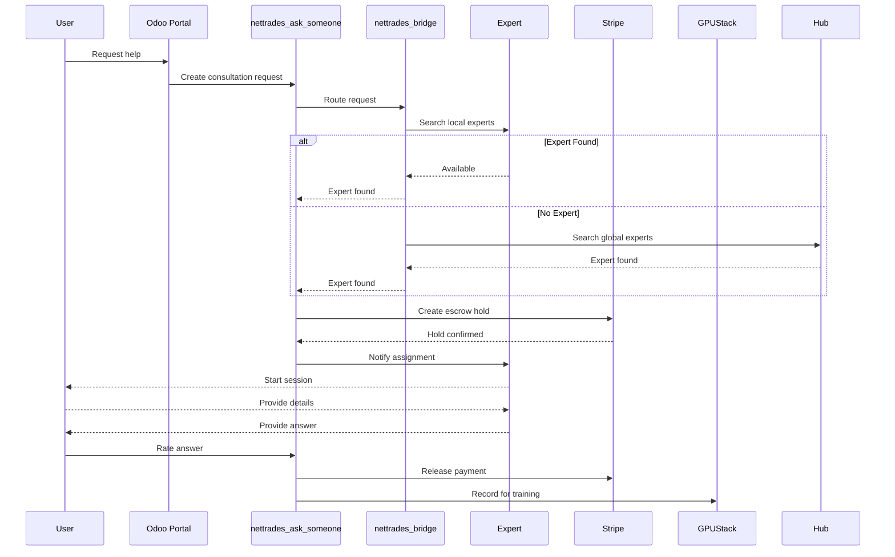


#### 8.2 GPU Sharing & Inference Flow

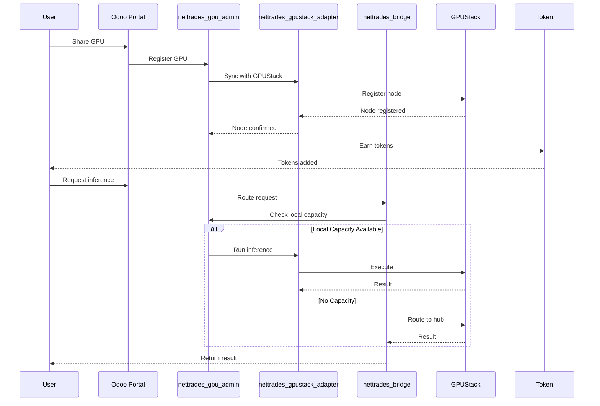

#### 8.3 Good Answer Flow

```mermaid

sequenceDiagram
    participant User
    participant Portal as Odoo Portal
    participant Vote as nettrades_good_answer
    participant Core as nettrades_core
    participant Data as nettrades_data_collection
    participant Trigger as nettrades_trigger
    participant Loop as nettrades_loop
    participant GPUStack

    User->>Portal: Mark answer as good
    Portal->>Vote: Record vote
    Vote->>Core: Update Karma
    Core-->>Vote: Karma updated
    Vote->>Data: Create episode
    Data->>Data: Calculate quality score
    Data->>Trigger: Check triggers
    Trigger->>Trigger: Evaluate threshold
    alt Trigger Fired
        Trigger->>Loop: Create training job
        Loop->>GPUStack: Submit training
        GPUStack-->>Loop: Job submitted
        Loop->>Loop: Deploy improved model
    
```

Detailed Explanation of Each Step
Phase 1: User Interaction
Step	Description	Component
1	User views an answer in a thread	Odoo Portal
2	User clicks "Good Answer" button	Odoo Portal
3	Vote is submitted to the system	nettrades_good_answer
Phase 2: Vote Processing
Step	Description	Component
4	Validate user can vote (check permissions)	nettrades_good_answer
5	Check if user already voted on this answer	nettrades_good_answer
6	Record vote in database	nettrades_good_answer
Phase 3: Reputation & Karma Update
Step	Description	Component
7	Update answerer's Karma score	nettrades_core
8	Recalculate reputation score	nettrades_core
Phase 4: Data Collection
Step	Description	Component
9	Create data.episode record	nettrades_data_collection
10	Store input → output → feedback	nettrades_data_collection
11	Calculate quality_score	nettrades_data_collection
Phase 5: Trigger Detection
Step	Description	Component
12	Evaluate quality threshold	nettrades_trigger
13	Check data volume for training	nettrades_trigger
Phase 6: Training & Deployment
Step	Description	Component
14	Initiate self-improving loop	nettrades_loop
15	Prepare training dataset	nettrades_loop
16	Submit fine-tuning job to GPUStack	GPUStack
17	Run Unsloth/Axolotl training	GPUStack
18	A/B test new model	nettrades_loop
19	Deploy or rollback model	nettrades_loop
Phase 7: Autonomous Administration
Step	Description	Component
20	Apply reputation decay (1% daily)	Autonomous Administration
21	Check qualification threshold	Autonomous Administration
22	Update GPU reputation	Autonomous Administration
Phase 8: Audit & Statistics
Step	Description	Component
23	Log vote in audit trail	nettrades_good_answer
24	Update vote statistics	nettrades_good_answer
Key Decision Points
Decision Point	Condition	Action
Quality Score Check	Quality Score > Threshold	Episode qualified for training
Quality Score Check	Quality Score < Threshold	Episode rejected (no training)
Training Result	Model Improved	Deploy updated model
Training Result	Model Not Improved	Rollback to previous model
Qualification Check	Karma > Threshold	User qualified as Expert
Qualification Check	Karma < Threshold	User remains unqualified
Related Code Files
Component	File Path
Good Answer Model	odoo-modules/nettrades_good_answer/models/good_answer_vote.py
Core Model (Karma)	odoo-modules/nettrades_core/models/res_partner.py
Data Collection	odoo-modules/nettrades_data_collection/models/data_episode.py
Trigger Evaluation	odoo-modules/nettrades_trigger/models/trigger_config.py
Self-Improving Loop	odoo-modules/nettrades_loop/models/self_improving_loop.py
Autonomous Admin	odoo-modules/nettrades_core/models/autonomous_admin.py


## 9. File Locations Summary

| Component | File Pat |
|---------|-------------|
| Supervisor Agent | src/core/supervisor.py |
| Bridge Integration | src/core/bridge_integration.py |
| Self-Improving Integration | src/core/self_improving_integration.py |
| Recruitment Agent | src/core/agents/recruitment_agent.py |
| Freelance Agent | src/core/agents/freelance_agent.py |
| Lead Gen Agent | src/core/agents/lead_gen_agent.py |
| GPU Management Agent | src/core/agents/gpu_management_agent.py |
| Vision Agent | src/core/agents/vision_agent.py |
| Action Agent | src/core/agents/action_agent.py |
| Ask Someone | odoo-modules/nettrades_ask_someone/models/ |
| Good Answer | odoo-modules/nettrades_good_answer/models/ |
| GPU Admin | odoo-modules/nettrades_gpu_admin/models/ |
| GPUStack Adapter | odoo-modules/nettrades_gpustack_adapter/models/ |
| Data Collection | odoo-modules/nettrades_data_collection/models/ |
| Trigger | odoo-modules/nettrades_trigger/models/ |
| Loop | odoo-modules/nettrades_loop/models/ |
| Self-Improving Config | odoo-modules/nettrades_self_improving_config/models/ |
| Bridge | odoo-modules/nettrades_bridge/models/ |

## 10. Summary of Workflows

Workflow	Key Modules	Key Features
Ask Someone	nettrades_ask_someone, nettrades_bridge, Stripe	Expert consultation, escrow payments, reputation
Good Answer Voting	nettrades_good_answer, nettrades_core, nettrades_data_collection	User feedback, karma, qualification
GPU Sharing	nettrades_gpu_admin, nettrades_gpustack_adapter, GPUStack	GPU marketplace, token economy
Self-Improving Loop	nettrades_data_collection, nettrades_trigger, nettrades_loop	Continuous learning, fine-tuning, deployment
Agent Routing	nettrades_bridge, LangGraph Agents	Hub-and-spoke, local/remote routing, overflow   