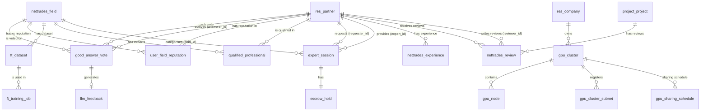

# Database Schema

This document provides the consolidated database schema for the NETTRADES.AI platform.

---

## Schema Diagram


    
    res_partner – Extended Partner
``` sql
    
    ALTER TABLE res_partner ADD COLUMN onboarding_step VARCHAR(50) DEFAULT 'new';
    ALTER TABLE res_partner ADD COLUMN linkedin_uid VARCHAR(255);
    ALTER TABLE res_partner ADD COLUMN github_username VARCHAR(255);
    ALTER TABLE res_partner ADD COLUMN upwork_id VARCHAR(255);
    ALTER TABLE res_partner ADD COLUMN profile_completeness INTEGER DEFAULT 0;
    ALTER TABLE res_partner ADD COLUMN latitude FLOAT;
    ALTER TABLE res_partner ADD COLUMN longitude FLOAT;
    ALTER TABLE res_partner ADD COLUMN last_seen TIMESTAMP;
    ALTER TABLE res_partner ADD COLUMN is_online BOOLEAN DEFAULT FALSE;
``` 
    nettrades.experience – Work Experience
``` sql
    
    CREATE TABLE nettrades_experience (
        id SERIAL PRIMARY KEY,
        partner_id INTEGER NOT NULL REFERENCES res_partner(id) ON DELETE CASCADE,
        job_title VARCHAR(255) NOT NULL,
        company VARCHAR(255) NOT NULL,
        start_date DATE NOT NULL,
        end_date DATE,
        description TEXT,
        is_current BOOLEAN DEFAULT FALSE
    );
    
    CREATE INDEX idx_nettrades_experience_partner ON nettrades_experience(partner_id);
    CREATE INDEX idx_nettrades_experience_dates ON nettrades_experience(start_date DESC);
```

    nettrades.review – User Reviews
``` sql
    
    CREATE TABLE nettrades_review (
        id SERIAL PRIMARY KEY,
        reviewer_id INTEGER NOT NULL REFERENCES res_partner(id) ON DELETE CASCADE,
        reviewed_partner_id INTEGER NOT NULL REFERENCES res_partner(id) ON DELETE CASCADE,
        project_id INTEGER REFERENCES project_project(id) ON DELETE SET NULL,
        rating INTEGER NOT NULL CHECK (rating >= 1 AND rating <= 5),
        comment TEXT,
        create_date TIMESTAMP DEFAULT NOW()
    );
    
    CREATE INDEX idx_nettrades_review_reviewer ON nettrades_review(reviewer_id);
    CREATE INDEX idx_nettrades_review_reviewed ON nettrades_review(reviewed_partner_id);
    CREATE INDEX idx_nettrades_review_project ON nettrades_review(project_id);
```

    good_answer_vote
``` sql
    
    CREATE TABLE good_answer_vote (
        id SERIAL PRIMARY KEY,
        user_id INTEGER NOT NULL REFERENCES res_partner(id),
        answer_id INTEGER NOT NULL,
        answer_model VARCHAR(255) NOT NULL,
        answerer_id INTEGER NOT NULL REFERENCES res_partner(id),
        field_id INTEGER NOT NULL REFERENCES nettrades_field(id),
        points INTEGER,
        is_qualified_vote BOOLEAN DEFAULT FALSE,
        processed_for_ai BOOLEAN DEFAULT FALSE,
        created_at TIMESTAMP DEFAULT NOW()
    );
    
    CREATE UNIQUE INDEX idx_good_answer_vote_unique ON good_answer_vote(user_id, answer_id, answer_model);
```

    user_field_reputation
``` sql
    
    CREATE TABLE user_field_reputation (
        id SERIAL PRIMARY KEY,
        partner_id INTEGER NOT NULL REFERENCES res_partner(id),
        field_id INTEGER NOT NULL REFERENCES nettrades_field(id),
        reputation_points INTEGER DEFAULT 0,
        can_charge BOOLEAN DEFAULT FALSE,
        updated_at TIMESTAMP DEFAULT NOW()
    );
```

    llm_feedback
``` sql
    
    CREATE TABLE llm_feedback (
        id SERIAL PRIMARY KEY,
        vote_id INTEGER REFERENCES good_answer_vote(id),
        weight FLOAT,
        field_id INTEGER REFERENCES nettrades_field(id),
        input_text TEXT,
        output_text TEXT,
        created_at TIMESTAMP DEFAULT NOW(),
        processed BOOLEAN DEFAULT FALSE
    );
```

    ft_dataset
``` sql
    
    CREATE TABLE ft_dataset (
        id SERIAL PRIMARY KEY,
        field_id INTEGER NOT NULL REFERENCES nettrades_field(id),
        name VARCHAR(255) NOT NULL,
        description TEXT,
        file_uri VARCHAR(255),
        record_count INTEGER DEFAULT 0,
        created_at TIMESTAMP DEFAULT NOW()
    );
```

    ft_training_job
``` sql
    
    CREATE TABLE ft_training_job (
        id SERIAL PRIMARY KEY,
        dataset_id INTEGER REFERENCES ft_dataset(id),
        field_id INTEGER REFERENCES nettrades_field(id),
        provider VARCHAR(50),
        base_model VARCHAR(255),
        fine_tuned_model_id VARCHAR(255),
        status VARCHAR(50) DEFAULT 'pending',
        started_at TIMESTAMP,
        completed_at TIMESTAMP,
        hyperparameters JSONB,
        metrics JSONB,
        error_message TEXT
    );
```

    qualified_professional
``` sql
    
    CREATE TABLE qualified_professional (
        id SERIAL PRIMARY KEY,
        partner_id INTEGER NOT NULL REFERENCES res_partner(id),
        field_id INTEGER NOT NULL REFERENCES nettrades_field(id),
        is_active BOOLEAN DEFAULT TRUE,
        verified_at TIMESTAMP DEFAULT NOW()
    );
```
    
    expert_session
``` sql
    
    CREATE TABLE expert_session (
        id SERIAL PRIMARY KEY,
        session_id VARCHAR(255) UNIQUE NOT NULL,
        requester_id INTEGER NOT NULL REFERENCES res_partner(id),
        expert_id INTEGER NOT NULL REFERENCES res_partner(id),
        field_id INTEGER REFERENCES nettrades_field(id),
        task_summary TEXT,
        ai_context_bundle JSONB,
        duration_minutes INTEGER,
        rate_per_minute FLOAT,
        total_charged FLOAT,
        escrow_id VARCHAR(255),
        status VARCHAR(50) DEFAULT 'pending',
        started_at TIMESTAMP,
        ended_at TIMESTAMP,
        rating_by_requester INTEGER,
        rating_by_expert INTEGER,
        forgejo_repo_url VARCHAR(512),
        created_at TIMESTAMP DEFAULT NOW()
    );
    
    CREATE INDEX idx_expert_session_status ON expert_session(status, started_at);
    CREATE INDEX idx_expert_session_expert ON expert_session(expert_id, status);
    CREATE INDEX idx_expert_session_requester ON expert_session(requester_id, status);
```

    escrow_hold
``` sql
    
    CREATE TABLE escrow_hold (
        id SERIAL PRIMARY KEY,
        session_id INTEGER REFERENCES expert_session(id),
        amount FLOAT,
        currency VARCHAR(3) DEFAULT 'USD',
        provider VARCHAR(50) DEFAULT 'stripe',
        provider_hold_id VARCHAR(255),
        status VARCHAR(50) DEFAULT 'held',
        released_at TIMESTAMP
    );
```

    gpu_cluster
``` sql
    
    CREATE TABLE gpu_cluster (
        id SERIAL PRIMARY KEY,
        company_id INTEGER REFERENCES res_company(id),
        name VARCHAR(255),
        trust_mode VARCHAR(50),
        wireguard_mesh_subnet VARCHAR(50),
        wireguard_controller_public_key TEXT,
        controller_endpoint VARCHAR(255),
        wireguard_listen_port INTEGER,
        gpustack_server_url VARCHAR(255),
        gpustack_api_key VARCHAR(255)
    );
```

    gpu_node
``` sql
    
    CREATE TABLE gpu_node (
        id SERIAL PRIMARY KEY,
        cluster_id INTEGER REFERENCES gpu_cluster(id),
        hostname VARCHAR(255),
        ip_address VARCHAR(255),
        wireguard_public_key TEXT,
        wireguard_assigned_ip VARCHAR(50),
        gpus JSONB,
        pool VARCHAR(50),
        container_runtime VARCHAR(50),
        gpustack_worker_id VARCHAR(255),
        status VARCHAR(50),
        last_seen TIMESTAMP,
        uptime_hours FLOAT,
        gpu_utilisation_pct FLOAT,
        tokens_served INTEGER,
        token_earnings FLOAT,
        reputation_score FLOAT,
        attestation_passed BOOLEAN
    );
```

    project_milestone
``` sql
    
    CREATE TABLE project_milestone (
        id SERIAL PRIMARY KEY,
        project_id INTEGER NOT NULL REFERENCES project_project(id) ON DELETE CASCADE,
        name VARCHAR(255) NOT NULL,
        amount FLOAT,
        status VARCHAR(50) DEFAULT 'pending',
        due_date DATE,
        released BOOLEAN DEFAULT FALSE
);
```