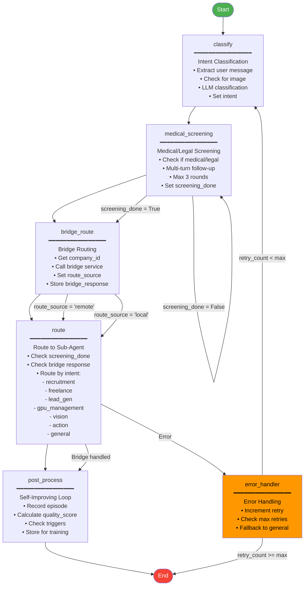
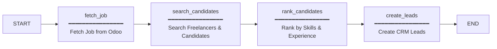
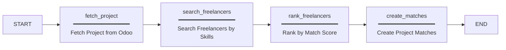
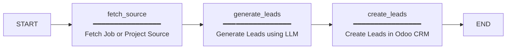
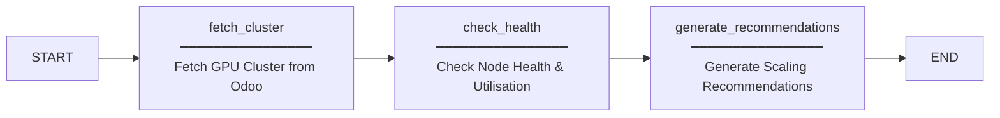
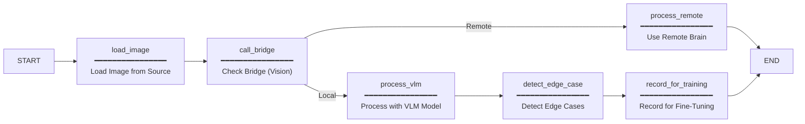
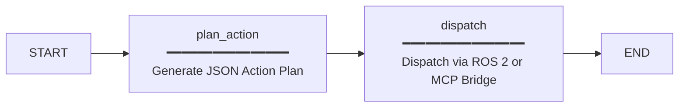
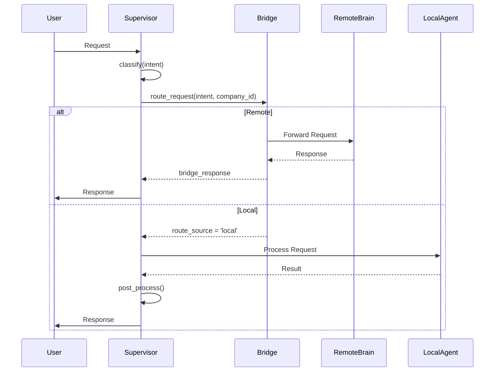
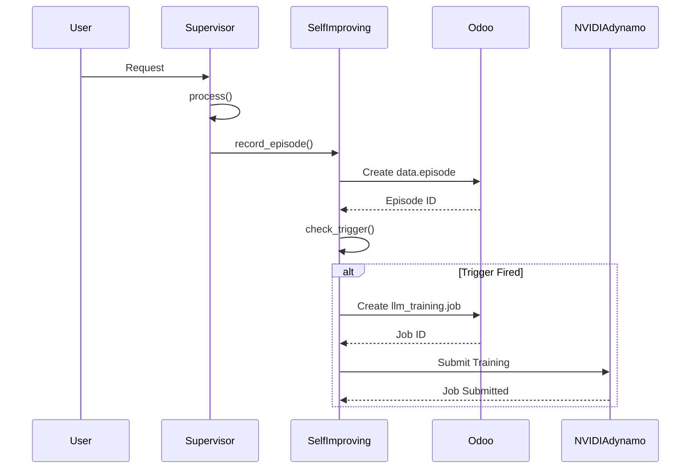
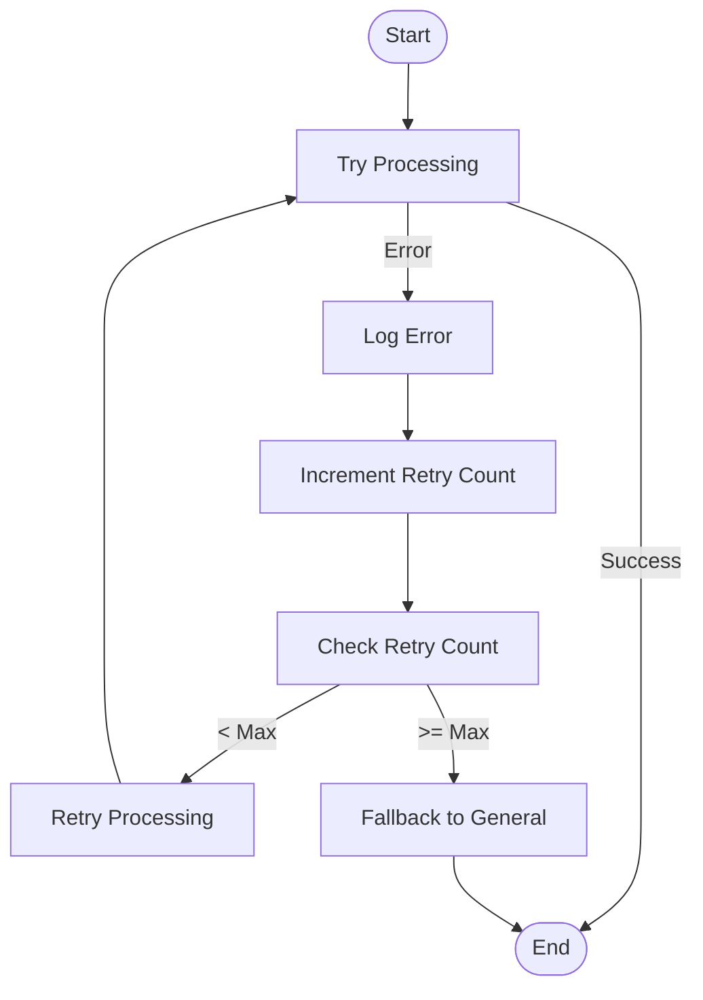

# LangGraph Agent State Machine Diagram

## 1. Overview

The NETTRADES platform uses LangGraph to orchestrate a **multi-agent state machine** that handles all user interactions, intent classification, medical/legal screening, and routing to specialised sub-agents. The supervisor agent is the central orchestrator.

The architecture includes:
- **Intent classification** using LLM
- **Medical/Legal screening** with multi-turn follow-up
- **Bridge integration** for hub-and-spoke routing
- **Self-improving loop** integration for continuous learning
- **Sub-agent routing** for specialised tasks

---

## 2. Complete Supervisor State Machine



## 3. Node-by-Node Explanation

### 3.1 classify – Intent Classification


| Field | Description |
|-----------|----------|
| `Input` | messages (last user message), image_base64 (optional) |
| `Logic` | Calls an LLM to classify the intent into one of: recruitment, freelance, lead_gen, gpu_management, medical, legal, action, vision, or general. If an image is present, it forces vision. |
| `Output` | intent, followup_count = 0 |
| `File` | src/core/supervisor.py |

### 3.2 medical_screening – Clinical/Legal Screening


| Field | Description |
|-----------|----------|
| `Trigger` | Only when intent is medical or legal |
| `Logic` | Engages in a multi-turn dialogue (up to 3 rounds) to ask clarifying questions about comorbidities or medication interactions. If the LLM responds with SUFFICIENT, screening is marked done. |
| `Output` | screening_done (boolean), updated messages |
| `File` | src/core/supervisor.py |

### 3.3 bridge_route – Hub-and-Spoke Routing (NEW)

| Field | Description |
|-----------|----------|
| `Input` | intent, company_id, current state |
| `Logic` | Calls the nettrades_bridge service to decide whether to process the request locally or forward it to the remote NETTRADES.AI brain. The decision considers: company-specific feature flags, GPU overflow threshold (for GPU intents), and the global bridge mode (local, remote, or hybrid). |
| `Output` | route_source (local / remote), bridge_response (if remote) |
| `File` | src/core/bridge_integration.py |

### 3.4 route – Intent Router

| Field | Description |
|-----------|----------|
| `Input` | intent, screening_done, bridge_response |
| `Logic` | If the bridge already handled the request remotely, it uses the bridge_response directly. Otherwise, it dispatches to the appropriate sub-agent based on intent. If no matching agent is found, it falls back to a general LLM. |
| `Output` | Result from the sub-agent (e.g., analysis, action_plan) |
| `File` | src/core/supervisor.py |

### 3.5 post_process – Self-Improving Loop (NEW)

| Field | Description |
|-----------|----------|
| `Input` | Entire state (includes intent, messages, output) |
| `Logic` | Skips if route_source == 'remote'. Calculates a quality_score (from confidence or analysis length). Extracts input_text and output_text, then calls SelfImprovingService.record_episode() to create a data.episode record in Odoo. If trigger conditions are met (e.g., quality drop, data volume threshold), it initiates a fine-tuning job via llm_training and NVIDIA Dynamo. |
| `Output` | None (episode recorded asynchronously) |
| `File` | src/core/self_improving_integration.py |

### 3.6 error_handler – Retry & Fallback

| Field | Description |
|-----------|----------|
| `Input` | error, retry_count |
| `Logic` | Logs the error, increments retry_count. If retry_count < 3, clears the error and returns to classify. Otherwise, falls back to a general LLM response. |
| `Output` | Cleared error or final fallback |
| `File` | src/core/supervisor.py |

## 4. Sub-Agents (Business Logic)

Each sub-agent is a self-contained LangGraph sub-graph that handles a specific domain.

### 4.1 Recruitment Agent



| Node | Description |
|-----------|----------|
| `fetch_job` | Retrieves the job posting from Odoo (hr.job or nettrades.job).
| `search_candidates` | Queries the candidate pool (freelancers, job seekers) using skill-based filters.
| `rank_candidates` | Uses an LLM to rank candidates by match score.
| `create_leads` | Creates CRM leads for the top candidates.
| `File` | src/core/agents/recruitment_agent.py

### 4.2 Freelance Agent



| Node | Description |
|-----------|----------|
| `fetch_project` | Retrieves the project from Odoo (project.project). |
| `search_freelancers` | Searches the freelancer pool using skill, availability, and rate filters. |
| `rank_freelancers` | Uses an LLM to rank freelancers by overall match. |
| `create_matches` | Creates project-freelancer match records in Odoo. |
| `File` | src/core/agents/freelance_agent.py |

### 4.3 Lead Gen Agent



| Node | Description |
|-----------|----------|
| `fetch_source` | Retrieves job postings or projects from external feeds or Odoo. |
| `generate_leads` | Uses an LLM to identify potential leads from the source data. |
| `create_leads` | Creates lead records in Odoo CRM. |
| `File` | src/core/agents/lead_gen_agent.py |

### 4.4 GPU Management Agent



| Node | Description |
|-----------|----------|
| `fetch_cluster` | Retrieves the GPU cluster configuration from nettrades_gpu_admin. |
| `check_health` | Queries each GPU node for health status and utilisation. |
| `generate_recommendations` | Uses an LLM to suggest scaling or rebalancing actions. |
| `File` | src/core/agents/gpu_management_agent.py |

### 4.5 Vision Agent (VLM)



| Node | Description |
|-----------|----------|
| `load_image` | Loads the image from a path, URL, or base64 data. |
| `call_bridge` | Checks if the vision request should be routed remotely (via nettrades_bridge). |
| `process_vlm` | Runs the image through a Vision-Language Model (Qwen2-VL, LLaVA, etc.). |
| `detect_edge_case` | Flags low-confidence or unusual results for the self-improving loop. |
| `record_for_training` | Stores the image-text pair for future fine-tuning. |
| `File` | src/core/agents/vision_agent.py |

### 4.6 Action Agent (VLA)



| Node | Description |
|-----------|----------|
| `plan_action` | Uses a Vision-Language-Action (VLA) model to translate natural language into a structured action plan (e.g., {"action": "move_arm", "params": {...}}). |
| `dispatch` | Sends the action to the robot via ROS 2 or the MCP-Robotics bridge. |
| `File` | src/core/agents/action_agent.py |

## 5. State Schema (SupervisorState)

typescript

interface SupervisorState {
    // Core conversation
    messages: Message[];
    intent: string;
    input_data: Record<string, any>;
    output_data: Record<string, any>;

    // Screening
    screening_done: boolean;
    followup_count: number;

    // Bridge routing
    route_source: 'local' | 'remote' | 'bridge';
    bridge_response: Record<string, any> | null;

    // Self-improving loop
    self_improving_data: Record<string, any> | null;

    // Error handling
    error: string | null;
    retry_count: number;
    max_retries: number;

    // Context
    company_id: number | null;
    user_id: number | null;
    image_base64?: string;
}

## 6. Sub-Agent Registration

All sub-agents are registered in src/core/agents/__init__.py.

| Setting | Description | Default |
|-----------|----------|-------------|
| `Agent` | Factory Function	Import Path |
| `Recruitment` | create_recruitment_agent() | src.core.agents.recruitment_agent |
| `Freelance` | create_freelance_agent() | src.core.agents.freelance_agent |
| `Lead Generation` | create_lead_gen_agent() | src.core.agents.lead_gen_agent |
| `GPU Management` | create_gpu_management_agent() | src.core.agents.gpu_management_agent |
| `Vision` | create_vision_agent() | src.core.agents.vision_agent |
| `Action` | create_action_agent() | src.core.agents.action_agent |

## 7. Bridge Integration (Sequence Diagram)



## 8. Self-Improving Loop Integration (Sequence Diagram)



## 9. Complete Request Flow (End-to-End)
text

1. User sends a message (optionally with an image) to /invoke
2. FastAPI receives the request, tracks metrics, and passes it to the Supervisor graph
3. classify node determines the intent (or forces vision if an image is present)
4. If medical or legal → medical_screening node engages in multi-turn dialogue (up to 3 rounds)
5. bridge_route node decides local vs. remote execution (with GPU overflow detection)
6. route node dispatches to the appropriate sub-agent (or uses bridge_response)
7. Sub-agent processes the request and returns a result
8. post_process node records the episode for the self-improving loop
9. The final response is sent back to the user
10. All state transitions are checkpointed to PostgreSQL via PostgresSaver

## 10. Infrastructure & Persistence

| Component | Description |
|-----------|----------|
| `FastAPI Application (src/core/app.py)` | Exposes /invoke, /health, /metrics endpoints. |
| `PostgresSaver` | Provides durable checkpointing for every node state. |
| `Prometheus Metrics` | Tracks langgraph_requests_total (by intent) and langgraph_request_duration_seconds. |
| `Inference Backend Auto-Detection` | get_inference_backend() in src/core/tools/inference_tools.py auto-selects NVIDIA Dynamo, vLLM, or llama.cpp. |

## 11. File Locations

| Component | File Path |
|-----------|----------|
| `Supervisor` | src/core/supervisor.py |
| `Bridge Integration` | src/core/bridge_integration.py |
| `Self-Improving Integration` | src/core/self_improving_integration.py |
| `Recruitment Agent` | src/core/agents/recruitment_agent.py |
| `Freelance Agent` | src/core/agents/freelance_agent.py |
| `Lead Gen Agent` | src/core/agents/lead_gen_agent.py |
| `GPU Management Agent` | src/core/agents/gpu_management_agent.py |
| `Vision Agent` | src/core/agents/vision_agent.py |
| `Action Agent` | src/core/agents/action_agent.py |
| `FastAPI App` | src/core/app.py |
| `Inference Tools` | src/core/tools/inference_tools.py |

## 12.  Error Handling Flow




## 13. To Use cuVS in Your RAG Pipeline

cuVS is a standalone vector search library designed to be the world's fastest, running on NVIDIA GPUs. 

The most pragmatic and high-impact path is to use cuVS as a standalone service for your most latency-sensitive RAG queries. This approach allows you to keep the operational benefits of PostgreSQL while unlocking a ~27x performance boost for your most demanding vector searches.

Therefore you can keep PostgreSQL + pgvector as your durable, authoritative data store and use cuVS as a high-performance "co-processor" for the most demanding search operations. At 10 million vectors, the GPU-accelerated library can be up to 30x faster.


### How cuVS Works

cuVS is a Python library that your LangGraph agents and RAG pipelines import and use directly:


```python

# Your Python code (e.g., in RAG pipeline)
from cuvs.neighbors import cagra

# cuVS runs GPU-accelerated vector search
# No separate container needed – it uses the same GPU as vLLM

```

It:

* Runs inside your existing Python virtual environment (.venv)

* Uses the same GPU that vLLM/Dynamo is already using

* Adds no new containers to manage

* Has no separate service to start/stop


To Test cuVS (After Deployment Completes)

Once the deployment finishes, you can verify cuVS is installed:

```bash

cd /root/nettrades-platform
source .venv/bin/activate
python3 -c "from cuvs.neighbors import cagra; print('cuVS installed successfully!')"

```

Example integration with your existing LangGraph code:

```python

# In your RAG/retrieval code
from cuvs.neighbors import cagra
import numpy as np

# Your embeddings (from your existing embedding model)
embeddings = np.array([...])  # Your vectors

# Build index on GPU
index = cagra.Index.build(embeddings)

# Search
results = index.search(query_embedding, k=10)

```