# Logical Solution Architecture Diagram

## 1. Overview

The NETTRADES platform is a self-improving, agentic AI system built on Odoo 19 CE, LangGraph, and GPUStack. It connects companies, freelancers, job-seekers, researchers, partners, and customers through a hub-and-spoke architecture with a unique GPU marketplace and closed-loop self-improvement.

The platform is designed for **autonomous enterprise operations** where AI agents handle recruitment, freelancing, GPU management, and business operations, continuously learning and improving from user interactions.

```mermaid

flowchart TD
    %% ========================================================================
    %% 1. EXTERNAL CLIENTS & ACCESS LAYER
    %% ========================================================================
    subgraph AccessLayer["🌐 External Access & Clients"]
        Browser["Web Browser (PWA)
        ━━━━━━━━━━━━━━━
        • Odoo Website / Discuss / Chat
        • Service Worker (offline support)
        • Progressive Web App manifest"]
        APIClient["External API Client
        ━━━━━━━━━━━━━━━
        • REST / JSON-RPC consumers
        • Third-party job board scrapers
        • Partner integrations"]
        RoboticClient["Robotic / Edge Client
        ━━━━━━━━━━━━━━━
        • ROS 2 nodes
        • MCP-Robotics bridge
        • IoT sensor data ingestion"]
        MobileApp["Mobile App
        ━━━━━━━━━━━━━━━
        • React Native / Flutter
        • Push notifications
        • Offline-first sync"]
    end

    %% ========================================================================
    %% 2. API GATEWAY & EDGE SECURITY
    %% ========================================================================
    subgraph Gateway["🔒 API Gateway & Edge (Traefik)"]
        TLSTerm["TLS Termination
        ━━━━━━━━━━━━━━━
        • Let's Encrypt Auto-Cert
        • HTTP/2 & WebSocket support
        • mTLS for internal services"]
        AuthZ["Authentication / Authorization
        ━━━━━━━━━━━━━━━
        • JWT Bearer token validation
        • OAuth2 / OpenID Connect proxy
        • API key management"]
        RateLimit["Rate Limiting & Routing
        ━━━━━━━━━━━━━━━
        • Path-based routing
        • Request throttling per tenant
        • Circuit breaker patterns"]
        WAF["Web Application Firewall
        ━━━━━━━━━━━━━━━
        • SQL injection prevention
        • XSS protection
        • DDoS mitigation"]
    end

    %% ========================================================================
    %% 3. APPLICATION SERVICES LAYER (BACKEND LOGIC)
    %% ========================================================================
    subgraph ApplicationLayer["⚙️ Application Services Layer"]
        direction TB

        subgraph OdooServer["Odoo 19 CE Application Server (Python)"]
            WebController["Web Controllers
            ━━━━━━━━━━━━━━━
            • /website, /forum, /shop
            • /ask_someone, /jobs
            • /freelance, /research"]
            APIController["JSON-RPC API Controllers
            ━━━━━━━━━━━━━━━
            • /api/v1/gpu/register
            • /api/v1/dataset/export
            • /api/v1/chatbot/invoke
            • /api/v1/bridge/route"]
            subgraph OdooModels["Odoo ORM Models (Business Logic)"]
                CoreModel["nettrades.core
                ━━━━━━━━━━━━━━━
                • Field qualification rules
                • Voting weight config
                • Auto-qualification by karma
                • Worker agent configuration"]
                GoodAnswer["nettrades.good_answer
                ━━━━━━━━━━━━━━━
                • Vote collection
                • Reputation decay (1% daily)
                • FT dataset eligibility
                • Quality scoring"]
                GPUAdmin["nettrades.gpu_admin
                ━━━━━━━━━━━━━━━
                • GPU node registry
                • TEE/Edge device metadata
                • Pool assignment (public/internal)
                • Utilisation monitoring"]
                JobMatching["nettrades.job_matching
                ━━━━━━━━━━━━━━━
                • CV parsing & scoring
                • Candidate shortlist generation
                • Skill extraction"]
                Proposals["nettrades.proposals
                ━━━━━━━━━━━━━━━
                • Freelancer skills matching
                • Rate suggestions
                • Proposal lifecycle"]
                LeadScoring["nettrades.lead_scoring
                ━━━━━━━━━━━━━━━
                • Lead generation from external feeds
                • Quality scoring
                • Conversion tracking"]
                AskSomeone["nettrades.ask_someone
                ━━━━━━━━━━━━━━━
                • Expert consultation sessions
                • Stripe escrow management
                • Session billing"]
                Chatbot["nettrades.chatbot
                ━━━━━━━━━━━━━━━
                • Conversation session state
                • AI response generation
                • Context management"]
                BridgeModel["nettrades.bridge
                ━━━━━━━━━━━━━━━
                • Hub-and-spoke routing
                • Local ↔ Remote brain routing
                • GPU overflow detection
                • Intent-based routing
                • Usage logging"]
                DataCollectionModel["nettrades.data_collection
                ━━━━━━━━━━━━━━━
                • data.episode (interaction records)
                • data.annotation (human feedback)
                • data.dataset (training datasets)
                • Edge case detection"]
                TriggerModel["nettrades.trigger
                ━━━━━━━━━━━━━━━
                • trigger.config (conditions)
                • Quality score triggers
                • Data volume triggers
                • Cron evaluation"]
                LoopModel["nettrades.loop
                ━━━━━━━━━━━━━━━
                • self_improving.loop (cycles)
                • Training orchestration
                • Model deployment tracking
                • Performance metrics"]
                SelfImprovingConfigModel["nettrades.self_improving_config
                ━━━━━━━━━━━━━━━
                • Loop enable/disable
                • Quality threshold configuration
                • A/B testing settings
                • Auto-deploy/rollback settings"]
                FairnessModel["nettrades.fairness
                ━━━━━━━━━━━━━━━
                • AI fairness monitoring
                • Bias detection
                • Rationality checks"]
                NotificationsModel["nettrades.notifications
                ━━━━━━━━━━━━━━━
                • Real-time alerts
                • Email notifications
                • In-app notifications"]
            end
        end

        subgraph LangGraphLayer["🤖 LangGraph Agent Orchestration"]
            Supervisor["Supervisor Agent
            ━━━━━━━━━━━━━━━
            • Intent classification (LLM)
            • Medical/Legal screening (multi-turn)
            • Bridge integration (hub-and-spoke)
            • Self-improving loop integration
            • Error handling & retry"]
            subgraph SubAgents["Sub-Agents"]
                RecruitmentAgent["Recruitment Agent
                ━━━━━━━━━━━━━━━
                • fetch_job()
                • search_candidates()
                • rank_candidates()
                • create_leads()"]
                FreelanceAgent["Freelance Agent
                ━━━━━━━━━━━━━━━
                • fetch_project()
                • search_freelancers()
                • rank_freelancers()
                • create_matches()"]
                LeadGenAgent["Lead Generation Agent
                ━━━━━━━━━━━━━━━
                • fetch_source()
                • generate_leads()
                • create_leads()"]
                GPUManagementAgent["GPU Management Agent
                ━━━━━━━━━━━━━━━
                • fetch_cluster()
                • check_health()
                • generate_recommendations()"]
                VisionAgent["Vision Agent
                ━━━━━━━━━━━━━━━
                • load_image()
                • process_vlm()
                • detect_edge_case()
                • record_for_training()"]
                ActionAgent["Action Agent
                ━━━━━━━━━━━━━━━
                • plan_action()
                • dispatch_action()
                • ROS 2 integration"]
            end
            MCPBridge["MCP-Odoo Bridge
            ━━━━━━━━━━━━━━━
            • Tool execution
            • Data access
            • Odoo ORM integration
            • Authentication"]
        end
    end

    %% ========================================================================
    %% 4. SELF-IMPROVING SYSTEM LAYER
    %% ========================================================================
    subgraph SelfImprovingLayer["🔄 Self-Improving System Layer"]
        direction TB

        subgraph MonitorPhase["Monitor Phase (nettrades_data_collection)"]
            EpisodeCollector["Episode Collector
            ━━━━━━━━━━━━━━━
            • Collects LangGraph agent interactions
            • Stores input → output → feedback
            • Edge case detection"]
            FeedbackAggregator["Feedback Aggregator
            ━━━━━━━━━━━━━━━
            • Aggregates 'Good Answer' votes
            • Integrates expert annotations
            • Quality scoring"]
        end

        subgraph AnalyzePhase["Analyze Phase (nettrades_trigger)"]
            TriggerEvaluator["Trigger Evaluator
            ━━━━━━━━━━━━━━━
            • Evaluates quality thresholds
            • Detects performance degradation
            • Identifies data volume triggers"]
        end

        subgraph PlanExecutePhase["Plan + Execute Phases (nettrades_loop)"]
            TrainingOrchestrator["Training Orchestrator
            ━━━━━━━━━━━━━━━
            • Creates llm_training jobs
            • Submits to GPUStack
            • Monitors training progress"]
            DeploymentManager["Deployment Manager
            ━━━━━━━━━━━━━━━
            • Deploys fine-tuned models
            • A/B testing
            • Automatic rollback"]
        end

        subgraph ConfigLayer["Configuration Layer (nettrades_self_improving_config)"]
            AdminSettings["Administration Settings
            ━━━━━━━━━━━━━━━
            • Loop enable/disable
            • Quality thresholds
            • A/B traffic split
            • Auto-deploy settings"]
        end

        MonitorPhase --> AnalyzePhase --> PlanExecutePhase --> ConfigLayer
        ConfigLayer --> MonitorPhase
    end

    %% ========================================================================
    %% 5. AI INFERENCE & TRAINING LAYER
    %% ========================================================================
    subgraph TrainingLayer["🧠 AI Inference & Training Layer"]
        GPUStack["GPUStack Server
        ━━━━━━━━━━━━━━━
        • Cluster management
        • Resource scheduling
        • Health monitoring
        • OpenAI-compatible API"]
        Workers["GPU Workers
        ━━━━━━━━━━━━━━━
        • vLLM (high-throughput inference)
        • llama.cpp (local models)
        • SGLang (structured generation)
        • Ascend MindIE"]
        FineTune["Fine-Tuning Jobs
        ━━━━━━━━━━━━━━━
        • Unsloth (2x faster, 70% less memory)
        • Axolotl (configurable training)
        • Dataset management
        • Job orchestration"]
        External["External LLM APIs
        ━━━━━━━━━━━━━━━
        • OpenAI (GPT-4, GPT-4o)
        • Anthropic (Claude 3.5/3.7)
        • Ollama (Local deployment)
        • Replicate"]
        TrainingMgmt["llm_training
        ━━━━━━━━━━━━━━━
        • Dataset management
        • Training job orchestration
        • Model lifecycle
        • Cost tracking"]
    end

    %% ========================================================================
    %% 6. DATA LAYER
    %% ========================================================================
    subgraph DataLayer["💾 Data Layer"]
        PG["PostgreSQL 18 + pgvector
        ━━━━━━━━━━━━━━━
        • Structured data (Odoo ORM)
        • Vector embeddings (pgvector)
        • LangGraph checkpoints
        • Full-text search"]
        PGR["PostgreSQL Read Replicas
        ━━━━━━━━━━━━━━━
        • Reporting queries
        • Analytics workloads
        • Read scaling"]
        Valkey["Valkey 8 (Redis-compatible)
        ━━━━━━━━━━━━━━━
        • Session cache
        • Rate limiting
        • Pub/Sub (real-time events)
        • Job queue backend"]
        S3["MinIO / S3
        ━━━━━━━━━━━━━━━
        • File storage (attachments)
        • Dataset storage
        • Model artifacts
        • Training logs"]
    end

    %% ========================================================================
    %% 7. SECURITY LAYER
    %% ========================================================================
    subgraph SecurityLayer["🛡️ Security Layer"]
        WG["WireGuard VPN
        ━━━━━━━━━━━━━━━
        • Site-to-site encryption
        • Secure remote access"]
        gVisor["gVisor Sandbox
        ━━━━━━━━━━━━━━━
        • Container isolation
        • System call interception"]
        TEE["TEE / Confidential Computing
        ━━━━━━━━━━━━━━━
        • Intel SGX / AMD SEV
        • Encrypted memory
        • Attestation"]
        RBAC["RBAC / Access Control
        ━━━━━━━━━━━━━━━
        • Role-based permissions
        • Fine-grained policies
        • Audit logging"]
    end

    %% ========================================================================
    %% 8. CONNECTIONS & DATA FLOW
    %% ========================================================================
    AccessLayer --> Gateway
    Gateway --> ApplicationLayer
    Gateway --> TrainingLayer

    ApplicationLayer --> LangGraphLayer
    ApplicationLayer --> OdooServer
    ApplicationLayer --> SelfImprovingLayer

    LangGraphLayer --> TrainingLayer
    LangGraphLayer --> DataLayer

    SelfImprovingLayer --> TrainingLayer
    SelfImprovingLayer --> DataLayer

    TrainingLayer --> DataLayer

    OdooServer --> DataLayer

    SecurityLayer --> Gateway
    SecurityLayer --> ApplicationLayer
    SecurityLayer --> TrainingLayer
    SecurityLayer --> DataLayer

    %% ========================================================================
    %% 9. STYLING
    %% ========================================================================
    classDef access fill:#e3f2fd,stroke:#1565c0,color:#000;
    classDef gateway fill:#fff3e0,stroke:#e65100,color:#000;
    classDef app fill:#f3e5f5,stroke:#6a1b9a,color:#000;
    classDef selfimproving fill:#e8f5e9,stroke:#2e7d32,color:#000;
    classDef training fill:#fce4ec,stroke:#c62828,color:#000;
    classDef data fill:#ede7f6,stroke:#4527a0,color:#000;
    classDef security fill:#ffebee,stroke:#b71c1c,color:#000;

    class AccessLayer access;
    class Gateway gateway;
    class ApplicationLayer app;
    class SelfImprovingLayer selfimproving;
    class TrainingLayer training;
    class DataLayer data;
    class SecurityLayer security;
    
```

| Section | Components Included |
|-----------|----------|	
| `External Access & Clients` | Web Browser (PWA), External API Client, Robotic/Edge Client, Mobile App |
| `API Gateway & Edge Security` | TLS Termination, Authentication/Authorization, Rate Limiting & Routing, Web Application Firewall |
| `Application Services` | Odoo 19 CE (Web Controllers, API Controllers, Odoo ORM Models), LangGraph Agent Orchestration (Supervisor, Sub-Agents, MCP-Odoo Bridge) |
| `Self-Improving System` | Monitor Phase (Episode Collector, Feedback Aggregator), Analyze Phase (Trigger Evaluator), Plan + Execute Phases (Training Orchestrator, Deployment Manager), Configuration Layer (Administration Settings) |
| `AI Inference & Training` | GPUStack Server, GPU Workers, Fine-Tuning Jobs, External LLM APIs, llm_training |
| `Data Layer` | PostgreSQL 18 + pgvector, PostgreSQL Read Replicas, Valkey 8, MinIO / S3 |
| `Security Layer` | WireGuard VPN, gVisor Sandbox, TEE / Confidential Computing, RBAC / Access Control |

## 2. High-Level Architecture Diagram

```mermaid
graph TB
    subgraph Frontend["Frontend Layer"]
        Web["Odoo Website / Portal"]
        PWA["Mobile PWA"]
        ChatWidget["AI Chatbot Widget"]
        VSCode["VS Code Extension"]
        API["REST API / GraphQL"]
    end

    subgraph Integration["Orchestration Layer (LangGraph)"]
        Supervisor["Supervisor Agent\n━━━━━━━━━━━━━━━━\n• Intent classification\n• Medical/legal screening\n• Multi-agent coordination\n• State management"]
        Agents["Sub-Agents\n━━━━━━━━━━━━━━━━\n• Recruitment\n• Freelance\n• Lead Gen\n• GPU Management\n• Vision\n• Action"]
        MCP["MCP-Odoo Bridge\n━━━━━━━━━━━━━━━━\n• Tool execution\n• Data access\n• Odoo integration"]
        Bridge["nettrades_bridge\n━━━━━━━━━━━━━━━━\n• Hub-and-Spoke Router\n• Intent-based routing\n• GPU overflow detection\n• Local ↔ Remote decision"]
    end

    subgraph SelfImproving["Self-Improving System Layer"]
        DataCollection["nettrades_data_collection\nMonitor Phase\n━━━━━━━━━━━━━━━━\n• data.episode\n• data.annotation\n• data.dataset\n• Edge case detection"]
        Trigger["nettrades_trigger\nAnalyze Phase\n━━━━━━━━━━━━━━━━\n• trigger.config\n• Quality triggers\n• Data volume triggers\n• Cron evaluation"]
        Loop["nettrades_loop\nPlan + Execute Phases\n━━━━━━━━━━━━━━━━\n• self_improving.loop\n• Training orchestration\n• Model deployment\n• Performance metrics"]
        Config["nettrades_self_improving_config\nAdministration UI\n━━━━━━━━━━━━━━━━\n• Loop enable/disable\n• Quality thresholds\n• A/B testing\n• Auto-deploy settings"]
    end

    subgraph Training["AI Inference & Training Layer"]
        GPUStack["GPUStack Server\n━━━━━━━━━━━━━━━━\n• Cluster management\n• Resource scheduling\n• Health monitoring"]
        Workers["GPU Workers\n━━━━━━━━━━━━━━━━\n• vLLM\n• llama.cpp\n• SGLang\n• Ascend MindIE"]
        FineTune["Fine-Tuning Jobs\n━━━━━━━━━━━━━━━━\n• Unsloth/Axolotl\n• Dataset management\n• Job orchestration"]
        External["External LLM APIs\n━━━━━━━━━━━━━━━━\n• OpenAI\n• Anthropic\n• Ollama (Local)\n• Replicate"]
        TrainingMgmt["llm_training\n━━━━━━━━━━━━━━━━\n• Dataset management\n• Training job orchestration\n• Model lifecycle\n• Cost tracking"]
    end

    subgraph Core["Core Layer (Odoo 19 CE)"]
        Odoo["Odoo 19 CE\n━━━━━━━━━━━━━━━━\n• Business logic\n• ORM\n• Security\n• Multi-worker"]
        CoreModules["nettrades_core\n━━━━━━━━━━━━━━━━\n• Users & companies\n• Karma & reputation\n• Qualification rules\n• Worker agent config"]
        GPUAdmin["nettrades_gpu_admin\n━━━━━━━━━━━━━━━━\n• GPU node registry\n• Utilisation monitoring\n• Pool assignment"]
        GoodAnswer["nettrades_good_answer\n━━━━━━━━━━━━━━━━\n• Vote collection\n• Reputation decay\n• Dataset eligibility"]
        AskSomeone["nettrades_ask_someone\n━━━━━━━━━━━━━━━━\n• Expert sessions\n• Stripe escrow\n• Consultation management"]
        JobMatching["nettrades_job_matching\n━━━━━━━━━━━━━━━━\n• CV parsing\n• Candidate scoring\n• Shortlist generation"]
        LeadScoring["nettrades_lead_scoring\n━━━━━━━━━━━━━━━━\n• Lead generation\n• Quality scoring"]
        Chatbot["nettrades_chatbot\n━━━━━━━━━━━━━━━━\n• Conversation state\n• AI responses"]
        Notifications["nettrades_notifications\n━━━━━━━━━━━━━━━━\n• Real-time alerts\n• Email notifications"]
    end

    subgraph Data["Data Layer"]
        PG["PostgreSQL 18 + pgvector\n━━━━━━━━━━━━━━━━\n• Structured data\n• Vector embeddings\n• LangGraph checkpoints"]
        Valkey["Valkey 8\n━━━━━━━━━━━━━━━━\n• Session cache\n• Rate limiting\n• Pub/Sub"]
        S3["MinIO / S3\n━━━━━━━━━━━━━━━━\n• File storage\n• Dataset storage\n• Model artifacts"]
    end

    subgraph Security["Security Layer"]
        WG["WireGuard VPN"]
        gVisor["gVisor Sandbox"]
        TEE["TEE / Confidential Computing"]
        RBAC["RBAC / Access Control"]
    end

    Frontend --> Core
    Frontend --> Integration
    Integration --> Bridge --> SelfImproving
    Integration --> Supervisor --> Agents
    Integration --> MCP --> Core
    Integration --> Training
    Training --> GPUStack --> Workers
    Training --> FineTune
    Training --> External
    Training --> TrainingMgmt
    Core --> Data
    Core --> Security
    Security --> Training
    SelfImproving --> Training
    DataCollection --> Trigger --> Loop --> Config
    Loop --> TrainingMgmt
    
```
    
    
## 3. Odoo ORM Models (Detailed)

### Core Models

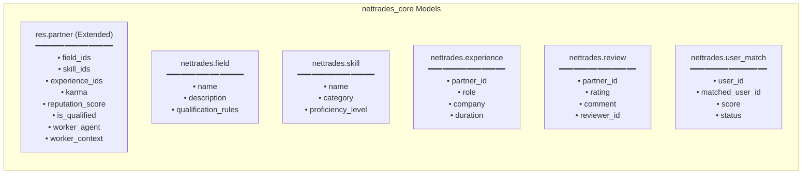

### Good Answer Models

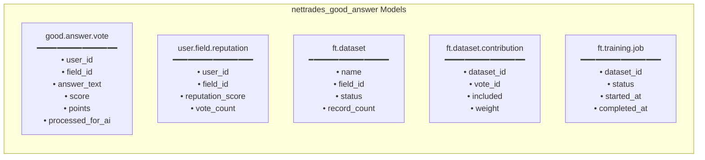

### GPU Admin Models

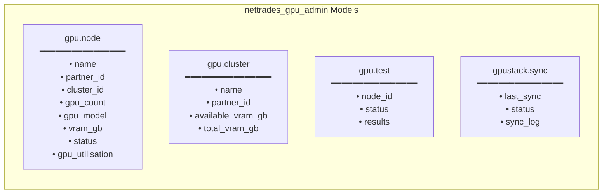

### Self-Improving System Models

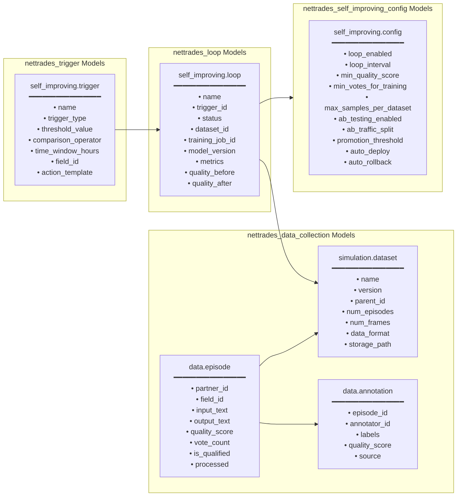

### Bridge Models

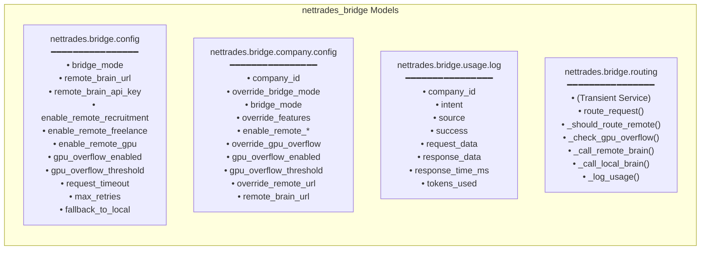

## 4. Data Flow: Self-Improving Loop

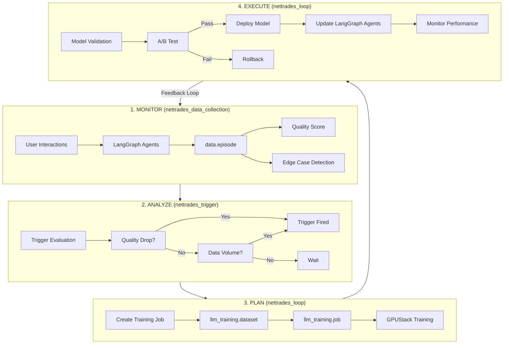

## 5. Application Services Layer

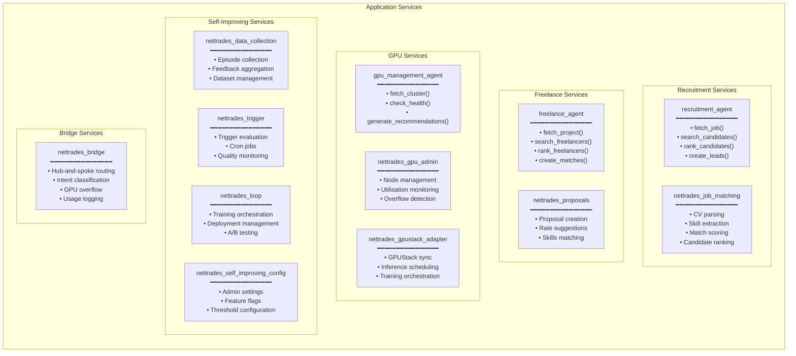

## 6. Technology Stack Summary

| Layer | Technology | Version | Purpose |
|-----------|----------|-------------|-------------|
| `Frontend` | Odoo Website | 19 CE | Business portal |
| `Mobile` | Odoo PWA | 19 CE | Mobile access |
| `Agent Orchestration` | LangGraph | Latest | Multi-agent workflows |
| `Agent Framework` | LangChain | Latest | Agent tools and memory |
| `Business Logic` | Odoo 19 CE | 19.0 | ERP, CRM, HR, Accounting |
| `Database` | PostgreSQL | 18 | Primary database |
| `Vector Storage` | pgvector | Latest | Embedding storage |
| `Cache` | Valkey | 8 | Session management |
| `Object Storage` | MinIO / S3 | Latest | File and model storage |
| `GPU Management` | GPUStack | Latest | GPU cluster management |
| `Fine-Tuning` | Unsloth / Axolotl | Latest | Model fine-tuning |
| `Inference` | vLLM / llama.cpp | Latest | LLM inference |
| `Container` | Docker / Kubernetes | Latest | Container orchestration |
| `Security` | WireGuard / gVisor | Latest | Network and sandbox |
| `LLM Providers` | OpenAI, Anthropic, Ollama | Various	LLM access |
| `LLM Integration` | Apexive odoo-llm | 19.0 | LLM modules |

## 7. Self-Improving System Data Flow (Detailed)

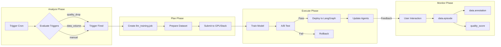

## 8. Deployment Architecture

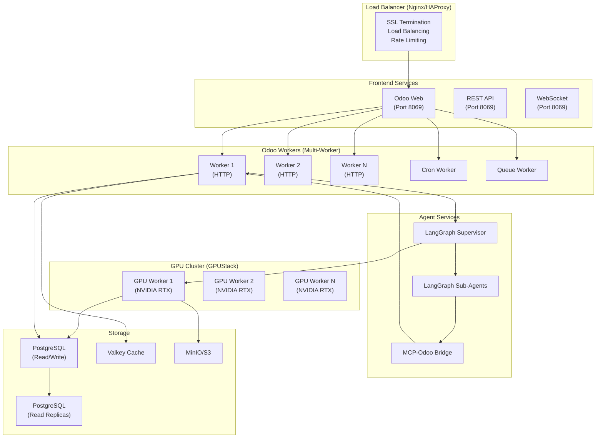

## 9. Key Integration Points

| Integration | Source | Target | Purpose |
|-----------|----------|-------------|-------------|
| `LangGraph ↔ Odoo` | LangGraph Agents | Odoo ORM | Data access via MCP-Odoo Bridge |
| `LangGraph ↔ GPUStack` | LangGraph Agents | GPUStack API | LLM inference and training |
| `Odoo ↔ GPUStack` | Odoo Modules | GPUStack API | GPU resource management |
| `Odoo ↔ PostgreSQL` | Odoo ORM | PostgreSQL | Data persistence |
| `Odoo ↔ pgvector` | Odoo ORM | pgvector | Vector embeddings |
| `LangGraph ↔ PostgreSQL` | LangGraph Checkpointer | PostgreSQL | State persistence |
| `nettrades_bridge ↔ LangGraph` | Bridge Service | Supervisor Agent | Hub-and-spoke routing |

## 10. Security Architecture

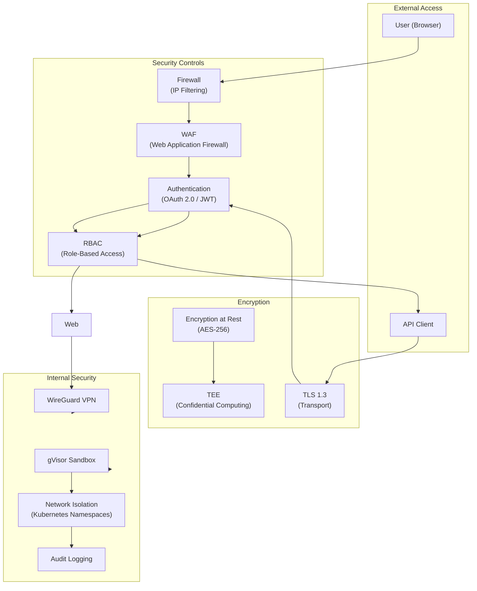

## 11. Monitoring & Observability

| Component | Monitoring Tool | Metrics |
|-----------|----------|-------------|
| `Odoo` | Odoo Logging, Prometheus | Request rate, error rate, response time |
| `LangGraph` | LangSmith, OpenTelemetry | Agent traces, step duration, success rate |
| `GPUStack` | Grafana, Prometheus | GPU utilisation, inference latency, throughput |
| `PostgreSQL` | pg_stat_statements, Prometheus | Query performance, connection count, replication lag |
| `Kubernetes` | Prometheus, Grafana | Pod status, CPU/Memory usage, network I/O |

## 12. Scaling Recommendations

| Component | Scaling Strategy | Max Instances |
|-----------|----------|-------------|
| `Odoo Workers` | Horizontal (multi-worker) | 8-12 workers |
| `LangGraph Agents` | Horizontal (Kubernetes HPA) | 5-10 pods |
| `GPUStack Workers` | Horizontal (add nodes) | 10-20 nodes |
| `PostgreSQL` | Read replicas | 2-3 replicas |
| `Valkey` | Cluster mode | 3-6 nodes |