## Architect Perspective — Class Diagram (Core Domain Models)

```mermaid
classDiagram
    %% ========================================================================
    %% Core User & Partner Models
    %% ========================================================================
    class res_partner {
        +integer id PK
        +string name
        +string email
        +boolean is_company
        +boolean is_freelancer
        +text skills_text
        +float hourly_rate
        +text portfolio_url
        +string forgejo_username
        +string github_username
        +text blog_url
        +float average_rating
        +float reputation_points
        +boolean can_charge
        +float charge_rate
        +string onboarding_step
        +string linkedin_uid
        +integer profile_completeness
        +float latitude
        +float longitude
        +datetime last_seen
        +boolean is_online
        +update_reputation()
        +get_qualified_fields()
    }

    class nettrades_field {
        +integer id PK
        +string name
        +text description
        +boolean only_qualified
        +boolean auto_karma_qualify
        +integer reputation_threshold_for_charging
        +integer base_points_per_vote
        +integer qualified_points_per_vote
        +integer qualified_professional_count
        +integer total_voter_count
        +integer suggested_qualified_weight
        +boolean auto_adjust_weights
        +boolean expert_answers_trainable
        +float indirect_reputation_points
        +boolean enable_data_juicer
        +float data_juicer_min_quality_score
        +boolean data_juicer_dedup
        +boolean data_juicer_pii_removal
        +boolean enable_deita_scoring
        +float deita_min_complexity
        +string deita_judge_model
        +boolean enable_ab_testing
        +float ab_testing_traffic_split
        +float auto_promote_threshold
        +boolean enable_grpo_training
        +integer min_votes_for_training
        +integer min_unique_voters
        +boolean enable_benchmark_evaluation
        +string finetune_provider
        +string base_model
        +jsonb hyperparameters
        +get_qualified_experts()
        +get_voting_weight()
        +compute_qualified_stats()
    }

    class user_field_reputation {
        +integer id PK
        +integer partner_id FK
        +integer field_id FK
        +integer reputation_points
        +boolean can_charge
        +datetime updated_at
        +_cron_decay_reputation()
        +_cron_auto_qualify_by_karma()
        +_cron_auto_adjust_weights()
    }

    class qualified_professional {
        +integer id PK
        +integer partner_id FK
        +integer field_id FK
        +boolean is_active
        +datetime verified_at
        +action_revoke()
        +action_reactivate()
    }

    %% ========================================================================
    %% Good Answer & Voting
    %% ========================================================================
    class good_answer_vote {
        +integer id PK
        +integer user_id FK
        +integer answer_id
        +string answer_model
        +integer answerer_id FK
        +integer field_id FK
        +integer points
        +boolean is_qualified_vote
        +boolean processed_for_ai
        +datetime created_at
        +create_vote()
        +get_total_votes()
    }

    class llm_feedback {
        +integer id PK
        +integer vote_id FK
        +float weight
        +integer field_id FK
        +text input_text
        +text output_text
        +datetime created_at
        +boolean processed
        +process_feedback()
    }

    %% ========================================================================
    %% Fine-Tuning & Datasets
    %% ========================================================================
    class ft_dataset {
        +integer id PK
        +integer field_id FK
        +string name
        +text description
        +string file_uri
        +integer record_count
        +datetime created_at
        +export_to_jsonl()
        +_run_data_juicer_pipeline()
        +_run_deita_scoring()
        +action_trigger_finetune()
    }

    class ft_dataset_contribution {
        +integer id PK
        +integer dataset_id FK
        +integer partner_id FK
        +integer answer_count
        +float indirect_reputation_earned
        +record_contribution()
    }

    class ft_training_job {
        +integer id PK
        +integer dataset_id FK
        +integer field_id FK
        +string provider
        +string base_model
        +string fine_tuned_model_id
        +string status
        +datetime started_at
        +datetime completed_at
        +jsonb hyperparameters
        +jsonb metrics
        +text error_message
        +submit_job()
        +register_model()
    }

    %% ========================================================================
    %% Expert Help (Ask Someone)
    %% ========================================================================
    class expert_session {
        +integer id PK
        +string session_id UK
        +integer requester_id FK
        +integer expert_id FK
        +integer field_id FK
        +text task_summary
        +jsonb ai_context_bundle
        +integer duration_minutes
        +float rate_per_minute
        +float total_charged
        +string escrow_id
        +string status
        +datetime started_at
        +datetime ended_at
        +integer rating_by_requester
        +integer rating_by_expert
        +string forgejo_repo_url
        +datetime created_at
        +accept_session()
        +complete_session()
        +rate_session()
    }

    class escrow_hold {
        +integer id PK
        +integer session_id FK
        +float amount
        +string currency
        +string provider
        +string provider_hold_id
        +string status
        +datetime released_at
        +hold_funds()
        +release_funds()
    }

    class ask_someone_config {
        +integer id PK
        +float distance_weight
        +float reputation_weight
        +float online_bonus
        +float available_bonus
        +integer max_distance_km
        +integer reputation_threshold
        +string geocoding_provider
        +string geocoding_api_key
        +float platform_fee_percent
        +integer default_field_id FK
        +get_matching_params()
    }

    class expert_agreement {
        +integer id PK
        +integer partner_id FK
        +string version
        +datetime signed_at
        +sign_agreement()
    }

    %% ========================================================================
    %% GPU Administration
    %% ========================================================================
    class gpu_cluster {
        +integer id PK
        +integer company_id FK
        +string name
        +string trust_mode
        +string wireguard_mesh_subnet
        +string wireguard_controller_public_key
        +string controller_endpoint
        +integer wireguard_listen_port
        +string gpustack_server_url
        +string gpustack_api_key
        +_generate_wireguard_config()
        +_generate_gpustack_token()
        +_scan_network_for_gpus()
        +_install_agent_on_host()
        +action_remove_cluster()
    }

    class gpu_cluster_subnet {
        +integer id PK
        +integer cluster_id FK
        +string subnet (CIDR)
        +contains_ip()
    }

    class gpu_node {
        +integer id PK
        +integer cluster_id FK
        +string hostname
        +string ip_address
        +string wireguard_public_key
        +string wireguard_assigned_ip
        +jsonb gpus
        +string pool
        +string container_runtime
        +string gpustack_worker_id
        +string status
        +datetime last_seen
        +float uptime_hours
        +float gpu_utilisation_pct
        +integer tokens_served
        +float token_earnings
        +float reputation_score
        +boolean attestation_passed
        +action_remove_node()
        +action_reassign_pool()
        +_cron_health_watchdog()
    }

    class gpu_sharing_schedule {
        +integer id PK
        +integer cluster_id FK
        +string day_of_week
        +float start_time
        +float end_time
        +boolean is_enabled
        +integer min_vram_free_gb
        +is_active_now()
    }

    class gpu_token_economics {
        +integer id PK
        +integer company_id FK
        +float earn_rate_per_1k_tokens
        +float minimum_payout_amount
        +string payout_schedule
        +float platform_markup_pct
        +calculate_payout()
    }

    class multimodal_config {
        +integer id PK
        +boolean enable_multimodal_inferencing
        +boolean enable_robotics_integration
        +boolean enable_iot_integration
        +boolean enable_edge_support
        +validate_requirements()
    }

    %% ========================================================================
    %% Job Matching & Recruitment
    %% ========================================================================
    class hr_job {
        +integer id PK
        +string name
        +text description
        +text required_skills
        +integer company_id FK
        +text ai_match_criteria
        +string forgejo_repo_url
        +text ai_keywords
        +action_match_candidates()
        +get_top_matches()
    }

    class hr_applicant {
        +integer id PK
        +integer job_id FK
        +integer partner_id FK
        +binary resume
        +float ai_match_score
        +text ai_analysis
        +string status
        +jsonb feedback_data
        +action_shortlist()
        +action_invite()
    }

    class candidate_match {
        +integer id PK
        +integer job_posting_id FK
        +integer candidate_id FK
        +float match_score
        +text ai_analysis_summary
        +string status
        +calculate_match()
    }

    %% ========================================================================
    %% Freelance & Projects
    %% ========================================================================
    class project_project {
        +integer id PK
        +string name
        +integer partner_id FK
        +float budget
        +text ai_project_analysis
        +string forgejo_repo_url
        +string forgejo_clone_url
        +action_create_forgejo_repo()
        +action_generate_proposal()
    }

    class project_milestone {
        +integer id PK
        +integer project_id FK
        +string name
        +float amount
        +string status
        +date due_date
        +boolean released
        +mark_complete()
        +release_payment()
    }

    class freelancer {
        +integer id PK
        +integer user_id FK
        +jsonb skills
        +string availability
        +float hourly_rate
        +match_project()
    }

    class project_match {
        +integer id PK
        +integer project_id FK
        +integer freelancer_id FK
        +float match_score
        +float suggested_rate
        +string status
        +calculate_score()
    }

    %% ========================================================================
    %% Lead Scoring & CRM
    %% ========================================================================
    class crm_lead {
        +integer id PK
        +string name
        +integer partner_id FK
        +float expected_revenue
        +string lead_source
        +text ai_match_explanation
        +jsonb ai_recommendations
        +float lead_score
        +action_convert_to_opportunity()
    }

    class lead_scoring_rule {
        +integer id PK
        +string activity_type
        +integer score_impact
        +string description
        +apply_rule()
    }

    %% ========================================================================
    %% Research & Collaboration
    %% ========================================================================
    class research_project {
        +integer id PK
        +integer project_id FK
        +string research_field
        +text expected_publication
        +float budget
        +match_researchers()
    }

    class forgejo_repo {
        +integer id PK
        +integer project_id FK
        +string repo_url
        +string clone_url
        +datetime created_at
        +sync_repo()
    }

    %% ========================================================================
    %% Notifications & Reviews
    %% ========================================================================
    class user_notification {
        +integer id PK
        +integer partner_id FK
        +string notification_type
        +string title
        +text body
        +boolean read
        +datetime created_at
        +mark_read()
    }

    class nettrades_review {
        +integer id PK
        +integer reviewer_id FK
        +integer reviewed_partner_id FK
        +integer rating
        +text comment
        +integer project_id FK
        +datetime created_at
        +update_rating()
    }

    class dispute {
        +integer id PK
        +integer session_id FK
        +integer project_id FK
        +integer raised_by FK
        +text description
        +string status
        +datetime resolved_at
        +resolve_dispute()
    }

    %% ========================================================================
    %% Relationships (Cardinalities)
    %% ========================================================================
    res_partner "1" --> "0..*" nettrades_field : qualified in (through qualified_professional)
    res_partner "1" --> "0..*" user_field_reputation : has reputation in
    nettrades_field "1" --> "0..*" user_field_reputation : tracks reputation
    res_partner "1" --> "0..*" good_answer_vote : casts
    res_partner "1" --> "0..*" good_answer_vote : receives (answerer)
    nettrades_field "1" --> "0..*" good_answer_vote : is voted on
    good_answer_vote "1" --> "0..1" llm_feedback : generates
    nettrades_field "1" --> "0..*" ft_dataset : has dataset
    ft_dataset "1" --> "0..*" ft_training_job : used in
    ft_dataset "1" --> "0..*" ft_dataset_contribution : tracks contributions
    res_partner "1" --> "0..*" ft_dataset_contribution : contributes
    res_partner "1" --> "0..*" qualified_professional : is qualified in
    nettrades_field "1" --> "0..*" qualified_professional : has experts
    res_partner "1" --> "0..*" expert_session : requests (requester)
    res_partner "1" --> "0..*" expert_session : provides (expert)
    nettrades_field "1" --> "0..*" expert_session : categorises
    expert_session "1" --> "0..1" escrow_hold : has
    res_partner "1" --> "0..*" expert_agreement : signs
    gpu_cluster "1" --> "0..*" gpu_node : contains
    gpu_cluster "1" --> "0..*" gpu_cluster_subnet : has
    gpu_cluster "1" --> "0..*" gpu_sharing_schedule : defines
    res_company "1" --> "0..*" gpu_cluster : owns
    res_company "1" --> "0..*" gpu_token_economics : configures
    hr_job "1" --> "0..*" hr_applicant : receives
    res_partner "1" --> "0..*" hr_applicant : applies
    hr_job "1" --> "0..*" candidate_match : generates
    res_partner "1" --> "0..*" candidate_match : is matched to
    project_project "1" --> "0..*" project_milestone : has
    project_project "1" --> "0..*" project_match : receives
    res_partner "1" --> "0..*" project_project : owns (as client)
    res_partner "1" --> "0..*" freelancer : extends
    res_partner "1" --> "0..*" crm_lead : belongs to
    project_project "1" --> "0..1" forgejo_repo : has
    res_partner "1" --> "0..*" nettrades_review : reviews (reviewer)
    res_partner "1" --> "0..*" nettrades_review : is reviewed (reviewee)
    project_project "1" --> "0..*" nettrades_review : is reviewed for
    expert_session "1" --> "0..1" dispute : raises dispute
    res_partner "1" --> "0..*" user_notification : receives

```

Below is the Architect Perspective — Class Diagram (Core Domain Models) for NETTRADES.AI, showing the primary Odoo models, their attributes, key methods, and relationships. This diagram is based on the actual code in odoo-modules/ and the database schema described in the documentation.

# Explanation of Key Models
# User & Professional Models

res_partner: Extended Odoo partner with fields for freelancer, skills, reputation, location, and social links. The central user entity.

nettrades_field: Professional fields (e.g., Cardiology, Python Development). Contains all configuration for qualification, voting, and fine?tuning.

user_field_reputation: Per-field reputation points for each user, with cron jobs for decay and auto-qualification.

qualified_professional: Explicitly verified experts for restricted fields (e.g., medical).

# Good Answer & Fine-Tuning

good_answer_vote: Stores user votes on answers. Points are weighted based on voter qualification.

llm_feedback: Feedback data (question + answer) extracted from votes, used for training.

ft_dataset: Collection of feedback records for a field, with export to JSONL and quality pipeline.

ft_training_job: Tracks training jobs submitted to GPUStack.

ft_dataset_contribution: Indirect reputation earned by professionals whose answers contributed to training.

# Expert Help (Ask Someone)

expert_session: Represents a live consultation session between requester and expert, with escrow and ratings.

escrow_hold: Audit trail for Stripe escrow holds.

ask_someone_config: Admin?configurable matching weights and fees.

expert_agreement: Signed legal agreement for experts.

# GPU Administration

gpu_cluster: Represents a GPU cluster (company internal or public), with WireGuard configuration and GPUStack server details.

gpu_node: Individual GPU node, with hardware inventory, WireGuard keys, pool assignment, and runtime.

gpu_sharing_schedule: Schedule for public sharing (e.g., only at night).

gpu_token_economics: Token earning/spending rates and payout schedule.

# Job Matching & Freelance

hr_job: Job posting with AI match criteria.

hr_applicant: Applicant linked to a job, with AI match score.

candidate_match: Explicit match record between job and candidate.

project_project: Project with Forgejo Git integration.

project_milestone: Milestone?based payments.

# Lead Scoring & CRM

crm_lead: Extended CRM lead with AI?generated scores and recommendations.

# Research & Collaboration

research_project: Research?specific project with matching logic.

forgejo_repo: Git repository details linked to a project.

# Notifications & Reviews

user_notification: In?app notification store.

nettrades_review: User reviews with ratings.

dispute: Dispute resolution for sessions or projects.

This class diagram provides an architect?level view of the core domain models, enabling a clear understanding of the data model, relationships, and business logic encapsulated in each entity. It is directly derived from the Odoo custom modules and the database schema described in the documentation.

---

