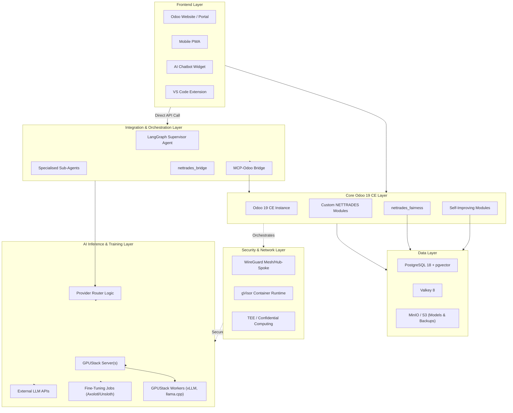
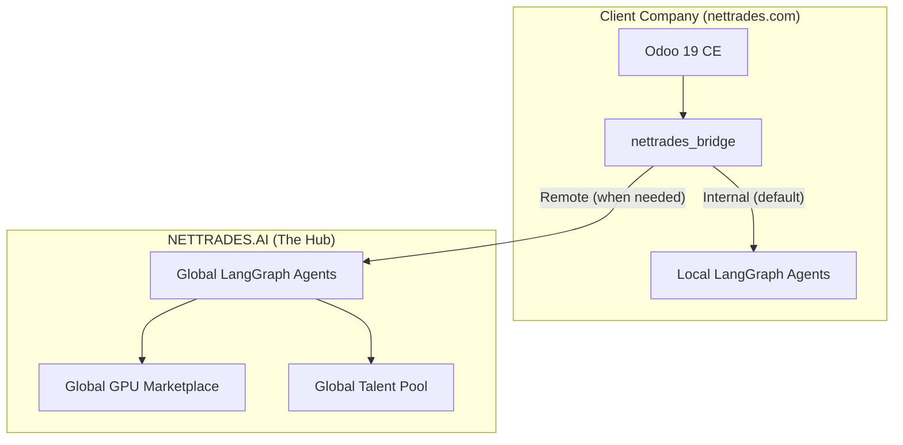
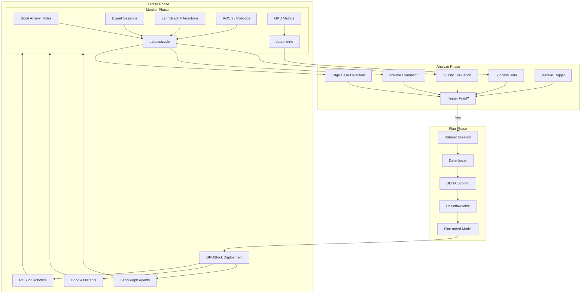
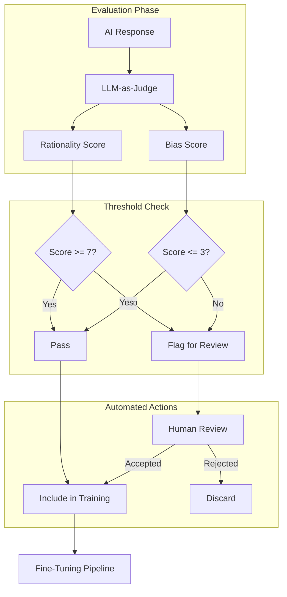

# Architecture Overview

This document provides a comprehensive overview of the NETTRADES.AI platform architecture.

---

## System Architecture Diagram

## Bridge Architecture (Hub-and-Spoke)

## Self-Improving Loop (MAPE)

## Fairness Architecture

## Component Descriptions
### 1. LangGraph Supervisor (src/core/supervisor.py)

The supervisor is the central orchestrator that classifies user intents and routes them to the correct sub-agent.

#### Key Functions:

| Function | Purpose | Status |
|----------|---------|--------|
| `build_supervisor()` | 	Constructs the complete LangGraph workflow |	? Complete |
| `classify()` | 	Classifies user intent (recruitment, freelance, lead_gen, gpu_management, medical, legal, action, vision, general) |	? Complete |
| `medical_screening()` | 	Conducts multi-round screening for medical/legal questions |	?? Needs Fix: No conditional edge to loop back |
| `route()` | 	Dispatches to the appropriate sub-agent |	? Complete |

### 2. FastAPI Application (src/core/app.py)

The FastAPI application is the main entry point for the LangGraph service.

#### Endpoints:

| Endpoint | Method | Purpose | Authentication |
|----------|---------|--------|--------|
| `/health` | 	GET |	Liveness/readiness probe | None |
| `/metrics` | 	GET |	Prometheus metrics | None |
| `/invoke` | 	POST |	Main inference endpoint	| API Key (header) |

### 3. Sub-Agents (src/core/agents/)

The sub-agents are LangGraph sub-graphs that handle specific business domains.

| Agent | Status | Location |
|----------|---------|--------|
| Recruitment Agent | ?? PLACEHOLDER | `src/agent/recruitment_agent.py` (real code) |
| Freelance Agent | ?? PLACEHOLDER | `src/agent/freelance_agent.py` (real code) |
| Lead Gen Agent | ?? PLACEHOLDER | `src/agent/lead_gen_agent.py` (real code) |
| GPU Management Agent | ?? PLACEHOLDER| `src/agent/gpu_management_agent.py` (real code) |
| Vision Agent | ?? PLACEHOLDER	| Not implemented |
| Action Agent | ?? PLACEHOLDER	| Not implemented |

### 4. Distributed GPU Agent (src/agent/agent.py)

The GPU agent runs on every GPU node in the cluster.

#### Responsibilities:

* Auto-install WireGuard

* Generate hardware-bound node ID (TPM EK or MAC hash)

* Detect GPUs via nvidia-smi

* Detect TEE capabilities

* Detect edge devices (Jetson, Raspberry Pi, Coral TPU)

* Register with Odoo

* Bring up WireGuard

* Start GPUStack worker

* Start DNS watchdog

* Periodically refresh GPUStack token

### 5. Fairness Module (odoo-modules/nettrades_fairness/)

The fairness module provides comprehensive bias detection and rationality evaluation.

#### Key Components:

| Component | Purpose |
|----------|---------|
| `nettrades.fairness.config` | Global and field-specific configuration |
| `nettrades.fairness.evaluator` | LLM-as-Judge evaluation service |
| `nettrades.fairness.audit` | Audit log for all evaluations |
| `nettrades.fairness.flag` | Human review workflow for flagged responses |
| `nettrades.fairness.metrics` | Fairness metrics calculator |

##### Configuration:
		

| Setting | Default | Description |
|----------|---------|------------|
| `rationality_evaluation_enabled` | True	Enable rationality evaluation |
| `bias_detection_enabled` | True	Enable bias detection |
| `auto_flag_for_review` | True | Auto-flag low-quality responses |
| `auto_filter_training` | True | Filter training data |
| `rationality_threshold` | 7.0 | Minimum rationality score |
| `bias_threshold` | 3.0 | Maximum bias score |
| `evaluation_model` | gpt-4o-mini | LLM judge model |

#### Technology Stack
			
| Component | Version | License | Purpose |
|----------|---------|--------|--------|
| `Odoo` | 19.0 CE` | LGPL-3.0 | 	ERP, marketplace, CRM, HR, Projects, Accounting |
| `PostgreSQL + pgvector` | 18.1 (via CNPG) | PostgreSQL License | Business data, vector embeddings, LangGraph checkpoints |
| `Valkey` | 	8-alpine | BSD-3-Clause | Session storage, ORM cache, bus notifications |
| `LangGraph` | ?1.2.0 | MIT | 	Multi-agent orchestration, durable execution |
| `LangGraph Checkpoint Postgres` | ?3.0.3 | MIT | Durable checkpoint storage in PostgreSQL |
| `GPUStack` | v2.1.2 | Apache-2.0 | GPU cluster manager, inference engine, token metering |
| `llama.cpp` | server-cpu/server-cuda | MIT | 	CPU inference fallback |
| `Unsloth (core)` | 2026.5.2 | Apache-2.0 | Single-GPU fine-tuning |
| `Axolotl` | 0.16.1+ | Apache-2.0 | Multi-GPU fine-tuning with FSDP2 |
| `WireGuard` | kernel module | GPL-2.0 | Kernel-level network isolation |
| `gVisor` | release-20260420.0 | Apache-2.0 | 	Syscall-level container isolation |

### Next Steps

[Building LangGraph Agents](building-agents.md)

[Building Odoo Modules](building-odoo-modules.md)

[API Reference](api-reference.md)

[Roadmap](roadmap.md)
