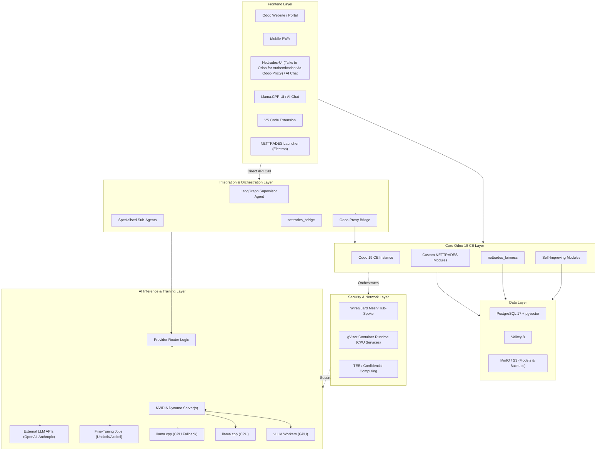
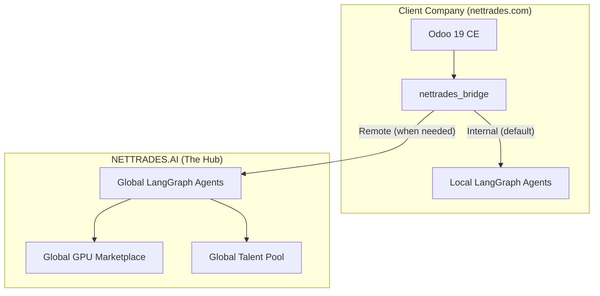
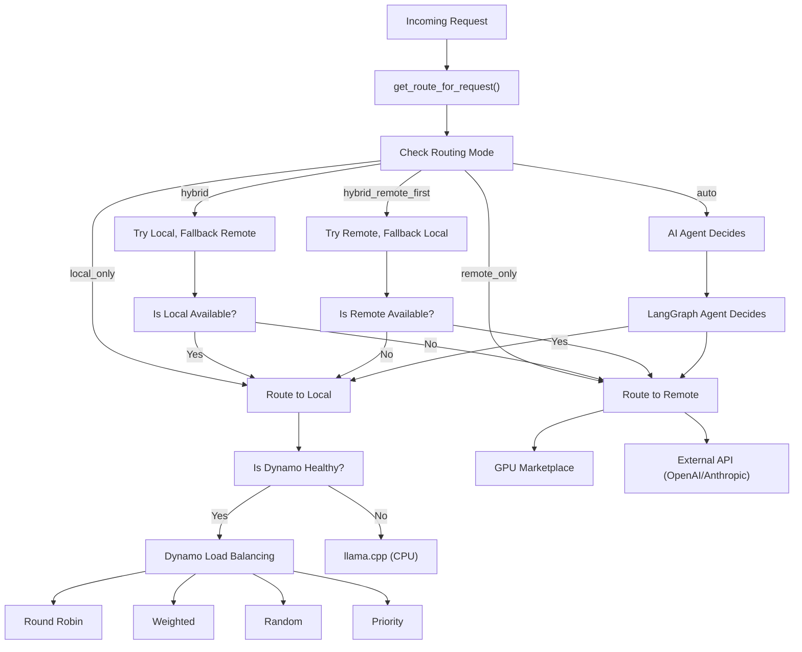
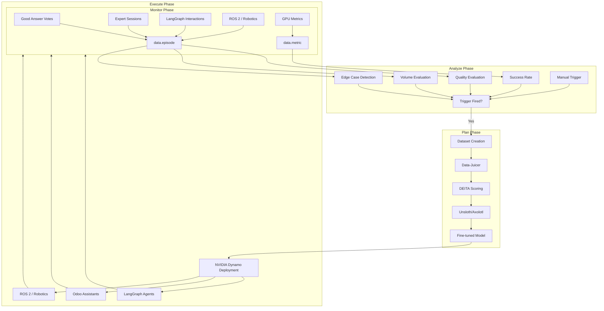
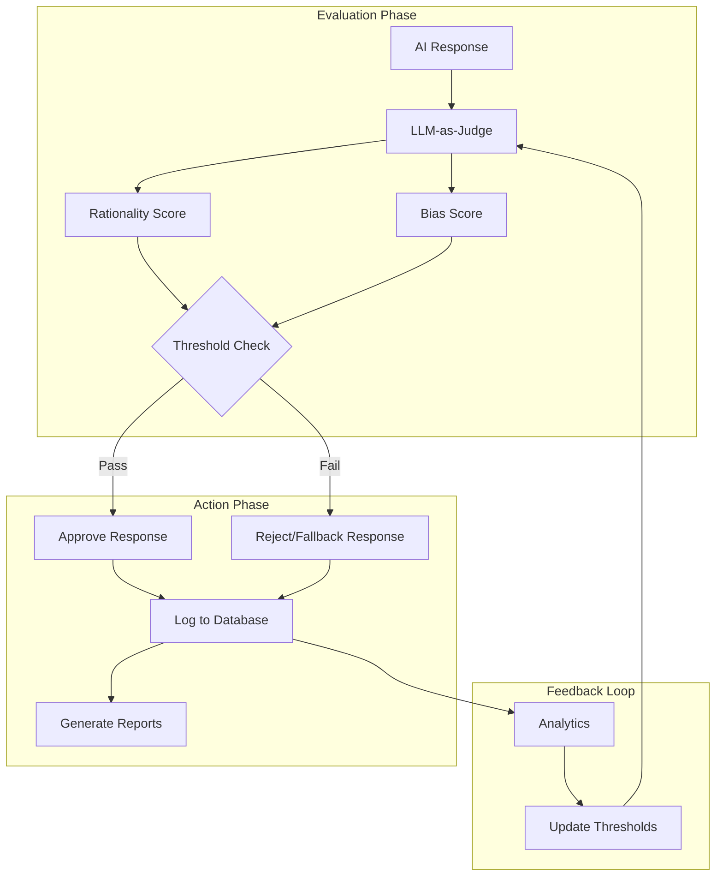
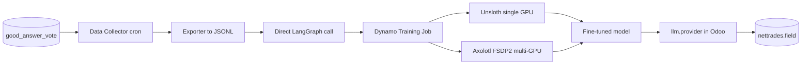
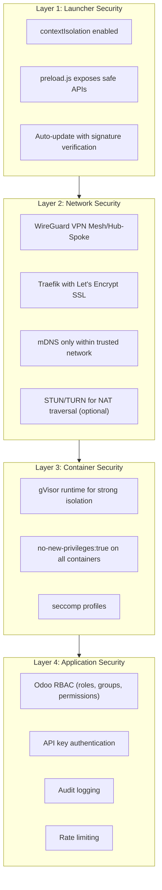

# Architecture Overview

This document provides a comprehensive overview of the NETTRADES.AI platform architecture.

---

## System Architecture Diagram

## Bridge Architecture (Hub-and-Spoke)

## Routing Decision Engine

The bridge module (`nettrades_bridge`) provides a configurable routing engine:

## Self-Improving Loop (MAPE)

## Fairness Architecture

## Good Answer -> Fine-Tuning Loop

## Inference Architecture

The platform uses a layered inference architecture with automatic fallback:

| Priority | Backend | Description |
|---------|-------------|---------|
| 1 | 	**NVIDIA Dynamo with vLLM** | Production-grade distributed inference, GPU-accelerated |
| 2 | 	**NVIDIA Dynamo (CPU mode)** | Runs on CPU when GPU unavailable |
| 3 | 	**NVIDIA Dynamo with llama.cpp** | Production-grade distributed inference, CPU-accelerated |
| 4 | 	**llama.cpp** | Zero-dependency CPU fallback, runs on port 8080 |

## Security Architecture

## Technology Stack

		
| Component | Version | Purpose |
|---------|-------------|---------|
| **Odoo** | 19.0 CE | ERP, marketplace, CRM, HR, Projects, Accounting |
| **PostgreSQL + pgvector** | 17 | Business data, vector embeddings, LangGraph checkpoints |
| **Valkey** | 8 | Session storage, ORM cache, bus notifications |
| **LangGraph** | >=1.2.0 | Multi-agent orchestration, durable execution |
| **NVIDIA Dynamo** | 1.2.1 | Distributed inference engine with vLLM and llama.cpp |
| **vLLM** | Latest | GPU-accelerated inference |
| **llama.cpp** | Latest | CPU inference fallback |
| **Traefik** | v3.6.13 | Reverse proxy with Let's Encrypt SSL |
| **WireGuard** | kernel | VPN mesh for secure node-to-node communication |
| **gVisor** | Latest | Container isolation for CPU services |
| **Prometheus** | Latest | Metrics collection and monitoring |
| **Grafana** | Latest | Visualisation and dashboards |
| **mDNS/Avahi** | Latest | Automatic node discovery on local networks |

## Security Architecture

| Layer | Technology | Purpose |
|---------|-------------|---------|
| **Launcher Security** | contextIsolation, preload.js | Secure IPC, auto-update with verification |
| **Network Security** | WireGuard, Traefik (Let's Encrypt), mDNS | VPN mesh, SSL, trusted network discovery |
| **Container Security** | gVisor (CPU services), no-new-privileges, seccomp | Strong isolation, reduced attack surface |
| **Application Security** | Odoo RBAC, API keys, audit logging | Access control, authentication, compliance |

## Component Descriptions

### 1. LangGraph Supervisor (src/core/supervisor.py)

The supervisor is the central orchestrator that classifies user intents and routes them to the correct sub-agent.

#### Key Functions:

| Function | Purpose |
|----------|---------|
| `build_supervisor()` | 	Constructs the complete LangGraph workflow |
| `classify()` | 	Classifies user intent (recruitment, freelance, lead_gen, gpu_management, medical, legal, action, vision, general) |
| `medical_screening()` | 	Conducts multi-round screening for medical/legal questions |
| `route()` | 	Dispatches to the appropriate sub-agent |

### 2. FastAPI Application (src/core/app.py)

The FastAPI application is the main entry point for the LangGraph service.

#### Endpoints:

| Endpoint | Method | Purpose | Authentication |
|----------|---------|--------|--------|
| `/health` | 	GET |	liveness probe for container orchestration | None |
| `/metrics` | 	GET |	Prometheus metrics endpoint | None |
| `/invoke` | 	POST |	Main inference endpoint	| API Key (header) (authenticated)|
| `/assistants` |  |		list available assistants (for agent-chat-ui) |	 |
| `/threads` | 	 |	create a new conversation thread (for agent-chat-ui) |	 |
| `/threads/{thread_id}/state` |  |		get thread state (for agent-chat-ui) |	 |
| `/threads/{thread_id}/runs` |  |		run a thread (for agent-chat-ui) |	 |
| `/runs   ` | 	 |	create a new run and return assistant response |	 |

### 3. Sub-Agents (src/core/agents/)

The sub-agents are LangGraph sub-graphs that handle specific business domains.

| Agent | Location |
|----------|--------|
| Action Agent |  `src/core/agents/action_agent.py` |
| Ask Someone Agent |  `src/core/agents/ask_someone_agent.py` |
| Freelance Agent | `src/agent/freelance_agent.py` |
| Good Answer Agent |  `src/core/agents/good_answer_agent.py` |
| GPU Management Agent | `src/core/agents/gpu_management_agent.py` |
| GPU Marketplace Agent | `src/core/agents/gpu_marketplace_agent.py` |
| Inference Tools Agent |  `src/core/agents/inference_tools.py` |
| Lead Gen Agent | `src/agent/lead_gen_agent.py` |
| Recruitment Agent | `src/agent/recruitment_agent.py` |
| Vision Agent |  `src/core/agents/` |

### 4. Distributed GPU Agent (src/agent/gpu_agent.py)

The GPU agent runs on every GPU node in the cluster.

#### Responsibilities:

* Auto-install WireGuard

* Generate hardware-bound node ID (TPM EK or MAC hash)

* Detect GPUs via nvidia-smi

* Detect TEE capabilities

* Detect edge devices (Jetson, Raspberry Pi, Coral TPU)

* Register with Odoo

* Bring up WireGuard

* Start NVIDIA Dynamo worker

* Start DNS watchdog

* Periodically refresh NVIDIA Dynamo token

### 5. Fairness Module (odoo-modules/nettrades_fairness/)

The fairness module provides comprehensive bias detection and rationality evaluation.

#### Key Components:

| Component | Purpose |
|----------|---------|
| `nettrades.fairness.config` | Global and field-specific configuration |
| `nettrades.fairness.evaluator` | LLM-as-Judge evaluation service |
| `nettrades.fairness.audit` | Audit log for all evaluations |
| `nettrades.fairness.flag` | Human review workflow for flagged responses |
| `nettrades.fairness.metrics` | Fairness metrics calculator |

##### Configuration:
		

| Setting | Default | Description |
|----------|---------|------------|
| `rationality_evaluation_enabled` | True	Enable rationality evaluation |
| `bias_detection_enabled` | True	Enable bias detection |
| `auto_flag_for_review` | True | Auto-flag low-quality responses |
| `auto_filter_training` | True | Filter training data |
| `rationality_threshold` | 7.0 | Minimum rationality score |
| `bias_threshold` | 3.0 | Maximum bias score |
| `evaluation_model` | gpt-4o-mini | LLM judge model |

#### Technology Stack
			
| Component | Version | License | Purpose |
|----------|---------|--------|--------|
| `Odoo` | 19.0 CE` | LGPL-3.0 | 	ERP, marketplace, CRM, HR, Projects, Accounting |
| `PostgreSQL + pgvector` | 18.1 (via CNPG) | PostgreSQL License | Business data, vector embeddings, LangGraph checkpoints |
| `Valkey` | 	8-alpine | BSD-3-Clause | Session storage, ORM cache, bus notifications |
| `LangGraph` | ?1.2.0 | MIT | 	Multi-agent orchestration, durable execution |
| `LangGraph Checkpoint Postgres` | ?3.0.3 | MIT | Durable checkpoint storage in PostgreSQL |
| `NVIDIA Dynamo` | 1.3.1 | Apache-2.0 | GPU manager, inference engine |
| `llama.cpp` | server-cpu/server-cuda | MIT | 	CPU inference fallback |
| `Unsloth (core)` | 2026.5.2 | Apache-2.0 | Single-GPU fine-tuning |
| `Axolotl` | 0.16.1+ | Apache-2.0 | Multi-GPU fine-tuning with FSDP2 |
| `WireGuard` | kernel module | GPL-2.0 | Kernel-level network isolation |
| `gVisor` | release-20260420.0 | Apache-2.0 | 	Syscall-level container isolation |

### Next Steps

[Building LangGraph Agents](building-agents.md)

[Building Odoo Modules](building-odoo-modules.md)

[API Reference](api-reference.md)

[Roadmap](roadmap.md)

[NVIDIA Dynamo Integration](nvidia-dynamo-integration.md) – Dynamo integration guide

[Bridge Architecture](bridge-architecture.md) – Understanding the bridge

[Building Agents](building-agents.md) – Create custom LangGraph agents

[API Reference](api-reference.md) – API documentation

[Troubleshooting](troubleshooting.md) – Common issues and solutions