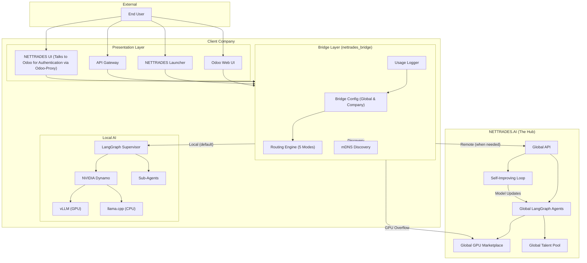
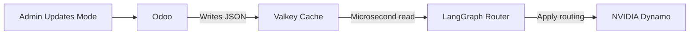

## Bridge Architecture

The `nettrades_bridge` module is the core of the NETTRADES Sovereign AI Router. It provides configurable routing between local and remote AI infrastructure.

### Overview

### Routing Modes

The bridge supports five routing modes, configurable per company:

Mode	Description	Use Case
Local Only	All requests stay on local infrastructure	Sovereign AI – full data sovereignty
Remote Only	All requests go to external providers	Testing, no local GPUs available
Hybrid (Local First)	Try local, fallback to remote if unavailable	High availability, maximise local usage
Hybrid (Remote First)	Try remote, fallback to local if unavailable	Cost optimisation, use external when cheaper
Auto	AI agent decides based on context	Dynamic routing based on workload
Load Balancing Strategies

The bridge provides load balancing for NVIDIA Dynamo nodes:

Strategy	Description	Use Case
Round Robin	Distributes requests evenly across healthy nodes	Simple, even distribution
Weighted	Distributes based on node weight	Prioritise faster nodes
Random	Random distribution	Simple, no state tracking
Priority	Highest priority node first	Primary/backup configuration

### Health Checking

The bridge continuously monitors the health of all routes:

* Health check endpoint: /health (configurable)

* Interval: 30s (configurable)

* Timeout: 5s (configurable)

* Status: healthy, unhealthy, unknown

### mDNS Discovery

The bridge uses mDNS/Avahi for automatic node discovery:

Field	Description
version	Platform version
gpus	Number of available GPUs
models	Number of available models
capabilities	JSON of capabilities

### External API Integration

The bridge can route requests to external APIs:
Provider	API URL	Model Format
OpenAI	https://api.openai.com/v1	gpt-4, gpt-3.5-turbo
Anthropic	https://api.anthropic.com/v1	claude-3-opus, claude-3-sonnet
Custom	User-defined	User-defined
API Endpoints
Endpoint	Method	Description
/api/bridge/route/decide	POST	Get a route decision for a request
/api/bridge/config	GET	Get effective configuration
/api/bridge/usage	GET	Get usage logs
/api/bridge/discovery/peers	GET	Get discovered mDNS peers
/api/bridge/discovery/status	GET	Get discovery service status

## Valkey as Configuration Cache

The bridge routing engine reads operational mode settings from Valkey cache:

