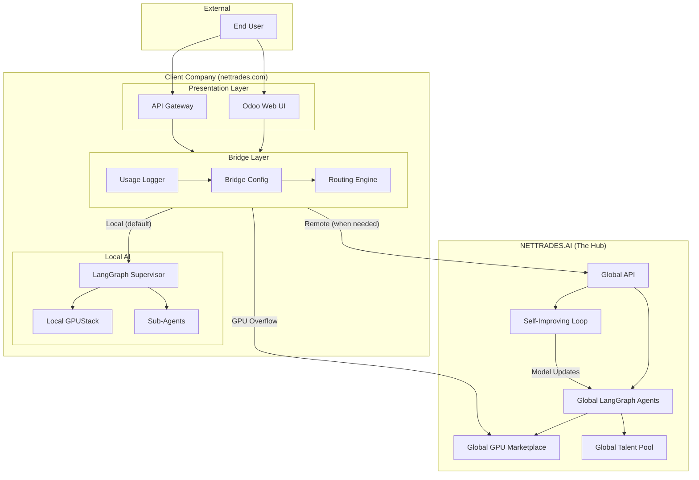

## Bridge Architecture

```mermaid
graph TB
    subgraph External["External"]
        User["End User"]
    end

    subgraph Client["Client Company (nettrades.com)"]
        subgraph Presentation["Presentation Layer"]
            WebUI["Odoo Web UI"]
            API["API Gateway"]
        end

        subgraph Bridge["Bridge Layer"]
            Config["Bridge Config"]
            Router["Routing Engine"]
            Logger["Usage Logger"]
        end

        subgraph Local["Local AI"]
            LangGraph["LangGraph Supervisor"]
            GPUStack["Local GPUStack"]
            Agents["Sub-Agents"]
        end
    end

    subgraph Cloud["NETTRADES.AI (The Hub)"]
        GlobalAPI["Global API"]
        GlobalAgents["Global LangGraph Agents"]
        GlobalGPU["Global GPU Marketplace"]
        TalentPool["Global Talent Pool"]
        SelfImproving["Self-Improving Loop"]
    end

    User --> WebUI
    User --> API
    WebUI --> Bridge
    API --> Bridge

    Bridge -->|"Local (default)"| LangGraph
    Bridge -->|"Remote (when needed)"| GlobalAPI
    Bridge -->|"GPU Overflow"| GlobalGPU

    LangGraph --> GPUStack
    LangGraph --> Agents

    GlobalAPI --> GlobalAgents
    GlobalAgents --> TalentPool
    GlobalAgents --> GlobalGPU
    GlobalAPI --> SelfImproving
    SelfImproving -->|"Model Updates"| GlobalAgents

    Logger --> Config
    Config --> Router
```