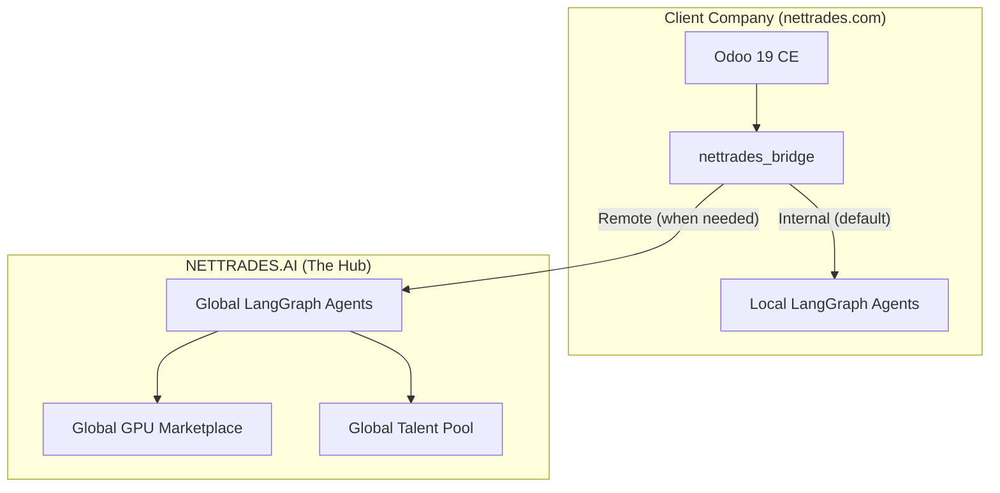

# NETTRADES Bridge Module – Hub-and-Spoke Routing

## Overview

The `nettrades_bridge` module is the central "switchboard" for the NETTRADES platform. It enables the **hub-and-spoke architecture** where client companies run `nettrades.com` software locally while seamlessly calling `NETTRADES.AI` for external services.

## Architecture


    
## Configuration

### Global Configuration (Singleton)

Navigate to `Settings → Technical → Bridge → Global Configuration`.

| Setting | Description | Default |
|-----------|----------|-------------|	
| `bridge_mode` | local, remote, or hybrid | local |
| `remote_brain_url` | URL of the remote brain | https://api.nettrades.ai |
| `remote_brain_api_key` | API key for authentication | (required) |
| `enable_remote_recruitment` | Route recruitment queries remotely | False |
| `enable_remote_freelance` | Route freelance queries remotely | False |
| `enable_remote_gpu` | Route GPU queries remotely | False |
| `enable_remote_vision` | Route vision queries remotely | False |
| `enable_remote_action` | Route action queries remotely | False |
| `gpu_overflow_enabled` | Enable GPU overflow routing | False |
| `gpu_overflow_threshold` | GPU utilisation threshold (%) | 80.0 |
| `request_timeout` | Remote request timeout (seconds) | 30 |
| `max_retries` | Maximum retry attempts | 3 |
| `retry_delay` | Initial retry delay (seconds) | 1 |
| `fallback_to_local` | Fallback to local on remote failure | True |

### Company-Specific Configuration

Navigate to `Settings → Technical → Bridge → Company Configuration`.

Each company can override global settings:

* `Bridge Mode Override:` Use company-specific mode

* `Feature Flags Override:` Enable/disable remote routing per intent

* `GPU Overflow Override:` Customise overflow threshold

* `Remote Connection Override:` Use company-specific URL and API key

## API Endpoints

| Endpoint | Method | Description |
|-----------|----------|-------------|		
| `/api/bridge/health` | GET | Health check |
| `/api/bridge/route` | POST | Route a request |
| `/api/bridge/config` | GET | Get effective configuration |
| `/api/bridge/usage` | GET | Get usage logs |

### Route Request Example

```json

POST /api/bridge/route
{
    "intent": "recruitment",
    "data": {
        "query": "Find me a Python developer",
        "context": {}
    },
    "company_id": 1
}

```

### Response

```json

{
    "status": "success",
    "data": {
        "source": "remote",
        "intent": "recruitment",
        "analysis": "I found 5 candidates...",
        "rankings": [...]
    }
}
```

### Integration with LangGraph

The bridge intercepts requests before they reach the LangGraph supervisor. The `src/core/supervisor.py` file includes a `_call_bridge` method that checks the bridge configuration before routing locally.

## Database Tables

| Table | Description |
|-------|-------------|
| `nettrades_bridge_config` | Global configuration (singleton) |
| `nettrades_bridge_company_config` | Per-company overrides |
| `nettrades_bridge_usage_log` | Usage logs for billing |
| `nettrades_bridge_route` | Route definitions with load balancing |
| `nettrades_bridge_discovery` | mDNS discovered peers |

## Security

* API keys are required for all bridge requests, API keys are stored encrypted (`password=True` in Odoo fields)

* Access controlled via `group_bridge_admin` and `group_bridge_user`

* Company isolation ensures data separation

* Audit logging for all routing decisions. Usage logs track all requests for audit purposes

* gVisor isolation for untrusted workloads

## Next Steps

[Self-Improving AI System](self-improving.md)

[Architecture Overview](architecture.md)