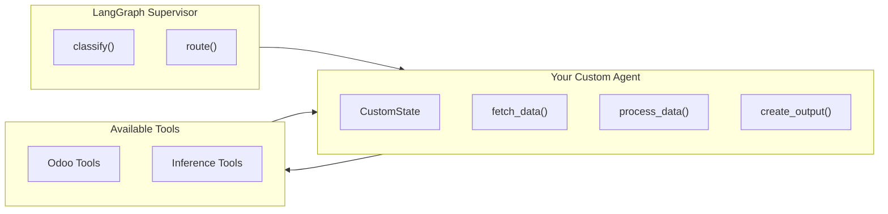

# Building LangGraph Agents

This guide explains how to create new LangGraph sub-agents for the NETTRADES.AI platform. Agents are specialised AI workflows that handle specific business domains.

## Overview

LangGraph agents are self-contained workflows that:

Receive input from the supervisor (user messages, state data)

Process data using LLMs and Odoo tools

Return structured results back to the supervisor

Agents are ideal for tasks like:

Analysing CVs and matching candidates to jobs

Matching freelancers to projects

Generating and scoring leads

Managing GPU clusters

Analysing images with VLM

Planning robotic actions

## Where Agents Live

All agents live in src/core/agents/:

text

src/core/agents/

├── __init__.py

├── recruitment_agent.py      # CV / job matching

├── freelance_agent.py        # Project ↔ freelancer matching

├── lead_gen_agent.py         # Lead scoring & creation

├── gpu_management_agent.py   # GPU cluster health & scaling

├── vision_agent.py           # Multi-modal VLM agent

├── action_agent.py           # VLA agent for robotic control

└── custom_agent.py           # Your new agent goes here

## Agent Architecture Diagram



## Step 1: Create the Agent File

Create a new file src/core/agents/custom_agent.py:
``` python

# -*- coding: utf-8 -*-
# =============================================================================
# Custom Agent – Description of what this agent does.
# Example: "Analyses customer feedback and creates support tickets"
# =============================================================================
import json
import logging
from typing import Dict, Any, List, Optional

from langgraph.graph import StateGraph, END, START
from langchain_openai import ChatOpenAI

# Import tools
from ..tools.inference_tools import get_inference_backend
from ..tools.odoo_tools import (
    res_partner_search,
    crm_lead_create,
    crm_lead_search,
    hr_job_search,
)

# Set up logging
_logger = logging.getLogger(__name__)

# =============================================================================
# 1. Define the State
# =============================================================================

class CustomState(dict):
    """
    State carried through the custom workflow.

    Keys:
        - input: The user's original request
        - data: Fetched data from Odoo
        - result: Processed result from LLM
        - error: Any error that occurred
        - output: Final output to return
    """
    pass


# =============================================================================
# 2. Define Node Functions
# =============================================================================

async def fetch_data(state: CustomState) -> CustomState:
    """
    Fetch required data from Odoo.

    This node:
    1. Extracts search parameters from the state
    2. Queries Odoo for relevant records
    3. Stores results in the state
    """
    _logger.info("Fetching data from Odoo...")

    try:
        # Example: fetch freelancers
        # You can customise this to fetch any data you need
        results = await res_partner_search([
            ("user_type", "=", "freelancer"),
            ("is_active", "=", True),
            ("skills_text", "!=", False)
        ])

        # Store the data in the state
        state["data"] = results
        state["data_count"] = len(results)

        _logger.info(f"Found {len(results)} freelancers")

    except Exception as e:
        _logger.error(f"Error fetching data: {e}")
        state["error"] = str(e)
        state["data"] = []

    return state


async def process_data(state: CustomState) -> CustomState:
    """
    Process the data using an LLM.

    This node:
    1. Gets the inference backend (GPUStack/vLLM/llama.cpp)
    2. Constructs a prompt with the data
    3. Sends it to the LLM
    4. Parses and stores the result
    """
    _logger.info("Processing data with LLM...")

    try:
        # Get the inference backend
        backend = get_inference_backend()
        llm = ChatOpenAI(
            base_url=backend["base_url"],
            api_key=backend["api_key"],
            model=backend["model_name"],
            temperature=0.1,
        )

        # Construct the prompt
        data = state.get("data", [])
        if not data:
            state["result"] = "No data found to process."
            return state

        prompt = f"""
        You are a data analyst. Analyse the following data and provide insights.

        Data: {json.dumps(data[:10], indent=2)}  # Limit to first 10 for brevity

        Provide a summary analysis including:
        1. Key patterns or trends
        2. Any notable anomalies
        3. Recommended actions

        Format your response as structured text.
        """

        # Send to LLM
        response = await llm.ainvoke(prompt)
        state["result"] = response.content

        _logger.info(f"LLM processing complete: {len(response.content)} chars")

    except Exception as e:
        _logger.error(f"Error processing data: {e}")
        state["error"] = str(e)
        state["result"] = "An error occurred during processing."

    return state


async def create_output(state: CustomState) -> CustomState:
    """
    Create output in Odoo.

    This node:
    1. Takes the processed result
    2. Creates a CRM lead or other record
    3. Updates the state with the created record
    """
    _logger.info("Creating output in Odoo...")

    try:
        result = state.get("result", "")

        if not result or len(result) < 10:
            state["output"] = {"status": "skipped", "reason": "No meaningful result"}
            return state

        # Create a CRM lead with the result
        lead_data = {
            "name": f"Custom Agent Result: {result[:50]}...",
            "description": result,
            "type": "lead",
        }

        # Add a partner if we have one
        data = state.get("data", [])
        if data and len(data) > 0:
            lead_data["partner_id"] = data[0].get("id")

        created = await crm_lead_create(lead_data)

        state["output"] = {
            "status": "created",
            "lead_id": created.get("id"),
            "lead_name": created.get("name"),
        }

        _logger.info(f"Created lead: {created.get('id')}")

    except Exception as e:
        _logger.error(f"Error creating output: {e}")
        state["error"] = str(e)
        state["output"] = {"status": "failed", "error": str(e)}

    return state


# =============================================================================
# 3. Build the Graph
# =============================================================================

def create_custom_agent() -> StateGraph:
    """
    Build and return a compiled custom sub-graph.

    Returns:
        StateGraph: Compiled LangGraph workflow
    """
    # Create the workflow
    workflow = StateGraph(CustomState)

    # Add nodes
    workflow.add_node("fetch_data", fetch_data)
    workflow.add_node("process_data", process_data)
    workflow.add_node("create_output", create_output)

    # Define edges
    workflow.add_edge(START, "fetch_data")
    workflow.add_edge("fetch_data", "process_data")
    workflow.add_edge("process_data", "create_output")
    workflow.add_edge("create_output", END)

    # Return the compiled graph
    return workflow.compile()
```

## Step 2: Register with the Supervisor

In src/core/supervisor.py, you need to:

Import your agent

Create an instance

Add routing logic

### 2.1 Import the Agent
```python

# In src/core/supervisor.py
from .agents.custom_agent import create_custom_agent
```

### 2.2 Create the Agent Instance
python

def build_supervisor():
    # ... existing code ...

    # Create sub-agents
    recruitment_agent = create_recruitment_agent()
    freelance_agent = create_freelance_agent()
    lead_gen_agent = create_lead_gen_agent()
    gpu_management_agent = create_gpu_management_agent()
    vision_agent = create_vision_agent()
    action_agent = create_action_agent()
    custom_agent = create_custom_agent()  # <-- Add this line

    # ... rest of build_supervisor ...

### 2.3 Add Routing Logic

In the route() function:
python

async def route(state: dict) -> dict:
    """
    Route the request to the appropriate agent based on intent.
    """
    intent = state.get("intent", "general")

    # ... existing routing logic ...

    elif "custom" in intent or "analysis" in intent:
        result = await custom_agent.ainvoke(state)

    # ... rest of routing ...

    return result

### 2.4 Update Intent Classification

In the classify() function, update the prompt to include your new intent:
python

async def classify(state: dict) -> dict:
    """
    Classify user intent.
    """
    user_msg = state.get("messages", [])[-1].get("content", "")

    prompt = (
        f"Classify the intent of the following message into one of: "
        f"recruitment, freelance, lead_gen, gpu_management, medical, legal, "
        f"action, vision, custom, general. "  # <-- Add 'custom'
        f"Message: {user_msg}"
    )

    # ... rest of classify ...

## Step 3: Using Odoo Tools

The odoo_tools.py module provides async functions for interacting with Odoo.

### 3.1 Available Tools
Function	Purpose	Parameters
res_partner_search(domain)	Search partners	Domain list
res_partner_read(ids, fields)	Read partner data	List of IDs, fields
crm_lead_search(domain)	Search CRM leads	Domain list
crm_lead_create(values)	Create a CRM lead	Dict of values
crm_lead_update(id, values)	Update a CRM lead	ID, dict of values
hr_job_search(domain)	Search job postings	Domain list
hr_job_create(values)	Create a job posting	Dict of values
hr_applicant_search(domain)	Search applicants	Domain list
hr_applicant_create(values)	Create an applicant	Dict of values
project_search(domain)	Search projects	Domain list
project_create(values)	Create a project	Dict of values
gpu_cluster_search(domain)	Search GPU clusters	Domain list
gpu_node_search(domain)	Search GPU nodes	Domain list
gpu_node_write(id, values)	Update a GPU node	ID, dict of values

### 3.2 Domain List Format

Domains are lists of triples: [field, operator, value]
Operator	Description	Example
=	Equal	["user_type", "=", "freelancer"]
!=	Not equal	["is_active", "!=", False]
>	Greater than	["reputation_points", ">", 100]
<	Less than	["hourly_rate", "<", 50]
>=	Greater or equal	["experience_years", ">=", 5]
<=	Less or equal	["rating", "<=", 4]
ilike	Case-insensitive contains	["name", "ilike", "python"]
like	Case-sensitive contains	["skills", "like", "Django"]
in	In list	["status", "in", ["draft", "active"]]
not in	Not in list	["status", "not in", ["closed", "archived"]]
3.3 Example: Searching for Freelancers
python

# Search for active freelancers with Python skills
freelancers = await res_partner_search([
    ("user_type", "=", "freelancer"),
    ("is_active", "=", True),
    ("skills_text", "ilike", "python")
])

### 3.4 Example: Creating a CRM Lead
python

lead = await crm_lead_create({
    "name": "New Lead from AI Agent",
    "description": "Automatically generated by the custom agent",
    "partner_id": partner_id,
    "type": "lead",
    "stage_id": 1,  # New stage
})

## Step 4: Using Inference Tools

The inference_tools.py module auto-detects the best inference backend.

### 4.1 Auto-Detection Priority
Priority	Backend	Environment Variable
1	GPUStack	GPUSTACK_SERVER_URL
2	vLLM	VLLM_BASE_URL
3	llama.cpp (fallback)	LLM_BASE_URL


### 4.2 Usage Example
```python

from ..tools.inference_tools import get_inference_backend

backend = get_inference_backend()
llm = ChatOpenAI(
    base_url=backend["base_url"],
    api_key=backend["api_key"],
    model=backend["model_name"],
    temperature=0.1,
)

response = await llm.ainvoke("Hello, how are you?")
```
Step 5: Error Handling

Always include error handling in your agent nodes.

### 5.1 Try/Except Pattern
python

async def process_data(state: CustomState) -> CustomState:
    try:
        # Your processing logic
        result = await llm.ainvoke(prompt)
        state["result"] = result.content
    except Exception as e:
        _logger.error(f"Error in process_data: {e}")
        state["error"] = str(e)
        state["result"] = f"An error occurred: {e}"
    return state

### 5.2 Logging

Use the module-level logger:
python

_logger = logging.getLogger(__name__)

def my_function():
    _logger.info("Starting processing...")
    _logger.debug(f"State: {state}")
    _logger.error(f"Error occurred: {e}")

## Step 6: Testing Your Agent

### 6.1 Unit Test Template

Create tests/test_custom_agent.py:
python

import pytest
from src.core.agents.custom_agent import create_custom_agent

@pytest.mark.asyncio
async def test_custom_agent():
    # Create the agent
    agent = create_custom_agent()

    # Create a test state
    state = {
        "input": "Test input",
        "data": [{"id": 1, "name": "Test User"}],
    }

    # Invoke the agent
    result = await agent.ainvoke(state)

    # Assertions
    assert "result" in result
    assert "error" not in result
    assert result["output"]["status"] == "created"

### 6.2 Manual Testing with curl
bash

curl -X POST http://localhost:8000/invoke \
  -H "Content-Type: application/json" \
  -H "X-API-Key: your-api-key" \
  -d '{
    "input": {
      "messages": [
        {"role": "user", "content": "Run custom analysis"}
      ]
    },
    "config": {
      "configurable": {
        "thread_id": "test-123"
      }
    }
  }'

## Step 7: Debugging Tips

### 7.1 Enable Debug Logging
python

import logging
logging.basicConfig(level=logging.DEBUG)
_logger = logging.getLogger(__name__)

### 7.2 Use LangSmith (if available)
python

import os
os.environ["LANGCHAIN_TRACING_V2"] = "true"
os.environ["LANGCHAIN_PROJECT"] = "nettrades-agent"

### 7.3 Print State in Nodes
python

async def my_node(state: CustomState) -> CustomState:
    _logger.debug(f"State before processing: {state}")
    # ... processing ...
    _logger.debug(f"State after processing: {state}")
    return state

Best Practices
1. Keep Agents Focused

One agent per business domain:

    ✅ Good: "Recruitment Agent" (handles CVs and job matching)

    ❌ Bad: "Everything Agent" (handles recruitment, leads, GPUs, and more)

2. Use Async Functions

All agent nodes should be async:
python

async def my_node(state: CustomState) -> CustomState:
    # ... async operations ...
    return state

3. Handle Errors Gracefully

Never let an agent crash the supervisor:
python

async def my_node(state: CustomState) -> CustomState:
    try:
        # Risky operation
        result = await risky_operation()
    except Exception as e:
        state["error"] = str(e)
        state["result"] = "Fallback result"
    return state

4. Log Extensively

Use _logger for debugging:
python

_logger.info("Node started")
_logger.debug(f"State: {state}")
_logger.error(f"Error: {e}")

5. Use Type Hints

Type hints improve maintainability:
python

async def my_node(state: CustomState) -> CustomState:
    # ... implementation ...
    return state

6. Write Docstrings

Document what each node does:
python

async def my_node(state: CustomState) -> CustomState:
    """
    Fetches data from Odoo and stores it in the state.

    This node:
    1. Extracts search parameters from the state
    2. Queries Odoo for relevant records
    3. Stores results in the state
    """
    pass

Complete Agent Template

Here's a complete template you can copy and modify:
```python

# -*- coding: utf-8 -*-
# =============================================================================
# {Agent Name} – {Description}
# =============================================================================
import json
import logging
from typing import Dict, Any, List, Optional

from langgraph.graph import StateGraph, END, START
from langchain_openai import ChatOpenAI

from ..tools.inference_tools import get_inference_backend
from ..tools.odoo_tools import (
    res_partner_search,
    crm_lead_create,
    crm_lead_search,
)

_logger = logging.getLogger(__name__)


class {AgentName}State(dict):
    """State for the {AgentName} agent."""
    pass


async def fetch_data(state: {AgentName}State) -> {AgentName}State:
    """Fetch data from Odoo."""
    _logger.info("Fetching data...")
    try:
        # TODO: Implement data fetching
        state["data"] = []
    except Exception as e:
        state["error"] = str(e)
    return state


async def process_data(state: {AgentName}State) -> {AgentName}State:
    """Process data with LLM."""
    _logger.info("Processing data...")
    try:
        backend = get_inference_backend()
        llm = ChatOpenAI(
            base_url=backend["base_url"],
            api_key=backend["api_key"],
            model=backend["model_name"],
            temperature=0.1,
        )
        # TODO: Implement LLM processing
        state["result"] = "Processed result"
    except Exception as e:
        state["error"] = str(e)
    return state


async def create_output(state: {AgentName}State) -> {AgentName}State:
    """Create output in Odoo."""
    _logger.info("Creating output...")
    try:
        # TODO: Implement output creation
        state["output"] = {"status": "created"}
    except Exception as e:
        state["error"] = str(e)
    return state


def create_{agent_name}_agent() -> StateGraph:
    """Build and return the {AgentName} agent."""
    workflow = StateGraph({AgentName}State)
    workflow.add_node("fetch_data", fetch_data)
    workflow.add_node("process_data", process_data)
    workflow.add_node("create_output", create_output)
    workflow.add_edge(START, "fetch_data")
    workflow.add_edge("fetch_data", "process_data")
    workflow.add_edge("process_data", "create_output")
    workflow.add_edge("create_output", END)
    return workflow.compile()
```

## Quick Reference

Task	Command / File
Create agent file	src/core/agents/custom_agent.py
Import agent	from .agents.custom_agent import create_custom_agent
Register with supervisor	src/core/supervisor.py
Update intent classification	src/core/supervisor.py (classify function)
Run tests	pytest tests/
Manual test	curl -X POST http://localhost:8000/invoke ...


