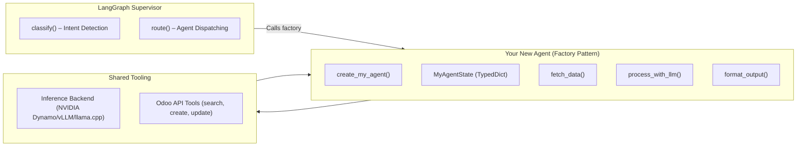

# Building LangGraph Agents

This guide explains how to create new LangGraph sub-agents for the NETTRADES.AI platform. Agents are specialised AI workflows that handle specific business domains or operational tasks.

> **Note**: The platform uses a **factory pattern** for agent instantiation. Agents are defined as graph-building functions (e.g., `create_recruitment_agent()`) rather than pre-compiled graph constants, allowing for dynamic configuration and testing.

## Overview

LangGraph agents are self-contained workflows that:

- **Receive input** from the supervisor (user messages, conversation state).
- **Process data** using LLMs (via the unified inference backend) and Odoo API tools.
- **Return structured results** back to the supervisor for final response formatting.

Agents are ideal for tasks like:

- Analysing CVs and matching candidates to job descriptions.
- Matching freelancers to project requirements.
- Generating and scoring sales leads.
- Managing GPU cluster health and auto-scaling.
- Analysing images with multi-modal VLMs.
- Planning robotic actions via VLA.
- Finding internal experts or answering specific domain queries.

## Fairness & Quality Integration

All agents automatically benefit from the platform's fairness and quality evaluation layer:

1.  Agent outputs are evaluated for rationality, bias, and factual consistency.
2.  Low-quality responses are filtered from the fine-tuning dataset.
3.  Flagged responses are routed for human-in-the-loop review.

To ensure your agent performs well with these evaluations:

- Use diverse, representative data during testing.
- Structure your output clearly (prefer JSON or well-formatted text).
- Avoid over-confident or unsubstantiated claims in your system prompts.

## Where Agents Live

All domain agents are stored in `src/core/agents/`:

```
src/core/agents/
??? init.py
??? recruitment_agent.py # CV / job matching
??? freelance_agent.py # Project ? freelancer matching
??? lead_gen_agent.py # Lead scoring & creation
??? gpu_management_agent.py # GPU cluster health & scaling
??? vision_agent.py # Multi-modal VLM agent
??? action_agent.py # VLA agent for robotic control
??? ask_someone_agent.py # Internal expert matching
??? good_answer_agent.py # Response quality scoring
??? gpu_marketplace_agent.py # GPU booking and marketplace

```


**Important**: There is no generic `custom_agent.py` in the repository. You will create a new file (e.g., `my_new_agent.py`) following the template below.

## Agent Architecture Diagram




## Step-by-Step: Creating a New Agent

### Step 1: Create the Agent File

Create a new Python file in src/core/agents/, for example my_new_agent.py.

```python

# -*- coding: utf-8 -*-
# =============================================================================
# my_new_agent.py – Description of your agent's purpose.
# Example: "Analyses customer support tickets and suggests priority levels."
# =============================================================================

import json
import logging
from typing import TypedDict, List, Dict, Any, Optional

from langgraph.graph import StateGraph, END, START
from langgraph.graph.state import CompiledStateGraph

# Correct import path for the unified inference backend
from tools import get_inference_backend

# Correct import path for Odoo tools (available via the tools package)
from tools.odoo_tools import (
    res_partner_search,
    crm_lead_create,
    crm_lead_search,
    hr_job_search,
)

_logger = logging.getLogger(__name__)

# =============================================================================
# 1. Define the State using TypedDict (matching the codebase style)
# =============================================================================

class MyAgentState(TypedDict):
    """State carried through the custom workflow."""
    input: Optional[str]                      # Original user request
    search_params: Optional[Dict[str, Any]]   # Parameters for Odoo queries
    data: Optional[List[Dict[str, Any]]]      # Fetched data from Odoo
    llm_result: Optional[Dict[str, Any]]      # Processed result from LLM
    error: Optional[str]                      # Error message, if any
    output: Optional[Dict[str, Any]]          # Final structured output

# =============================================================================
# 2. Define Node Functions
# =============================================================================

async def fetch_data(state: MyAgentState) -> Dict[str, Any]:
    """Fetch required data from Odoo based on search_params."""
    try:
        params = state.get("search_params", {})
        # Example: Fetch partners matching the criteria
        partners = await res_partner_search(params)
        # Update the state with the fetched data
        state["data"] = partners
        state["error"] = None
    except Exception as e:
        _logger.error(f"fetch_data error: {e}", exc_info=True)
        state["error"] = str(e)
        state["data"] = []
    return state

async def process_with_llm(state: MyAgentState) -> Dict[str, Any]:
    """Process the fetched data using the LLM inference backend."""
    if state.get("error"):
        return state

    try:
        # Get the inference backend (handles Dynamo, vLLM, or llama.cpp fallback)
        backend = get_inference_backend()

        # Prepare the conversation/messages for the LLM
        messages = [
            {"role": "system", "content": "You are a helpful assistant specialised in this domain."},
            {"role": "user", "content": json.dumps(state.get("data", []))}
        ]

        # Invoke the backend (this is async)
        result = await backend.ainvoke(messages)  # or backend.invoke() for sync
        state["llm_result"] = result
        state["error"] = None
    except Exception as e:
        _logger.error(f"process_with_llm error: {e}", exc_info=True)
        state["error"] = str(e)
        state["llm_result"] = None
    return state

async def format_output(state: MyAgentState) -> Dict[str, Any]:
    """Format the final output and optionally create Odoo records."""
    if state.get("error"):
        state["output"] = {"error": state["error"]}
        return state

    try:
        # Structure the output for the supervisor to consume
        output = {
            "status": "success",
            "summary": "Processed successfully.",
            "data": state.get("llm_result", {}),
            # Add any Odoo record creation logic here if needed
        }
        state["output"] = output
        state["error"] = None
    except Exception as e:
        _logger.error(f"format_output error: {e}", exc_info=True)
        state["output"] = {"error": str(e)}
    return state

# =============================================================================
# 3. Build the Graph (Factory Pattern)
# =============================================================================

def create_my_new_agent() -> CompiledStateGraph:
    """
    Factory function that builds and returns the compiled agent graph.
    This matches the pattern used in recruitment_agent.py, freelance_agent.py, etc.
    """
    # Instantiate the StateGraph with the TypedDict type
    builder = StateGraph(MyAgentState)

    # Add nodes
    builder.add_node("fetch_data", fetch_data)
    builder.add_node("process_with_llm", process_with_llm)
    builder.add_node("format_output", format_output)

    # Add edges (define the execution flow)
    builder.add_edge(START, "fetch_data")
    builder.add_edge("fetch_data", "process_with_llm")
    builder.add_edge("process_with_llm", "format_output")
    builder.add_edge("format_output", END)

    # Compile and return the graph
    return builder.compile()

```

### Step 2: Register the Agent in the Supervisor

Update src/core/supervisor.py to import the factory function and route to your new agent.

```python

# In supervisor.py (add to the top section)

# Import your factory function
from .agents.my_new_agent import create_my_new_agent

# --- Inside the Supervisor class or routing function ---

# 1. Instantiate your agent (factory pattern)
# Place this alongside the other agent instantiations, e.g., in __init__ or a setup function.
self.agent_map = {
    "recruitment": create_recruitment_agent(),
    "freelance": create_freelance_agent(),
    "lead_gen": create_lead_gen_agent(),
    "ask_someone": create_ask_someone_agent(),
    "good_answer": create_good_answer_agent(),
    "gpu_marketplace": create_gpu_marketplace_agent(),
    # Add your new agent here
    "my_new_intent": create_my_new_agent(),
}

# 2. Update the routing logic to dispatch to the correct agent
async def route_to_agent(self, state: SupervisorState) -> SupervisorState:
    intent = state.get("intent", "general")
    agent = self.agent_map.get(intent)

    if agent:
        # Invoke the specific agent
        result = await agent.ainvoke(state)
        state["agent_output"] = result
    else:
        # Fallback to the general LLM for unknown intents
        state["agent_output"] = await self.general_llm_handler(state)
    return state

```


### Step 3: Update Intent Classification

The `classify()` function in `supervisor.py` uses an LLM to determine the user's intent. Update the classification prompt to include your new intent, e.g., `my_new_intent`.

```python

# In supervisor.py - classify() function

classification_prompt = f"""
Classify the user's intent into one of these categories:
- "general": General chat or questions.
- "recruitment": Matching CVs to job descriptions.
- "freelance": Matching freelancers to projects.
- "ask_someone": Looking for an internal expert.
- "good_answer": Checking response quality.
- "gpu_marketplace": Booking or managing GPU resources.
- "my_new_intent": Description of what your new agent does.
...
User message: {user_message}
Return only the intent category string.
"""

```

### Step 4: Testing Your Agent

You can test your agent locally by invoking the LangGraph server endpoint. Ensure your .env file has the correct LANGGRAPH_API_KEY and OPENAI_API_KEY (or Dynamo endpoint) configured.

```bash

curl -X POST http://localhost:8000/invoke \
  -H "Content-Type: application/json" \
  -H "X-API-Key: your-langgraph-api-key" \
  -d '{
    "input": {
        "messages": [
            {"role": "user", "content": "Your test message here"}
        ]
    },
    "config": {
        "configurable": {
            "thread_id": "test-thread-001"
        }
    }
}'

```

Check the agent's logs in logs/nettrades.log to debug any issues during execution.