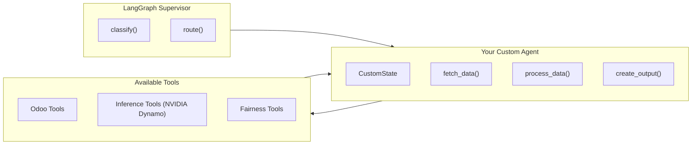

# Building LangGraph Agents

This guide explains how to create new LangGraph sub-agents for the NETTRADES.AI platform. Agents are specialised AI workflows that handle specific business domains.

## Overview

LangGraph agents are self-contained workflows that:

- **Receive input** from the supervisor (user messages, state data)
- **Process data** using LLMs and Odoo tools
- **Return structured results** back to the supervisor

Agents are ideal for tasks like:

- Analysing CVs and matching candidates to jobs
- Matching freelancers to projects
- Generating and scoring leads
- Managing GPU clusters
- Analysing images with VLM
- Planning robotic actions

## Fairness Integration in Agents

When building agents, you should consider fairness and bias detection:

1. **The agent's responses will be automatically evaluated** for rationality and bias by the fairness module.
2. **Low-quality responses are filtered** from training data.
3. **Responses that fail thresholds are flagged** for human review.

To ensure your agent produces high-quality, unbiased responses:

- **Use diverse training data** – Ensure your training data represents diverse populations.
- **Test with fairness metrics** – Use `nettrades.fairness.metrics` to test your agent.
- **Monitor flags** – Check `nettrades.fairness.flag` for responses flagged for review.

## Where Agents Live

All agents live in `src/core/agents/`:

src/core/agents/
├── init.py
├── recruitment_agent.py # CV / job matching
├── freelance_agent.py # Project ↔ freelancer matching
├── lead_gen_agent.py # Lead scoring & creation
├── gpu_management_agent.py # GPU cluster health & scaling
├── vision_agent.py # Multi-modal VLM agent
├── action_agent.py # VLA agent for robotic control
├── ask_someone_agent.py # Expert matching
├── good_answer_agent.py # Quality scoring
└── custom_agent.py # Your new agent goes here


## Agent Architecture Diagram



## Step 1: Create the Agent File

Create a new file src/core/agents/custom_agent.py:

```python

# -*- coding: utf-8 -*-
# =============================================================================
# Custom Agent – Description of what this agent does.
# Example: "Analyses customer feedback and creates support tickets"
# =============================================================================

import json
import logging
from typing import Dict, Any, List, Optional
from langgraph.graph import StateGraph, END, START
from langchain_openai import ChatOpenAI

# Import tools
from ..tools.inference_tools import get_inference_backend
from ..tools.odoo_tools import (
    res_partner_search,
    crm_lead_create,
    crm_lead_search,
    hr_job_search,
)

_logger = logging.getLogger(__name__)

# =============================================================================
# 1. Define the State
# =============================================================================

class CustomState(dict):
    """State carried through the custom workflow.
    Keys:
    - input: The user's original request
    - data: Fetched data from Odoo
    - result: Processed result from LLM
    - error: Any error that occurred
    - output: Final output to return
    """
    pass

# =============================================================================
# 2. Define Node Functions
# =============================================================================

async def fetch_data(state: CustomState) -> CustomState:
    """Fetch required data from Odoo.
    This node:
    1. Extracts search parameters from the state
    2. Queries Odoo for relevant data
    3. Stores results in state['data']
    """
    try:
        # Example: Search for partners
        params = state.get('search_params', {})
        partners = await res_partner_search(params)
        state['data'] = partners
        state['error'] = None
    except Exception as e:
        _logger.error(f"fetch_data error: {e}")
        state['error'] = str(e)
        state['data'] = []
    return state

async def process_with_llm(state: CustomState) -> CustomState:
    """Process data using LLM inference via NVIDIA Dynamo."""
    if state.get('error'):
        return state

    try:
        # Get the inference backend (Dynamo, vLLM, or llama.cpp)
        backend = get_inference_backend()

        # Prepare messages
        messages = [
            {"role": "system", "content": "You are a helpful assistant."},
            {"role": "user", "content": json.dumps(state.get('data', []))}
        ]

        # Call the inference backend
        result = await backend.invoke(messages)
        state['result'] = result
        state['error'] = None
    except Exception as e:
        _logger.error(f"process_with_llm error: {e}")
        state['error'] = str(e)
        state['result'] = None
    return state

async def create_output(state: CustomState) -> CustomState:
    """Create the final output.
    This node:
    1. Formats the result for the user
    2. Optionally creates records in Odoo
    3. Sets state['output']
    """
    if state.get('error'):
        state['output'] = f"Error: {state['error']}"
        return state

    try:
        # Format output
        output = {
            "result": state.get('result', {}),
            "summary": "Processed successfully"
        }
        state['output'] = output
        state['error'] = None
    except Exception as e:
        _logger.error(f"create_output error: {e}")
        state['output'] = f"Error: {e}"
    return state

# =============================================================================
# 3. Build the Graph
# =============================================================================

def build_custom_agent() -> StateGraph:
    """Build and return the custom agent graph."""
    builder = StateGraph(CustomState)

    # Add nodes
    builder.add_node("fetch_data", fetch_data)
    builder.add_node("process_with_llm", process_with_llm)
    builder.add_node("create_output", create_output)

    # Add edges
    builder.add_edge(START, "fetch_data")
    builder.add_edge("fetch_data", "process_with_llm")
    builder.add_edge("process_with_llm", "create_output")
    builder.add_edge("create_output", END)

    # Compile the graph
    return builder.compile()

# =============================================================================
# 4. Export
# =============================================================================

CUSTOM_AGENT = build_custom_agent()

```


## Step 2: Register the Agent in the Supervisor

Update `src/core/supervisor.py` to route to your new agent:

```python

# In supervisor.py

# Import your agent
from .agents.custom_agent import CUSTOM_AGENT

# Update the route function
async def route(state: SupervisorState) -> SupervisorState:
    intent = state.get('intent', 'general')

    if intent == 'custom':
        # Route to your custom agent
        result = await CUSTOM_AGENT.ainvoke(state)
        state['output'] = result
    elif intent == 'recruitment':
        # Route to recruitment agent
        # ...
    else:
        # Fallback to general LLM
        # ...

    return state

## Step 3: Update Intent Classification

Update the classify node to recognise the new intent:

```python

# In supervisor.py

async def classify(state: SupervisorState) -> SupervisorState:
    messages = state.get('messages', [])
    user_message = messages[-1]['content'] if messages else ''

    # Use LLM to classify intent
    intent = await classify_intent(user_message)

    # Check for custom intent
    if "custom" in user_message.lower():
        intent = 'custom'

    state['intent'] = intent
    return state

```

## Testing Your Agent

```bash

# Test the agent locally
curl -X POST http://localhost:8000/invoke \
  -H "Content-Type: application/json" \
  -H "X-API-Key: your-langgraph-api-key" \
  -d '{
    "input": {
        "messages": [
            {"role": "user", "content": "Custom request"}
        ]
    },
    "config": {
        "configurable": {
            "thread_id": "test-custom-123"
        }
    }
}'

```