## Business Solution Architecture Diagram

```mermaid
flowchart TB
    subgraph Access["🌐 Access & Presentation Layer"]
        direction TB
        WebUI["Web UI (Odoo Website / Portal)<br>━━━━━━━━━━━━━━━━<br>• Company / Freelancer / Job Seeker Portals<br>• Project & Job Boards<br>• eCommerce / Marketplace<br>• AI Chatbot Widget"]
        PWA["Mobile PWA<br>━━━━━━━━━━━━━━━━<br>• Progressive Web App<br>• Offline Capabilities<br>• Push Notifications"]
        API["External API Gateway<br>━━━━━━━━━━━━━━━━<br>• Odoo JSON-RPC API<br>• LangGraph /invoke Endpoint<br>• VS Code Extension Support<br>• MCP-Odoo Bridge"]
    end

    subgraph Orchestration["🧠 AI Orchestration Layer (LangGraph)"]
        direction TB
        
        subgraph Supervisor["Supervisor Agent (src/core/supervisor.py)"]
            Classify["classify Node<br>━━━━━━━━━━━━━━━━<br>• Intent Classification<br>• LLM-based Routing<br>• Extracts User Message"]
            MedicalScreening["medical_screening Node<br>━━━━━━━━━━━━━━━━<br>• Clinical/Legal Screening<br>• MAX_FOLLOWUP_ROUNDS=3<br>• Asks Clarifying Questions"]
            Route["route Node<br>━━━━━━━━━━━━━━━━<br>• Intent-based Dispatcher<br>• Routes to Sub-Agents<br>• Fallback to General LLM"]
        end

        subgraph SubAgents["Business Sub-Agents (src/core/agents/)"]
            RecruitmentAgent["Recruitment Agent<br>━━━━━━━━━━━━━━━━<br>• CV Analysis & Parsing<br>• Job-Candidate Matching<br>• Candidate Shortlisting"]
            FreelanceAgent["Freelance Agent<br>━━━━━━━━━━━━━━━━<br>• Project-Freelancer Matching<br>• Skills & Availability Check<br>• Rate Suggestions"]
            LeadGenAgent["Lead Gen Agent<br>━━━━━━━━━━━━━━━━<br>• Lead Generation from Jobs<br>• Quality Scoring & Ranking<br>• Automated CRM Creation"]
            GPUManagementAgent["GPU Management Agent<br>━━━━━━━━━━━━━━━━<br>• GPU Cluster Health<br>• Node Lifecycle Management<br>• Pool Assignment"]
            VisionAgent["Vision Agent<br>━━━━━━━━━━━━━━━━<br>• Multi-modal VLM Analysis<br>• Image + Text Processing<br>• GPUStack VLM Integration"]
            ActionAgent["Action Agent<br>━━━━━━━━━━━━━━━━<br>• Robotic Action Planning<br>• ROS 2 / MCP Dispatch<br>• VLA Model Integration"]
            GeneralLLM["General LLM Fallback<br>━━━━━━━━━━━━━━━━<br>• Direct Chat Completion<br>• Generic Queries"]
        end

        Checkpointer["PostgresSaver Checkpointer<br>━━━━━━━━━━━━━━━━<br>• Durable State Snapshots<br>• Crash Recovery<br>• Workflow Resumption"]
    end

    subgraph BusinessLogic["🏢 Business Logic Layer (Odoo 19 CE)"]
        direction TB
        
        subgraph CoreModules["Core Modules (odoo-modules/)"]
            nettrades_core["nettrades_core<br>━━━━━━━━━━━━━━━━<br>• Professional Field Config<br>• Qualification Rules<br>• Voting Weights<br>• Karma Management"]
            nettrades_good_answer["nettrades_good_answer<br>━━━━━━━━━━━━━━━━<br>• Good Answer Voting<br>• Reputation Management<br>• Fine-Tuning Dataset<br>• Data-Juicer & DEITA"]
            nettrades_gpu_admin["nettrades_gpu_admin<br>━━━━━━━━━━━━━━━━<br>• GPU Cluster Dashboard<br>• Node Registry<br>• Pool Assignment<br>• Token Economics"]
            nettrades_gpustack_adapter["nettrades_gpustack_adapter<br>━━━━━━━━━━━━━━━━<br>• GPUStack API Bridge<br>• Worker Sync<br>• Token Usage Sync"]
            nettrades_ask_someone["nettrades_ask_someone<br>━━━━━━━━━━━━━━━━<br>• Expert Marketplace<br>• Stripe Escrow<br>• Live Sessions"]
            nettrades_job_matching["nettrades_job_matching<br>━━━━━━━━━━━━━━━━<br>• Job Search & Matching<br>• One-Click Apply<br>• Conversational Search"]
            nettrades_proposals["nettrades_proposals<br>━━━━━━━━━━━━━━━━<br>• Freelancer Proposals<br>• Milestone Payments<br>• Project Management"]
            nettrades_lead_scoring["nettrades_lead_scoring<br>━━━━━━━━━━━━━━━━<br>• Lead Generation<br>• AI Scoring<br>• CRM Integration"]
            nettrades_chatbot["nettrades_chatbot<br>━━━━━━━━━━━━━━━━<br>• AI Chatbot Widget<br>• Ask Someone Integration<br>• Session Management"]
            nettrades_notifications["nettrades_notifications<br>━━━━━━━━━━━━━━━━<br>• In-App Notifications<br>• Reviews & Disputes<br>• Activity Tracking"]
            nettrades_pwa["nettrades_pwa<br>━━━━━━━━━━━━━━━━<br>• PWA Manifest<br>• Service Worker<br>• Offline Caching"]
        end

        subgraph ThirdParty["Third-Party Modules (third-party/)"]
            OdooCore["Odoo 19 CE Core<br>━━━━━━━━━━━━━━━━<br>• CRM, Sales, Project<br>• HR, Accounting<br>• Website, eCommerce"]
            OdooLLM["Apexive LLM Modules<br>━━━━━━━━━━━━━━━━<br>• llm, llm_pgvector<br>• llm_knowledge<br>• llm_assistant<br>• llm_training"]
            Marketplace["website_sale_marketplace<br>━━━━━━━━━━━━━━━━<br>• Multi-vendor Marketplace"]
            QueueJob["queue_job (OCA)<br>━━━━━━━━━━━━━━━━<br>• Background Job Processing"]
            PaymentStripe["payment_stripe<br>━━━━━━━━━━━━━━━━<br>• Stripe Payment Acquirer"]
        end

        MCPBridge["MCP-Odoo Bridge<br>━━━━━━━━━━━━━━━━<br>• Model Context Protocol<br>• AI-to-Odoo Function Calling<br>• CRUD Operations on Odoo Models"]
    end

    subgraph Data["💾 Data & Persistence Layer"]
        direction TB
        PostgreSQL["PostgreSQL 18 + pgvector<br>━━━━━━━━━━━━━━━━<br>• Odoo Transactional Data<br>• Vector Embeddings (RAG)<br>• LangGraph Checkpoints<br>• Full-Text Search"]
        Valkey["Valkey 8 (Redis-compatible)<br>━━━━━━━━━━━━━━━━<br>• Session Storage<br>• ORM Cache<br>• Bus Notifications (Pub/Sub)<br>• Rate Limiting"]
        Longhorn["Longhorn Distributed Storage<br>━━━━━━━━━━━━━━━━<br>• Odoo Filestore (CVs, Images)<br>• Fine-Tuning Datasets (JSONL)<br>• Model Weights (GGUF/Safetensors)<br>• Data-Juicer Artifacts"]
    end

    subgraph Infrastructure["⚙️ Infrastructure & Security Layer"]
        direction TB
        
        subgraph Compute["Compute & Orchestration"]
            K8s["Kubernetes (Talos 1.13.2)<br>━━━━━━━━━━━━━━━━<br>• Container Orchestration<br>• Immutable OS<br>• Horizontal Pod Autoscaling"]
            ArgoCD["Argo CD (GitOps)<br>━━━━━━━━━━━━━━━━<br>• Declarative Manifests<br>• Auto-Sync from Git<br>• Rollback Capabilities"]
        end

        subgraph Networking["Networking & Security"]
            Traefik["Traefik v3.6<br>━━━━━━━━━━━━━━━━<br>• Reverse Proxy<br>• Let's Encrypt TLS<br>• Path-based Routing"]
            WireGuard["WireGuard VPN<br>━━━━━━━━━━━━━━━━<br>• Kernel-level Network Isolation<br>• Hub-and-Spoke / Mesh Topology<br>• AllowedIPs Enforcement"]
            gVisor["gVisor Sandbox<br>━━━━━━━━━━━━━━━━<br>• Syscall-level Container Isolation<br>• Public GPU Worker Pools<br>• Container Escape Prevention"]
            RBAC["RBAC & Policy Engine<br>━━━━━━━━━━━━━━━━<br>• Odoo Security Groups<br>• Cilium Network Policies<br>• OAuth Authentication"]
        end

        subgraph Monitoring["Monitoring & Observability"]
            Prometheus["Prometheus<br>━━━━━━━━━━━━━━━━<br>• Metrics Collection<br>• Alerting Rules"]
            Grafana["Grafana<br>━━━━━━━━━━━━━━━━<br>• Dashboards<br>• Visualization"]
        end
    end

    subgraph GPU["🖥️ Distributed GPU Infrastructure"]
        direction TB
        
        subgraph GPUStack["GPUStack Manager"]
            GPUStackServer["GPUStack Server<br>━━━━━━━━━━━━━━━━<br>• Inference Engine<br>• Token Metering<br>• Worker Pool Management"]
            GPUNode1["GPU Node 1<br>(GPU Agent)"]
            GPUNode2["GPU Node 2<br>(GPU Agent)"]
            GPUNodeN["GPU Node N<br>(GPU Agent)"]
        end

        subgraph GPUPools["GPU Pools"]
            InternalPool["Internal Pool (Trusted)<br>━━━━━━━━━━━━━━━━<br>• Docker Runtime<br>• Multi-GPU vLLM<br>• Axolotl FSDP2<br>• Company LAN / WireGuard Mesh"]
            PublicPool["Public Pool (Untrusted)<br>━━━━━━━━━━━━━━━━<br>• gVisor Runtime<br>• Single-GPU Quantised<br>• Hub-and-Spoke WireGuard<br>• Hourly Attestation"]
        end

        GPUStackServer --> GPUNode1 & GPUNode2 & GPUNodeN
        GPUNode1 --> PublicPool
        GPUNode2 --> InternalPool
    end

    subgraph External["🔗 External Integrations"]
        Stripe["Stripe API<br>━━━━━━━━━━━━━━━━<br>• Payment Processing<br>• Escrow for Consultations<br>• Webhook Callbacks"]
        LLMProviders["External LLM Providers<br>━━━━━━━━━━━━━━━━<br>• OpenAI / Anthropic (Fallback)<br>• Used when GPUStack unavailable"]
        GitProviders["Forgejo Git<br>━━━━━━━━━━━━━━━━<br>• Self-hosted Git<br>• CI/CD Pipelines<br>• Project Collaboration"]
    end

    subgraph SelfImproving["🔄 Self-Improving AI Pipeline"]
        direction LR
        Vote["Good Answer Vote"] --> Export["Export to JSONL<br>(ft.dataset)"]
        Export --> DataJuicer["Data-Juicer<br>━━━━━━━━━━━━━━━━<br>• Quality Filtering<br>• Deduplication<br>• PII Removal"]
        DataJuicer --> DEITA["DEITA Scorer<br>━━━━━━━━━━━━━━━━<br>• LLM-as-Judge<br>• Complexity Scoring<br>• Quality Ranking"]
        DEITA --> Training["Unsloth/Axolotl Training<br>━━━━━━━━━━━━━━━━<br>• LoRA/QLoRA Fine-Tuning<br>• GRPO / DPO Preference<br>• 4-bit Quantization"]
        Training --> ModelRegistry["Model Registry<br>━━━━━━━━━━━━━━━━<br>• Versioned Storage<br>• Metadata Tags<br>• GPUStack Registration"]
        ModelRegistry --> LangGraph["LangGraph Agent<br>Uses Improved Model"]
    end

    %% ========================================================================
    %% CONNECTIONS & DATA FLOW
    %% ========================================================================

    %% Access Layer to Orchestration
    WebUI -->|"HTTP/HTTPS"| API
    PWA -->|"HTTP/HTTPS"| API
    API -->|"/invoke"| Classify
    API -->|"JSON-RPC"| OdooCore

    %% Supervisor Flow
    Classify --> MedicalScreening
    MedicalScreening --> Route
    Route -->|"recruitment"| RecruitmentAgent
    Route -->|"freelance"| FreelanceAgent
    Route -->|"lead_gen"| LeadGenAgent
    Route -->|"gpu_management"| GPUManagementAgent
    Route -->|"vision"| VisionAgent
    Route -->|"action"| ActionAgent
    Route -->|"general"| GeneralLLM

    %% Orchestration to Business Logic
    RecruitmentAgent -->|"Reads/Writes"| nettrades_core
    RecruitmentAgent -->|"Reads/Writes"| nettrades_job_matching
    FreelanceAgent -->|"Reads/Writes"| nettrades_proposals
    LeadGenAgent -->|"Creates"| nettrades_lead_scoring
    GPUManagementAgent -->|"Reads/Writes"| nettrades_gpu_admin
    VisionAgent -->|"Calls"| GPUStackServer
    ActionAgent -->|"Calls"| MCPBridge
    GeneralLLM -->|"Calls"| GPUStackServer
    GeneralLLM -->|"Fallback"| LLMProviders

    %% MCP Bridge to Odoo
    RecruitmentAgent -.->|"Function Calls"| MCPBridge
    FreelanceAgent -.->|"Function Calls"| MCPBridge
    LeadGenAgent -.->|"Function Calls"| MCPBridge
    GPUManagementAgent -.->|"Function Calls"| MCPBridge
    MCPBridge -->|"JSON-RPC"| OdooCore

    %% Business Logic to Data
    nettrades_core --> PostgreSQL
    nettrades_good_answer --> PostgreSQL
    nettrades_gpu_admin --> PostgreSQL
    nettrades_ask_someone --> PostgreSQL
    nettrades_job_matching --> PostgreSQL
    nettrades_proposals --> PostgreSQL
    nettrades_lead_scoring --> PostgreSQL
    nettrades_chatbot --> PostgreSQL
    nettrades_notifications --> PostgreSQL
    OdooCore --> PostgreSQL
    OdooLLM --> PostgreSQL

    OdooCore --> Valkey
    nettrades_chatbot --> Valkey
    OdooCore --> Longhorn

    %% Orchestration to Checkpointer
    Classify --> Checkpointer
    MedicalScreening --> Checkpointer
    Route --> Checkpointer
    RecruitmentAgent --> Checkpointer
    FreelanceAgent --> Checkpointer
    LeadGenAgent --> Checkpointer
    GPUManagementAgent --> Checkpointer
    VisionAgent --> Checkpointer
    ActionAgent --> Checkpointer
    GeneralLLM --> Checkpointer
    Checkpointer --> PostgreSQL

    %% GPU Infrastructure
    GPUStackServer --> InternalPool
    GPUStackServer --> PublicPool
    GPUManagementAgent -->|"Orchestrates"| GPUStackServer

    %% Self-Improving AI Pipeline
    nettrades_good_answer --> Vote
    ModelRegistry -->|"Registers Model"| GPUStackServer
    ModelRegistry -->|"Stores"| Longhorn

    %% External Integrations
    nettrades_ask_someone -->|"Payments"| Stripe
    nettrades_core -->|"Git Integration"| GitProviders

    %% Infrastructure
    Traefik -->|"Routes"| WebUI
    Traefik -->|"Routes"| API
    K8s -->|"Orchestrates"| BusinessLogic
    K8s -->|"Orchestrates"| Orchestration
    K8s -->|"Orchestrates"| GPUStack
    ArgoCD -->|"Deploys"| K8s
    WireGuard -->|"Secures"| GPUStack
    gVisor -->|"Isolates"| PublicPool
    RBAC -->|"Enforces"| Access

    %% Monitoring
    BusinessLogic -->|"Metrics"| Prometheus
    Orchestration -->|"Metrics"| Prometheus
    GPUStack -->|"Metrics"| Prometheus
    Prometheus -->|"Visualized"| Grafana

    %% ========================================================================
    %% STYLE DEFINITIONS
    %% ========================================================================
    classDef access fill:#e3f2fd,stroke:#1565c0,stroke-width:2px;
    classDef orchestration fill:#f3e5f5,stroke:#6a1b9a,stroke-width:2px;
    classDef business fill:#e8f5e9,stroke:#2e7d32,stroke-width:2px;
    classDef data fill:#fff3e0,stroke:#e65100,stroke-width:2px;
    classDef infrastructure fill:#fce4ec,stroke:#c62828,stroke-width:2px;
    classDef gpu fill:#ede7f6,stroke:#4527a0,stroke-width:2px;
    classDef external fill:#ffebee,stroke:#b71c1c,stroke-width:2px;
    classDef selfimprove fill:#e0f7fa,stroke:#00838f,stroke-width:2px;

    class Access access;
    class Orchestration,Supervisor,SubAgents orchestration;
    class BusinessLogic,CoreModules,ThirdParty,MCPBridge business;
    class Data data;
    class Infrastructure,Compute,Networking,Monitoring infrastructure;
    class GPU,GPUStack,GPUPools gpu;
    class External external;
    class SelfImproving selfimprove;

```

## Detailed Narrative of the Business Solution Architecture
## 1. Access & Presentation Layer

The platform is accessed via a Web UI built on Odoo's website and portal, a Mobile PWA for on?the?go access, and an External API Gateway that exposes Odoo's JSON?RPC API and the LangGraph /invoke endpoint for programmatic integration.

## 2. AI Orchestration Layer (LangGraph)

This is the "brain" of the platform, handling all AI-driven workflows.

Supervisor Agent (src/core/supervisor.py): The central orchestrator that:

Classifies user intent using an LLM

Screens medical/legal questions with up to 3 follow?up rounds

Routes requests to the appropriate business sub-agent

Business Sub-Agents (src/core/agents/):

Recruitment Agent: Analyses CVs, matches candidates to jobs, and generates shortlists

Freelance Agent: Matches freelancers to projects based on skills and availability

Lead Gen Agent: Generates and scores leads from job postings and projects

GPU Management Agent: Monitors GPU cluster health and manages node lifecycles

Vision Agent: Processes image + text queries using a Vision-Language Model (VLM)

Action Agent: Plans robotic actions and dispatches via ROS 2 / MCP

General LLM: Fallback for general queries

PostgresSaver Checkpointer: Saves state at every node to PostgreSQL, enabling crash recovery and workflow resumption.

## 3. Business Logic Layer (Odoo 19 CE)

The platform's business logic is encapsulated in Odoo 19 CE, with custom modules and third?party integrations.

### Custom NETTRADES Modules (odoo-modules/):

nettrades_core: Professional field configuration, qualification rules, voting weights, and karma management

nettrades_good_answer: Good Answer voting, reputation management, and fine?tuning dataset pipeline

nettrades_gpu_admin: GPU cluster dashboard, node registry, pool assignment, and token economics

nettrades_gpustack_adapter: GPUStack API bridge for worker and token usage sync

nettrades_ask_someone: Expert marketplace with Stripe escrow and live sessions

nettrades_job_matching: AI-powered job search, matching, and one?click apply

nettrades_proposals: Freelancer proposals and milestone payments

nettrades_lead_scoring: AI-driven lead generation and CRM integration

nettrades_chatbot: AI chatbot widget with Ask Someone integration

nettrades_notifications: In?app notifications, reviews, and disputes

nettrades_pwa: Progressive Web App manifest and service worker

### Third-Party Modules (third-party/):

Odoo 19 CE Core: CRM, Sales, Project, HR, Accounting, Website, eCommerce

Apexive LLM Modules: llm, llm_pgvector, llm_knowledge, llm_assistant, llm_training

MCP-Odoo Bridge: Enables AI agents to call Odoo functions and execute CRUD operations

## 4. Data & Persistence Layer

PostgreSQL 18 + pgvector: Stores Odoo transactional data, vector embeddings for RAG, and LangGraph checkpoints.

Valkey 8: Redis?compatible in?memory store for session caching, ORM cache, and bus notifications.

Longhorn: Distributed block storage for Odoo filestore, fine?tuning datasets, and model weights.

## 5. Infrastructure & Security Layer

Compute & Orchestration: Kubernetes on Talos Linux with Argo CD for GitOps.

Networking & Security: Traefik reverse proxy with Let's Encrypt TLS, WireGuard for kernel?level network isolation, and gVisor for syscall?level container isolation of public GPU workloads.

Monitoring & Observability: Prometheus for metrics collection and Grafana for dashboards.

## 6. Distributed GPU Infrastructure

GPUStack Manager: Orchestrates GPU workers, provides an OpenAI?compatible inference engine, and meters token usage.

GPU Pools:

Internal Pool (Trusted): Docker runtime, multi?GPU vLLM, and Axolotl FSDP2 training over WireGuard mesh.

Public Pool (Untrusted): gVisor runtime, single?GPU quantised inference, and hub?and?spoke WireGuard with hourly attestation.

## 7. Self-Improving AI Pipeline

The platform continuously improves its AI models through a closed?loop pipeline:

Good Answer Vote: Users vote on helpful responses

Export to JSONL: Feedback is exported from Odoo

Data-Juicer: Quality filtering, deduplication, and PII removal

DEITA Scorer: LLM?as?Judge scores complexity and quality

Unsloth/Axolotl Training: LoRA/QLoRA fine?tuning with 4?bit quantization

Model Registry: Versioned storage and registration with GPUStack

LangGraph Agent: Uses the improved model for future inference

## 8. External Integrations

Stripe API: Payment processing and escrow for consultations

External LLM Providers: OpenAI / Anthropic fallback when GPUStack is unavailable

Forgejo Git: Self?hosted Git for project collaboration and CI/CD

This architecture enables NETTRADES.AI to function as a self?improving, autonomous enterprise platform that connects companies, freelancers, job?seekers, researchers, partners, and customers through AI?powered matching, a distributed GPU marketplace, and a continuous fine?tuning pipeline.

---

