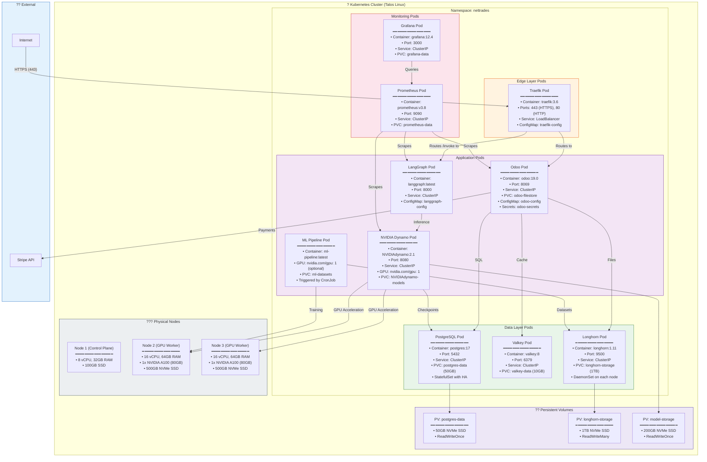

# DEPLOYMENT TEAM PERSPECTIVE — Deployment Diagram (Kubernetes)

Purpose: Shows the physical deployment of all containers on a Kubernetes cluster, including namespaces, pod placements, and persistent volumes.

---

## DEPLOYMENT TEAM PERSPECTIVE — Deployment Diagram (Kubernetes)

