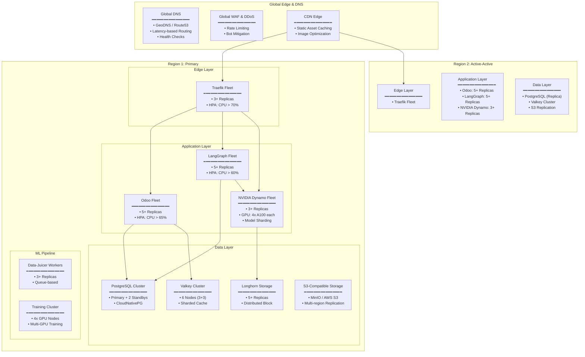

## Future Infrastructure Scaling Architecture




Based on the platform's existing modular architecture (Odoo + LangGraph + NVIDIA Dynamo) the infrastructure could scale from a single VM to a global, multi-region, highly available system.

The platform is designed to grow organically from a single VM to a global, multi-region deployment without requiring significant architectural changes.


# Detailed Scaling Strategy Explanation


# 1. Scaling Strategies

The NETTRADES platform is designed with a "scale-out first" philosophy, leveraging Kubernetes' native capabilities for horizontal scaling. The architecture supports three distinct scaling dimensions, plus edge devices:


## Scaling Strategy

| Strategy | Description | When to Apply |
|---------|-------------|-----------|
| **Vertical Scaling** | Add more CPU/RAM/GPU to existing nodes | 100-1,000 users |
| **Horizontal Scaling** | Add more nodes to the cluster | 1,000-10,000 users |
| **Active-Active** | Multiple regions with load balancing | 10,000-100,000 users |
| **Edge Computing** | Deploy at the edge for low latency | 100,000+ users |

The hub and spoke architecture expands this further. Growing out like a tree, with branches and sub branches, with each joint being a hub. 


## Scaling Dimensions

| Dimension | Single VM | Kubernetes | Enterprise |
|---------|-------------|-----------|-----------|
| **Users** | 100 | 10,000 | 1,000,000+ |
| **GPUs** | 1-4 | 100+ | 10,000+ |
| **Models** | 10 | 1,000 | 100,000+ |
| **Requests/sec** | 10	1,000 | 100,000+ |
| **Data** | 100 GB | 10 TB | 1 PB+ |


## Technology Stack for Scaling

| Component | Scaling Technology |
|---------|-------------|
| **Orchestration** | Kubernetes (Talos) |
| **Database** | CloudNativePG (PostgreSQL) |
| **Cache** | Valkey Cluster |
| **Storage** | Longhorn (distributed block) |
| **Object Storage** | MinIO / AWS S3 |
| **Inference** | NVIDIA Dynamo (distributed) |
| **GPU Orchestration** | KAI Scheduler |
| **CI/CD** | Argo CD |
| **Observability** | Grove |


# 2. Component-Specific Scaling


## A. Odoo Web Fleet (Stateless Web Workers)

 Trigger		

| Scaling | Action | Target |
|---------|-------------|-----------|
| CPU > 65% for 2min | Add replicas | Up to 20 pods |
| Memory > 75% for 2min | Add replicas | Up to 20 pods |
| Queue Length > 1000 | Add replicas | Up to 20 pods |
| Low traffic (2am-6am) | Scale down | Minimum 2 pods |


### State Management:

Sessions: Stored in Valkey (externalized)

Filestore: Shared via S3-compatible storage (Longhorn - MinIO)

Database: Connection pooling via PgBouncer


## B. LangGraph Orchestrator (Stateless API)

| Scaling Trigger | Action | Target |
|---------|-------------|-----------|
| Request Rate > 100 req/s | Add replicas | Up to 15 pods |
| P99 Latency > 500ms | Add replicas | Up to 15 pods |
| Checkpoint queue depth | Add replicas | Up to 15 pods |


### State Management:

Checkpoints: Stored in PostgreSQL (shared across replicas)

No in-memory state: Fully stateless


## C. NVIDIA Dynamo Inference Fleet (Stateful GPU Workers)

| Scaling Trigger | Action | Target |
|---------|-------------|-----------|
| GPU Utilization > 80% | Add GPU node | Up to 20 nodes |
| Queue Length > 50 | Add GPU node | Up to 20 nodes |
| Model load time > 10s | Scale up | Add replicas |


### Challenges & Solutions:

Model Sharding: Large models (>70B) sharded across multiple GPUs

Cold Start: Pre-warm models on standby nodes

GPU Diversity: Heterogeneous GPU pools (A100, H100, L40S)


## D. PostgreSQL Database (Stateful)

| Region | Role |
|---------|-------------|
| Scaling Strategy | Implementation |
| Read Scaling | Read replicas for reporting, analytics |
| Write Scaling | Vertical scaling (more CPU/RAM) |
| Sharding | Citus extension for horizontal sharding |
| Connection Pooling | PgBouncer (1000+ connections) |


#### High Availability:

Primary: 1 node (writes)

Standbys: 2+ nodes (synchronous replication)

Failover: Automatic via CloudNativePG operator


## E. Valkey Cache (Stateful)

| Scaling Strategy | Implementation |
|---------|-----------|
| Sharding | Redis Cluster (6+ nodes) |
| Replication | 1 primary + 2 replicas per shard |
| Eviction | LRU eviction policy |


# 3. Geographic Scaling (Multi-Region)

The platform supports Active-Active deployment across multiple regions:

| Region | Role | Traffic Split |
|---------|-------------|-----------|
| US-East | Primary | 60% |
| EU-West | Active | 30% |
| APAC | DR/Standby | 10% |


# Cross-Region Data Flow:

PostgreSQL: Logical replication (async) from primary to replicas

S3 Storage: Cross-region replication for filestore and models

Valkey: Not replicated (region-local cache only)

# Failover Strategy:

Health checks detect region failure (3 consecutive failures)

DNS routes traffic to healthy region

PostgreSQL replica promoted to primary (within 30 seconds)

Replication direction reversed


# 4. Cost Optimization Strategy

| Component | Optimization | Savings |
|---------|-------------|-----------|
ML Training | Spot instances + checkpointing | 60-70% |
Dev/Test | Auto-stop at night | 50-60% |
Reserved Instances | 3-year commitment for control plane | 40-50% |
GPU Selection | Mixed GPU types (A100 for training, L4 for inference) | 30-40% |


# 5. Observability & Chaos Engineering

# Observability Stack:

Metrics: Prometheus

Logs: Loki (centralized logging)

Traces: Tempo + Jaeger (distributed tracing)

Profiling: Pyroscope (continuous profiling)

# Chaos Engineering:

Chaos Mesh: Regular fault injection tests

Game Days: Quarterly resilience testing

SLIs: Latency, Error Rate, Saturation


# 6. Scaling Limits & Bottlenecks

| Component | Scaling Limit | Mitigation |
|---------|-------------|-----------|
| PostgreSQL Writes | ~10k TPS | Sharding with Citus |
| GPU Memory | 80GB per A100 | Model quantization, sharding |
| Network Bandwidth | 10Gbps per node | Multi-homing, RDMA |
| Odoo Monolith | ~500 concurrent users | Microservices migration (future) |


# 7. Future Evolution Path


| Phase 1 (Current) | Phase 2 (6-12 months) | Phase 3 (12-24 months) |
|---------|-------------|-----------|
| Single VM | Multi-AZ (3 zones) | Multi-Region (Active-Active) |
| 3 Pods | 15+ Pods | 50+ Pods |
| 1 GPU Node | 5 GPU Nodes | 20+ GPU Nodes |
| PostgreSQL Standalone | PostgreSQL HA Cluster | PostgreSQL + Citus Sharding |
| Local Storage | Longhorn | S3 + Multi-region Replication |
| Manual Scaling | KEDA Auto-scaling | Predictive Scaling (ML) |
| Basic Monitoring | Prometheus + Grafana | Global Dashboards |


## Scaling Configuration Examples
Horizontal Pod Autoscaler (LangGraph)

```yaml

apiVersion: autoscaling/v2
kind: HorizontalPodAutoscaler
metadata:
  name: langgraph-hpa
spec:
  scaleTargetRef:
    apiVersion: apps/v1
    kind: Deployment
    name: langgraph
  minReplicas: 3
  maxReplicas: 15
  metrics:
  - type: Resource
    resource:
      name: cpu
      target:
        type: Utilization
        averageUtilization: 65
  - type: Resource
    resource:
      name: memory
      target:
        type: Utilization
        averageUtilization: 75
```


## Cluster Autoscaler (GPU Node Pool)

```yaml

apiVersion: cluster-autoscaler.kubernetes.io/v1
kind: AutoscalingGroup
metadata:
  name: gpu-node-pool
spec:
  minSize: 1
  maxSize: 20
  instanceType: g4dn.xlarge
  gpu:
    type: nvidia
    count: 1

```

##] NVIDIA Dynamo also handles scaling

