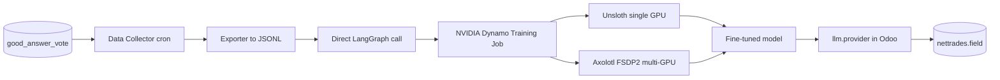

# Good Answer -> Fine-Tuning Loop

This document provides a comprehensive overview of the NETTRADES.AI platform architecture.

---

## Good Answer -> Fine-Tuning Loop

### Pipeline Stages

#### 1. Data Collection

The `nettrades_good_answer` module collects:

* **Good Answer votes** – users mark responses as helpful

* **Votes** – positive and negative feedback

* **Quality scores** – calculated by the LLM-as-Judge

#### 2. Data Export

The Odoo cron job `_cron_trigger_finetune()`:

* Exports "Good Answer" pairs to JSONL format

* Stores the raw data in the `ft_dataset` table

* Passes through the Data-Juicer pipeline (quality filtering)

* Applies DEITA scoring (LLM-as-Judge)

#### 3. Training

The training job runs on NVIDIA Dynamo using:

* **Unsloth** – Single GPU fine-tuning with QLoRA

* **Axolotl** – Multi-GPU fine-tuning with FSDP2

#### 4. Deployment

The fine-tuned model is:

* Deployed to NVIDIA Dynamo

* Registered in Odoo's `llm.provider` model

* Made available to LangGraph agents

* Associated with the professional field (`nettrades.field`)

### Training Triggers

Training is triggered when:

* `THRESHOLD_EPISODES` is reached (default: 50)

* `THRESHOLD_QUALITY` is met (default: 7.0)

* Manual trigger via Odoo UI

### Configuration

| Setting | Default | Description |
|---------|-------------|-------------|
| `THRESHOLD_EPISODES` |  50 | Number of episodes to trigger training  |
| `THRESHOLD_QUALITY` | 7.0  |  Minimum quality score (0-10) |
| `FINE_TUNE_MODEL` |  deepseek-1.5b | Base model to fine-tune  |
| `FINE_TUNE_METHOD` |  unsloth |  Training method (unsloth/axolotl) |

		
		
		
		