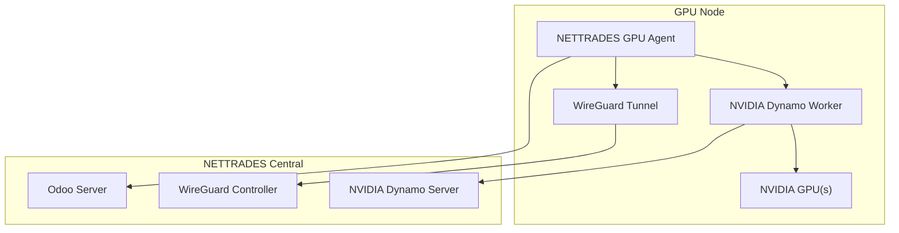

# GPU Node Deployment

This guide covers deploying GPU nodes to the distributed GPU network on both Linux and Windows.

---

## Overview

GPU nodes are machines with one or more NVIDIA GPUs that participate in the distributed inference and fine-tuning network. The GPU node agent:

1. Detects available GPUs
2. Generates a hardware-bound node ID
3. Registers with the Odoo server
4. Sets up WireGuard encryption
5. Starts the NVIDIA Dynamo worker
6. Maintains a heartbeat and DNS watchdog

---

## Architecture Diagram



To enable the distributed GPU peer setup for Phase 4, you need to create the wireguard-config.yaml file. This file defines a ConfigMap that Kubernetes uses to configure WireGuard on your GPU worker nodes, establishing a secure, encrypted overlay network for inter-node communication.

Here is a comprehensive guide and a complete, functional example you can use.

### 1. The Purpose of wireguard-config.yaml

In a Kubernetes environment, this YAML file creates a ConfigMap containing the wg0.conf file. This configuration is then mounted into a WireGuard DaemonSet or pod, which applies it to set up the VPN tunnel on each node. For a GPU cluster, this ensures that all worker nodes can communicate securely, which is critical for distributed GPU workloads orchestrated by tools like NVIDIA Dynamo.

#### 2. Prerequisites: Generate WireGuard Keys

Before creating the file, you must generate a private key for the WireGuard server (or the primary node) and a pre-shared key for each peer.

Run these commands on a Linux machine (or inside your WSL2 environment):
```bash

# Generate the server's private key
wg genkey | tee server_private.key
# Generate the server's public key from the private key
wg pubkey < server_private.key > server_public.key

# Generate a pre-shared key for a peer (run for each peer)
wg genpsk > peer1_psk.key
```

Important: Keep the private keys (server_private.key, peer*_psk.key) secure. They will be stored as Kubernetes Secrets, not in the ConfigMap.
### 3. The Complete wireguard-config.yaml File

Below is a production-ready example. This file defines a ConfigMap with the wg0.conf for the WireGuard server.

File path: deploy/kubernetes/distributed-gpu/peers/wireguard-config.yaml
```yaml

# =============================================================================
# FILE: deploy/kubernetes/distributed-gpu/peers/wireguard-config.yaml
# =============================================================================
# PURPOSE:
#   WireGuard ConfigMap for distributed GPU worker nodes.
#   This ConfigMap provides the wg0.conf file that configures the WireGuard
#   VPN tunnel on each Kubernetes node in the GPU cluster.
#
# USAGE:
#   1. Generate WireGuard keys (see docs).
#   2. Replace placeholders (SERVER_PRIVATE_KEY, PUBLIC_KEY, ENDPOINT_IP, etc.).
#   3. Apply with: kubectl apply -f wireguard-config.yaml
# =============================================================================

apiVersion: v1
kind: ConfigMap
metadata:
  name: wireguard-config
  namespace: NVIDIAdynamo  # Or your desired namespace
  labels:
    app: wireguard
    component: vpn
data:
  wg0.conf: |
    # =========================================================================
    # WireGuard Server Configuration
    # =========================================================================
    [Interface]
    # The private key of the WireGuard server (primary node).
    # This will be injected from a Kubernetes Secret for security.
    # Replace with your actual private key.
    PrivateKey = <SERVER_PRIVATE_KEY>
    
    # The IP address of the WireGuard server within the VPN.
    Address = 10.0.0.1/24
    
    # The port on which the server listens for incoming connections.
    ListenPort = 51820
    
    # Optional: Save the configuration automatically.
    # SaveConfig = true
    
    # =========================================================================
    # Peer Definitions (GPU Worker Nodes)
    # =========================================================================
    
    # --- Peer 1: GPU Worker Node 1 ---
    [Peer]
    # The public key of this peer (GPU worker node).
    # Generated from the peer's private key.
    PublicKey = <PEER1_PUBLIC_KEY>
    
    # Pre-shared key for this peer (optional but recommended for added security).
    # Will be injected from a Kubernetes Secret.
    PresharedKey = <PEER1_PSK>
    
    # The IP address assigned to this peer within the VPN.
    AllowedIPs = 10.0.0.2/32
    
    # If this peer is behind NAT, specify its endpoint.
    # Endpoint = <PEER1_PUBLIC_IP>:51820
    
    # Persistent keepalive to maintain the connection through NAT.
    PersistentKeepalive = 25
    
    # --- Peer 2: GPU Worker Node 2 ---
    [Peer]
    PublicKey = <PEER2_PUBLIC_KEY>
    PresharedKey = <PEER2_PSK>
    AllowedIPs = 10.0.0.3/32
    # Endpoint = <PEER2_PUBLIC_IP>:51820
    PersistentKeepalive = 25
    
    # --- Peer 3: GPU Worker Node 3 ---
    [Peer]
    PublicKey = <PEER3_PUBLIC_KEY>
    PresharedKey = <PEER3_PSK>
    AllowedIPs = 10.0.0.4/32
    # Endpoint = <PEER3_PUBLIC_IP>:51820
    PersistentKeepalive = 25
    
    # --- Add more peers as needed ---
    # [Peer]
    # PublicKey = <PEERn_PUBLIC_KEY>
    # PresharedKey = <PEERn_PSK>
    # AllowedIPs = 10.0.0.<n+1>/32
    # PersistentKeepalive = 25
```

### 4. Understanding the Configuration

* [Interface]: Defines the server's private key, its VPN IP address, and the listening port.


* [Peer]: Each [Peer] section defines a GPU worker node that can connect to the server.

* PublicKey: The public key of the worker node. The server uses this to authenticate the peer.

* PresharedKey: An additional symmetric key for enhanced security. It must match the key configured on the peer.

* AllowedIPs: This is critical for routing. It defines which IP addresses the peer is allowed to use. For a peer, this is typically its own VPN IP (e.g., 10.0.0.2/32). For a server or a hub, this could be a whole subnet. In a mesh or hub-and-spoke topology, you would adjust these values accordingly.

* PersistentKeepalive: Sends keepalive packets to maintain the connection, especially useful if peers are behind NAT.

### 5. Security: Handling Secrets

The configuration file above uses placeholders for sensitive keys. In practice, you should not store private keys in a ConfigMap.

Instead, create a Kubernetes Secret for the server's private key and each peer's pre-shared key, and then mount the Secret into your WireGuard pod alongside the ConfigMap.

Example Secret (for the server's private key):
```yaml

apiVersion: v1
kind: Secret
metadata:
  name: wireguard-secrets
  namespace: NVIDIAdynamo
type: Opaque
data:
  # Base64-encoded values
  server_private_key: <BASE64_ENCODED_SERVER_PRIVATE_KEY>
  peer1_psk: <BASE64_ENCODED_PEER1_PSK>
  peer2_psk: <BASE64_ENCODED_PEER2_PSK>

### 6. Integration with the Phase 4 Script

The phase-k8s.sh script you have already includes a step to apply this configuration:
bash

# Configure WireGuard for secure pod-to-pod communication
log_step "Configuring WireGuard..."
if [[ -f "$K8S_DIR/distributed-gpu/peers/wireguard-config.yaml" ]]; then
    kubectl apply -f "$K8S_DIR/distributed-gpu/peers/wireguard-config.yaml"
    log_success "WireGuard configuration applied"
else
    log_warning "WireGuard configuration not found – skipping"
fi
```
To make this work:

* Place the file in the correct directory: deploy/kubernetes/distributed-gpu/peers/wireguard-config.yaml.

* Replace the placeholders (<SERVER_PRIVATE_KEY>, <PEER1_PUBLIC_KEY>, etc.) with your actual keys.

* Create the corresponding Secret for the private keys.

* Ensure your WireGuard DaemonSet or deployment is configured to mount both the ConfigMap and the Secret.

### 7. Example: A Simple WireGuard DaemonSet (for reference)

To actually use the configuration, you would deploy a WireGuard DaemonSet. Here is a simplified example of what that might look like:
```yaml

apiVersion: apps/v1
kind: DaemonSet
metadata:
  name: wireguard
  namespace: NVIDIAdynamo
spec:
  selector:
    matchLabels:
      app: wireguard
  template:
    metadata:
      labels:
        app: wireguard
    spec:
      hostNetwork: true
      containers:
      - name: wireguard
        image: linuxserver/wireguard:latest
        env:
        - name: PUID
          value: "0"
        - name: PGID
          value: "0"
        volumeMounts:
        - name: wireguard-config
          mountPath: /config/wg0.conf
          subPath: wg0.conf
        - name: wireguard-secrets
          mountPath: /config/private.key
          subPath: server_private_key
        securityContext:
          capabilities:
            add: ["NET_ADMIN", "SYS_MODULE"]
      volumes:
      - name: wireguard-config
        configMap:
          name: wireguard-config
      - name: wireguard-secrets
        secret:
          secretName: wireguard-secrets
```
### 8. Next Steps

* Generate keys for your server and all peer nodes.

* Create the wireguard-config.yaml file and place it in the correct directory.

* Create a corresponding Secret for the private keys.

* Deploy a WireGuard DaemonSet (if you don't have one already) that uses these configurations.

* Run Phase 3 (./scripts/nettrades-setup.sh k8s --auto) to apply the ConfigMap and complete the setup.

Once applied, all your GPU worker nodes will have a secure, encrypted tunnel for inter-node communication, which is essential for distributed GPU workloads managed by NVIDIA Dynamo