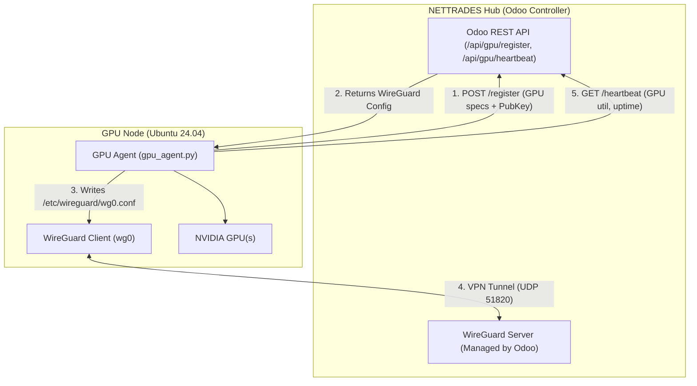

---

### File 2: `docs/developer/gpu-node-deployment.md`

```markdown
# GPU Node Deployment

This guide explains how to add GPU nodes to the NETTRADES.AI platform. The GPU node runs a lightweight Python agent that automatically discovers GPUs, registers with the central Odoo controller, and establishes a secure WireGuard VPN tunnel for communication.

> **Important**: The GPU Agent is a standalone Python script (`src/agent/gpu_agent.py`). It does **not** run inside Kubernetes or require NVIDIA Dynamo to be installed on the node itself. Dynamo inference jobs are dispatched by the hub and run on top of this infrastructure.

## Overview

The GPU Node Agent performs the following functions:
1. **Auto-Discovery**: Detects installed NVIDIA GPUs via `nvidia-smi`.
2. **Registration**: Sends GPU metadata (model, VRAM, compute capability) to the Odoo controller.
3. **VPN Setup**: Generates WireGuard key pairs and applies the VPN configuration returned by the Odoo controller.
4. **Heartbeat**: Periodically reports GPU utilisation and node health to the Odoo controller.

## Node Architecture



## Prerequisites

	
| Requirement | Details |
|---------|-------------|
| **OS**| 	Ubuntu 22.04 or 24.04 LTS |
| **GPU**| 	NVIDIA GPU (Compute Capability 6.0+) |
| **NVIDIA Drivers**| 	Version 550+ (with CUDA 12.4+ support) |
| **Python**| 	Python 3.10+ |
| **WireGuard**| 	Installed and available in $PATH |
| **Network**| 	Outbound HTTPS access to the Odoo controller; UDP port 51820 for WireGuard |

## Step-by-Step Deployment

### Step 1: Install System Dependencies

Run the following commands on the new GPU node:

```bash

# 1. Install NVIDIA drivers

sudo apt update
sudo apt install -y nvidia-driver-550 nvidia-utils-550

# 2. Install WireGuard
sudo apt install -y wireguard

# 3. Install Python and pip
sudo apt install -y python3 python3-pip python3-venv

# 4. (Optional) Install Docker and NVIDIA Container Toolkit if you plan to run containers
curl -fsSL https://get.docker.com | sh
sudo usermod -aG docker $USER

distribution=$(. /etc/os-release; echo $ID$VERSION_ID)
curl -s -L https://nvidia.github.io/nvidia-docker/gpgkey | sudo apt-key add -
curl -s -L "https://nvidia.github.io/nvidia-docker/$distribution/nvidia-docker.list" | sudo tee /etc/apt/sources.list.d/nvidia-docker.list
sudo apt update
sudo apt install -y nvidia-container-toolkit
sudo nvidia-ctk runtime configure --runtime=docker
sudo systemctl restart docker

```

**Reboot the node** after installing the NVIDIA drivers to ensure the GPU is detected correctly.

### Step 2: Clone the Repository

```bash

git clone -b dev-deployment1 https://github.com/nettrades/nettrades-platform.git
cd nettrades-platform

```


Step 3: Set Up the Python Environment

```bash

# Create and activate a virtual environment
python3 -m venv venv
source venv/bin/activate

# Install the required dependencies
pip install -r requirements.txt

```

The `requirements.txt` file includes `requests`, `python-dotenv`, and `langgraph` dependencies needed for the agent.


### Step 4: Configure Environment Variables

The GPU agent reads configuration from environment variables. Create a `.env` file in the project root (or export them directly):

```bash

# .env file (or export in shell)

# Required: The URL of your Odoo controller (hub)
export ODOO_URL="https://your-hub-domain.com"

# Required: The API key used for authentication (generated in Odoo)
export GPU_TOKEN="your-odoo-api-key"

# Optional: Override the node hostname
export HOSTNAME="gpu-node-01"

# Optional: Set log level (default: INFO)
export LOG_LEVEL="DEBUG"

```

Security: Ensure the `.env` file has strict permissions (`chmod 600 .env`) to prevent credential leakage.

### Step 5: Run the GPU Node Agent

The agent is a self-contained Python script. Start it with:

```bash

python3 src/agent/gpu_agent.py

```

#### What happens when you run it?

* GPU Detection: The script runs nvidia-smi --query-gpu=name,index,memory.total,compute_cap --format=csv,noheader to fetch GPU specs.

* Key Generation: It checks for existing WireGuard keys in /etc/wireguard/. If missing, it generates a new private/public key pair using wg genkey and wg pubkey.

* Registration: It sends a POST request to {ODOO_URL}/api/gpu/register with the GPU metadata and the WireGuard public key.

* Config Application: On success, the Odoo controller returns a full WireGuard configuration. The agent writes this to /etc/wireguard/wg0.conf and runs sudo wg-quick up wg0 to establish the tunnel.

* Heartbeat Loop: The agent enters an infinite loop, sending a heartbeat with GPU utilisation and uptime to {ODOO_URL}/api/gpu/heartbeat every 60 seconds.


### Step 6: Run as a Systemd Service (Production)

To keep the agent running reliably, create a systemd service:

```bash

sudo nano /etc/systemd/system/gpu-agent.service

```

Paste the following configuration:

```ini

[Unit]
Description=NETTRADES GPU Node Agent
After=network.target

[Service]
Type=simple
User=your-user
WorkingDirectory=/path/to/nettrades-platform
Environment="ODOO_URL=https://your-hub-domain.com"
Environment="GPU_TOKEN=your-odoo-api-key"
ExecStart=/path/to/nettrades-platform/venv/bin/python3 /path/to/nettrades-platform/src/agent/gpu_agent.py
Restart=on-failure
RestartSec=10s

[Install]
WantedBy=multi-user.target

```

Enable and start the service:

```bash

sudo systemctl daemon-reload
sudo systemctl enable gpu-agent
sudo systemctl start gpu-agent
sudo systemctl status gpu-agent

```


## Monitoring & Troubleshooting


### Check Agent Logs

The agent logs to stdout. With systemd, view logs using:

```bash

sudo journalctl -u gpu-agent -f

```

### Verify WireGuard Tunnel

```bash

sudo wg show
# Expected output: interface wg0, peer (hub's public key), transfer stats
```

### Verify GPU Detection

```bash

nvidia-smi
```

### Verify Odoo Registration

```bash

curl -X GET "https://your-hub-domain.com/api/gpu/nodes" \
  -H "X-API-Key: your-odoo-api-key"
```

### Common Issues
	
| Problem | Solution |
|---------|-------------|
| `ModuleNotFoundError` | Ensure `pip install -r requirements.txt` was run inside the virtual environment.
| **WireGuard fails to start** | Check `sudo wg-quick up wg0` manually. Ensure the interface `wg0` is not already in use.
| **Registration fails (401)** | Verify the `GPU_TOKEN` matches the API key configured in Odoo.
| **GPU not detected** | Run `nvidia-smi`. If it fails, reboot the node and ensure the NVIDIA drivers are loaded (`lsmod | grep nvidia`).
| **Heartbeat timeout** | Ensure the Odoo controller is reachable from the node (check firewall rules for port 443/80).