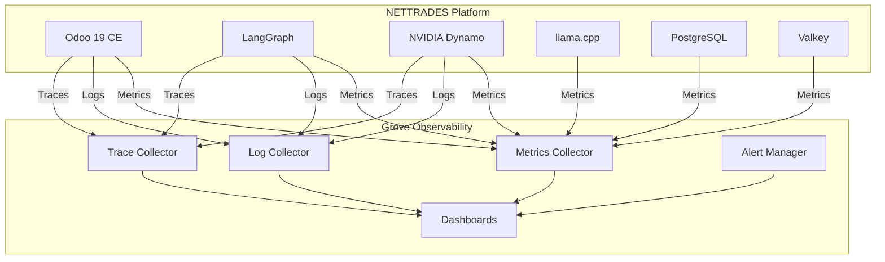

---

### File: `docs/developer/grove-integration.md`

```markdown
# Grove Integration (Future)

**Status:** Planned

This document outlines the future integration of Grove for advanced monitoring and observability.

## Overview

Grove provides:

- **Observability** – Metrics, logs, and traces
- **Real-time monitoring** – Performance and health
- **Alerting** – Customisable alerts
- **Analytics** – Usage and performance analysis

## Integration Architecture



## Benefits

| Benefit | Description |
|---------|----------------------|
| **Unified Observability** | Single view of all services |
| **Real-time Monitoring** | Instant visibility into system health |
| **Proactive Alerts** | Detect issues before they affect users |
| **Performance Analytics** | Identify bottlenecks and optimisation opportunities |
| **Compliance** | Audit trails and reporting |


## Metrics to Collect
		

| Metric | Source | Purpose |
|---------|----------------------|-------------------|
| ** GPU Utilisation ** | NVIDIA Dynamo | Capacity planning |
| ** Request Latency ** | LangGraph | Performance monitoring |
| ** Error Rate ** | All services | Quality monitoring |
| ** Model Loading Time ** | Dynamo | Performance monitoring |
| ** Token Throughput ** | Dynamo | Usage analytics |

		
## Dashboards

System Health Dashboard

* Service status overview

* Resource utilisation

* Recent alerts

Performance Dashboard

* Request latency distribution

* Token throughput

* Model performance

GPU Dashboard

* GPU utilisation per node

* GPU memory usage

* Job queue depth

Business Dashboard

* Inference usage by company

* Training jobs completed

* Marketplace transactions


## Alerting 
		
| Alert | Severity | Action |
|---------|----------------------|-------------------|
| ** GPU utilisation > 90% ** | Warning | Slack notification |
| ** Service down ** | Critical | PagerDuty alert |
| ** Error rate > 5% ** | Warning | Slack notification |
| ** Disk space < 10% ** | Warning | Slack notification |
| ** Certificate expiring ** | Warning | Email notification |


## Next Steps

* [Architecture](architecture.md) 

* [Monitoring](performance-tuning.md)  – Performance monitoring

* [Troubleshooting](troubleshooting.md)  – Common issues and solutions