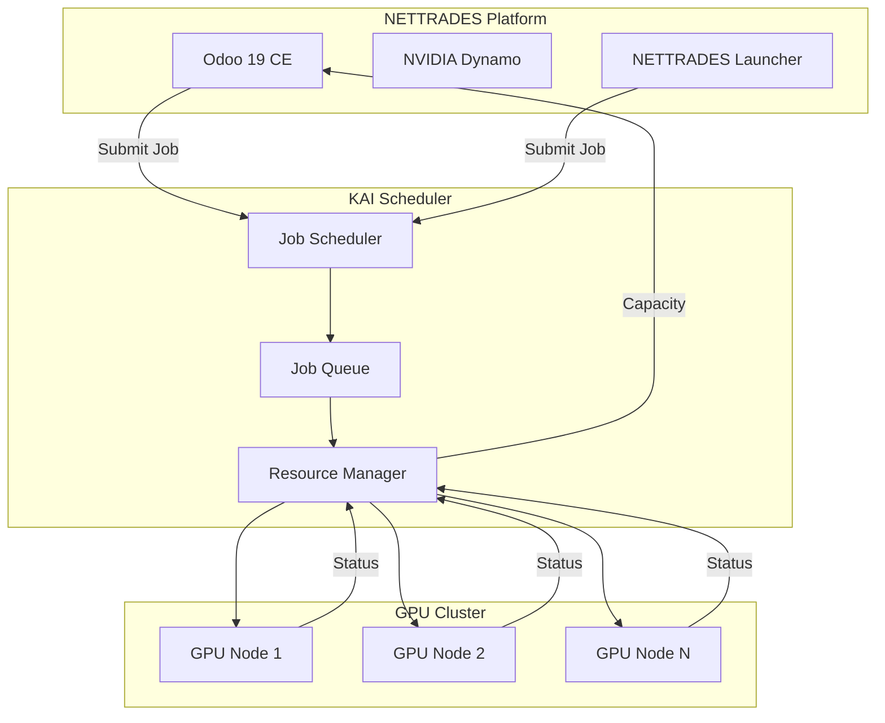

# KAI Scheduler Integration (Future)

**Status:** Planned

This document outlines the future integration of KAI Scheduler for advanced GPU job scheduling.

## Overview

KAI Scheduler is a GPU scheduling system that provides:

- **Advanced job scheduling** – Priority, preemption, and fair share
- **GPU cluster management** – Health checking, failover
- **Resource optimisation** – Maximises GPU utilisation
- **Multi-tenant support** – Isolates workloads

## Integration Architecture



## Benefits

| Benefit | Description |
|---------|----------------------|
| ** Better Utilisation ** | Maximises GPU usage across the cluster |
| ** Fair Scheduling ** | Allocates resources fairly across tenants |
| ** Priority Support ** | Critical jobs get priority |
| ** Preemption ** | Low-priority jobs can be preempted |
| ** Health Monitoring ** | Detects and handles failed nodes |


## API Integration


```python

# Integration point in Odoo
class KAIJob(models.Model):
    _name = 'nettrades.kai.job'
    _description = 'KAI Scheduler Job'

    name = fields.Char('Job Name', required=True)
    job_type = fields.Selection([
        ('inference', 'Inference'),
        ('training', 'Training'),
        ('fine_tuning', 'Fine Tuning'),
    ], string='Job Type')
    priority = fields.Integer('Priority')
    gpu_count = fields.Integer('GPU Count', default=1)
    status = fields.Selection([
        ('pending', 'Pending'),
        ('running', 'Running'),
        ('completed', 'Completed'),
        ('failed', 'Failed'),
    ], string='Status')


```


## Next Steps

* [NVIDIA Dynamo Integration](nvidia-dynamo-integration.md) – Current inference engine

* [GPU Node Deployment](gpu-node-deployment.md) – GPU node setup

* [Performance Tuning](performance-tuning.md) – Optimisation