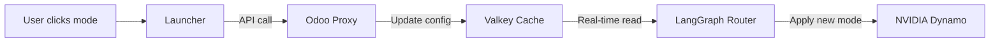

## Grove and KAI Scheduler Management

The Launcher provides toggle controls for optional components:

### Grove Observability

- **Start:** `startGrove()` – Starts Grove, Loki, and Tempo
- **Stop:** `stopGrove()` – Stops Grove services
- **Status:** `getGroveStatus()` – Returns running status

### KAI Scheduler

- **Start:** `startKAI()` – Starts KAI Scheduler
- **Stop:** `stopKAI()` – Stops KAI Scheduler
- **Status:** `getKAIStatus()` – Returns running status

## Operational Mode Switching

The Launcher uses the Odoo Proxy's `/mode` endpoints to switch between Red/Yellow/Green modes:

