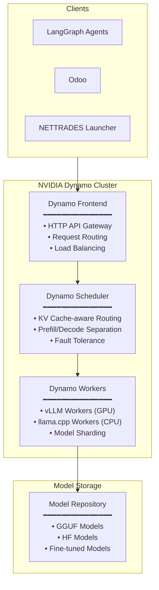
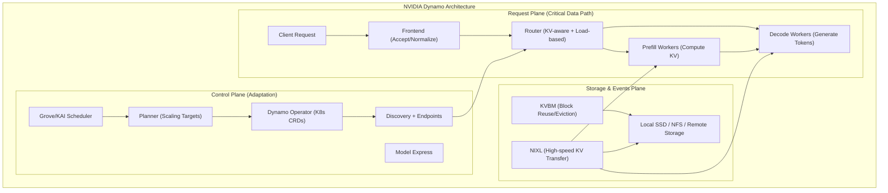

# NVIDIA Dynamo Integration Guide

This document explains how the NETTRADES platform integrates with NVIDIA Dynamo for distributed inference.

## Overview

NVIDIA Dynamo is the primary inference engine for the NETTRADES platform. It provides:

- **Distributed inference** across multiple GPU nodes
- **Disaggregated serving** (prefill/decode separation)
- **KV cache-aware routing** for optimal performance
- **Built-in fault tolerance** and health checking
- **OpenAI-compatible API** for easy integration
- **vLLM** for GPU-accelerated inference
- **llama.cpp** as a CPU fallback


##  🧩 Solution Overview: Universal Enterprise AI Fabric (UEAF)


NetTrades leverages NVIDIA Dynamo as the central orchestrator, vLLM for homogeneous GPU clusters (NVIDIA/AMD), and llama.cpp for CPU/mixed environments. This design is tailored for multi-company, heterogeneous hardware pools connected via a secure overlay network.


The UEAF is a decentralized, hardware-agnostic inference fabric that:

* Orchestrates diverse compute assets (NVIDIA, AMD, Intel GPUs, and CPUs) under a single API.

* Routes intelligently with KV-cache awareness to reduce latency.

* Isolates vendor-specific drivers and libraries at the node level, eliminating cross-vendor conflicts.

* Secures all inter-node communication via WireGuard VPN.

* Scales horizontally by adding more worker nodes without re-architecting.

The dynamo-frontend container is lightweight and does not require CUDA or backend engine dependencies. You can run the Frontend on one machine, for example a CPU node, and the worker on a different machine (a GPU node). The Frontend serves as a framework-agnostic HTTP entry point.

```
+-------------------------------------------------------+
|              NetTrades Core (LangGraph Agents)          |
|                  Odoo ERP & Business Logic              |
+---------------------------+---------------------------+
                            | (HTTP/REST, localhost:8000)
                            ▼
+-------------------------------------------------------+
|           NVIDIA Dynamo Global Coordinator              |
|  - OpenAI-compatible API gateway                        |
|  - KV-cache aware smart router                         |
|  - Global request queue & load balancing               |
|  - Node health monitoring & failover                   |
+---------------------------+---------------------------+
                            |
       (WireGuard VPN Mesh – encrypted overlay)
                            |
    +-----------+-----------+-----------+
    |           |           |           |
    ▼           ▼           ▼           ▼
+--------+  +--------+  +--------+  +--------+
| NVIDIA |  |  AMD   |  | Intel  |  |  CPU   |
|  Node  |  |  Node  |  |  Node  |  |  Mesh  |
|(vLLM)  |  |(vLLM)  |  |(vLLM)  |  |(llama) |
+--------+  +--------+  +--------+  +--------+


```


##  Component Breakdown
		
| Component | Role | Deployment Host |
|------|--------|----------|
| NVIDIA Dynamo | Global router; manages all worker registrations, routes requests, tracks KV caches. | A dedicated server (preferably with an NVIDIA GPU for compilation, though Dynamo itself can run without one). |
| vLLM (CUDA) | High-throughput inference on NVIDIA GPUs; handles unquantized/AWQ models. | Each company’s NVIDIA-only servers. |
| vLLM (ROCm) | High-throughput inference on AMD GPUs; handles unquantized models. | Each company’s AMD-only servers. |
| llama.cpp | Lightweight inference on CPUs, Intel GPUs, mixed/older hardware; uses GGUF quantized models. | Office PCs, Intel Xeon servers, or any machine without dedicated AI accelerators. |
| WireGuard VPN | Encrypted tunnel between all nodes; provides a private, routable IP space. | Every node (coordinator + workers). |


##  🧠 Intelligent Routing with Dynamo

* KV-Cache Awareness: Dynamo maintains a global index of which node holds which prompt context. When a follow-up request arrives (e.g., from a LangGraph agent), Dynamo routes it to the node that already processed the earlier part, avoiding re‑computation and cutting TTFT by up to 50%.

( Capability-Based Scheduling: Nodes self-declare capabilities (e.g., tier_1_gpu, tier_3_cpu, supports_tool_calling, etc.). Dynamo routes:

* Real-time trading logic → Tier-1 GPU nodes.

* Batch summarization, logging, Odoo background tasks → CPU/llama.cpp nodes.

* Health Checks: Each node sends periodic heartbeats; Dynamo automatically removes unresponsive nodes.


## Additional Documentation

[Dynamo GitHub](https://github.com/ai-dynamo/dynamo)

[Official Documentation](https://docs.nvidia.com/dynamo/)

## Architecture



## Inference Backend Priority

The system automatically selects the first available backend:


| Priority | Backend | Description |
|---------|--------------|-----------|
| 1 | **NVIDIA Dynamo with vLLM** | Production-grade distributed inference, GPU-accelerated |
| 2 | **NVIDIA Dynamo (CPU mode)** | Runs on CPU when GPU unavailable |
| 3 | **llama.cpp** | Runs on CPU when GPU unavailable |
| 4 | **llama.cpp** | Zero-dependency CPU fallback, runs on port 8080 |		
		
		
## Configuration

### Environment Variables

| Variable | Purpose | Default | Required |
|---------|--------------|-----------|----------|
| `DYNAMO_API_KEY` | API key for authentication | None |  ✅ Critical  |
| `LLM_BASE_URL` | Dynamo API URL | `http://dynamo:8000/v1` |  ⚠️ Optional  |
| `MODEL_NAME` | Default model | `Qwen2.5-1.5B-Instruct` |  ⚠️ Optional  |
| `INFERENCE_ENGINE` | Engine selection | `auto` |  ⚠️ Optional  |
| `VLLM_TARGET_DEVICE` | Target device (cuda or cpu) | `cuda` |  ⚠️ Optional  |


## Model Loading

Models are loaded from `deploy/docker/dynamo-data/models/`

Supported formats:

GGUF – For llama.cpp (e.g., `*.gguf`)

HF – For vLLM (Hugging Face format with `config.json`)			
			
			
## Downloading Models

```bash

# Download GGUF model
./scripts/download-model.sh --model deepseek-1.5b --format gguf

# Download HF model
./scripts/download-model.sh --model deepseek-1.5b --format h			
			
```


## API Reference

### Chat Completions

**Endpoint:** `POST /v1/chat/completions`

**Authentication:** `Authorization: Bearer <DYNAMO_API_KEY>`

```json

{
    "model": "deepseek-1.5b",
    "messages": [
        {"role": "user", "content": "Hello"}
    ],
    "temperature": 0.7,
    "max_tokens": 1024,
    "stream": false
}
```

## List Models

**Endpoint:** `GET /v1/models`

**Authentication:** `Authorization: Bearer <DYNAMO_API_KEY>`

```json

{
    "object": "list",
    "data": [
        {"id": "deepseek-1.5b", "object": "model"},
        {"id": "qwen-1.5b", "object": "model"}
    ]
}
```

## Health Check

**Endpoint:** `GET /health`

```bash

curl http://localhost:8001/health

```


## Fallback Mechanism

If NVIDIA Dynamo is unavailable, the system automatically falls back to llama.cpp:

**Health Check Fails** – The system periodically checks http://dynamo:8000/health

**Mark Unhealthy** – Dynamo is marked as unhealthy after multiple failures

**Route to Fallback** – LangGraph agents detect unavailability and route to llama.cpp

**Serve Request** – llama.cpp serves requests using GGUF models on port 8080


## Health Check Configuration

| Setting | Default | Description |
|---------|------------|----------|
| `health_check_enabled` | True | Enable/disable health checking |
| `health_check_endpoint` | /health | Health check endpoint URL |
| `health_check_interval` | 30s | How often to check |
| `health_check_timeout` | 5s | Timeout for each check |
		
		

## Monitoring

NVIDIA Dynamo exposes metrics at:

| Endpoint | Description |
|---------|------------|
| `/metrics` | Prometheus metrics |
| `/health` | Health check |
| `/v1/models` | List available models |


## Troubleshooting


| Issue | Solution |
|---------|------------|
| **Dynamo not starting** | Check logs: `docker compose logs dynamo` |
| **Model not found** | Ensure model exists in `dynamo-data/models/` |
| **GPU not detected** | Run `nvidia-smi` and install drivers |
| **API key invalid** | Check `DYNAMO_API_KEY` in `.env` |
| **Out of memory** | Increase GPU memory limit or use smaller model |
| **Slow inference** | Check GPU utilisation and model size |


## Integration with LangGraph

LangGraph agents use the inference backend through inference_tools.py:

```python

from src.core.tools.inference_tools import get_inference_backend

backend = get_inference_backend()  # Returns 'dynamo', 'vllm', or 'llama_cpp'
response = await backend.invoke(messages)
```

## Integration with Bridge Routing

The bridge routing engine (nettrades_bridge) can route requests to Dynamo:

```python

# The bridge returns a route decision
decision = bridge.get_route_for_request('inference', request_data)

# The target URL is either Dynamo or llama.cpp
target_url = decision['target_url']  # http://dynamo:8000/v1 or http://llama-cpp:8080/v1
```


## NVIDIA Dynamo Scaling Architecture


NVIDIA Dynamo is the foundation for all scaled deployments, providing:

* **Disaggregated prefill and decode** – Each scales independently

* **KV-aware routing** – Eliminates unnecessary KV cache recomputation

* **Dynamic worker scaling** – Responds to real-time signals

* **Control plane (Planner)** – Computes scaling targets from live metrics

* **Grove/KAI Scheduler path** – Topology-aware placement





### Key Scaling Features:

| Feature | Description | Benefit |
|---------|------------|----------|
| **Disaggregated Serving** | Separate prefill (compute-intensive) and decode (latency-sensitive) | Maximises GPU utilisation |
| **KV-aware Routing** | Routes requests to workers with cached KV states | Eliminates redundant recomputation |
| **Dynamic Scaling** | Planner computes scaling targets from live metrics | Responds to real-time demand |
| **KAI Scheduler** | Topology-aware placement and grouped scaling | Multi-node Kubernetes deployments |
| **KVBM + NIXL** | Multi-tier cache management and high-speed transfer | Efficient KV reuse across workers |


## Next Steps

[Bridge Architecture](bridge-architecture.md) – Understanding routing

[Building Agents](building-agents.md) – Using Dynamo in agents

[API Reference](api-reference.md) – Complete API documentation

[Troubleshooting](troubleshooting.md) – Common issues and solutions

