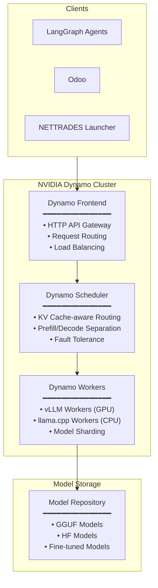

# NVIDIA Dynamo Integration Guide

This document explains how the NETTRADES platform integrates with NVIDIA Dynamo for distributed inference.

## Overview

NVIDIA Dynamo is the primary inference engine for the NETTRADES platform. It provides:

- **Distributed inference** across multiple GPU nodes
- **Disaggregated serving** (prefill/decode separation)
- **KV cache-aware routing** for optimal performance
- **Built-in fault tolerance** and health checking
- **OpenAI-compatible API** for easy integration
- **vLLM** for GPU-accelerated inference
- **llama.cpp** as a CPU fallback


##  🧩 Solution Overview: Universal Enterprise AI Fabric (UEAF)


NetTrades leverages NVIDIA Dynamo as the central orchestrator, vLLM for homogeneous GPU clusters (NVIDIA/AMD), and llama.cpp for CPU/mixed environments. This design is tailored for multi-company, heterogeneous hardware pools connected via a secure overlay network.


The UEAF is a decentralized, hardware-agnostic inference fabric that:

* Orchestrates diverse compute assets (NVIDIA, AMD, Intel GPUs, and CPUs) under a single API.

* Routes intelligently with KV-cache awareness to reduce latency.

* Isolates vendor-specific drivers and libraries at the node level, eliminating cross-vendor conflicts.

* Secures all inter-node communication via WireGuard VPN.

* Scales horizontally by adding more worker nodes without re-architecting.

The dynamo-frontend container is lightweight and does not require CUDA or backend engine dependencies. You can run the Frontend on one machine, for example a CPU node, and the worker on a different machine (a GPU node). The Frontend serves as a framework-agnostic HTTP entry point.

```
+-------------------------------------------------------+
|              NetTrades Core (LangGraph Agents)          |
|                  Odoo ERP & Business Logic              |
+---------------------------+---------------------------+
                            | (HTTP/REST, localhost:8000)
                            ▼
+-------------------------------------------------------+
|           NVIDIA Dynamo Global Coordinator              |
|  - OpenAI-compatible API gateway                        |
|  - KV-cache aware smart router                         |
|  - Global request queue & load balancing               |
|  - Node health monitoring & failover                   |
+---------------------------+---------------------------+
                            |
       (WireGuard VPN Mesh – encrypted overlay)
                            |
    +-----------+-----------+-----------+
    |           |           |           |
    ▼           ▼           ▼           ▼
+--------+  +--------+  +--------+  +--------+
| NVIDIA |  |  AMD   |  | Intel  |  |  CPU   |
|  Node  |  |  Node  |  |  Node  |  |  Mesh  |
|(vLLM)  |  |(vLLM)  |  |(vLLM)  |  |(llama) |
+--------+  +--------+  +--------+  +--------+


```


##  Component Breakdown
		
| Component | Role | Deployment Host |
|------|--------|----------|
| NVIDIA Dynamo | Global router; manages all worker registrations, routes requests, tracks KV caches. | A dedicated server (preferably with an NVIDIA GPU for compilation, though Dynamo itself can run without one). |
| vLLM (CUDA) | High-throughput inference on NVIDIA GPUs; handles unquantized/AWQ models. | Each company’s NVIDIA-only servers. |
| vLLM (ROCm) | High-throughput inference on AMD GPUs; handles unquantized models. | Each company’s AMD-only servers. |
| llama.cpp | Lightweight inference on CPUs, Intel GPUs, mixed/older hardware; uses GGUF quantized models. | Office PCs, Intel Xeon servers, or any machine without dedicated AI accelerators. |
| WireGuard VPN | Encrypted tunnel between all nodes; provides a private, routable IP space. | Every node (coordinator + workers). |


##  🧠 Intelligent Routing with Dynamo

* KV-Cache Awareness: Dynamo maintains a global index of which node holds which prompt context. When a follow-up request arrives (e.g., from a LangGraph agent), Dynamo routes it to the node that already processed the earlier part, avoiding re‑computation and cutting TTFT by up to 50%.

( Capability-Based Scheduling: Nodes self-declare capabilities (e.g., tier_1_gpu, tier_3_cpu, supports_tool_calling, etc.). Dynamo routes:

** Real-time trading logic → Tier-1 GPU nodes.

** Batch summarization, logging, Odoo background tasks → CPU/llama.cpp nodes.

* Health Checks: Each node sends periodic heartbeats; Dynamo automatically removes unresponsive nodes.


## Additional Documentation

[Dynamo GitHub](https://github.com/ai-dynamo/dynamo)
[Official Documentation](https://docs.nvidia.com/dynamo/)

## Architecture



Inference Backend Priority

The system automatically selects the first available backend:
Priority	Backend	Description
1	NVIDIA Dynamo with vLLM	Production-grade distributed inference, GPU-accelerated
2	NVIDIA Dynamo (CPU mode)	Runs on CPU when GPU unavailable
3	llama.cpp	Zero-dependency CPU fallback, runs on port 8080


NVIDIA Dynamo could also use llama.cpp