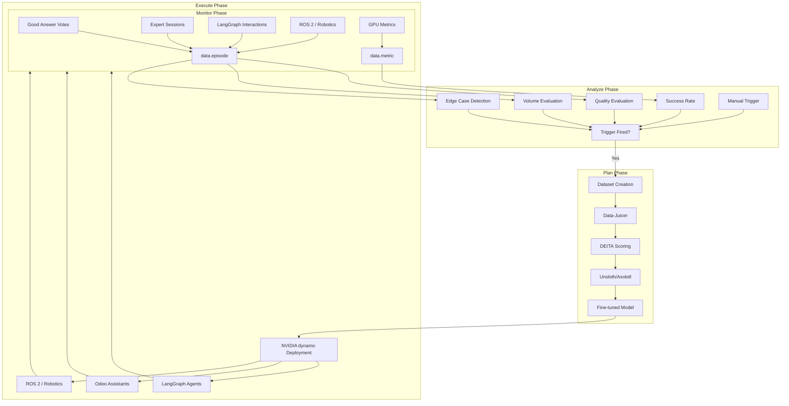

## Self Improving Loop

```mermaid
graph TB
    subgraph Monitor["Monitor Phase"]
        GA["Good Answer Votes"]
        ES["Expert Sessions"]
        LI["LangGraph Interactions"]
        ROS["ROS 2 / Robotics"]
        GM["GPU Metrics"]

        GA --> DC1["data.episode"]
        ES --> DC1
        LI --> DC1
        ROS --> DC1
        GM --> DC2["data.metric"]
    end

    subgraph Analyze["Analyze Phase"]
        DC1 --> QE["Quality Evaluation"]
        DC2 --> SE["Success Rate"]
        DC1 --> VE["Volume Evaluation"]
        DC1 --> EE["Edge Case Detection"]

        QE --> T["Trigger Fired?"]
        SE --> T
        VE --> T
        EE --> T
        Manual["Manual Trigger"] --> T
    end

    subgraph Plan["Plan Phase"]
        T -->|Yes| Dataset["Dataset Creation"]
        Dataset --> DJ["Data-Juicer"]
        DJ --> DEITA["DEITA Scoring"]
        DEITA --> Training["Unsloth/Axolotl"]
        Training --> Model["Fine-tuned Model"]
    end

    subgraph Execute["Execute Phase"]
        Model --> Deploy["NVIDIA dynamo Deployment"]
        Deploy --> A["LangGraph Agents"]
        Deploy --> B["Odoo Assistants"]
        Deploy --> C["ROS 2 / Robotics"]

        A --> Monitor
        B --> Monitor
        C --> Monitor
    end
    
```