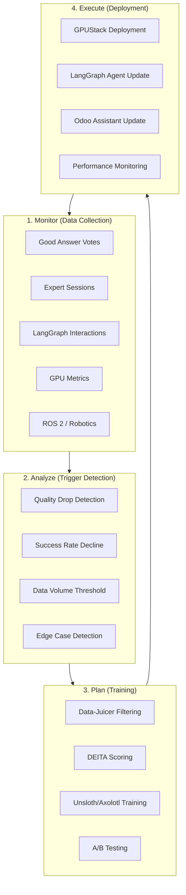

# Self-Improving AI System

## Overview

The self-improving AI system implements a **closed-loop learning architecture** that continuously improves the platform's AI models. It follows the **MAPE (Monitor, Analyze, Plan, Execute)** control loop pattern.

## Architecture Diagram



## Modules

| Module | Purpose | Phase |
|-------|----------|----------|		
| `nettrades_data_collection` | Collects interaction data | Monitor |
| `nettrades_trigger` | Detects improvement triggers | Analyze |
| `nettrades_loop` | Orchestrates the training cycle | Plan + Execute |
| `nettrades_self_improving_config` | Administration interface | All |

## Data Collection (`nettrades_data_collection`)

### Models

| Model | Purpose |
|-------|----------|
| `data.episode` | Complete interaction record (input ? output ? feedback) |
| `data.annotation` | Human or expert evaluations |
| `data.feedback` | User ratings and "Good Answer" votes |
| `data.metric` | Performance metrics |
| `data.edge_case` | Novel or problematic interactions |

## Collectors


```python

# Example: Collect from Good Answer vote
collector = self.env['data.collector']
collector.collect_good_answer(vote_id)

# Example: Collect from expert session
collector.collect_expert_session(session_id)

# Example: Collect from LangGraph interaction
collector.collect_langgraph_interaction(
    input_text="User query",
    output_text="AI response",
    intent="recruitment",
    partner_id=partner_id,
    field_id=field_id
)
```

## Trigger Detection (`nettrades_trigger`)

### Trigger Types

| Type | Description | Threshold Example |
|-------|----------|----------|		
| `quality_drop` | Quality score falls below threshold | < 5.0 / 10 |
| `success_rate` | Task success rate declines | < 80% |
| `data_volume` | Enough data accumulated | > 1000 episodes |
| `edge_case` | New edge case detected | Novel pattern |
| `manual` | Administrator manually triggers | N/A |

### Configuration

Navigate to Settings ? Technical ? Self-Improving AI ? Triggers.

## Loop Orchestration (nettrades_loop)

Cycle Lifecycle

* Pending – Triggered but not yet started

* Running – Currently executing

* Training – Fine-tuning in progress

* Deploying – Model being deployed

* Completed – Cycle successfully completed

* Failed – Cycle failed

## Pipeline Execution

```python

# Manual trigger
orchestrator = self.env['loop.orchestrator']
cycle = orchestrator.execute_cycle()
```

## Administration (`nettrades_self_improving_config`)

### Configuration Settings

| Setting | Description | Default |
|-------|----------|----------|
| `loop_enabled` | Enable/disable the loop | `True` |
| `loop_interval` | How often to run (hours) | `24` |
| `auto_deploy` | Automatically deploy improvements | `True` |
| `auto_rollback` | Rollback if performance degrades | `True` |
| `min_quality_score` | Minimum quality score for training | `5.0` |
| `min_votes_for_training` | Minimum votes for a sample | `2` |
| `max_samples_per_dataset` | Maximum samples per dataset | `10000` |
| `include_expert_answers` | Include expert answers | `True` |
| `ab_testing_enabled` | Enable A/B testing | `True` |
| `ab_traffic_split` | Traffic to test model (%) | `10.0` |
| `promotion_threshold` | Minimum improvement for promotion (%) | `5.0` |

Navigate to `Settings ? Technical ? Self-Improving AI ? Configuration`.

## Integration with Existing Systems

### Good Answer Votes

When a user clicks "Good Answer," the vote is collected by `nettrades_data_collection` and used as training data.

### Ask Someone Expert Sessions

Expert answers are automatically collected and marked as `is_qualified=True` for training.

### LangGraph Agents

Each interaction is collected as a `data.episode` record, providing the primary data source for the self-improving loop.

### GPUStack

Training jobs are submitted to GPUStack via the `gpu_gpustack_adapter` module.

## Monitoring

Navigate to Settings ? Technical ? Self-Improving AI ? Dashboard to view:

* Recent cycles

* Performance metrics

* Improvement percentages

* Episode counts

## Troubleshooting

| Issue | Solution |
|-------|----------|
| `No triggers firing` | Check trigger configuration and thresholds |
| `Training job fails` | Verify GPUStack is running and has capacity |
| `Dataset empty` | Check that data collection is working |
| `Loop disabled` | Enable loop_enabled in configuration |

## Next Steps

[Bridge Module](bridge-module.md)

[Architecture Overview](architecture.md)