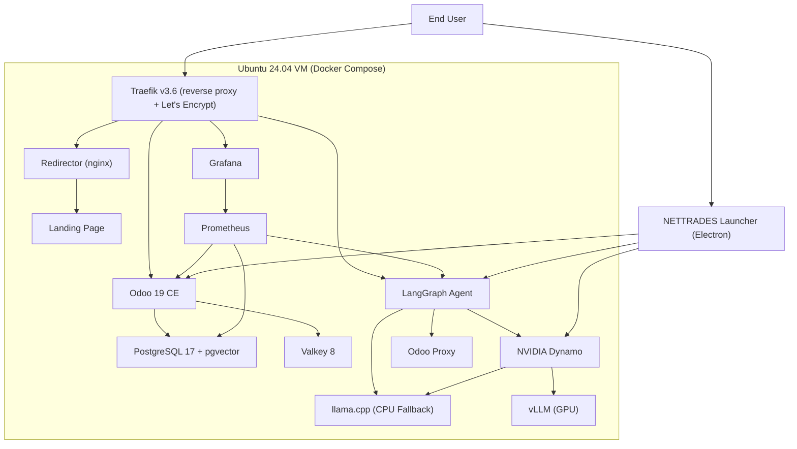

# Single VM Deployment (Docker Compose)

This guide walks you through deploying the NETTRADES.AI platform on a single Ubuntu 24.04 virtual machine using Docker Compose.

## Architecture Diagram



## Prerequisites

	
| Requirement | Details |
|---------|-------------|
| **OS** | 	Ubuntu 24.04 LTS (or WSL2 on Windows) |
| **CPU* | 	4+ cores (8+ recommended) |
| **RAM* | 	16 GB minimum (32 GB+ recommended) |
| **Storage* | 	100 GB minimum (SSD recommended) |
| **Docker* | 	Docker Engine 26+ with Docker Compose plugin |
| **Python* | 	Python 3.10+ |
| **GPU* | 	Optional – NVIDIA GPU with drivers for GPU acceleration |
| **Network* | 	Ports 80, 443 open (for Let's Encrypt) |


## One-Command Deployment

The fastest way to deploy:

```bash

# Clone the repository
git clone -b main https://github.com/nettrades/nettrades-platform.git
cd nettrades-platform

# Make the script executable
chmod +x scripts/nettrades-setup.sh

# Run the full deployment
sudo ./scripts/nettrades-setup.sh all --force

```

## Deployment Phases

| Phase | Description |
| **Phase 0** | System Preparation & Hardening (Docker, UFW, SSH, WireGuard, fail2ban) |
| **Phase 1** | Development Environment (Python virtual environment, dependencies) |
| **Phase 2** | Single-VM Deployment (Docker Compose, Odoo, LangGraph, Dynamo, llama.cpp) |
| **Phase 3** | Kubernetes Scaling (optional – future) |
| **Phase 4** | Module Installation (NETTRADES Odoo modules) |
| **Phase 5** | Monitoring Setup (Prometheus, Grafana) |


## Inference Architecture

????????????????????????????????????????????????????????????????????
?                         INFERENCE ARCHITECTURE                   ?
????????????????????????????????????????????????????????????????????
?                                                                  ?
?  ?????????????????????????????????????????????????????????????   ?
?  ?  LAYER 1: NVIDIA Dynamo (Primary – GPU-accelerated)       ?   ?
?  ?  • Production-grade distributed inference runtime         ?   ?
?  ?  • Disaggregated serving (prefill/decode separation)      ?   ?
?  ?  • KV cache-aware routing                                 ?   ?
?  ?  • Built-in fault tolerance and health checking           ?   ?
?  ?  • OpenAI-compatible API                                  ?   ?
?  ?  • Supports vLLM for GPU inference                        ?   ?
?  ?????????????????????????????????????????????????????????????   ?
?                                    ?                             ?
?                                    ?                             ?
?  ?????????????????????????????????????????????????????????????   ?
?  ?  LAYER 2: vLLM (GPU Inference)                            ?   ?
?  ?  • High-performance LLM inference engine                  ?   ?
?  ?  • PagedAttention for efficient memory management         ?   ?
?  ?  • Supports multiple GPU architectures                    ?   ?
?  ?  OR                                                       ?   ?
?  ?  llama.cpp with CPU                                       ?   ?
?  ?  (NVIDIA Dynamo   could also use llama.cpp with CPU       ?   ?
?  ?                                                           ?   ?
?  ?????????????????????????????????????????????????????????????   ?
?                                    ?                             ?
?                                    ?                             ?
?  ?????????????????????????????????????????????????????????????   ?
?  ?  LAYER 3: llama.cpp (CPU Fallback – Zero Dependency)      ?   ?
?  ?  • CPU inference with GGUF models                         ?   ?
?  ?  • No GPU required                                        ?   ?
?  ?  • Works immediately after deployment                     ?   ?
?  ?????????????????????????????????????????????????????????????   ?
?                                                                  ?
????????????????????????????????????????????????????????????????????


## Services Overview


| Service | Port | Purpose |
|---------|-------------|-----------|
| **Traefik** | 80, 443 | Reverse proxy with Let's Encrypt SSL |
| **Odoo** | 8069 | ERP, Marketplace, AI Hub (Governance Layer) |
| **Odoo Proxy** | 8090 | HTTP JSON-RPC shim for Odoo |
| **LangGraph** | 8000 | Multi-agent orchestration with state persistence |
| **NVIDIA Dynamo** | 8001 | Primary inference engine (vLLM + llama.cpp) |
| **llama.cpp** | 8080 | CPU inference fallback |
| **NETTRADES-UI** | 3002 | Chat interface |
| **PostgreSQL** | 5432 | Database with pgvector |
| **Valkey** | 6379 | In-memory store (sessions, cache, bus) |
| **Prometheus** | 9090 | Metrics collection |
| **Grafana** | 3001 | Visualisation dashboards |
| **Redirector** | 80 | Landing page redirector |
| **WireGuard** | 51821 | Admin VPN server |

## Accessing Services

After deployment, access the platform at:


| Service	| URL | Credentials |
|---------|-------------|---------|
| **NETTRADES Launcher** | `http://localhost:3002` | No login required |
| **Odoo** | `https://your-domain/odoo` | admin / (from .env) |
| **Grafana** | `https://grafana.your-domain` | admin / (from .env) |
| **Prometheus** | `https://prometheus.your-domain` | admin / (from .env) |
| **NETTRADES-UI Chat** | `http://localhost:3002` | No login required |
| **llama.cpp UI** | `http://localhost:8080` | 	No login required |
| **Dynamo API** | `http://localhost:8001/v1` | Bearer token (from .env) |

## Security Hardening


The deployment automatically applies security hardening:

| Security Feature | Description |
|---------|-------------|
| **SSH Hardening** | Root login disabled, key-based authentication, port 2222 rescue port |
| **UFW Firewall** | Only necessary ports open (22, 80, 443, 51821) |
| **WireGuard VPN** | Secure admin VPN server on port 51821 |
| **gVisor** | Container isolation for CPU services (Odoo, LangGraph) |
| **fail2ban** | Protection against brute force attacks |
| **RBAC** | Role-based access control in Odoo |
| **Audit Logging** | All administrative actions logged |


## GPU Support


## NVIDIA GPU Setup

If you have an NVIDIA GPU, the deployment will automatically:

* Detect the GPU using nvidia-smi

* Install NVIDIA drivers (version 550+)

* Install NVIDIA Container Toolkit

* Configure Docker for GPU runtime


## AMD GPU Setup

For AMD GPUs (ROCm):

* Detect the GPU using rocminfo

* Install ROCm drivers (if not present)

* Install ROCm container runtime


## Intel GPU Setup

For Intel GPUs:

* Detect the GPU using clinfo

* Install Intel GPU drivers (intel-gpu-tools, intel-opencl-icd)


## Troubleshooting


### Check Service Status

```bash

cd /root/nettrades-platform/deploy/docker
docker compose ps
```

### View Logs

```bash

# All services
docker compose logs

# Specific service
docker compose logs odoo
docker compose logs langgraph-server
docker compose logs dynamo
```

### Restart Services

```bash

docker compose restart odoo
docker compose restart langgraph-server
docker compose restart dynamo
```

### Full Redeployment

```bash

cd /root/nettrades-platform
rm -f .phase-*-complete
sudo ./scripts/nettrades-setup.sh all --force
```

## Next Steps

* [NVIDIA Dynamo Integration](nvidia-dynamo-integration.md) – Dynamo integration guide

* [gVisor Integration](gvisor-integration.md) – Container isolation

* [GPU Node Deployment](gpu-node-deployment.md) – Add GPU nodes

* [Backup & Restore](backup-and-restore.md) – Backup your data

* [Performance Tuning](performance-tuning.md) – Optimise performance

* [Troubleshooting](troubleshooting.md) – Common issues and solutions