## Solution Architecture (Logical)

```mermaid
flowchart TB
    subgraph Presentation["🖥️ Presentation Layer"]
        direction TB
        WebUI["Odoo Web UI<br>━━━━━━━━━━━━━━━━<br>• Website & Portal<br>• Company / Freelancer / Job Seeker Dashboards<br>• Job Boards & Project Listings<br>• eCommerce / Marketplace<br>• AI Chatbot Widget<br>• Ask Someone Interface"]
        
        PWA["Mobile PWA<br>━━━━━━━━━━━━━━━━<br>• Progressive Web App<br>• Offline Capabilities<br>• Push Notifications<br>• Service Worker"]
        
        API["API Gateway<br>━━━━━━━━━━━━━━━━<br>• Odoo JSON-RPC API<br>• LangGraph /invoke Endpoint<br>• GPU Node Registration API<br>• MCP-Odoo Bridge<br>• WebSocket Bus"]
        
        VSCode["VS Code Extension<br>━━━━━━━━━━━━━━━━<br>• Custom OpenAI Endpoint<br>• AI-Powered Code Assistance<br>• Project Collaboration"]
    end

    subgraph Integration["🧠 Integration & Orchestration Layer (LangGraph)"]
        direction TB
        
        subgraph Supervisor["Supervisor Agent (src/core/supervisor.py)"]
            Classify["classify Node<br>━━━━━━━━━━━━━━━━<br>• Intent Classification<br>• LLM-based Routing<br>• Extracts User Message"]
            MedicalScreening["medical_screening Node<br>━━━━━━━━━━━━━━━━<br>• Clinical/Legal Screening<br>• MAX_FOLLOWUP_ROUNDS=3<br>• Asks Clarifying Questions"]
            Route["route Node<br>━━━━━━━━━━━━━━━━<br>• Intent-based Dispatcher<br>• Routes to Sub-Agents<br>• Fallback to General LLM"]
        end
        
        subgraph SubAgents["Business Sub-Agents (src/core/agents/)"]
            RecruitmentAgent["Recruitment Agent<br>━━━━━━━━━━━━━━━━<br>• CV Parsing & Analysis<br>• Job-Candidate Matching<br>• Candidate Shortlisting<br>• Match Score Calculation"]
            
            FreelanceAgent["Freelance Agent<br>━━━━━━━━━━━━━━━━<br>• Project-Freelancer Matching<br>• Skills & Availability Check<br>• Rate Suggestions<br>• Proposal Generation"]
            
            LeadGenAgent["Lead Gen Agent<br>━━━━━━━━━━━━━━━━<br>• Lead Generation<br>• Quality Scoring & Ranking<br>• Automated CRM Creation<br>• Lead Scoring"]
            
            GPUManagementAgent["GPU Management Agent<br>━━━━━━━━━━━━━━━━<br>• GPU Cluster Health Monitoring<br>• Node Lifecycle Management<br>• Pool Assignment<br>• Token Economics"]
            
            VisionAgent["Vision Agent<br>━━━━━━━━━━━━━━━━<br>• Multi-modal VLM Analysis<br>• Image + Text Processing<br>• GPUStack VLM Integration<br>• Image Description"]
            
            ActionAgent["Action Agent<br>━━━━━━━━━━━━━━━━<br>• Robotic Action Planning<br>• ROS 2 / MCP Dispatch<br>• VLA Model Integration<br>• Action Execution"]
            
            GeneralLLM["General LLM Fallback<br>━━━━━━━━━━━━━━━━<br>• Direct Chat Completion<br>• Generic Queries<br>• Fallback when No Intent Matched"]
        end
        
        Checkpointer["PostgresSaver Checkpointer<br>━━━━━━━━━━━━━━━━<br>• Durable State Snapshots<br>• Crash Recovery<br>• Workflow Resumption<br>• Thread-based State"]
    end

    subgraph Business["🏢 Business Logic Layer (Odoo 19 CE)"]
        direction TB
        
        subgraph CustomModules["Custom NETTRADES Modules (odoo-modules/)"]
            nettrades_core["nettrades_core<br>━━━━━━━━━━━━━━━━<br>• Professional Field Config<br>• Qualification Rules<br>• Voting Weights<br>• Karma Management<br>• Partner Extensions"]
            
            nettrades_good_answer["nettrades_good_answer<br>━━━━━━━━━━━━━━━━<br>• Good Answer Voting<br>• Reputation Management<br>• Fine-Tuning Dataset<br>• Data-Juicer & DEITA<br>• Cron Jobs"]
            
            nettrades_gpu_admin["nettrades_gpu_admin<br>━━━━━━━━━━━━━━━━<br>• GPU Cluster Dashboard<br>• Node Registry<br>• Pool Assignment<br>• Token Economics<br>• WireGuard Management"]
            
            nettrades_gpustack_adapter["nettrades_gpustack_adapter<br>━━━━━━━━━━━━━━━━<br>• GPUStack API Bridge<br>• Worker Synchronization<br>• Token Usage Sync<br>• Model Deployment"]
            
            nettrades_ask_someone["nettrades_ask_someone<br>━━━━━━━━━━━━━━━━<br>• Expert Marketplace<br>• Stripe Escrow<br>• Live Sessions<br>• Expert Matching"]
            
            nettrades_job_matching["nettrades_job_matching<br>━━━━━━━━━━━━━━━━<br>• Job Search & Matching<br>• One-Click Apply<br>• Conversational Search<br>• Cover Letter Generation"]
            
            nettrades_proposals["nettrades_proposals<br>━━━━━━━━━━━━━━━━<br>• Freelancer Proposals<br>• Milestone Payments<br>• Project Management<br>• Smart Proposal Drafting"]
            
            nettrades_lead_scoring["nettrades_lead_scoring<br>━━━━━━━━━━━━━━━━<br>• Lead Generation<br>• AI Scoring<br>• CRM Integration<br>• Activity Tracking"]
            
            nettrades_chatbot["nettrades_chatbot<br>━━━━━━━━━━━━━━━━<br>• AI Chatbot Widget<br>• Ask Someone Integration<br>• Session Management<br>• Real-time Messaging"]
            
            nettrades_notifications["nettrades_notifications<br>━━━━━━━━━━━━━━━━<br>• In-App Notifications<br>• Reviews & Disputes<br>• Activity Tracking<br>• Email Alerts"]
            
            nettrades_pwa["nettrades_pwa<br>━━━━━━━━━━━━━━━━<br>• PWA Manifest<br>• Service Worker<br>• Offline Caching<br>• Mobile Optimization"]
        end
        
        subgraph ThirdParty["Third-Party Modules (third-party/)"]
            OdooCore["Odoo 19 CE Core<br>━━━━━━━━━━━━━━━━<br>• CRM, Sales, Project<br>• HR, Recruitment<br>• Accounting, Invoicing<br>• Website, eCommerce<br>• Forum, Gamification"]
            
            OdooLLM["Apexive LLM Modules<br>━━━━━━━━━━━━━━━━<br>• llm (Core Framework)<br>• llm_pgvector (Vector Store)<br>• llm_knowledge (RAG)<br>• llm_assistant (Chat)<br>• llm_training (Fine-Tuning)<br>• llm_tool (Function Calling)<br>• llm_thread (Conversations)"]
            
            Marketplace["website_sale_marketplace<br>━━━━━━━━━━━━━━━━<br>• Multi-vendor Marketplace<br>• Product Listings<br>• Vendor Management"]
            
            QueueJob["queue_job (OCA)<br>━━━━━━━━━━━━━━━━<br>• Background Job Processing<br>• Async Operations<br>• Retry Logic"]
            
            PaymentStripe["payment_stripe<br>━━━━━━━━━━━━━━━━<br>• Stripe Payment Acquirer<br>• Payment Intents<br>• Webhook Handling"]
        end
        
        MCPBridge["MCP-Odoo Bridge<br>━━━━━━━━━━━━━━━━<br>• Model Context Protocol<br>• AI-to-Odoo Function Calling<br>• CRUD Operations<br>• Dynamic Model Discovery"]
    end

    subgraph Data["💾 Data & Persistence Layer"]
        direction TB
        
        PostgreSQL["PostgreSQL 18 + pgvector<br>━━━━━━━━━━━━━━━━<br>• Odoo Transactional Data<br>• Vector Embeddings (RAG)<br>• LangGraph Checkpoints<br>• Full-Text Search<br>• ACID Transactions"]
        
        Valkey["Valkey 8 (Redis-compatible)<br>━━━━━━━━━━━━━━━━<br>• Session Storage<br>• ORM Cache<br>• Bus Notifications (Pub/Sub)<br>• Rate Limiting<br>• Job Locks"]
        
        Longhorn["Longhorn Distributed Storage<br>━━━━━━━━━━━━━━━━<br>• Odoo Filestore (CVs, Images)<br>• Fine-Tuning Datasets (JSONL)<br>• Model Weights (GGUF/Safetensors)<br>• Data-Juicer Artifacts<br>• Backups"]
    end

    subgraph Infrastructure["⚙️ Infrastructure & Security Layer (Logical)"]
        direction TB
        
        subgraph Security["Security Services"]
            WireGuard["WireGuard VPN Mesh<br>━━━━━━━━━━━━━━━━<br>• Kernel-level Network Isolation<br>• Hub-and-Spoke / Mesh Topology<br>• AllowedIPs Enforcement<br>• Site-to-Site Connectivity"]
            
            gVisor["gVisor Sandbox<br>━━━━━━━━━━━━━━━━<br>• Syscall-level Container Isolation<br>• Public GPU Worker Pools<br>• Container Escape Prevention<br>• Resource Limits"]
            
            RBAC["RBAC & Policy Engine<br>━━━━━━━━━━━━━━━━<br>• Odoo Security Groups<br>• Cilium Network Policies<br>• OAuth Authentication<br>• API Key Management"]
        end
        
        subgraph GPUOrchestration["GPU Orchestration"]
            GPUStackServer["GPUStack Manager<br>━━━━━━━━━━━━━━━━<br>• Inference Engine (OpenAI-compatible)<br>• Token Metering<br>• Worker Pool Management<br>• Model Deployment<br>• Multi-vendor Support"]
            
            GPUNodeAgent["GPU Node Agent<br>━━━━━━━━━━━━━━━━<br>• GPU Detection (nvidia-smi)<br>• Hardware-bound Node ID<br>• WireGuard Setup<br>• GPUStack Worker Startup<br>• DNS Watchdog<br>• Auto-Registration"]
        end
        
        subgraph Observability["Monitoring & Observability"]
            Prometheus["Prometheus<br>━━━━━━━━━━━━━━━━<br>• Metrics Collection<br>• Alerting Rules<br>• Service Discovery"]
            
            Grafana["Grafana<br>━━━━━━━━━━━━━━━━<br>• Dashboards<br>• Visualization<br>• Alert Management"]
        end
    end

    subgraph External["🔗 External Integrations"]
        Stripe["Stripe API<br>━━━━━━━━━━━━━━━━<br>• Payment Processing<br>• Escrow for Consultations<br>• Webhook Callbacks"]
        
        LLMProviders["External LLM Providers<br>━━━━━━━━━━━━━━━━<br>• OpenAI (Fallback)<br>• Anthropic (Fallback)<br>• Used when GPUStack Unavailable"]
        
        Forgejo["Forgejo Git<br>━━━━━━━━━━━━━━━━<br>• Self-hosted Git Repositories<br>• CI/CD Pipelines<br>• Project Collaboration<br>• Code Review"]
        
        JobBoards["External Job Boards<br>━━━━━━━━━━━━━━━━<br>• LinkedIn / Indeed / Upwork<br>• RSS / API Feeds<br>• Lead Ingestion"]
    end

    subgraph ML["🧠 Self-Improving AI Pipeline"]
        direction LR
        Vote["Good Answer Vote"] --> Export["Export to JSONL<br>(ft.dataset)"]
        Export --> DataJuicer["Data-Juicer<br>━━━━━━━━━━━━━━━━<br>• Quality Filtering<br>• Deduplication<br>• PII Removal<br>• LLM Quality Scoring"]
        DataJuicer --> DEITA["DEITA Scorer<br>━━━━━━━━━━━━━━━━<br>• LLM-as-Judge<br>• Complexity Scoring<br>• Quality Ranking<br>• Diversity Assessment"]
        DEITA --> Training["Unsloth/Axolotl Training<br>━━━━━━━━━━━━━━━━<br>• LoRA/QLoRA Fine-Tuning<br>• GRPO / DPO Preference<br>• 4-bit Quantization<br>• FSDP2 Multi-GPU"]
        Training --> ModelRegistry["Model Registry<br>━━━━━━━━━━━━━━━━<br>• Versioned Storage<br>• Metadata Tags (Domain, Score)<br>• GPUStack Registration<br>• A/B Testing"]
        ModelRegistry --> LangGraph["LangGraph Agent<br>Uses Improved Model"]
    end

    %% ========================================================================
    %% CONNECTIONS & DATA FLOW
    %% ========================================================================

    %% Presentation to Integration
    WebUI -->|"HTTP/HTTPS"| API
    PWA -->|"HTTP/HTTPS"| API
    VSCode -->|"HTTP/HTTPS"| API
    API -->|"/invoke"| Classify
    API -->|"JSON-RPC"| Business
    API -->|"WebSocket"| Valkey

    %% Supervisor Flow
    Classify -->|"Intent Classified"| MedicalScreening
    MedicalScreening -->|"Screening Done"| Route
    Route -->|"recruitment"| RecruitmentAgent
    Route -->|"freelance"| FreelanceAgent
    Route -->|"lead_gen"| LeadGenAgent
    Route -->|"gpu_management"| GPUManagementAgent
    Route -->|"vision"| VisionAgent
    Route -->|"action"| ActionAgent
    Route -->|"general"| GeneralLLM

    %% Orchestration to Business Logic
    RecruitmentAgent -->|"Reads/Writes"| nettrades_core
    RecruitmentAgent -->|"Reads/Writes"| nettrades_job_matching
    FreelanceAgent -->|"Reads/Writes"| nettrades_proposals
    LeadGenAgent -->|"Creates"| nettrades_lead_scoring
    GPUManagementAgent -->|"Reads/Writes"| nettrades_gpu_admin
    VisionAgent -->|"Calls"| GPUStackServer
    ActionAgent -->|"Calls"| Infrastructure
    GeneralLLM -->|"Calls"| GPUStackServer
    GeneralLLM -->|"Fallback"| LLMProviders

    %% MCP Bridge to Odoo (Function Calling)
    RecruitmentAgent -.->|"Function Calls"| MCPBridge
    FreelanceAgent -.->|"Function Calls"| MCPBridge
    LeadGenAgent -.->|"Function Calls"| MCPBridge
    GPUManagementAgent -.->|"Function Calls"| MCPBridge
    MCPBridge -->|"JSON-RPC"| OdooCore

    %% Business Logic to Data
    nettrades_core -->|"SQL"| PostgreSQL
    nettrades_good_answer -->|"SQL"| PostgreSQL
    nettrades_gpu_admin -->|"SQL"| PostgreSQL
    nettrades_ask_someone -->|"SQL"| PostgreSQL
    nettrades_job_matching -->|"SQL"| PostgreSQL
    nettrades_proposals -->|"SQL"| PostgreSQL
    nettrades_lead_scoring -->|"SQL"| PostgreSQL
    nettrades_chatbot -->|"SQL"| PostgreSQL
    nettrades_notifications -->|"SQL"| PostgreSQL
    OdooCore -->|"SQL"| PostgreSQL
    OdooLLM -->|"SQL"| PostgreSQL

    OdooCore -->|"Cache"| Valkey
    nettrades_chatbot -->|"Pub/Sub"| Valkey
    OdooCore -->|"Filestore"| Longhorn

    %% Orchestration to Checkpointer
    Classify -->|"Checkpoint"| Checkpointer
    MedicalScreening -->|"Checkpoint"| Checkpointer
    Route -->|"Checkpoint"| Checkpointer
    RecruitmentAgent -->|"Checkpoint"| Checkpointer
    FreelanceAgent -->|"Checkpoint"| Checkpointer
    LeadGenAgent -->|"Checkpoint"| Checkpointer
    GPUManagementAgent -->|"Checkpoint"| Checkpointer
    VisionAgent -->|"Checkpoint"| Checkpointer
    ActionAgent -->|"Checkpoint"| Checkpointer
    GeneralLLM -->|"Checkpoint"| Checkpointer
    Checkpointer -->|"PostgresSaver"| PostgreSQL

    %% GPU Infrastructure
    GPUStackServer -->|"Orchestrates"| GPUNodeAgent
    GPUManagementAgent -->|"Manages"| GPUStackServer
    GPUNodeAgent -->|"Registers"| API

    %% Self-Improving AI Pipeline
    nettrades_good_answer -->|"Votes"| Vote
    ModelRegistry -->|"Registers Model"| GPUStackServer
    ModelRegistry -->|"Stores"| Longhorn

    %% External Integrations
    nettrades_ask_someone -->|"Payments"| Stripe
    nettrades_core -->|"Git Integration"| Forgejo
    nettrades_lead_scoring -->|"Ingests"| JobBoards

    %% Security
    WireGuard -->|"Secures"| GPUOrchestration
    gVisor -->|"Isolates"| GPUOrchestration
    RBAC -->|"Enforces"| Presentation

    %% Monitoring
    Business -->|"Metrics"| Prometheus
    Integration -->|"Metrics"| Prometheus
    Infrastructure -->|"Metrics"| Prometheus
    Prometheus -->|"Visualized"| Grafana

    %% ========================================================================
    %% STYLE DEFINITIONS
    %% ========================================================================
    classDef presentation fill:#e3f2fd,stroke:#1565c0,stroke-width:2px;
    classDef integration fill:#f3e5f5,stroke:#6a1b9a,stroke-width:2px;
    classDef business fill:#e8f5e9,stroke:#2e7d32,stroke-width:2px;
    classDef data fill:#fff3e0,stroke:#e65100,stroke-width:2px;
    classDef infrastructure fill:#fce4ec,stroke:#c62828,stroke-width:2px;
    classDef external fill:#ffebee,stroke:#b71c1c,stroke-width:2px;
    classDef ml fill:#e0f7fa,stroke:#00838f,stroke-width:2px;

    class Presentation presentation;
    class Integration,Supervisor,SubAgents integration;
    class Business,CustomModules,ThirdParty,MCPBridge business;
    class Data data;
    class Infrastructure,Security,GPUOrchestration,Observability infrastructure;
    class External external;
    class ML ml;

```

# Detailed Explanation of the Logical Architecture
# 1. Presentation Layer

The presentation layer provides the user interface and API access points:
Component  &   Purpose	Technologies

### Component: Odoo Web UI	

Main web interface for all user roles (Companies, Freelancers, Job Seekers, Experts)	

Technologies: Odoo Website, Portal, QWeb

### Component: Mobile PWA	

Purpose: Mobile-optimized Progressive Web App with offline support	

Technologies: Service Worker, PWA Manifest

### Component: API Gateway	

Purpose: Exposes Odoo JSON-RPC, LangGraph /invoke, GPU Registration, MCP-Odoo Bridge	

Technologies: FastAPI, Odoo Controllers

### Component: VS Code Extension	

Purpose: Enables developers to use company-local vLLM inference from VS Code	

Technologies: VS Code API, OpenAI-compatible endpoints

# 2. Integration & Orchestration Layer (LangGraph)

This is the "brain" of the platform, orchestrating all AI-driven workflows.

PostgresSaver Checkpointer: Provides durable state snapshots, enabling crash recovery and workflow resumption.

## Supervisor Agent (src/core/supervisor.py):

classify Node: Classifies user intent using an LLM (recruitment, freelance, lead_gen, gpu_management, vision, action, medical, legal, general)

medical_screening Node: Conducts up to 3 rounds of follow-up questions for medical/legal queries

route Node: Dispatches requests to the appropriate sub-agent or fallback LLM

## Business Sub-Agents (src/core/agents/):

Recruitment Agent: CV parsing, job-candidate matching, shortlist generation

Freelance Agent: Project-freelancer matching, skills & availability validation, rate suggestions

Lead Gen Agent: Lead generation, quality scoring, automated CRM creation

GPU Management Agent: GPU cluster health monitoring, node lifecycle, pool assignment, token economics

Vision Agent: Multi-modal VLM (Vision-Language Model) for image + text analysis

Action Agent: Robotic action planning and dispatch via ROS 2 / MCP

General LLM: Fallback for unclassified or general queries

# 3. Business Logic Layer (Odoo 19 CE)

This layer contains all business logic, data models, and user administration.

## Custom NETTRADES Modules:

Module	      &              Purpose

nettrades_core:	            Professional field configuration, qualification rules, voting weights, karma management

nettrades_good_answer:	    Good Answer voting, reputation management, fine-tuning dataset pipeline

nettrades_gpu_admin:	    GPU cluster dashboard, node registry, pool assignment, token economics

nettrades_gpustack_adapter:	GPUStack API bridge for worker and token usage synchronization

nettrades_ask_someone:	    Expert marketplace with Stripe escrow and live sessions

nettrades_job_matching:	    AI-powered job search, matching, and one-click apply

nettrades_proposals:	    Freelancer proposals and milestone payments

nettrades_lead_scoring:	    AI-driven lead generation and CRM integration

nettrades_chatbot:	        AI chatbot widget with Ask Someone integration

nettrades_notifications:	In-app notifications, reviews, and disputes

nettrades_pwa:	            Progressive Web App manifest and service worker

# Third-Party Modules:

Odoo 19 CE Core: CRM, Sales, Project, HR, Accounting, Website, eCommerce, Forum, Gamification

Apexive LLM Modules: llm (framework), llm_pgvector (vector store), llm_knowledge (RAG), llm_assistant (chat), llm_training (fine-tuning), llm_tool (function calling), llm_thread (conversations)

MCP-Odoo Bridge: Enables AI agents to call Odoo functions and execute CRUD operations

# 4. Data & Persistence Layer

### Component: PostgreSQL 18 + pgvector	
Purpose: Odoo transactional data, vector embeddings for RAG, LangGraph checkpoints, full-text search	
Technology: SQL, pgvector extension

### Component: Valkey 8	
Purpose: Session storage, ORM cache, bus notifications (Pub/Sub), rate limiting, job locks	
Technology: Redis-compatible in-memory store

### Component: Longhorn	
Purpose: Odoo filestore (CVs, images), fine-tuning datasets (JSONL), model weights (GGUF/Safetensors), Data-Juicer artifacts, backups	
Technology: Distributed block storage

# 5. Infrastructure & Security Layer (Logical)

## Security Services:

WireGuard VPN Mesh: Kernel-level network isolation with AllowedIPs enforcement. Supports both hub-and-spoke (public freelancers) and full mesh (company internal) topologies.

gVisor Sandbox: Syscall-level container isolation for untrusted public GPU workloads, preventing container escape attacks.

RBAC & Policy Engine: Odoo security groups, Cilium network policies, OAuth authentication, API key management.

## GPU Orchestration:

GPUStack Manager: Provides an OpenAI-compatible inference engine, token metering, worker pool management, multi-vendor GPU support (NVIDIA, AMD, Apple Metal).

GPU Node Agent: Runs on each GPU node, handles GPU detection, hardware-bound node ID generation, WireGuard setup, and GPUStack worker startup.

## Observability:

Prometheus: Metrics collection and alerting

Grafana: Dashboards and visualization

# 6. External Integrations

Integration	Purpose
### Integration: Stripe API	
Purpose: Payment processing and escrow for Ask Someone consultations

### Integration: External LLM Providers	
Purpose: OpenAI / Anthropic fallback when GPUStack is unavailable

### Integration: Forgejo Git	
Purpose: Self-hosted Git for project collaboration and CI/CD

### Integration: External Job Boards	
Purpose: LinkedIn, Indeed, Upwork RSS/API feeds for lead ingestion

# 7. Self-Improving AI Pipeline

A closed-loop pipeline that continuously improves the AI models:

Good Answer Vote: Users vote on helpful responses

Export to JSONL: Feedback is exported from Odoo

Data-Juicer: Quality filtering, deduplication, and PII removal

DEITA Scorer: LLM-as-Judge scores complexity and quality

Unsloth/Axolotl Training: LoRA/QLoRA fine-tuning with 4-bit quantization

Model Registry: Versioned storage and registration with GPUStack

LangGraph Agent: Uses the improved model for future inference

# Data Flow Summary

### Flow: User Request	

Path: WebUI → API → Classify → MedicalScreening → Route → Sub-Agent → Odoo → PostgreSQL	

Description: User makes a request, intent is classified, routed to the appropriate agent, which interacts with Odoo and stores data

### Flow: AI Inference	

Path: Sub-Agent → GPUStack Server → GPU Node Agent → GPU	

Description: AI inference requests are routed to GPUStack, which distributes them to available GPU workers

### Flow: GPU Registration	

Path: GPU Node Agent → API → nettrades_gpu_admin → PostgreSQL	

Description: GPU nodes register themselves with Odoo and receive WireGuard configuration

### Flow: Good Answer Voting	

Path: WebUI → nettrades_good_answer → PostgreSQL	

Description: Users vote on answers, storing feedback for reputation and training

### Flow: Fine-Tuning	

Path: nettrades_good_answer → Data-Juicer → DEITA → Unsloth/Axolotl → Model Registry → GPUStack	

Description: Feedback data is exported, quality-filtered, scored, and used to fine-tune models, which are then registered for inference

### Flow: Payments	

Path: nettrades_ask_someone → Stripe → PostgreSQL	

Description: Expert consultations are paid via Stripe escrow

### Flow: Git Collaboration	

Path: nettrades_core → Forgejo → PostgreSQL	
Description: Projects are linked to Forgejo repositories

This logical architecture enables the platform to function as a self-improving, autonomous enterprise ecosystem, connecting all stakeholders through AI-powered matching, a distributed GPU marketplace, and a continuous learning pipeline.

---

