## Technical Solution Architecture

```mermaid
flowchart TD
    %% ========================================================================
    %% 1. EXTERNAL ACCESS & EDGE (Single VM Entry Point)
    %% ========================================================================
    subgraph External["?? External Access"]
        Internet["Internet / Public Network<br><br>• End Users (Web Browsers)<br>• API Clients<br>• Robotic / Edge Clients"]
    end

    subgraph VM["??? Single Virtual Machine (Host OS: Talos Linux / Ubuntu 22.04 LTS)"]
        direction TB

        subgraph Edge["?? Edge Layer (Container: traefik)"]
            Traefik["Traefik Reverse Proxy<br>━━━━━━━━━━━━━━━━<br>• Port 443 (HTTPS) with Let's Encrypt<br>• Port 80 (HTTP ? HTTPS redirect)<br>• Path-based routing:<br>  - / ? Odoo Web UI<br>  - /api/v1/* ? Odoo JSON-RPC API<br>  - /invoke ? LangGraph FastAPI<br>• JWT / OAuth2 Authentication Proxy<br>• Rate Limiting"]
        end

        %% ========================================================================
        %% 2. APPLICATION & ORCHESTRATION SERVICES
        %% ========================================================================
        subgraph AppLayer["?? Application Services Layer"]

            subgraph OdooContainer["Container: odoo-web (Port 8069 internal)"]
                Odoo["Odoo 19 CE Application Server<br>━━━━━━━━━━━━━━━━<br>• Web Controllers (/website, /forum)<br>• JSON-RPC API Controllers<br>• Custom Odoo Modules:<br>  - nettrades_core<br>  - nettrades_good_answer<br>  - nettrades_gpu_admin<br>  - nettrades_job_matching<br>  - nettrades_proposals<br>  - nettrades_lead_scoring<br>  - nettrades_ask_someone<br>  - nettrades_chatbot<br>• Scheduled Cron Jobs:<br>  - _cron_decay_reputation()<br>  - _cron_auto_qualify_by_karma()<br>  - _cron_trigger_finetune()"]
            end

            subgraph LangGraphContainer["Container: langgraph-orchestrator (Port 8000 internal)"]
                FastAPI["FastAPI Application<br>━━━━━━━━━━━━━━━━<br>• /invoke (async inference)<br>• /health (liveness probe)<br>• /metrics (Prometheus)"]
                Supervisor["Supervisor Graph<br>━━━━━━━━━━━━━━━━<br>• classify Node<br>• medical_screening Node<br>• route Node"]
                SubAgents["Sub-Agents<br>━━━━━━━━━━━━━━━━<br>• Recruitment Agent<br>• Freelance Agent<br>• Lead Gen Agent<br>• GPU Management Agent<br>• Vision Agent<br>• Action Agent<br>• General LLM Fallback"]
                Checkpointer["PostgresSaver Checkpointer<br>━━━━━━━━━━━━━━━━<br>• Durable state snapshots"]
            end

            subgraph GPUStackContainer["Container: gpustack-manager (Port 8080 internal)"]
                GPUStack["GPUStack Manager<br>━━━━━━━━━━━━━━━━<br>• Inference Engine (OpenAI-compatible)<br>• Token Metering<br>• Worker Pool Manager<br>  - gVisor (public pools)<br>  - Docker (internal pools)"]
            end

            subgraph GPUNodeAgent["Container: gpu-node-agent (Privileged)"]
                GNA["GPU Node Agent<br>━━━━━━━━━━━━━━━━<br>• ensure_wireguard()<br>• get_or_create_node_id()<br>• get_gpu_info() (nvidia-smi)<br>• get_tee_summary()<br>• register_with_odoo()<br>• apply_wireguard_config()<br>• start_gpustack_worker()<br>• start_dns_watchdog()<br>• Token Refresh Loop (every 600s)"]
            end
        end

        %% ========================================================================
        %% 3. DATA & PERSISTENCE LAYER
        %% ========================================================================
        subgraph DataLayer["?? Data & Persistence Layer"]

            subgraph PostgresContainer["Container: postgres (Port 5432 internal)"]
                PostgreSQL["PostgreSQL 17 + pgvector<br>━━━━━━━━━━━━━━━━<br>• Odoo transactional data<br>• Vector embeddings<br>• LangGraph checkpoint blobs<br>• Full-text search indexes<br><br>Persistent Volume:<br>• /var/lib/postgresql/data"]
            end

            subgraph ValkeyContainer["Container: valkey (Port 6379 internal)"]
                Valkey["Valkey 8.0 (Redis-compatible)<br>━━━━━━━━━━━━━━━━<br>• Odoo ORM session cache<br>• Odoo bus notifications (Pub/Sub)<br>• Rate limiting counters<br>• Temporary job locks"]
            end

            subgraph StorageContainer["Container: longhorn (Optional / NFS / HostPath)"]
                Longhorn["Longhorn Distributed Storage<br>━━━━━━━━━━━━━━━━<br>• Fine-tuning datasets (JSONL)<br>• Trained model weights (GGUF/Safetensors)<br>• Data-Juicer intermediate artifacts<br>• Odoo filestore (CVs, images)<br><br>Persistent Volume:<br>• /mnt/longhorn"]
            end
        end

        %% ========================================================================
        %% 4. AI/ML PIPELINE (Optional, Triggered by Cron)
        %% ========================================================================
        subgraph MLPipeline["?? AI/ML Pipeline (Container: ml-pipeline)"]
            DataJuicer["Data-Juicer<br>━━━━━━━━━━━━━━━━<br>• Quality filtering<br>• Deduplication"]
            DEITA["DEITA Scorer<br>━━━━━━━━━━━━━━━━<br>• LLM-as-Judge scoring"]
            Unsloth["Unsloth/Axolotl Trainer<br>━━━━━━━━━━━━━━━━<br>• LoRA/QLoRA fine-tuning"]
            ModelRegistry["Model Registry<br>━━━━━━━━━━━━━━━━<br>• Versioned model storage"]
        end

        %% ========================================================================
        %% 5. NETWORK & SECURITY FABRIC (Host-Level)
        %% ========================================================================
        subgraph SecurityFabric["??? Host-Level Security & Networking"]
            WireGuard["WireGuard VPN Mesh<br>━━━━━━━━━━━━━━━━<br>• Kernel module (enabled)<br>• Hub-and-spoke topology<br>• Encrypted node-to-node traffic"]
            gVisor["gVisor Sandbox<br>━━━━━━━━━━━━━━━━<br>• Syscall-level isolation<br>• Applied to public GPU worker pools"]
            Firewall["Host Firewall (iptables/nftables)<br>━━━━━━━━━━━━━━━━<br>• Allow: 443, 22 (SSH)<br>• Allow: WireGuard UDP port<br>• Deny: All other inbound"]
        end

        %% ========================================================================
        %% 6. HARDWARE RESOURCES (Single VM)
        %% ========================================================================
        subgraph Hardware["?? Hardware Resources"]
            CPU["CPU: 16+ Cores (x86_64)"]
            RAM["RAM: 64+ GB"]
            GPU["GPU: 1+ NVIDIA GPUs (e.g., A100, RTX 4090)<br>• NVIDIA Driver 550+<br>• CUDA 12.4+<br>• nvidia-container-toolkit"]
            Storage["Storage: 1+ TB NVMe SSD<br>• /var/lib/docker<br>• /mnt/longhorn<br>• /mnt/models"]
        end
    end

    %% ========================================================================
    %% 7. CONNECTIVITY & DATA FLOW ARROWS (LABELED)
    %% ========================================================================

    %% External to VM
    Internet -->|"HTTPS (443)"| Traefik

    %% Edge Routing
    Traefik -->|"Routes / ? Port 8069"| Odoo
    Traefik -->|"Routes /api/v1/* ? Port 8069"| Odoo
    Traefik -->|"Routes /invoke ? Port 8000"| FastAPI

    %% Odoo Internal Calls
    Odoo -->|"Async HTTP Request to /invoke"| FastAPI
    Odoo -->|"SQL (psycopg2)"| PostgreSQL
    Odoo -->|"Set/Get (redis-py)"| Valkey
    Odoo -->|"Read/Write Files"| Longhorn

    %% LangGraph Orchestration Flow
    FastAPI -->|"Executes"| Supervisor
    Supervisor -->|"Dispatches to"| SubAgents
    SubAgents -->|"Reads/Updates Odoo Models"| Odoo
    SubAgents -->|"OpenAI-compatible API"| GPUStack
    FastAPI -->|"Checkpoint (asyncpg)"| Checkpointer
    Checkpointer -->|"Read/Write blobs"| PostgreSQL

    %% GPUStack & GPU Node Agent
    GPUStack -->|"Manages Worker Pool"| GNA
    GNA -->|"Registers via /api/v1/gpu/register"| Odoo
    GNA -->|"Reads GPU Info"| GPU

    %% ML Pipeline (Triggered by Odoo Cron)
    Odoo -->|"export_to_jsonl()"| DataJuicer
    DataJuicer -->|"Cleaned Data"| DEITA
    DEITA -->|"Scored Data"| Unsloth
    Unsloth -->|"Produces Adapter Weights"| ModelRegistry
    ModelRegistry -->|"Stores Models"| Longhorn
    ModelRegistry -->|"Registers New Model Version"| GPUStack

    %% Security Fabric Dependencies
    GNA -->|"Uses"| WireGuard
    GPUStack -->|"Uses"| gVisor
    Traefik -->|"Protected by"| Firewall

    %% Hardware Dependencies
    Odoo -->|"Runs on"| CPU & RAM
    FastAPI -->|"Runs on"| CPU & RAM
    GPUStack -->|"Accelerated by"| GPU
    PostgreSQL -->|"Stored on"| Storage
    Longhorn -->|"Stored on"| Storage

    %% ========================================================================
    %% 8. STYLE DEFINITIONS
    %% ========================================================================
    classDef external fill:#e3f2fd,stroke:#1565c0,stroke-width:2px;
    classDef edge fill:#fff3e0,stroke:#e65100,stroke-width:2px;
    classDef app fill:#f3e5f5,stroke:#6a1b9a,stroke-width:2px;
    classDef data fill:#e8f5e9,stroke:#2e7d32,stroke-width:2px;
    classDef ml fill:#fce4ec,stroke:#c62828,stroke-width:2px;
    classDef security fill:#ffebee,stroke:#b71c1c,stroke-width:2px;
    classDef hardware fill:#eceff1,stroke:#37474f,stroke-width:2px;

    class External external;
    class Edge,Traefik edge;
    class AppLayer,OdooContainer,LangGraphContainer,GPUStackContainer,GPUNodeAgent app;
    class DataLayer,PostgresContainer,ValkeyContainer,StorageContainer data;
    class MLPipeline,DataJuicer,DEITA,Unsloth,ModelRegistry ml;
    class SecurityFabric,WireGuard,gVisor,Firewall security;
    class Hardware,CPU,RAM,GPU,Storage hardware;

```

Here is an extremely detailed Technical Solution Architecture (Deployment – Single VM) diagram for the NETTRADES.AI platform.

This diagram visualizes how all services—from the web interface and business logic to the AI orchestration and data persistence—are containerized and deployed on a single, powerful virtual machine, providing a complete, self-contained production environment.

# Detailed Narrative of the Single VM Deployment Architecture
# 1. Host Operating System & Hardware

The entire platform is designed to run on a single, powerful virtual machine or bare-metal server. The recommended host OS is Talos Linux (immutable, Kubernetes-optimized) or Ubuntu 22.04 LTS with the following minimum specifications:

    CPU: 16+ cores (x86_64)

    RAM: 64+ GB

    GPU: 1+ NVIDIA GPUs (e.g., A100, RTX 4090) with NVIDIA Driver 550+, CUDA 12.4+, and nvidia-container-toolkit installed

    Storage: 1+ TB NVMe SSD, partitioned for Docker, Longhorn, and model storage

The host runs a hardened firewall (iptables/nftables) that only exposes ports 443 (HTTPS), 22 (SSH for administration), and the WireGuard UDP port, blocking all other inbound traffic.
# 2. Edge Layer (Traefik Reverse Proxy)

Traefik runs as the single entry point for all external traffic. It is containerized and handles:

    TLS Termination: Automatic Let's Encrypt certificates for HTTPS on port 443, with HTTP-to-HTTPS redirection on port 80.

    Path-Based Routing:

        / ? Odoo Web UI (internal port 8069)

        /api/v1/* ? Odoo JSON-RPC API (internal port 8069)

        /invoke ? LangGraph FastAPI (internal port 8000)

    Authentication: Acts as a JWT/OAuth2 authentication proxy, validating tokens before forwarding requests.

    Rate Limiting: Protects backend services from abuse by throttling requests per client IP.

# 3. Application Services (Containerized)

All application logic is packaged into Docker containers and orchestrated via docker-compose.yml.
# A. Odoo 19 CE Application Server (odoo-web)

This container runs the full Odoo 19 CE instance with all custom NETTRADES modules installed:

    Web Controllers: Serve the Odoo website, forum, shop, "Ask Someone" marketplace, and job boards.

    JSON-RPC API Controllers: Expose endpoints for GPU node registration (/api/v1/gpu/register), dataset export (/api/v1/dataset/export), and chatbot invocation (/api/v1/chatbot/invoke).

    Custom Odoo Modules: All business logic is encapsulated in modules including nettrades_core, nettrades_good_answer, nettrades_gpu_admin, nettrades_job_matching, nettrades_proposals, nettrades_lead_scoring, nettrades_ask_someone, and nettrades_chatbot.

    Scheduled Cron Jobs: Run periodically to decay reputation scores, auto-qualify experts by karma, and trigger the fine-tuning pipeline.

# B. LangGraph Orchestrator (langgraph-orchestrator)

This container runs the FastAPI application that hosts the LangGraph supervisor and all sub-agents:

    FastAPI Application: Exposes /invoke for asynchronous inference, /health for liveness probes, and /metrics for Prometheus monitoring.

    Supervisor Graph: Orchestrates the classify ? medical_screening ? route pipeline.

    Sub-Agents: Includes the Recruitment, Freelance, Lead Gen, GPU Management, Vision, Action, and General LLM agents.

    PostgresSaver Checkpointer: Ensures durable state snapshots are written to PostgreSQL, allowing workflows to resume after container restarts.

# C. GPUStack Manager (gpustack-manager)

This container provides the inference fabric for the platform:

    Inference Engine: Exposes an OpenAI-compatible API on port 8080, supporting dynamic model loading.

    Token Metering: Counts tokens per request for usage billing.

    Worker Pool Manager: Manages GPU worker pools with strict isolation—gVisor for public workloads (syscall-level sandboxing) and Docker for internal pools.

# D. GPU Node Agent (gpu-node-agent)

This privileged container runs the GPU node agent that executes on the host machine:

    ensure_wireguard(): Auto-installs WireGuard if missing (supports Ubuntu/Debian/CentOS/RHEL).

    get_or_create_node_id(): Generates a hardware-bound node ID (TPM EK hash or MAC address fallback).

    get_gpu_info(): Detects NVIDIA GPUs via nvidia-smi.

    get_tee_summary(): Detects TEE capabilities (NVIDIA CC, Intel SGX, AMD SEV).

    register_with_odoo(): Registers the node with Odoo via POST /api/v1/gpu/register with retries and exponential backoff.

    apply_wireguard_config(): Writes wg0.conf and brings up the WireGuard interface.

    start_gpustack_worker(): Launches the GPUStack worker with gVisor (public) or Docker (internal) isolation.

    start_dns_watchdog(): Starts a daemon thread to keep the WireGuard tunnel alive when the ISP changes the IP.

    Token Refresh Loop: Every 600 seconds, refreshes the GPUStack worker token and restarts the worker.

# 4. Data & Persistence Layer

All stateful data is stored in dedicated containers with persistent volumes:

    PostgreSQL 17 + pgvector (postgres): Stores Odoo transactional data, vector embeddings for semantic search, and LangGraph checkpoint blobs. Data is persisted to /var/lib/postgresql/data on the host.

    Valkey 8.0 (valkey): A Redis-compatible in-memory data store used for Odoo ORM session caching, Odoo bus notifications (Pub/Sub), rate limiting counters, and temporary job locks.

    Longhorn (longhorn): Provides distributed block storage for unstructured data, including fine-tuning datasets (JSONL), trained model weights (GGUF/Safetensors), Data-Juicer intermediate artifacts, and the Odoo filestore (CVs, images). Data is persisted to /mnt/longhorn on the host.

# 5. AI/ML Pipeline (Optional, Cron-Triggered)

The fine-tuning pipeline runs in a separate container (ml-pipeline) and is triggered by Odoo's scheduled cron jobs:

    Data-Juicer: Applies quality filtering and deduplication to the exported dataset.

    DEITA Scorer: Uses an LLM-as-Judge to score the complexity and quality of responses.

    Unsloth/Axolotl Trainer: Runs LoRA/QLoRA fine-tuning on the curated dataset.

    Model Registry: The new adapter weights are saved to Longhorn and registered with the GPUStack inference engine, making the improved model available for future inference.

# 6. Network & Security Fabric (Host-Level)

    WireGuard VPN Mesh: Provides an encrypted, kernel-level tunnel between the control plane and all GPU worker nodes, securing internal communication (e.g., GPU health checks, model transfers).

    gVisor Sandbox: Provides syscall-level isolation for public GPU worker pools, preventing tenant workloads from affecting the host kernel.

    Host Firewall: Restricts inbound traffic to only HTTPS (443), SSH (22), and the WireGuard UDP port.

# 7. Deployment & Orchestration

The entire stack is defined in a single docker-compose.yml file, enabling:

    Single-Command Deployment: docker-compose up -d brings up all services with proper dependencies.

    Service Discovery: Containers communicate via internal Docker network DNS names (e.g., postgres:5432, valkey:6379).

    Persistent Volumes: All stateful data is mapped to host directories, ensuring data survives container restarts.

    Health Checks: Each container includes liveness and readiness probes for automatic recovery.

# 8. Complete Request Flow (Single VM)

    User Request: An end-user sends an HTTPS request to the VM's public IP.

    Traefik Routing: Traefik terminates TLS, validates the JWT token, and routes the request:

        / or /api/v1/* ? Odoo container (port 8069)

        /invoke ? LangGraph FastAPI container (port 8000)

    Odoo Processing: If the request is to the chatbot endpoint (/api/v1/chatbot/invoke), Odoo makes an internal HTTP call to the LangGraph container's /invoke endpoint.

    LangGraph Orchestration: The FastAPI app executes the Supervisor Graph, which classifies the intent, performs medical/legal screening if needed, and dispatches to the appropriate sub-agent.

    Sub-Agent Execution: The sub-agent processes the request, optionally calling the GPUStack inference engine (internal port 8080) for LLM inference, and reads/writes data to PostgreSQL, Valkey, or Longhorn as needed.

    GPUStack Inference: The GPUStack manager routes the inference request to the GPU node agent, which executes the model on the host's NVIDIA GPU(s).

    Response: The response flows back through the chain: sub-agent ? FastAPI ? Odoo ? Traefik ? User.

    State Persistence: All LangGraph state transitions are checkpointed to PostgreSQL via the PostgresSaver, ensuring durability and resume capability.

This single VM deployment architecture provides a complete, self-contained, production-ready environment for the NETTRADES.AI platform, balancing simplicity with the full power of its AI-driven business logic, GPU acceleration, and continuous self-improvement pipeline.

---

