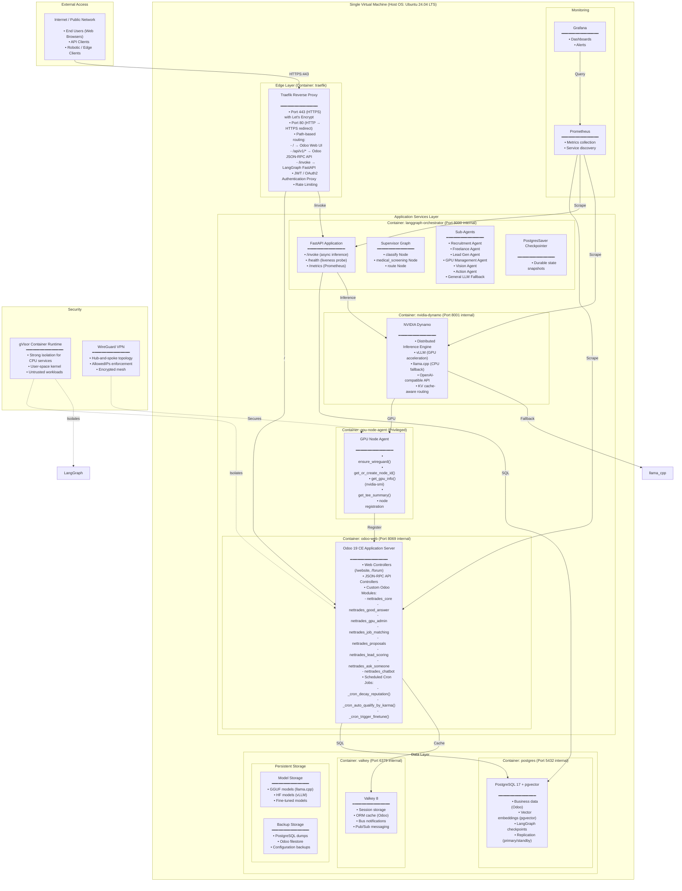
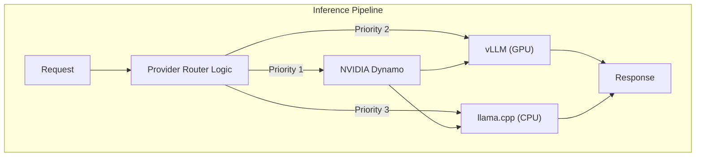

## Technical Solution Architecture

## Inference Architecture

### Inference Backend Priority

| Priority | Backend | Condition |
|---------|-------------|---------|
| 1	| **NVIDIA Dynamo with vLLM** |  GPU available and healthy |
| 2	| **NVIDIA Dynamo (CPU mode)** |  GPU unavailable but Dynamo running |
| 3	| **NVIDIA Dynamo with llama.cpp** |  CPU available and healthy |
| 4	| **llama.cpp** |  Dynamo unavailable (fallback) |

## Security Architecture

| Layer | Technology | Description |
|---------|-------------|---------|
| **Edge** |  Traefik + Let's Encrypt | TLS termination, rate limiting, path routing |
| **Network** | WireGuard | Encrypted VPN mesh, AllowedIPs enforcement |
| **Container** |  gVisor (CPU), default (GPU) | User-space kernel for CPU services; default for GPU |
| **Application** |  Odoo RBAC | Role-based access control, audit logging |
| **Secrets** |  Kubernetes Secrets / .env | Encrypted secrets management |

## Scaling Architecture (Future)

The platform is designed to scale from a single VM to a full Kubernetes cluster:

| Scale | Deployment | Services |
|---------|-------------|---------|
| **Small** |  Single VM (Docker Compose) | All services on one host |
| **Medium** |  Kubernetes (3 nodes) | Odoo, LangGraph, Dynamo, PostgreSQL |
| **Large** |  Kubernetes (10+ nodes) | All services + GPU workers |
| **Enterprise** |  Kubernetes (100+ nodes) | Multi-region, active-active |

