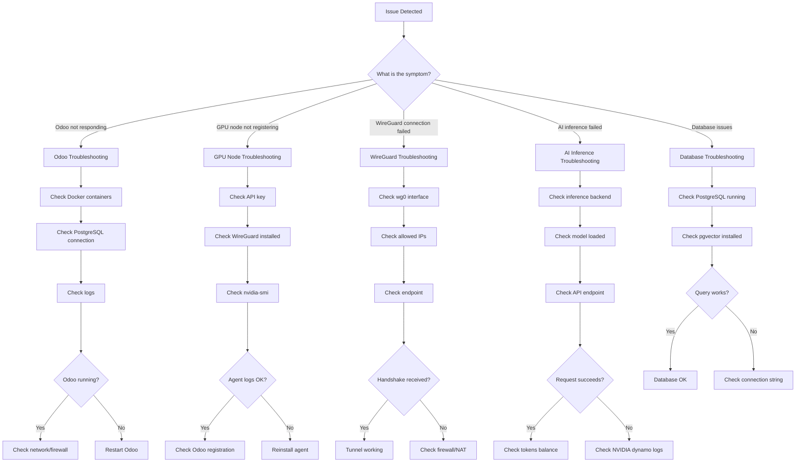

# Troubleshooting Guide

This document lists common issues and their solutions for the NETTRADES.AI platform, along with a comprehensive set of diagnostic commands for operators and developers.


## Overview



## Quick Diagnostic Commands

Below is a complete set of commands for diagnosing issues with the NETTRADES platform. These are the same commands used daily by the development and operations teams.

### A. System & Docker Status

```bash
# 1. OS and kernel info
uname -a
cat /etc/os-release

# 2. Docker version and info
docker --version
docker compose version
docker info

# 3. Check if Docker is running
systemctl status docker --no-pager

# 4. List all containers (running and stopped)
docker ps -a

# 5. List all Docker networks
docker network ls

# 6. Check available disk space
df -h

# 7. Check memory usage
free -h

```

### B. Docker Compose Stack Status

```bash

cd /root/nettrades-platform/deploy/docker

# 8. Show all services and their status
docker compose ps

# 9. Show all container logs (combined) – last 100 lines each
docker compose logs --tail=100 2>&1 | tee /root/all-logs.txt

# 10. Check which services failed to start
docker compose ps --filter "status=exited" --filter "status=dead" --filter "status=restarting"

# 11. Show service dependencies (if any)
docker compose config --services

```

### C. PostgreSQL & Database

```bash

# 12. Check PostgreSQL container status and logs
docker compose ps postgres
docker compose logs postgres --tail=50

# 13. Test PostgreSQL connection
docker compose exec -T postgres pg_isready -U odoo
docker compose exec -T postgres psql -U odoo -d odoo -c "SELECT 1" 2>&1

# 14. Check if database tables exist
docker compose exec -T postgres psql -U odoo -d odoo -c "\dt" 2>&1 | head -20

```

### D. LangGraph Server

```bash

# 15. Check LangGraph container status
docker compose ps langgraph-server

# 16. LangGraph logs (look for errors)
docker compose logs langgraph-server --tail=100

# 17. Test LangGraph health endpoint (from inside container network)
docker compose exec langgraph-server curl -s http://localhost:8000/health 2>&1 || echo "Health check failed"

# 18. Check if LangGraph can reach Dynamo
docker compose exec langgraph-server curl -s http://dynamo:8000/v1/models 2>&1 | head -10
```

### E. Traefik & Routing

```bash

# 19. Traefik container status and logs
docker compose ps traefik
docker compose logs traefik --tail=100

# 20. Check Traefik configuration (labels)
docker inspect $(docker compose ps -q traefik) --format='{{json .Config.Labels}}' | jq . 2>/dev/null || echo "jq not available"

# 21. Check if Traefik is listening on ports 80 and 443
netstat -tulpn | grep -E ":(80|443)" || ss -tulpn | grep -E ":(80|443)"

# 22. Test local API endpoint (bypass Traefik)
curl -s http://localhost:8000/health || echo "LangGraph not reachable on port 8000"
curl -s http://localhost:8069 || echo "Odoo not reachable on port 8069"

```

### F. Environment Variables & Configuration

```bash

# 23. Check .env file (redact sensitive values)
cat /root/nettrades-platform/deploy/docker/.env | grep -v -E "PASSWORD|SECRET|KEY" | head -50

# 24. Check if required variables are set in .env
grep -E "DOMAIN|ADMIN_EMAIL|POSTGRES_PASSWORD|LANGGRAPH_API_KEY|DYNAMO_API_KEY|AUTH_ENABLED|NEXTAUTH_SECRET" /root/nettrades-platform/deploy/docker/.env

```

### G. NVIDIA Dynamo & Inference

```bash

# 25. Dynamo container status
docker compose ps dynamo

# 26. Dynamo logs
docker compose logs dynamo --tail=50

# 27. Test Dynamo API
curl -s http://localhost:8001/v1/models 2>&1 | head -20
```

### H. Network & Domain

```bash

# 28. Check DNS resolution for domain
nslookup nettrades.ai 2>&1 || dig nettrades.ai || host nettrades.ai

# 29. Check if domain resolves to server IP
ping -c 2 nettrades.ai 2>&1

# 30. Check open ports on the server (from outside perspective)
nmap -p 80,443,8069,8000,3002 localhost 2>&1 || echo "nmap not installed"

# 31. Check firewall status
ufw status 2>&1 || echo "UFW not installed or not active"
```

### I. Deployment Script Logs

```bash

# 32. Check if deployment script completed or failed
ls -la /tmp/nettrades-phase2-completed 2>/dev/null && echo "Phase 2 completed flag exists" || echo "Phase 2 not completed"

# 33. Look for any phase markers
ls -la /tmp/nettrades-* 2>/dev/null

# 34. If the script produced a log, show it (adjust path if needed)
find /root -name "*.log" -mtime -1 | xargs ls -la

```

### Common Errors

#### 1. llm_pgvector Fails to Install

**Error:** llm_pgvector installation fails with missing dependencies.

**Solution:**

```bash

# Install PostgreSQL development packages
sudo apt update
sudo apt install -y postgresql-server-dev-all

# Retry installation
pip install llm_pgvector
```

#### 2. Virtual Environment Not Found

**Error:** VIRTUAL_ENV: unbound variable or "Virtual environment not found".

**Solution:**

```bash

# Run Phase 1 to create the virtual environment
cd /root/nettrades-platform
./scripts/nettrades-setup.sh dev --force

# Activate the virtual environment
source .venv/bin/activate
```

#### 3. PostgreSQL Connection Failed

**Error:** Odoo cannot connect to PostgreSQL.

**Solution:**

```bash

# Check PostgreSQL container status
docker compose ps postgres

# Check PostgreSQL logs
docker compose logs postgres --tail=50

# Verify password in .env matches container
cat /root/nettrades-platform/deploy/docker/.env | grep POSTGRES_PASSWORD
docker exec docker-postgres-1 env | grep POSTGRES_PASSWORD

# Test connection manually
docker compose exec -T postgres psql -U odoo -d odoo -c "SELECT 1"

```

#### 4. LangGraph Health Check Fails

**Error:** curl http://localhost:8000/health returns non-200.

**Solution:**

```bash

# Check LangGraph logs
docker compose logs langgraph-server --tail=100

# Verify LangGraph can reach PostgreSQL
docker compose exec langgraph-server curl -s http://postgres:5432

# Restart LangGraph
docker compose restart langgraph-server

```

#### 5. Traefik Routing Issues

**Error:** Requests to /api/health return 404 or 503.

**Solution:**

```bash

# Check Traefik logs for routing errors
docker compose logs traefik | grep -i "langgraph-api"

# Verify router configuration
docker inspect langgraph-server --format='{{json .Config.Labels}}' | jq | grep "entrypoints"

# Test route directly
curl -v -H "Host: nettrades.ai" http://localhost/api/health
curl -v -k https://localhost/api/health

# Watch Traefik logs in real-time
docker compose logs traefik -f

```

#### 6. NVIDIA Dynamo Not Starting

**Error:** Dynamo container exits or fails to start.

**Solution:**

```bash

# Check Dynamo logs
docker compose logs dynamo --tail=50

# Verify model exists
ls -la /root/nettrades-platform/deploy/docker/dynamo-data/models/

# Check GPU availability
nvidia-smi

# Restart Dynamo
docker compose restart dynamo

```

#### 7. Odoo Module Installation Fails

**Error:** Odoo module installation fails with FileNotFoundError for view files.

**Solution:**

```bash

# Re-run addon preparation
cd /root/nettrades-platform
./scripts/prepare-odoo-addons.sh --force

# Reinstall modules
./scripts/install-modules.sh --force

```

### Full Diagnostic Checklist

When troubleshooting, run these commands in order:

```bash

# 1. Check system health
uname -a && df -h && free -h

# 2. Check Docker status
docker info && docker ps -a

# 3. Check stack status
cd /root/nettrades-platform/deploy/docker && docker compose ps

# 4. Check logs for errors
docker compose logs --tail=50 | grep -i "error"

# 5. Check specific services
docker compose logs odoo --tail=30
docker compose logs langgraph-server --tail=30
docker compose logs dynamo --tail=30

# 6. Test endpoints
curl -s -o /dev/null -w "Odoo: %{http_code}\n" http://localhost:8069
curl -s -o /dev/null -w "LangGraph: %{http_code}\n" http://localhost:8000/health
curl -s -o /dev/null -w "Dynamo: %{http_code}\n" http://localhost:8001/v1/models

# 7. Check database
docker compose exec -T postgres pg_isready -U odoo
```


### Import "odoo" could not be resolved Pylance (reportMissingImports)

**Symptom:** VS Code shows `Import "odoo" could not be resolved` for Odoo module imports.

**Solution:**
Open `.vscode/settings.json` and add:

```json
   {
       "python.analysis.extraPaths": [
           "./third-party/odoo",
           "./third-party/odoo_llm",
           "./third-party/odoo_llm_compat"
       ],
       "python.autoComplete.extraPaths": [
           "./third-party/odoo",
           "./third-party/odoo_llm",
           "./third-party/odoo_llm_compat"
       ]
   }
   
```
   
cheat sheet for the most common issues.

---

## Odoo Issues

| Symptom | Quick Check | Likely Fix |
|---------|-------------|------------|
| Odoo returns 502 | `docker compose ps` | Wait 30s or restart Odoo |
| Blank screen after login | Check Valkey/Redis | Comment out `session_store` in `odoo.conf` |
| Module not showing in Apps | Enable Developer Mode | Update Apps List, remove Apps filter |
| `llm_pgvector` fails | `psql -d nettrades -c "CREATE EXTENSION IF NOT EXISTS vector;"` | Install pgvector extension |

---

## GPU Node Issues

| Symptom | Quick Check | Likely Fix |
|---------|-------------|------------|
| Node not registering | `sudo journalctl -u nettrades-agent -f` | Check API key, Odoo endpoint |
| GPU not detected | `nvidia-smi` | Install NVIDIA drivers |
| WireGuard tunnel down | `sudo wg show` | `sudo wg-quick up wg0` |
| NVIDIA dynamo worker not starting | `journalctl -u NVIDIAdynamo-worker -f` | Check server URL, token |

---

## Authentication Issues

| Symptom | Quick Check | Likely Fix |
|---------|-------------|------------|
| 401 Unauthorised | Check `LANGGRAPH_API_KEY` | Update API key in `.env` |
| 402 Payment Required | Token balance | Top up tokens |

---

## Connection Issues

| Symptom | Quick Check | Likely Fix |
|---------|-------------|------------|
| SSL certificate error | `curl -v https://domain` | Ensure port 80 is open, DNS correct |
| PostgreSQL connection refused | `sudo systemctl status postgresql` | Start PostgreSQL |
| Redis/Valkey connection | `docker compose exec valkey redis-cli ping` | Restart Valkey |

---

## Log Locations

| Component | Log Location |
|-----------|--------------|
| **Odoo** | `/var/log/odoo/odoo.log` or `docker compose logs odoo` |
| **LangGraph** | `docker compose logs langgraph` |
| **GPU Node Agent** | `sudo journalctl -u nettrades-agent -f` |
| **NVIDIA dynamo Worker** | `journalctl -u NVIDIAdynamo-worker -f` |
| **PostgreSQL** | `/var/log/postgresql/postgresql-*.log` |

---

## Common Docker Commands

```bash
# Check all services
docker compose ps

# View logs
docker compose logs --tail=100 <service>

# Restart a service
docker compose restart <service>

# Update and restart all
docker compose pull && docker compose up -d

# Execute a command in a container
docker compose exec odoo bash

```

Next Steps

Quick Start – Deployment guide

Single VM Deployment – Detailed deployment

System Requirements – Requirements