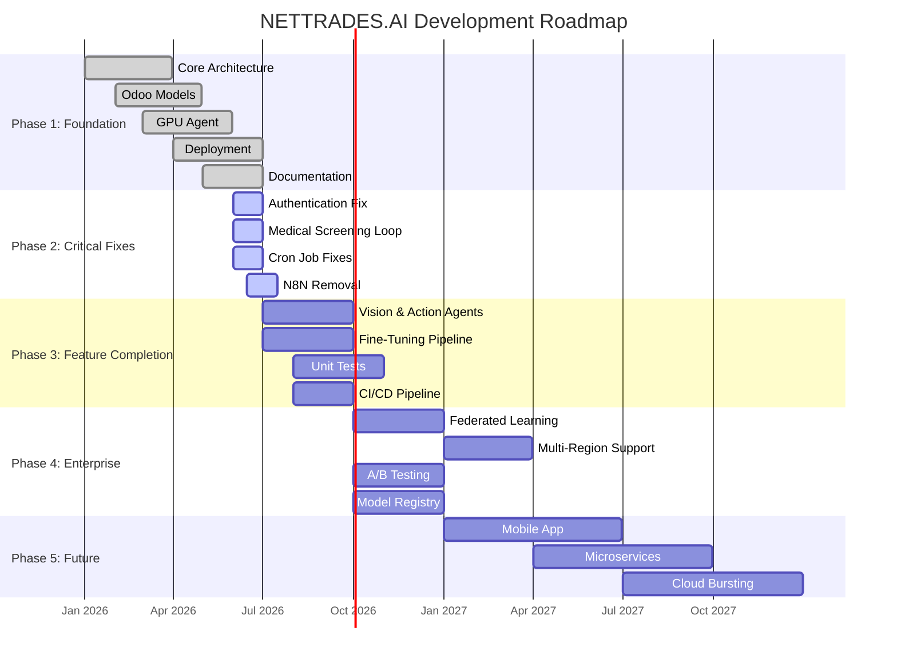

# Project Roadmap

This document outlines the development roadmap for NETTRADES.AI. It provides transparency on what has been completed, what is being worked on, and what is planned for the future.

---

## Overview

NETTRADES.AI is an ambitious open-source autonomous enterprise platform. The roadmap is organised into phases, with clear milestones and priorities. We welcome community contributions and feedback on this roadmap.

---

## Legend

| Icon | Meaning |
|------|---------|
| ✅ | Completed |
| 🔄 | In Progress |
| 📋 | Planned |
| ⏳ | Backlog / Future |
| 🚀 | Stretch Goal |

---

## Phase 1: Foundation (Completed)

The initial phase focused on establishing the core architecture, essential models, and basic functionality.

### ✅ Completed Items

| Item | Description |
|------|-------------|
| **LangGraph Supervisor** | Core orchestrator with intent classification, medical/legal screening, and routing to sub-agents |
| **Sub-Agents** | Recruitment, Freelance, Lead Gen, GPU Management agents (moved to correct location) |
| **FastAPI Application** | `/invoke`, `/health`, `/metrics` endpoints with PostgresSaver checkpointing |
| **Distributed GPU Agent** | WireGuard setup, GPU detection, NVIDIA dynamo integration, DNS watchdog |
| **Odoo Core Models** | `nettrades.field`, `nettrades.experience`, `nettrades.review` models with full fields |
| **GPU Models** | `gpu.cluster`, `gpu.node`, `gpu.cluster.subnet`, `gpu.sharing.schedule`, `gpu.token.economics`, `multimodal.config` |
| **GPU Security** | Record rules for all GPU models (Administrator and Operator groups) |
| **Good Answer System** | Voting, reputation, and fine-tuning dataset pipeline |
| **Ask Someone** | Expert marketplace with Stripe escrow and live sessions |
| **Job Matching** | Conversational job search and one-click apply |
| **Lead Scoring** | AI-driven lead generation and CRM integration |
| **AI Chatbot** | Floating chat widget with Ask Someone integration |
| **Notifications** | In-app notifications, reviews, and disputes |
| **Mobile PWA** | Progressive Web App manifest and service worker |
| **Single VM Deployment** | Docker Compose with Traefik, PostgreSQL, Valkey, LangGraph, llama.cpp, NVIDIA dynamo, Forgejo, Prometheus, Grafana |
| **Kubernetes Deployment** | Talos Linux, Cilium, Longhorn, CNPG, MetalLB, Argo CD |
| **GPU Node Agent** | Full implementation with hardware-bound node ID, TEE detection, edge device detection |
| **Documentation** | Comprehensive MkDocs site with user, developer, operations, governance, and appendix sections |
| **Module Manifests** | All `__manifest__.py` files have `author`, `license`, and full comments |

---

## Phase 2: Critical Fixes (In Progress)

These are the highest-priority items that need to be completed for a stable release.

### 🔄 In Progress / High Priority

| Item | Priority | Description | Status |
|------|----------|-------------|--------|
| **Fix Authentication Bypass** | 🔴 Critical | `LANGGRAPH_API_KEY` must be required (no silent bypass) | ✅ Fixed |
| **Fix Medical Screening Loop** | 🔴 Critical | Add conditional edge to loop back for follow-ups | ✅ Fixed |
| **Fix Missing Model Imports** | 🔴 Critical | Ensure `nettrades.experience` and `nettrades.review` are correctly imported | ✅ Fixed |
| **Fix Controller Imports** | 🔴 Critical | `__init__.py` files import correct controllers | ✅ Fixed |
| **Fix GPU Node Requirements** | 🔴 Critical | `src/agent/requirements.txt` with correct dependencies | ✅ Fixed |
| **N8N Removal** | 🔴 Critical | Replace all `n8n_finetune_webhook` references | 🔄 In Progress |
| **Redis → Valkey Migration** | 🔴 Critical | Update connection strings and configuration | 🔄 In Progress |
| **Fix GPU Node Registration** | 🔴 Critical | Ensure `/api/v1/gpu/register` endpoint is functional | ✅ Fixed |
| **Fix Fine-Tuning Cron** | 🟡 High | `action_trigger_finetune` handles empty recordset | ✅ Fixed |
| **Fix Good Answer Feedback Cron** | 🟡 High | `process_feedback` groups by field | ✅ Fixed |
| **Fix Auto-Qualify Cron** | 🟡 High | Ensure `auto_karma_qualify` field exists | ✅ Fixed |
| **Remove Dead Code** | 🟡 High | Delete `client_registration.py`, `test.py`, duplicate files | 🔄 In Progress |

---

## Phase 3: Feature Completion (Short-Term)

These features are planned for the next release cycle.

### 📋 Planned

| Item | Priority | Description | Estimated Timeline |
|------|----------|-------------|-------------------|
| **Vision Agent** | 🟡 High | Multi-modal VLM (Vision-Language Model) integration | Q3 2026 |
| **Action Agent** | 🟡 High | ROS 2 / VLA (Vision-Language-Action) integration | Q3 2026 |
| **Data-Juicer Integration** | 🟡 High | Full quality filtering pipeline for fine-tuning | Q3 2026 |
| **DEITA Scoring** | 🟡 High | LLM-as-Judge scoring for dataset quality | Q3 2026 |
| **NVIDIA dynamo Adapter** | 🟡 High | Full worker and token usage synchronisation | Q3 2026 |
| **OpenAPI Documentation** | 🟡 Medium | Auto-generated OpenAPI/Swagger docs for all APIs | Q3 2026 |
| **Unit Tests** | 🟡 High | Achieve >80% test coverage for core modules | Q3 2026 |
| **Integration Tests** | 🟡 Medium | End-to-end tests for critical workflows | Q3 2026 |
| **CI/CD Pipeline** | 🟡 Medium | GitHub Actions for automated testing and deployment | Q3 2026 |
| **VS Code Extension** | 🟢 Low | Official VS Code extension for the platform | Q4 2026 |

---

## Phase 4: Enterprise & Scaling (Medium-Term)

These features are planned for the enterprise-ready release.

### 📋 Planned

| Item | Priority | Description | Estimated Timeline |
|------|----------|-------------|-------------------|
| **Federated Learning Module** | 🟡 High | Cross-organisation model training without sharing data | Q4 2026 |
| **Multi-Region Support** | 🟡 Medium | Active-active deployment across multiple regions | Q1 2027 |
| **A/B Testing** | 🟡 Medium | Shadow deployment and automatic model promotion | Q4 2026 |
| **GRPO Training** | 🟡 Medium | Reinforcement learning from Good Answer preferences | Q4 2026 |
| **Benchmark Evaluation** | 🟢 Low | Field-specific model evaluation with NeMo Evaluator | Q1 2027 |
| **Model Registry** | 🟡 Medium | Versioned model storage with A/B testing | Q4 2026 |
| **Audit Logging** | 🟡 Medium | Complete audit trail for all configuration changes | Q4 2026 |
| **SSO / LDAP Integration** | 🟡 Medium | Enterprise authentication integration | Q1 2027 |
| **Performance Tuning** | 🟡 Medium | Optimised for large-scale deployments | Q1 2027 |

---

## Phase 5: Future Development (Long-Term)

These are stretch goals for the future.

### ⏳ Backlog

| Item | Description | Status |
|------|-------------|--------|
| **Mobile Native App** | Android and iOS native applications | ⏳ Backlog |
| **Microservices Migration** | Split monolith into independent services | ⏳ Backlog |
| **More AI Agents** | Custom agents for specific industries | ⏳ Backlog |
| **Integration with External Job Boards** | LinkedIn, Indeed, Upwork API integration | ⏳ Backlog |
| **Blockchain Integration** | Decentralised token economy (optional) | ⏳ Backlog |
| **Confidential Computing** | Full TEE support for all GPU workloads | ⏳ Backlog |
| **Multi-Cloud Bursting** | Auto-scaling across cloud providers | ⏳ Backlog |

### 🚀 Stretch Goals

| Item | Description | Status |
|------|-------------|--------|
| **1 Million Users** | Platform scaling to support 1M+ users | 🚀 Stretch |
| **500+ GPU Nodes** | Distributed GPU network scaling | 🚀 Stretch |
| **10,000+ Apps** | Third-party app marketplace growth | 🚀 Stretch |
| **Open-Source Community** | 5,000+ GitHub stars and 100+ contributors | 🚀 Stretch |

---

## How to Contribute

We welcome contributions at any stage of the roadmap! Here's how you can help:

### For Developers

1. **Check the issue tracker** – Look for issues labelled `good-first-issue` or `help-wanted`.
2. **Pick a task** – Choose something from the roadmap that interests you.
3. **Fork and implement** – Follow the [Contributing Guide](/governance/contributing).
4. **Submit a PR** – Include tests and documentation.

### For Testers

- **Report bugs** – Open issues on GitHub with clear reproduction steps.
- **Test new features** – Try out development builds and provide feedback.
- **Improve documentation** – Fix typos, add examples, or clarify explanations.

### For Community

- **Spread the word** – Star the repository, share with your network.
- **Answer questions** – Help other users on Discord or GitHub Discussions.
- **Provide feedback** – Let us know what features you'd like to see.

---

## Visual Timeline

    
## Release Schedule

| Version | Target Date | Key Features |
|---------|-------------|-------------|
|`    v0.1.0`	| Q2 2026	| 	Initial alpha release – core architecture, Odoo models, GPU agent, deployment |
|`    v0.2.0`	| Q3 2026	| 	Critical fixes, Vision Agent, Action Agent, fine-tuning pipeline |
|`    v0.3.0`	| Q4 2026	| 	Unit tests, CI/CD, enterprise features, model registry |
|`    v1.0.0`	| Q1 2027	| 	Stable release – full enterprise support, multi-region, federated learning |

## Next Steps
    
[Contributing Guide](contributing.md) →
    
[Changelog](changelog.md) →
    
License →
    

    
## Summary
    
    | File | Action | Description |
    |------|--------|-------------|
    | `roadmap.md` | **Regenerated** | Comprehensive roadmap with phases, priorities, status indicators, visual timeline, and contribution guide |
    
The roadmap shows:
- What has been completed (Phase 1)
- What is in progress (Phase 2 – Critical Fixes)
- What is planned for the short term (Phase 3 – Feature Completion)
- What is planned for the medium term (Phase 4 – Enterprise & Scaling)
- Future and stretch goals (Phase 5 – Future Development)
- A visual Gantt chart timeline
- Release schedule
- How to contribute
    
