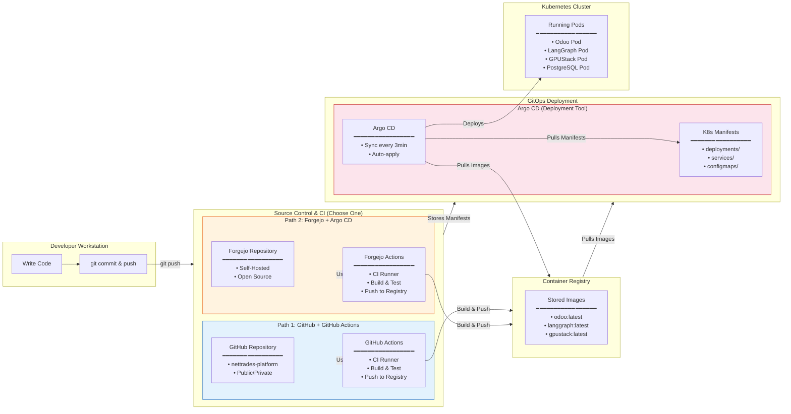
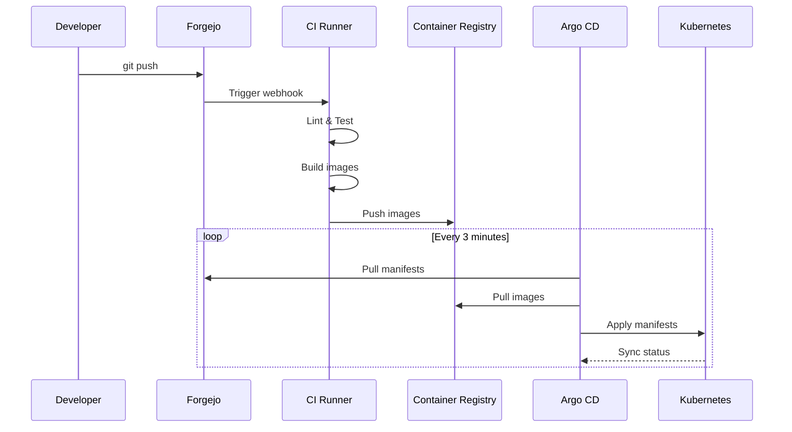

# Deployment Team Perspective — CI/CD Pipeline Diagram

## 1. Overview

This document describes the **Continuous Integration and Continuous Deployment (CI/CD) pipeline** for the NETTRADES platform. The pipeline supports two deployment paths:

- **GitHub + GitHub Actions** (for public/cloud deployments)
- **Forgejo + Argo CD** (for self-hosted/private deployments)

Both paths deliver the same result: a fully deployed NETTRADES platform running on **Kubernetes**.

---

## 2. Unified CI/CD Pipeline Diagram

This diagram shows both deployment paths. The platform can use either GitHub or Forgejo as the source control and CI system, with Argo CD as the GitOps deployment tool for Kubernetes.



## 3. Option 1: GitHub + GitHub Actions (Public/Cloud)
### 3.1 Forgejo Alternative: Self-Hosted Git + CI

If you prefer a self-hosted solution, the same pipeline can be run using:

| Component | GitHub | Forgejo Alternative |
|-----------|----------|-------------|	
| `Source Control` | GitHub | Forgejo (self-hosted Git) |
| `CI` | GitHub Actions | Forgejo Actions |
| `CD` | Argo CD | Argo CD (same) |
| `Container Registry` | GitHub Container Registry (GHCR) | Self-hosted Harbor / Docker Registry |

### 3.2 Forgejo Actions CI Pipeline

#### File: .forgejo/workflows/ci.yml

```yaml

name: CI

on:
  push:
    branches: [main, develop]
  pull_request:
    branches: [main]

env:
  REGISTRY: harbor.example.com/nettrades
  IMAGE_TAG: ${{ github.sha }}

jobs:
  lint:
    runs-on: ubuntu-latest
    steps:
      - uses: actions/checkout@v4
      - uses: actions/setup-python@v5
        with:
          python-version: '3.12'
      - run: pip install flake8 black isort mypy
      - run: flake8 src/ odoo-modules/ --max-complexity=10
      - run: black --check src/ odoo-modules/
      - run: isort --check-only src/ odoo-modules/

  test:
    runs-on: ubuntu-latest
    needs: lint
    steps:
      - uses: actions/checkout@v4
      - uses: actions/setup-python@v5
        with:
          python-version: '3.12'
      - run: pip install -r src/core/requirements.txt
      - run: pip install pytest pytest-cov
      - run: pytest src/core/tests/ --cov=src --cov-report=xml

  build:
    runs-on: ubuntu-latest
    needs: test
    if: github.event_name == 'push'
    steps:
      - uses: actions/checkout@v4
      - uses: docker/setup-buildx-action@v3
      - uses: docker/login-action@v3
        with:
          registry: ${{ env.REGISTRY }}
          username: ${{ secrets.REGISTRY_USER }}
          password: ${{ secrets.REGISTRY_PASSWORD }}
      - name: Build and push Odoo image
        uses: docker/build-push-action@v5
        with:
          context: .
          file: deploy/docker/Dockerfile.odoo
          push: true
          tags: |
            ${{ env.REGISTRY }}/odoo:${{ env.IMAGE_TAG }}
            ${{ env.REGISTRY }}/odoo:latest

  security:
    runs-on: ubuntu-latest
    needs: build
    steps:
      - uses: actions/checkout@v4
      - name: Run Trivy vulnerability scanner
        uses: aquasecurity/trivy-action@master
        with:
          image-ref: ${{ env.REGISTRY }}/odoo:${{ env.IMAGE_TAG }}
          format: 'sarif'
          output: 'trivy-results.sarif'
      - name: Upload Trivy results to GitHub Security tab
        uses: github/codeql-action/upload-sarif@v3
        with:
          sarif_file: 'trivy-results.sarif'

  deploy:
    runs-on: ubuntu-latest
    needs: [build, security]
    if: github.event_name == 'push' && github.ref == 'refs/heads/main'
    steps:
      - uses: actions/checkout@v4
      - name: Update image tag in Kubernetes manifests
        run: |
          sed -i "s|image:.*|image: ${{ env.REGISTRY }}/odoo:${{ env.IMAGE_TAG }}|g" deploy/kubernetes/odoo-deployment.yaml
      - name: Commit and push manifest update
        run: |
          git config user.name "CI Bot"
          git config user.email "ci@example.com"
          git add deploy/kubernetes/odoo-deployment.yaml
          git commit -m "Update Odoo image to ${{ env.IMAGE_TAG }} [skip ci]"
          git push

```

## 4. Option 2: Forgejo + Argo CD (Self-Hosted)
### 4.1 Why Forgejo + Argo CD?

Forgejo is a self-hosted, open-source Git platform (a fork of Gitea). Combined with Argo CD, it provides:

* Full control over source code and CI infrastructure

* No vendor lock-in – no dependency on GitHub or other cloud services

* Cost-effective – runs on your own infrastructure

* Data sovereignty – code and pipeline data never leave your environment

### 4.2 Argo CD Application Definition

#### File: deploy/argocd/application.yaml

```yaml

apiVersion: argoproj.io/v1alpha1
kind: Application
metadata:
  name: nettrades
  namespace: argocd
  finalizers:
    - resources-finalizer.argocd.argoproj.io
spec:
  project: default
  source:
    repoURL: https://forgejo.example.com/nettrades/nettrades-platform
    targetRevision: main
    path: deploy/kubernetes
  destination:
    server: https://kubernetes.default.svc
    namespace: nettrades
  syncPolicy:
    automated:
      prune: true
      selfHeal: true
    syncOptions:
      - CreateNamespace=true
      - PruneLast=true
  revisionHistoryLimit: 10

```

### 4.3 Argo CD Sync Wave Order

| Wave | Resource Type | Description |
|-----------|----------|-------------|	
| 0 | Namespace | Create nettrades namespace |
| 1 | Secrets, ConfigMaps | Configuration before services start |
| 2 | PersistentVolumeClaims | Storage before pods mount |
| 3 | Services | Expose ports before deployments |
| 4 | Deployments | Main application pods |
| 5 | Ingress | External access after services are ready |

## 5. Deployment Strategies
		
| Strategy | Description Type | Implementation |
|-----------|----------|-------------|	
| Rolling Update | Incrementally replaces old pods | Kubernetes default (strategy: RollingUpdate) |
| Blue/Green | Two environments, switch traffic | Argo CD + Service selector change |
| Canary | Gradual traffic shift | Flagger + Istio or Argo Rollouts |
| A/B Testing | Route to different versions based on headers | Istio VirtualService + DestinationRule |

### 5.1 Rolling Update Configuration

```yaml

spec:
  strategy:
    type: RollingUpdate
    rollingUpdate:
      maxSurge: 1
      maxUnavailable: 0

```

### 5.2 Canary Deployment with Flagger

```yaml

apiVersion: flagger.app/v1beta1
kind: Canary
metadata:
  name: nettrades-canary
  namespace: nettrades
spec:
  provider: kubernetes
  targetRef:
    apiVersion: apps/v1
    kind: Deployment
    name: odoo
  progressDeadlineSeconds: 60
  service:
    port: 8069
  analysis:
    interval: 30s
    threshold: 5
    maxWeight: 50
    stepWeight: 10
    metrics:
      - name: request-success-rate
        threshold: 99
        interval: 1m
      - name: request-duration
        threshold: 500
        interval: 1m

```

## 6. Security Considerations

| Aspect | Implementation |
|-----------|----------|	
| `Secrets Management` | Kubernetes Secrets (encrypted) + external secrets manager (optional) |
| `Image Signing` | Cosign to verify image integrity before deployment |
| `Vulnerability Scanning` | Trivy in CI pipeline (fail on critical vulnerabilities) |
| `Network Policies` | Kubernetes NetworkPolicies restricting pod communication |
| `RBAC` | Fine-grained access control in both Kubernetes and Argo CD |
| `Secret Encryption` | Sealed Secrets or Bitnami SealedSecrets for Git-stored secrets |

## 7. Monitoring & Observability

| Component | Tool | Purpose |
|-----------|----------|-------------|	
| `Metrics` | Prometheus | Collects resource and application metrics |
| `Dashboards` | Grafana | Visualises metrics with custom dashboards |
| `Logs` | Loki / Elasticsearch | Aggregates logs from all pods |
| `Traces` | Jaeger / Tempo | Distributed tracing for LangGraph agents |
| `Alerts` | Alertmanager | Sends notifications for critical conditions |
| `Kubernetes Events` | kube-state-metrics | Cluster events and status |

## 8. Rollback Procedure

### 8.1 Automatic Rollback

    Kubernetes: RollingUpdate automatically reverts if pods crash-loop.

    Argo CD: Sync failures prevent changes from applying.

### 8.2 Manual Rollback via Argo CD

```bash

# Rollback to previous revision
argocd app rollback nettrades 1

# Rollback to specific commit
argocd app sync nettrades --revision <commit-sha>

```

### 8.3 Manual Rollback via Git

```bash

# Revert the manifest change
git revert <commit-sha>
git push
# Argo CD will automatically sync
```

## 9. Environment Separation

| Environment | Namespace Type | Branch | Purpose |
|-----------|----------|-------------|----------|			
| `Development` | dev | develop | Developer testing and integration |
| `Staging` | staging | main | Pre-production validation |
| `Production` | prod | main (tagged) | Live environment |

### 9.1 Argo CD Applications per Environment

```yaml

apiVersion: argoproj.io/v1alpha1
kind: Application
metadata:
  name: nettrades-dev
  namespace: argocd
spec:
  source:
    repoURL: https://forgejo.example.com/nettrades/nettrades-platform
    targetRevision: develop
    path: deploy/kubernetes/overlays/dev
---
apiVersion: argoproj.io/v1alpha1
kind: Application
metadata:
  name: nettrades-staging
  namespace: argocd
spec:
  source:
    repoURL: https://forgejo.example.com/nettrades/nettrades-platform
    targetRevision: main
    path: deploy/kubernetes/overlays/staging
---
apiVersion: argoproj.io/v1alpha1
kind: Application
metadata:
  name: nettrades-prod
  namespace: argocd
spec:
  source:
    repoURL: https://forgejo.example.com/nettrades/nettrades-platform
    targetRevision: main
    path: deploy/kubernetes/overlays/prod

```

## 10. Troubleshooting

| Issue | Solution |
|-----------|-----------|	
| `Pipeline fails at linting` | Run flake8 and black locally to fix formatting |
| `Tests fail` | Check test logs; fix code or update tests |
| `Image build fails` | Verify Dockerfile syntax and dependencies |
| `Argo CD sync fails` | Check Kubernetes events (kubectl describe pod) |
| `Pod crash loops` | Check logs (kubectl logs <pod>); verify env vars |
| `Secrets not found` | Ensure secrets are created in the correct namespace |
| `Ingress not working` | Verify Ingress controller and DNS configuration |

## 11. Links & References

| Resource | GitHub Path | Forgejo Path |
|-----------|----------|-------------|	
| GitHub Actions | https://github.com/features/actions | N/A |
| Forgejo Actions | N/A | https://forgejo.org/docs/latest/user/actions/ |
| Argo CD | https://argo-cd.readthedocs.io/ | Same |
| Kubernetes | https://kubernetes.io/docs/ | Same |
| Flagger | https://flagger.app/ | Same |


## 12. CI/CD Pipeline Flow (Sequence Diagram)

