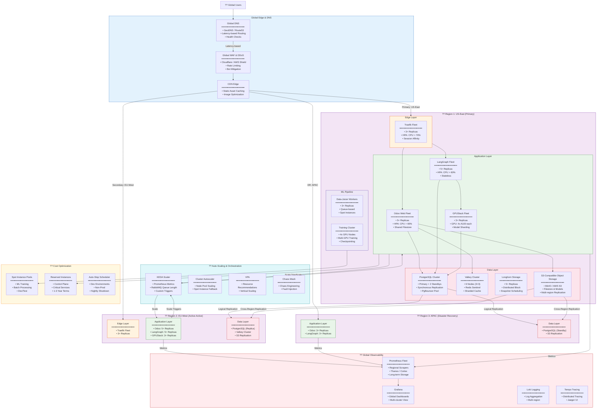

## Future Infrastructure Scaling Architecture

Based on the platform's existing modular architecture (Odoo + LangGraph + GPUStack on Kubernetes), here is a comprehensive Future Infrastructure Scaling Diagram showing how the NETTRADES.AI platform can scale from a single VM to a global, multi-region, highly available system.

# Detailed Scaling Strategy Explanation
# 1. Scaling Philosophy

The NETTRADES.AI platform is designed with a "scale-out first" philosophy, leveraging Kubernetes' native capabilities for horizontal scaling. The architecture supports three distinct scaling dimensions:

Dimension	Strategy	Implementation
Vertical Scaling	Increase resources per node	Larger VM sizes, GPU upgrades (A100 ? H100)
Horizontal Scaling	Add more nodes/pods	Kubernetes HPA, cluster autoscaler
Geographic Scaling	Deploy to multiple regions	Active-Active with GeoDNS

# 2. Component-Specific Scaling
# A. Odoo Web Fleet (Stateless Web Workers)
Scaling Trigger	Action	Target
CPU > 65% for 2min	Add replicas	Up to 20 pods
Memory > 75% for 2min	Add replicas	Up to 20 pods
Queue Length > 1000	Add replicas	Up to 20 pods
Low traffic (2am-6am)	Scale down	Minimum 2 pods

# State Management:

Sessions: Stored in Valkey (externalized)

Filestore: Shared via S3-compatible storage (Longhorn ? MinIO)

Database: Connection pooling via PgBouncer

# B. LangGraph Orchestrator (Stateless API)
Scaling Trigger	Action	Target
Request Rate > 100 req/s	Add replicas	Up to 15 pods
P99 Latency > 500ms	Add replicas	Up to 15 pods
Checkpoint queue depth	Add replicas	Up to 15 pods

# State Management:

Checkpoints: Stored in PostgreSQL (shared across replicas)

No in-memory state: Fully stateless

# C. GPUStack Inference Fleet (Stateful GPU Workers)
Scaling Trigger	Action	Target
GPU Utilization > 80%	Add GPU node	Up to 20 nodes
Queue Length > 50	Add GPU node	Up to 20 nodes
Model load time > 10s	Scale up	Add replicas

# Challenges & Solutions:

Model Sharding: Large models (>70B) sharded across multiple GPUs

Cold Start: Pre-warm models on standby nodes

GPU Diversity: Heterogeneous GPU pools (A100, H100, L40S)

# D. PostgreSQL Database (Stateful)
Scaling Strategy	Implementation
Read Scaling	Read replicas for reporting, analytics
Write Scaling	Vertical scaling (more CPU/RAM)
Sharding	Citus extension for horizontal sharding
Connection Pooling	PgBouncer (1000+ connections)

# High Availability:

Primary: 1 node (writes)

Standbys: 2+ nodes (synchronous replication)

Failover: Automatic via CloudNativePG operator

# E. Valkey Cache (Stateful)
Scaling Strategy	Implementation
Sharding	Redis Cluster (6+ nodes)
Replication	1 primary + 2 replicas per shard
Eviction	LRU eviction policy

# 3. Geographic Scaling (Multi-Region)

The platform supports Active-Active deployment across multiple regions:
Region	Role	Traffic Split
US-East	Primary	60%
EU-West	Active	30%
APAC	DR/Standby	10%

# Cross-Region Data Flow:

PostgreSQL: Logical replication (async) from primary to replicas

S3 Storage: Cross-region replication for filestore and models

Valkey: Not replicated (region-local cache only)

# Failover Strategy:

Health checks detect region failure (3 consecutive failures)

DNS routes traffic to healthy region

PostgreSQL replica promoted to primary (within 30 seconds)

Replication direction reversed

# 4. Auto-Scaling with KEDA

KEDA (Kubernetes Event-Driven Autoscaling) provides custom scaling triggers:

yaml

# Example: Scale LangGraph based on RabbitMQ queue depth
triggers:
  - type: rabbitmq
    metadata:
      queueName: langgraph-jobs
      queueLength: '50'
      host: rabbitmq.nettrades.svc

Trigger Type	Source	Scaling Metric
Prometheus	Custom metrics	Request rate, latency
RabbitMQ	Queue depth	Pending jobs
Cron	Time-based	Peak hours
External	Webhook	Custom events

# 5. Cost Optimization Strategy
Component	Optimization	Savings
ML Training	Spot instances + checkpointing	60-70%
Dev/Test	Auto-stop at night	50-60%
Reserved Instances	3-year commitment for control plane	40-50%
GPU Selection	Mixed GPU types (A100 for training, L4 for inference)	30-40%
# 6. Observability & Chaos Engineering

# Observability Stack:

Metrics: Prometheus + Thanos (multi-region aggregation)

Logs: Loki (centralized logging)

Traces: Tempo + Jaeger (distributed tracing)

Profiling: Pyroscope (continuous profiling)

# Chaos Engineering:

Chaos Mesh: Regular fault injection tests

Game Days: Quarterly resilience testing

SLIs: Latency, Error Rate, Saturation

# 7. Scaling Limits & Bottlenecks
Component	Scaling Limit	Mitigation
PostgreSQL Writes	~10k TPS	Sharding with Citus
GPU Memory	80GB per A100	Model quantization, sharding
Network Bandwidth	10Gbps per node	Multi-homing, RDMA
Odoo Monolith	~500 concurrent users	Microservices migration (future)

# 8. Future Evolution Path
text

Phase 1 (Current)          Phase 2 (6-12 months)       Phase 3 (12-24 months)
━━━━━━━━━━━━━━━━           ━━━━━━━━━━━━━━━━            ━━━━━━━━━━━━━━━━
Single VM                  Multi-AZ (3 zones)          Multi-Region (Active-Active)
3 Pods                     15+ Pods                    50+ Pods
1 GPU Node                 5 GPU Nodes                 20+ GPU Nodes
PostgreSQL Standalone      PostgreSQL HA Cluster       PostgreSQL + Citus Sharding
Local Storage              Longhorn                    S3 + Multi-region Replication
Manual Scaling             KEDA Auto-scaling           Predictive Scaling (ML)
Basic Monitoring           Prometheus + Grafana        Thanos + Global Dashboards

# Scaling Configuration Examples
Horizontal Pod Autoscaler (LangGraph)
yaml

apiVersion: autoscaling/v2
kind: HorizontalPodAutoscaler
metadata:
  name: langgraph-hpa
spec:
  scaleTargetRef:
    apiVersion: apps/v1
    kind: Deployment
    name: langgraph
  minReplicas: 3
  maxReplicas: 15
  metrics:
  - type: Resource
    resource:
      name: cpu
      target:
        type: Utilization
        averageUtilization: 65
  - type: Resource
    resource:
      name: memory
      target:
        type: Utilization
        averageUtilization: 75

# Cluster Autoscaler (GPU Node Pool)
yaml

apiVersion: cluster-autoscaler.kubernetes.io/v1
kind: AutoscalingGroup
metadata:
  name: gpu-node-pool
spec:
  minSize: 1
  maxSize: 20
  instanceType: g4dn.xlarge
  gpu:
    type: nvidia
    count: 1

# KEDA ScaledObject (Queue-Based Scaling)
yaml

apiVersion: keda.sh/v1alpha1
kind: ScaledObject
metadata:
  name: langgraph-scaledobject
spec:
  scaleTargetRef:
    name: langgraph
  triggers:
  - type: prometheus
    metadata:
      serverAddress: http://prometheus:9090
      metricName: langgraph_queue_depth
      threshold: '50'
      query: sum(langgraph_queue_depth)

This future infrastructure scaling architecture is based on the NETTRADES.AI platform's modular design and industry best practices for scaling AI workloads. The platform is designed to grow organically from a single VM to a global, multi-region deployment without requiring significant architectural changes.
---

