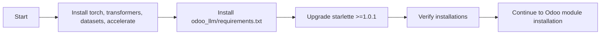
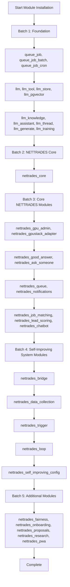

# NETTRADES Odoo Module Installation Order

## Overview

This document outlines the correct order for installing NETTRADES Odoo modules. Modules must be installed in this sequence to satisfy dependencies.

## Installation Order

### Batch 1: Foundation Modules

These modules are required by everything else.

| Module | Purpose |
|--------|---------|
| `queue_job` | Asynchronous job queue |
| `queue_job_batch` | Batch job processing |
| `queue_job_cron` | Cron-based job scheduling |
| `llm` | LLM integration base |
| `llm_tool` | Tool framework for LLMs |
| `llm_store` | Vector store abstraction |
| `llm_pgvector` | pgvector backend |
| `llm_knowledge` | RAG pipeline |
| `llm_assistant` | AI assistants |
| `llm_thread` | Chat interface |
| `llm_generate` | Content generation |
| `llm_training` | Dataset and training job management |

### Batch 2: NETTRADES Core

| Module | Purpose |
|--------|---------|
| `nettrades_core` | Core platform functionality |

### Batch 3: Core NETTRADES Modules

| Module | Purpose |
|--------|---------|
| `nettrades_gpu_admin` | GPU cluster administration |
| `nettrades_gpustack_adapter` | GPUStack integration |
| `nettrades_good_answer` | "Good Answer" voting system |
| `nettrades_ask_someone` | Expert help marketplace |
| `nettrades_queue` | Queue management |
| `nettrades_notifications` | Notification system |
| `nettrades_job_matching` | AI-powered job matching |
| `nettrades_lead_scoring` | Lead scoring |
| `nettrades_chatbot` | AI chatbot |

### Batch 4: Self-Improving System Modules

| Module | Purpose |
|--------|---------|
| `nettrades_bridge` | Hub-and-spoke routing engine |
| `nettrades_data_collection` | Monitor phase data collection |
| `nettrades_trigger` | Analyze phase trigger detection |
| `nettrades_loop` | Plan + Execute phase orchestration |
| `nettrades_self_improving_config` | Administration interface |

### Batch 5: Additional Modules

| Module | Purpose |
|--------|---------|
| `nettrades_fairness` | AI fairness monitoring |
| `nettrades_onboarding` | Smart onboarding |
| `nettrades_proposals` | Freelancer proposals |
| `nettrades_research` | Research marketplace |
| `nettrades_pwa` | Mobile PWA |

## Installation Commands

### Windows PowerShell

```powershell
# Install all modules using the installation script
.\install-odoo-modules.ps1

# Install a specific batch
python .\third-party\odoo\odoo-bin -c .\deploy\docker\config\odoo.conf --addons-path=.\third-party\odoo\addons,.\odoo-modules,.\third-party\odoo_llm,.\third-party\odoo_llm_compat,.\third-party\website_sale_marketplace,.\third-party\queue-19 -i nettrades_core --stop-after-init


### Linux / WSL
```bash

# Using the development environment script
./scripts/phase-dev-env.sh

# Install a specific module
python third-party/odoo/odoo-bin -c deploy/docker/config/odoo.conf --addons-path=third-party/odoo/addons,odoo-modules,third-party/odoo_llm,third-party/odoo_llm_compat,third-party/website_sale_marketplace,third-party/queue-19 -i nettrades_core --stop-after-init

```

### Python Dependencies

Before installing Odoo modules, ensure the following Python packages are installed:

```bash

pip install torch transformers datasets accelerate
pip install -r third-party/odoo_llm/requirements.txt
pip install --upgrade starlette>=1.0.1
```

### Odoo 19 Compatibility Notes

The odoo_llm modules have been updated for Odoo 19 compatibility:

* models.Q has been replaced with @api.constrains for uniqueness constraints

* ondelete='restrict' on fields pointing to ir.model has been changed to 'cascade'

* auto_join parameter has been removed from field definitions

* _sql_constraints has been replaced with models.Constraint

### Troubleshooting
"Odoo is currently processing another module operation"

Wait for the current operation to finish, or clear the lock:
```sql

UPDATE ir_module_module SET state='uninstalled' WHERE state='to install';

```

### "Module not found"

Ensure the module is in the addons path and the path is correct in odoo.conf.
text


---

### 4. Updated Deployment CI/CD Pipeline Diagram

The diagram at `/docs/operations/deployment-perspective-CICD-pipeline-diagram.md` needs to include the Python dependency installation steps and the correct module installation order.

**Add the following section:**

```markdown
## CI/CD Pipeline Stages

### Stage 1: Python Dependencies



### Stage 2: Odoo Module Installation (Correct Order)



text


---

### 5. Summary of Required Documentation Updates

| Document | Update Required | Priority |
|----------|-----------------|----------|
| `README.md` | Update architecture diagram to include self-improving system modules | High |
| `Logical-Solution-Architecture-Diagram.md` | Add self-improving system modules and bridge module | High |
| `LangGraph-Agent-State-Machine-Diagram.md` | Add bridge integration and self-improving loop nodes | Medium |
| `deployment-perspective-CICD-pipeline-diagram.md` | Add Python dependency steps and correct module order | Medium |
| `module-installation-order.md` | **New file** – complete installation guide | High |

---

### 6. New Module Installation Guide (Complete File)

Create a new file at `/docs/operations/module-installation-order.md` with the content provided in Section 3 above. This will serve as the definitive reference for installing all Odoo modules in the correct order, including all Python dependencies and Odoo 19 compatibility notes.