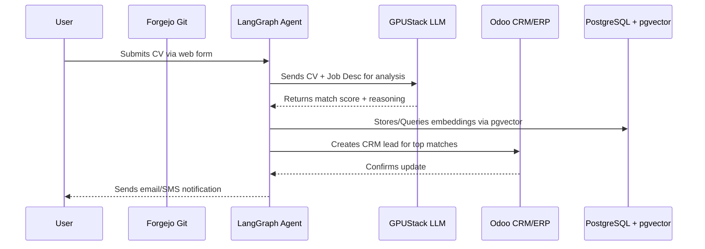

# Job Matching & Freelancing

This guide covers how companies and freelancers use NETTRADES.AI to find and match talent.

---

## Overview

NETTRADES.AI combines the functionalities of **LinkedIn**, **Fiverr**, **Upwork**, and **Freelancer**, with AI-powered matching.

| Role | What You Can Do |
|------|-----------------|
| **Company** | Post jobs, find candidates, manage hiring pipelines |
| **Freelancer** | Find projects, submit proposals, manage milestones |
| **Job Seeker** | Find jobs, apply with one click, track applications |

---

## User Journey: CV Submission to Candidate Notification

This diagram shows the complete flow from a candidate submitting a CV to the employer receiving a notification.

